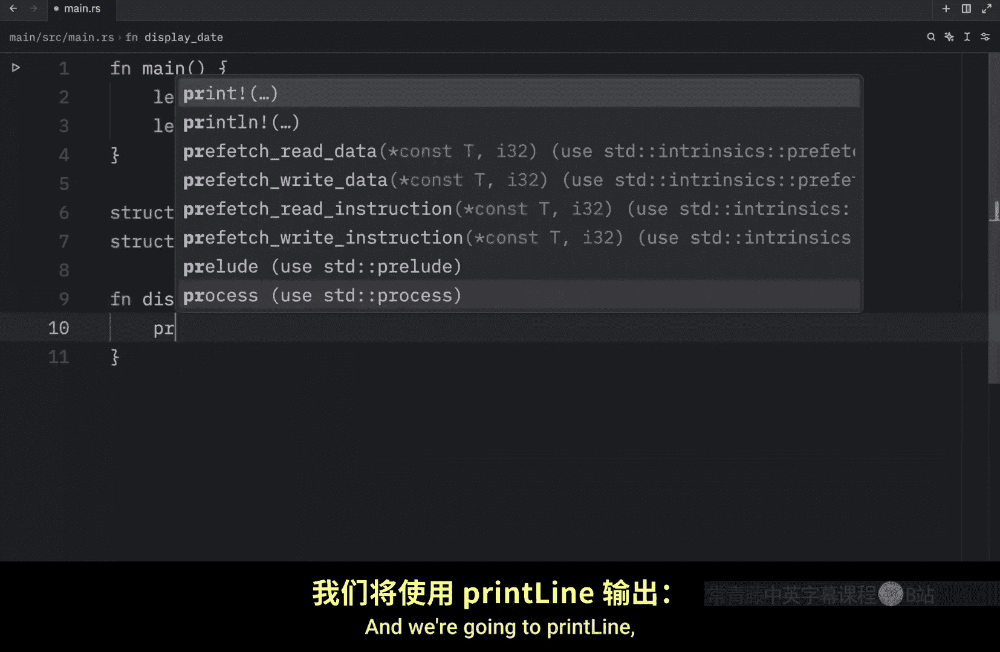
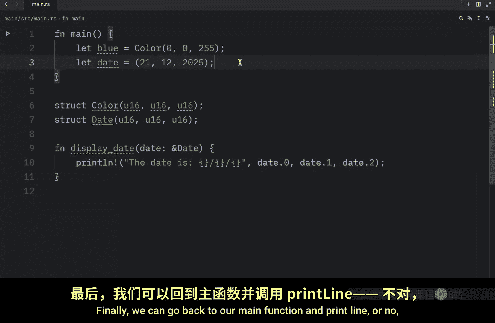
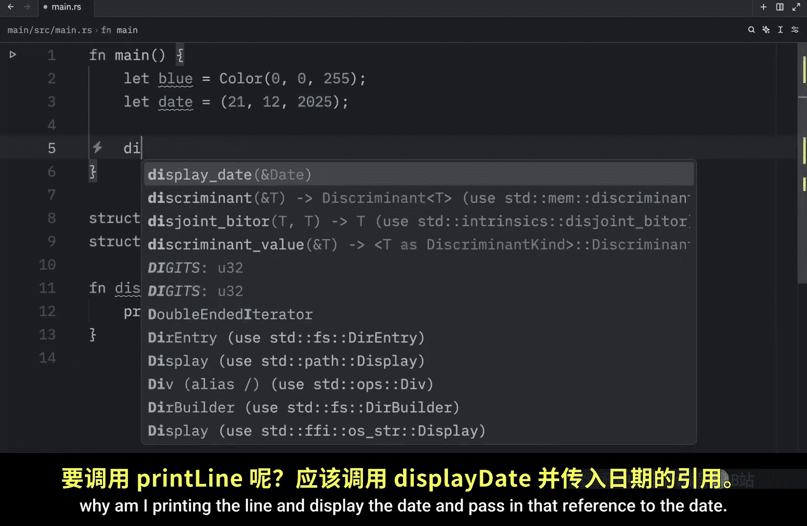
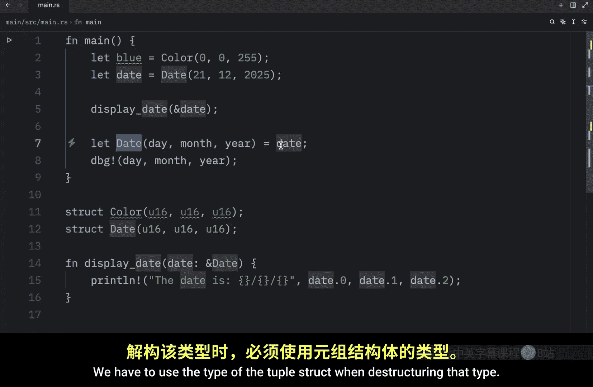
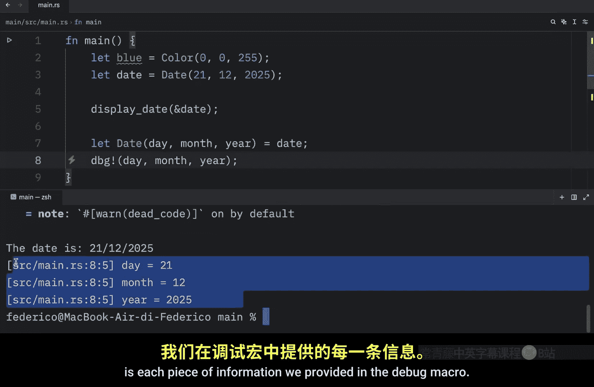
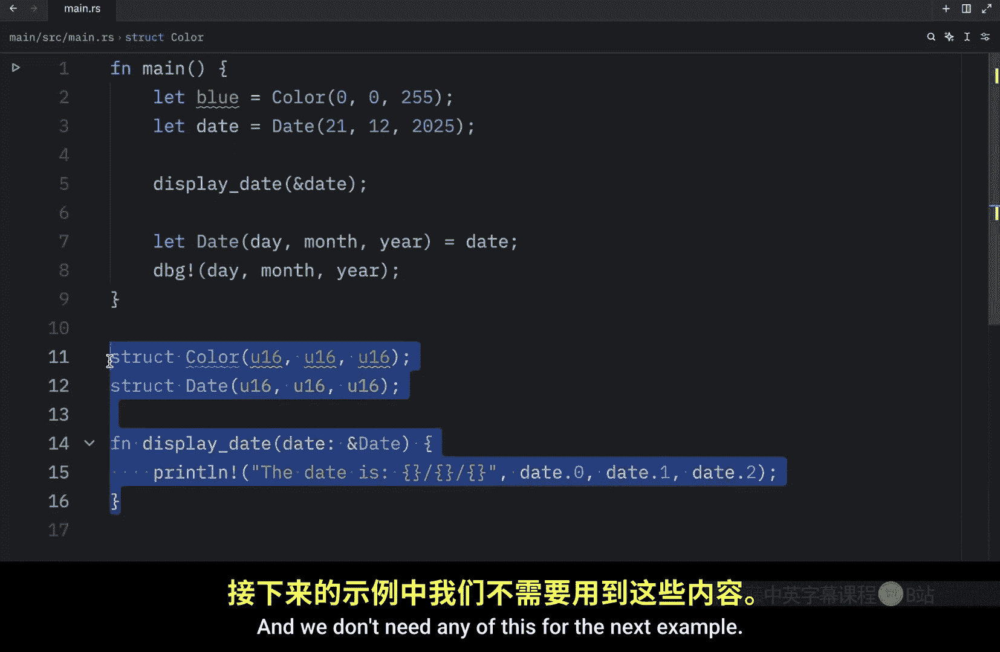

# Rustfully【中英⚡Rust 初学者教程（2025）｜Rust for beginners (2025)】 p36 P36 Rust中的元组结构体相当酷 -BV1eyAkzPEhj_p36-

Up next we're going to be covering another type of struct which sounds quite funky and this is the tuple struct now tustructs are pretty much just tuples with names which can make it partially more readable in certain contexts they're quite useful when you want to give a whole tuple a name and make the tuple a different type from other tuples it's also nice when you think that naming each field in a regular struct would be considered verbose or redundant for example。

You might have astruct called Col， and we will use American English there because we are in a programming video。

 or you might have astruct called date， which will also contain these three fields。

Next， inside our main function， we're going to create a color called blue。

Which will be of type color and will provide the values of 0，0 and 2，55。

 And below that we will create a date， which will be the 21st of December 2025。

 And I guess that's in the future。 but that's not even the point doesn't matter。 This is a date。

 Now right below both of thesestructs。 I'm going to quickly create a function called display date。

 which takes a date and a reference to that date， And we're going to print line。

That the date is placeholder， slash placeholder slash placeholder， then we need to pass in date dot0。

 date dot1 and date dot2。 Finally， we can go back to our main function and print line or why am I printing the line。

And display the date and passing in that reference to the date。

 Now I'm getting some syntax highlighting because I forgot to specify that this should be a date data type。

 but with that being done， we can clear the console run our program and you'll notice that the date is the 21s of December 2025。

 It displayed the date without any issues Now what we cannot do is pass in the color of blue because blue is not of type date even if it contains all of these same data types。

 and that's why having a tuple strapped can be considered to be better than just having a regular tuple because it differentiates the types。

 Otherwise we could just remove this and pass in U 16。

And in that case， blue would work just fine as a tuple。

And so would date anything that follows this signature would work。

 So now our function accepts anything that contains 3 U16s。

 which means if we were to run this with the color blue inserted would get a funky output such as this one。

 So all I'm trying to say is that a tuolestruct is a great way to be more specific with your data。

 So let's go back to what we had earlier。And passing the dates to display date。

 So practically a tuplestruct is just a tuple with a name in front of it。

 making it its own data type。 there is one thing I want to mention though。

 and that is that if you ever want to destructure a tuple or a tuplestruct。

 you're going to have to use the name as well here we're going to type in let date equal day month and yeah。

And that's going to be extracted from the date。 Now， we can debug they。Month and yeah。

 And this will work just fine。 What we cannot do is extract that data or destructure that data directly using a regular tuple。

 This will not work。 We have to use the type of the tuple structure when destructuring that type。

And if we were to run this， what we're going to end up with is each piece of information we provided in the debug macro Moving on。

 I want to show you that it's also possible to definestructs that don't have any fields at all and we don't need any of this for the next example so I will remove that and we will type instructs。

Ready and that's all we need inside main we can create something called a status and we can set that to Read so eventually later down the line we could use this as a flag to inform the program that something is ready and that it can move on and there are many more use cases but we will leave all of that for a future lesson Next I want to talk about ownership ofstruct data so once again I will create a user which will contain an ID of I32 a username。

Of type string and an email。Of type string。And here we used an owned string rather than the string slice。

 This was done deliberately because we want each instance to own all of its data and for that data to be valid as long as the entirestruct is valid。

 but it's also possible forstructs to store references to data owned by something else。

 And that requires something called lifetimes which we're going to discuss in a future lesson。

 but I just wanted to address that it is possible。 We're just not covering that in this lesson because it's not as simple as it sounds。

 We can't just type instruct fruit Pass in name and say that's of a reference type such as the string slice。

 we cannot do that。 It's going to complain or rust is going to complain that we're missing a lifetime specifier。

 So I just want you to know that that's coming in a future lesson。

