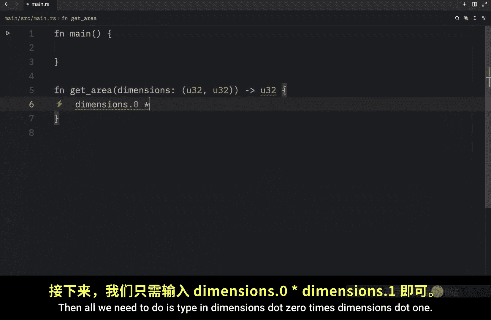
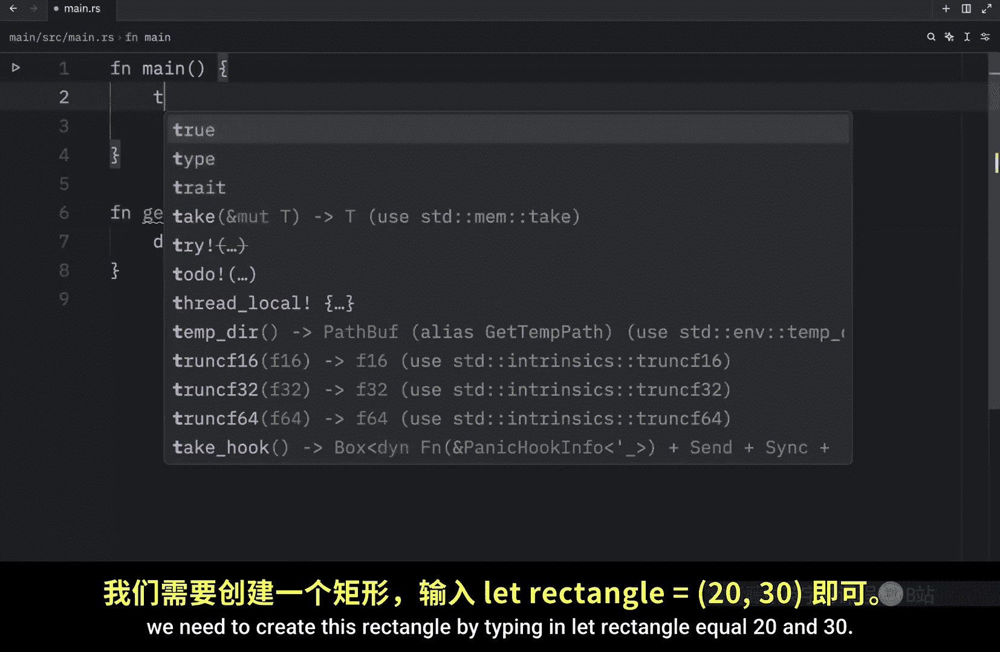
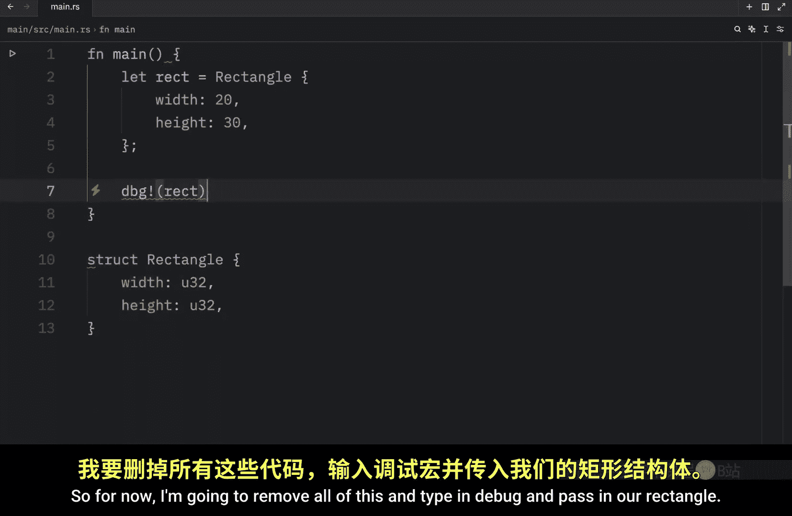
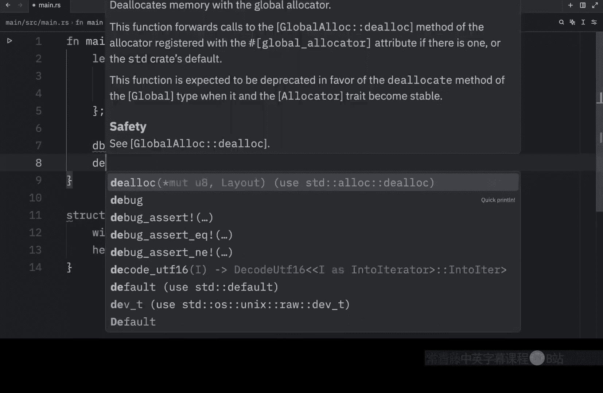
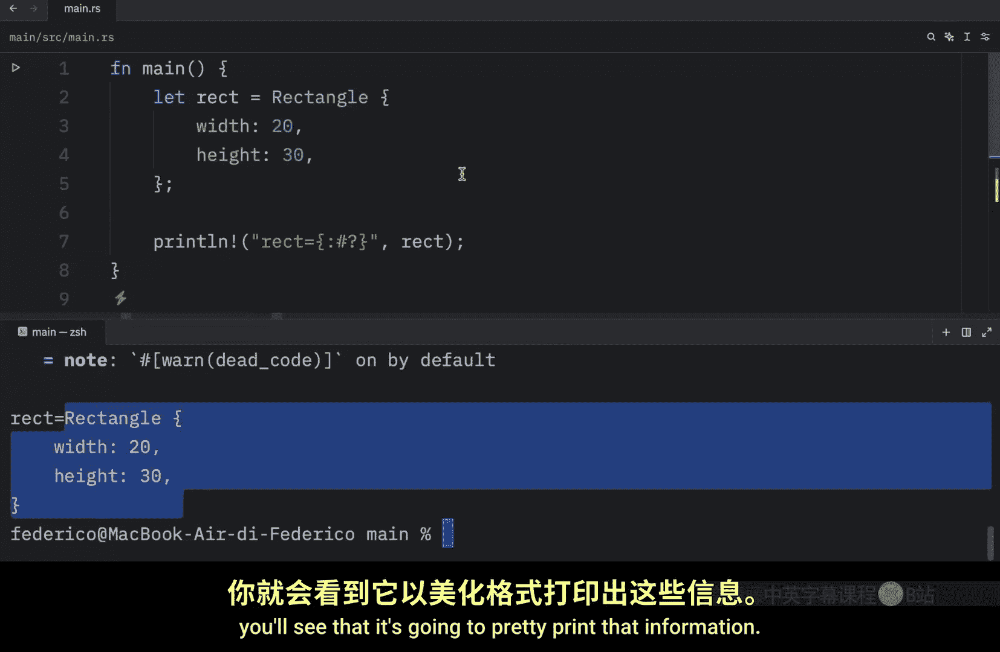

# Rustfully【中英⚡Rust 初学者教程（2025）｜Rust for beginners (2025)】 p37 P37 Rust中的结构体提供清晰性 -BV1eyAkzPEhj_p37-

In today's video we will continue learning about strs with an example program that is used in the official Rubook and we're going to start by creating the program without usingstructs and then adapt the code to usestructs so we get a better understanding of how they can be useful。

 The goal of this program is to be able to calculate the area of any given rectangle So let's get started with the first approach which will be astructless approach So immediately we're going to create a function called get area and this will take some dimensions of type U32 and U32 and it will return to us a U32 as well then all we need to do type in dimensions do0 times dimensions do1  moving to our main function。

 We need to create this rectangle by typing in lets。

Rectangle equal 20 and 30。 those are going to be the dimensions of the rectangle。

Now we can print line。And insert that the。Area of the rectangle。Is curly bracket？Square pixels。

Then we just need to pass in get area along with the dimensions， which is going to be our rectangle。

 Now， let's test this out and make sure everything works correctly。 And if we were to run this。

 you'll notice that the area of the rectangle is 600 square pixels。

 So everything functioned perfectly。 And for this example， a regular tuple works perfectly fine。

 Since it doesn't matter in which order you multiply the height by the width。

 you're going to get the same result in both scenarios。 So if I were to put 30 here and 20 here。

 the result would be the same But now imagine that instead of getting the area。

 you're drawing a rectangle on the screen。 The order would matter a lot in that case。

 It would be the difference between a very wide and short rectangle versus a very high and thin rectangle。

 but the type we use for dimensions just isn't the right way to convey that the order matters。

 So let's fix that。 and to fix that we're going to create astruct called。Tangle。

And it will have a width of type U32 and a height of type U 32 as well。 Now with this。

 let's modify our function。Instead of saying dimensions of type 2ple of U 32 and U 32。

 we're going to remove all of this， insert rectangle and pass in a reference to our rectangle。 Now。

 inside the function， we can type in rectangle dot width。Times， rectangle。t height。

 And this is much better because we have control over what we're doing。

 We understand immediately that we're working with either the width or the height。

 So if our function was more complex or this rectangle had more data it will be easier to manipulate。

 but now up here we need to create a rectangle。 So'll type in rectangle and will'll pass in 20 and 30。

 then all we need to do is pass in a reference of our rectangle to the get area function and I also need to remember to add a semicolon here。

Now I'm going to format this real quickly。And I'm going to rerun the script and what you should notice is that the area of the rectangle is 600 square pixels so the program worked exactly the same way。

 except this time we were much more clear with our code Also one thing we haven't covered yet is how we can debugstructs because if you were to try to either use the debug macro or to print it normally you'd notice that rust won't allow you to compile that garbage。

 we need to modify ourstruct slightly so that we can actually print it out So for now I'm going to remove all of this and type in debug and pass in our rectangle as you can see the error message says that rectangle doesn't implement debug and if we were to use a print statements and pass in the rectangle we would get the same error message that rectangle doesn't implement debug Now I'm just going to comment out the debug macro for now or actually I'm just going to remove it completely we can add that later because I want to talk about print line。

Now this section is taken directly from the docs。 The printline macro can do many kinds of formatting and by default。

 the curly brackets tell printline to use formatting known as display。

 So this is the formatting that the printline macro uses by default which gives us output intended for direct and user consumption and a lot of primitive types implement display by default。

 because there's basically only one way that you'd want to show an integer like one I mean I can't really think of any other way to display this if you're printing it out to the terminal So that's quite straightforward but with more complex data types。

 it becomes far less clear how you'd like the data to be displayed and rust leaves it up to us to clarify that Now I don't know if I mentioned this earlier or not but what you're seeing here is the debug specifier and usually you can use this for a lot of things such as an array and that will allow us to display this array but again。

Some other more complex data types rust is not going to know what to do because for example。

 our rectangle is completely user definedfin and just to show you if we were to run this。

 we'll end up with this error and if we scroll to the top you'll see that we'll end up with this error that rectangle doesn't implement debug and if we scroll down you'll notice a lot of helpful suggestions such as consider annotating rectangle with derived debug So what we're going to do is copy this and paste it directly above ourstruct and now the next time we run our program。

What we should end up with is that our rectangle is equal to this rectangle over here。

 We now told Ru exactly how we want to display that information and if your struct happens to contain a lot of data you can also use something called pretty formatting or pretty printing and I do that you just need to use the hash symbol in front of the question mark and the next time you run the script you'll see that it's going to pretty print that information and this is what the debug macro uses by default so here we can type in debug pass in a reference to our rectangle。

And now when we run this you'll see that we're going to get this as an output and that was all possible thanks to this little fix。

 but to sum this lesson up， it is much more convenient to be able to group our data into astruct rather than having regular tuples with random types floating around everywhere It makes our code much more clear and easier to edit later we still have one more topic to discuss regardingstructs though。

 and this will take our rectangle code to the next level That's right up next we're going to be learning about methods。

