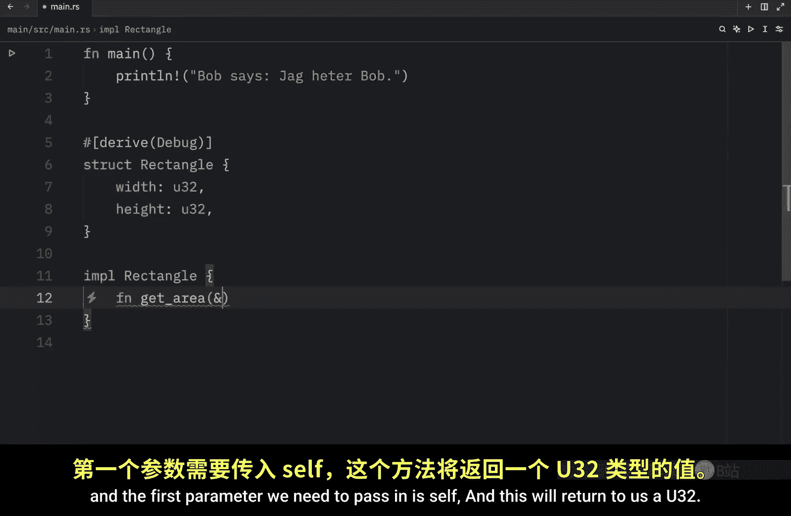
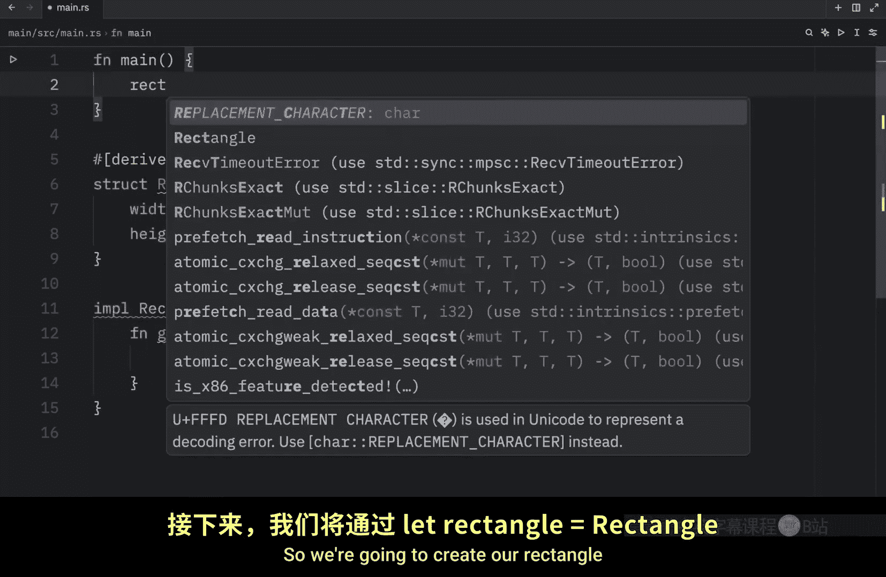
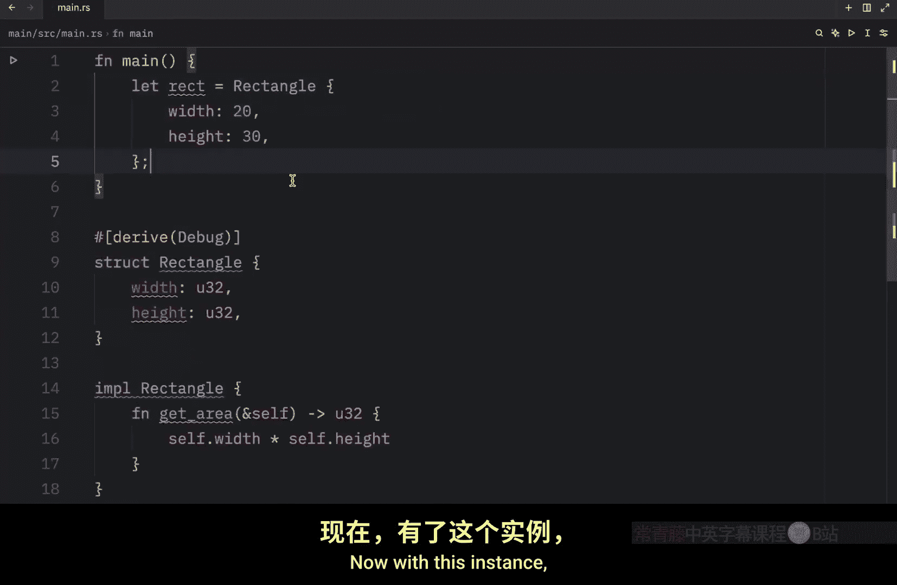
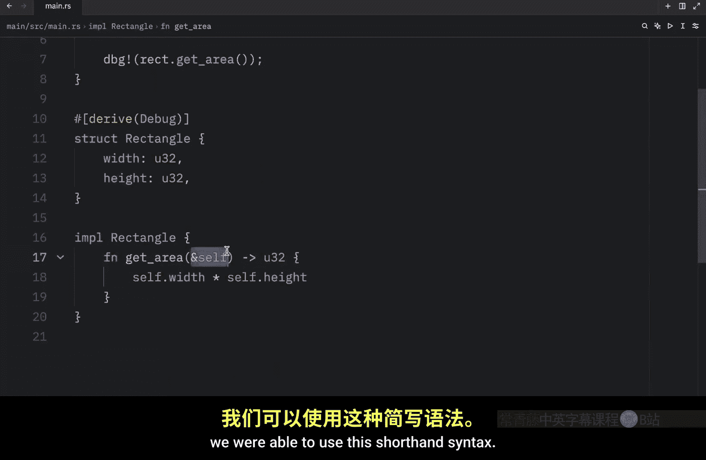
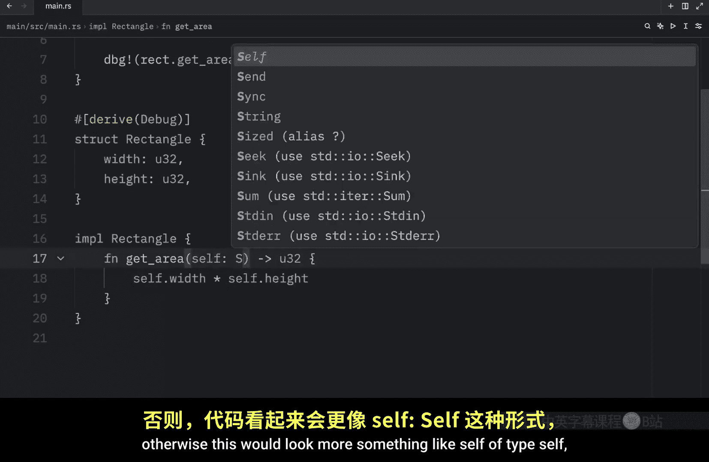
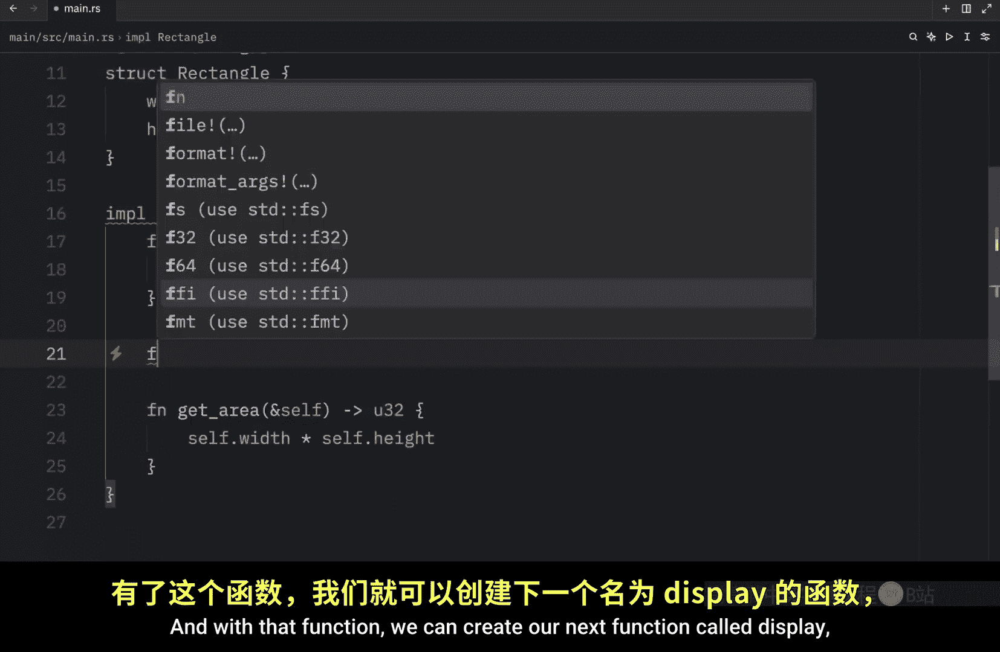
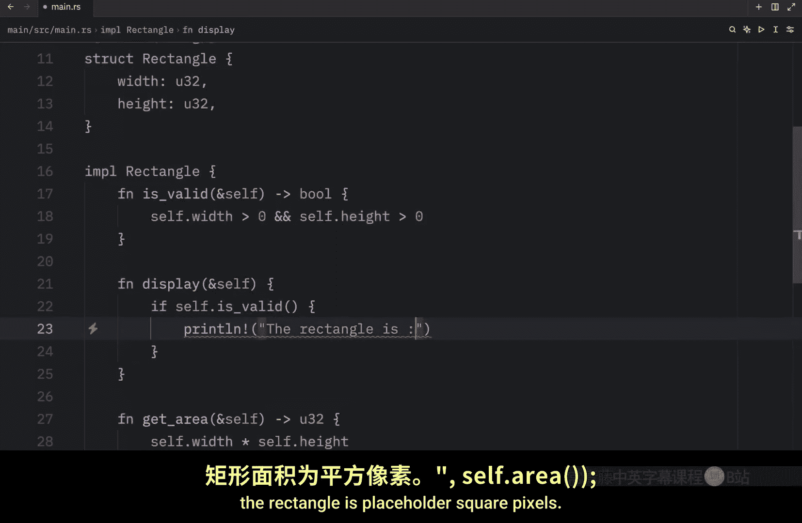
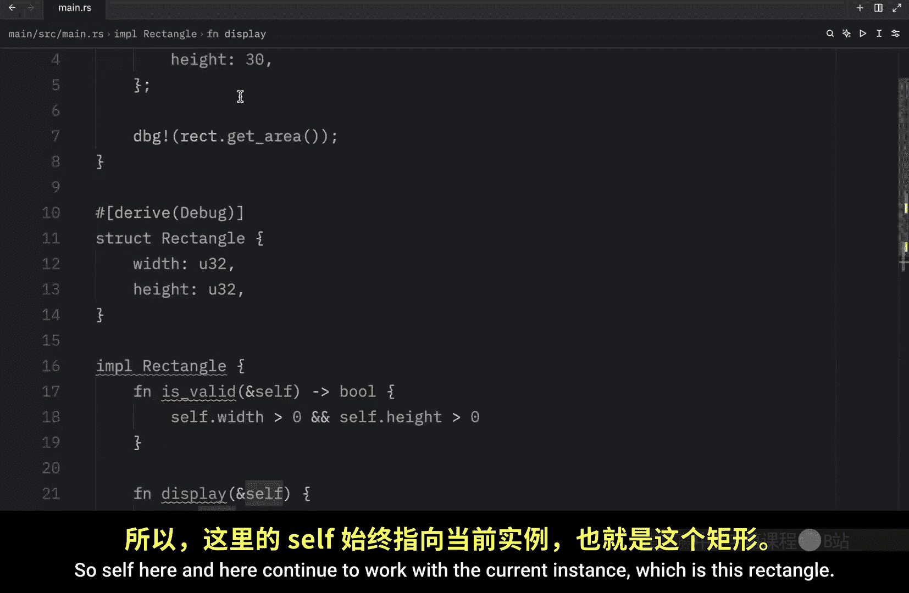
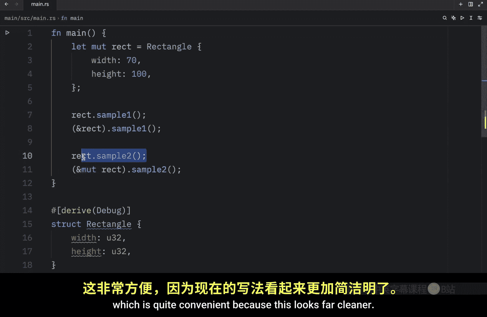

# Rustfully【中英⚡Rust 初学者教程（2025）｜Rust for beginners (2025)】 p38 P38 Rust中的方法很有用 -BV1eyAkzPEhj_p38-

In today's video， we're going to start learning about methods which are practically functions that are defined to be used with ourstructs。

 Mes are always defined within the context of astruct and the first parameter is always going to be self which represents the current instance of the struct that it's being used on but as always that was a lot of talking so let's jump into a practical example that shows us how we can define and use a method and we're going to pick up where we left off with the laststruct so we're going to be using our rectangle struct to implement some methods to add functionality to our rectangle we're going to have to create an implementation block and to do that we just type in IML which stands for implementation followed by the struct name such as rectangle Now inside here we can create some methods which will always refer to rectangle For example。

 let's create a get area method。By typing in function。

 get area and the first parameter we need to pass in is self。

And this will return to us A 32 and all we need to do is type in self。 width times self。

he and the reason we can do this is because self refers to the instance that's why we're getting all of these suggestions that have to do with rectangle self is the instance of rectangle but before I explain more let's create a quick example using this method so we're going to create our rectangle using let rectangle equal a rectangle。

With the following data width set to 30 or 20。The keyboard has spoken。And height set  to 30。 Now。

 with this instance， we can get the area just by typing in debug rectangle dot get area。

 We can now use dot notation to get that information back or that data back from rectangle。 Now。

 let's open up the terminal， clear it。

And type in cargo run in quiet mode。 And what we will get as an output is that the rectangle dot get area is equal to 600。

 So now this functionality is associated with our rectangle。

 And just to go back to what self is self is this piece right here。

 It's the current instance that we are working on。 Also。

 since methods always require self as the first parameter， we were able to use this shorthand syntax。

 Otherwise this would look more something like self of type。

Self。That is the equivalent to what we are doing， but rust allows us to use the shorthand equivalent to save time and energy。

 and it also looks quite nice， and it's quite important we use the ambiantia in front of the self shorthand to indicate that this method borrows the self instance。

 otherwise methods can take ownership of self。 they can also borrow self immutably or borrow them mutably。

 just like with any other parameter anyway， Another major benefit of using methods is that we can group functionality together。

 which helps us with organizing our code even more， for example， inside our rectangle implementation。

 we can add another function， such as is valid。Which will also take a reference of self and return to us a Boolean。

 And we can type in self dot width is more than0 and self dot height is more than or greater than0。

 And with that function， we can create our next function called display。

 which also takes the current instance。

And if self dot is valid， then we will execute the following line of code print line， the rectangle。

Is placeholderer square pixels。

And then we will pass in self。t get area， so self here and here continue to work with the current instance。

 which is this rectangle and this rectangle contains this information else we're going to print line that the rectangle is invisible。

Because if either the width or the height are0 you have an invisible rectangle。 Now with all of this。

 we can go back to our rectangle。 we can change the width to10。

 and what we're going to do instead is type in rectangle do display Otherwise you can see that all of the methods are included here。

 we can use each and every single one of these whenever we like。

 but in this example we just need display because we're curious about the information regarding our rectangle。

 Now if we were to run this， what we would get as an output is that the rectangle is 300 square pixels。

 Otherwise if we change the width to0 and we rerun this。

 we're going to get that the rectangle is invisible and this also works if the height is0。

 as you can see the rectangle is still invisible， but for literally any other positive number。

 we can add something such as 100 by 70 and this would give us a proper output such as the rectangle is 7000 square pixels。

 Also it's worth mentioning that self can come in many form。

Such as a reference， a mut reference， or it can even be owned， but when you are using the method。

 you are not required to do anything special to the instance Ru will automatically match the signature of the method so let's take a look at an example of what I'm talking about inside our implementation block I'm going to remove all of this and I'm going to create two simple methods。

Once's called sample1。 and it's going to take a reference to self。

 And then we're going to write sample 2， which is going to take a mut reference to self。 And next。

 we're going to try to use both of these。 So up here。

 we're going to type in rectangle dot sample 1 and rectangle dot sample 2 for sample 2。

 we do need to change our rectangle to be mutable So we will do just that。 But otherwise。

 everything is going to work perfectly fine。 rectangle dot sample 1 is exactly the same thing as。

Apaand rectangle dot sample1。 We do not need to match the signature of sample 1。

 Rus will do that for us， and the same thing goes for sample 2。

 We do not have to type in ampersand mutable rectangle dot sample 2。

 This is exactly the same thing as just typing in rectangle dot sample 2。

 but rust automatically adjusts to the signature。 So rectangle looks like this under the hood。

 but we do not explicitly have to write that， which is quite convenient because this looks far cleaner。

