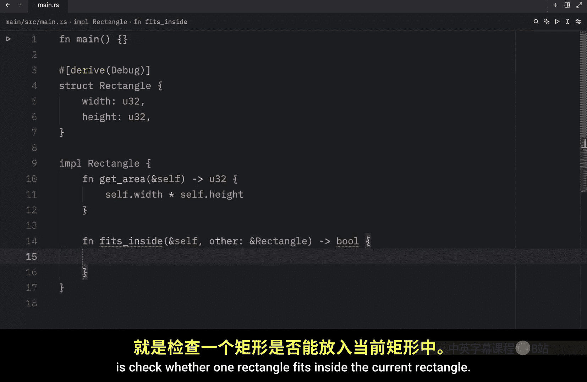
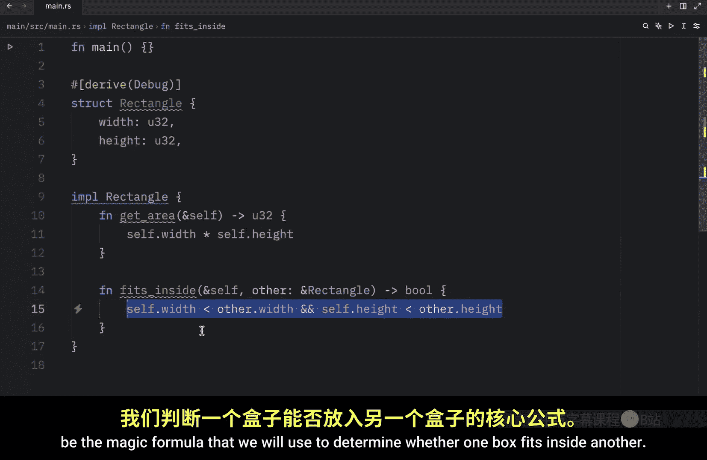
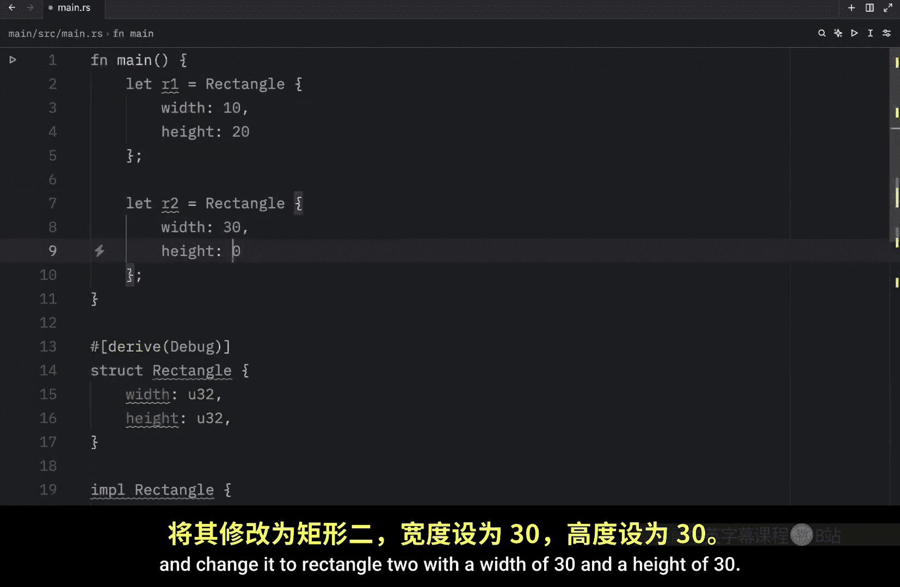
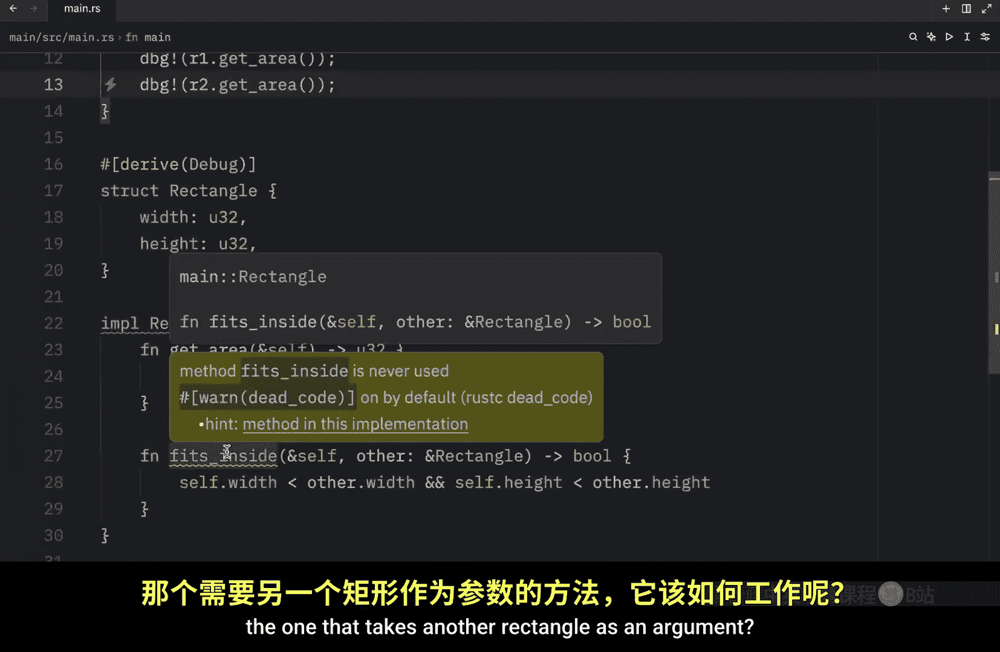
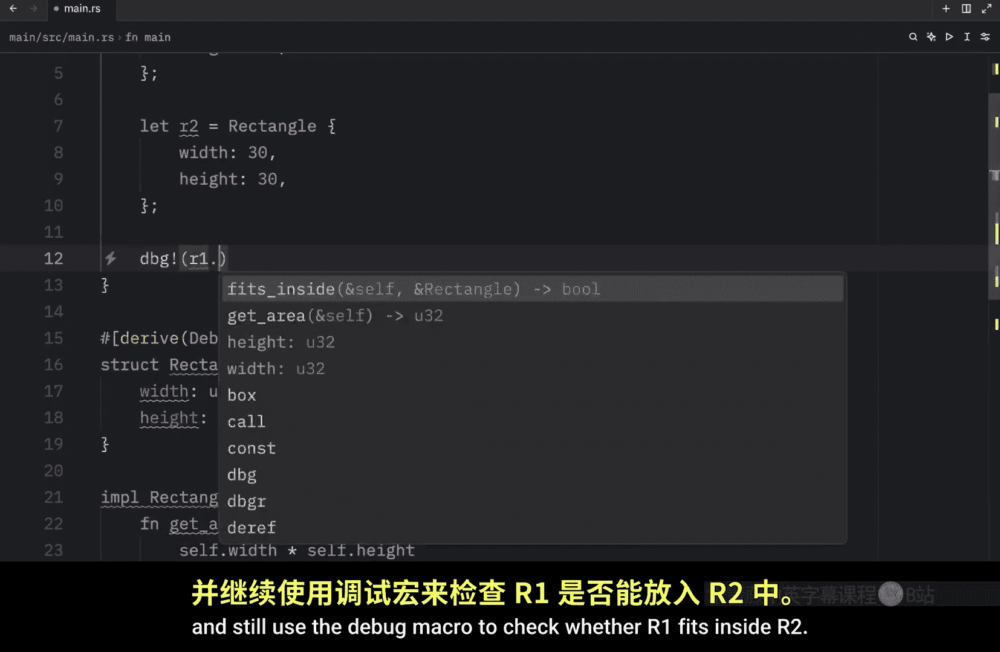
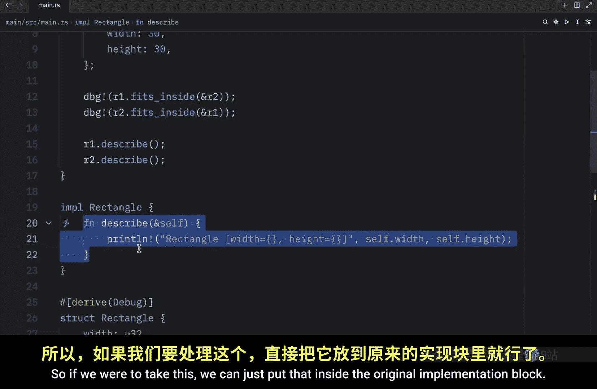
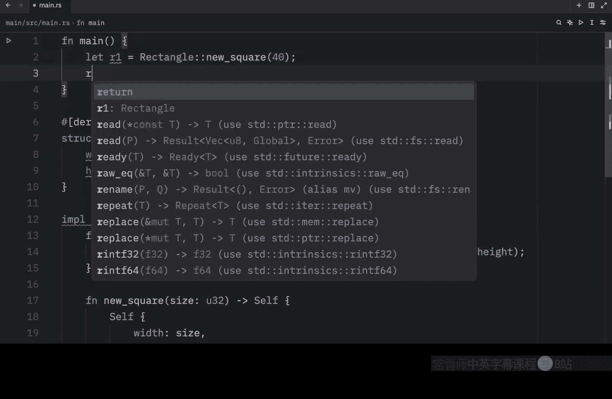

# Rustfully【中英⚡Rust 初学者教程（2025）｜Rust for beginners (2025)】 p39 P39 Rust中的关联方法很有趣 -BV1eyAkzPEhj_p39-

In today's video， we will continue learning about methods and to start off。

 we're going to talk a little bit about multiple parameters in methods。

 So let's go to our implementation block。 and I'm just going to insert the get area method that we had from earlier as our first method。

 This is what we had in the previous video。 But now I want to show you that we can create a method that takes other parameters。

 what takes other arguments when we are calling it。

 So here we will create a method called fits inside。

 and our first argument or parameter is going to be self for the instance。

 and then we're going to take another parameter， which is going to be a rectangle。

 And this will return to us a boolean。 and all we want to do here is check whether one rectangle fits inside the current rectangle。

 So to do that will type in self dot with。

Is less than other dot width。And self dot height is less than other dot height。

 This is going to be the magic formula that we will use to determine whether one box fits inside another。

 Next， let's go to our main function and create two rectangles So let R1 equal a rectangle with a width of 10 and a height of 20 then I will copy and paste this and change it to rectangle2 with a width of 30 and a height of 30。

 Now to call a normal method All we need to do is refer to the instance and use dot notation so we can get the area for R1 and we can do the same thing for R2 as long as we remember to use the semicollonons and if we were to run this。

In quiet mode， we should get the area back for each one of these rectangles。

 but how will it work with our new method， the one that takes another rectangle as an argument。

 Well for that， we're going to remove both of these and still use the debug macro to check whether all one fits inside。

R2。 and that's all it took to use our new method， which takes a parameter。

 It practically works exactly the same way as with a regular function， but it requires an instance。

 we can do the same thing with R 2 to check whether that fits inside R1。 Now， if we were to run this。

 you'll notice that R1 fits inside R2 is true。 because 10 and 20 are both less than 30 and 30。

 while R 2 does not fit inside R1。 and on a side note。

 I want to show you that you can also define multiple implementation blocks。

 It doesn't have to all be under one implementation block。 For example。

 here we have one implementation block， but somewhere else in our code， we can choose to。

Create a new one using the exact same name， and I'm just going to copy and paste in some functionality。

And what this functionality does is describe the current instance。

 So it's going to print out that the rectangle has a certain width and height and it's going to insert those values and with that we can now refer to an instance and use describe and let's describe both of them so describe R1 and describe R2 Now the next time we run this we should get back the height and the width for each one of these rectangles。

 although at this point there isn't really a good reason to do this and you'd achieve the same result using only one implementation block So if we were to take this we can just put that inside the original implementation block and then remove this one entirely and the code would function the exact same way For now I just wanted to show you that this is valid syntax but later on in a future video we'll cover where this can be useful moving on。

 we're going to be talking about associated functions and all functions defined within an implementation block。

A called associated functions because they are associated with the type that comes right after I we can also define associated functions that don't use self as the first parameter because they don't need an instance of that type to work with and if we are not using the instance to access functionality via dot notation it is no longer referred to as a method and we've already seen an associated function before。

Just to show you what I'm talking about， we can create a name。Which will equal string。From Bob。

 this part right here is an associated function。From is associated with string and associated functions that aren't methods are often used to create constructors that return a new instance of the currentstruct。

 for example let's go down to rectangle and I'm just going to remove these two since we're not going to use those anymore I will use describescribe because I think that's quite useful。

But what we're going to do here is create something called new square。 And this time。

 we're not going to use self as the first parameter。 We're just going to insert a size。

Of U 32。 And this will return to us an instance。 So we're going to return self。

 Then self is going to require the following fields， a width。

Of type size or not of type size， but with the value of size and a height。

 which will also take the value of size。 And both of these are going to be size because we are creating a square here。

 We don't need to provide different values for the width or the height。

 They're both going to be exactly the same。 Anyway， with this。

 we can now create a square using this new syntax。

So let's R1 equal rectangle， colon colon， new square， and we will pass in 40。

 and then we can describe this square。 So R1 dot describe。

Now if we were to run this， what we should get as an output is a rectangle with a width of 40 and a height of 40 Also I want you to note that all the functionality we have in rectangle can be accessed via this double colon notation。

 but it can be quite silly to call some functionality this way when you can do it on the instance directly。

For example， if we want to describe the square， we can type in rectangle colon colon describe and then pass in R1 or a reference to R1 This is valid code and if we were to remove this and werun our script or our program you'll notice that we will get the exact same output with this line of code but this can be seen as quite for both It was much cleaner just to type in R1 do describe this is straight to the point and took far less effort to write so to sumit upstructs allow us to create custom types that keep associated pieces of data together which is a huge win for organization and implementation blocks allow us to define functionality that is related to ourstr type which again is a huge win for organization and even code clarity butstructs aren't the only way to create custom types So up next we're going to be learning about enums。

In rust。