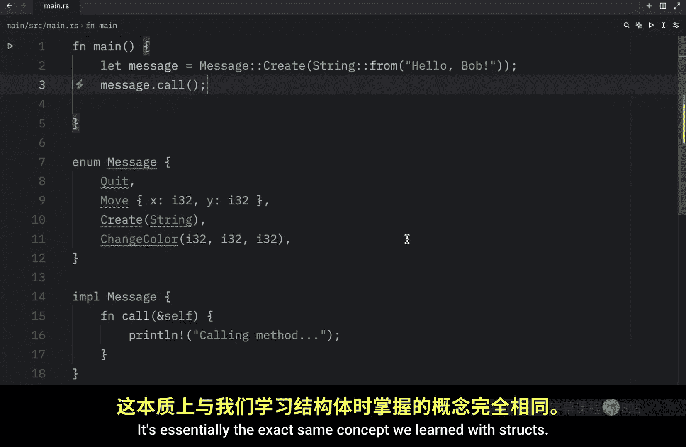

# Rustfully【中英⚡Rust 初学者教程（2025）｜Rust for beginners (2025)】 p40 P40 Rust中的枚举很有趣 -BV1eyAkzPEhj_p40-

How's it going everyone。 We just coveredstructs which gave us a way of grouping related fields and data together。

 So next we're going to learn about enums， which allow us to create a group of fixed values so to speak。

 For example， if you had a lamp the only two states you'd probably have for it are on and off。

 This group of values would fit perfectly in an enum because those are the only two options we have for a lamp。

 So let's create our very first enum and enumerate all the possible variances for that lamp。

 So what we're going to do is type in enum which stands for enumerate and then provide a state and you can name this whatever you like。

 it should represent the data that it is holding such as the state of the lamp and here we can insert on and off。

 and state is now a custom data type that we can use anywhere in our code。

 So what we're going to do is create a couple of instances。

 one which is called on and then we will type in state。

On and we can do the same thing for off Now since both of these values are of the state type。

 we can now define a function that accepts both of them。

 For example we could create a function that keeps track of the state and toggles it from off to on or vice versa depending on its current state so the function would look something like this FN toggle current state of type state and the functionality at this point doesn't matter what matters is that we can pass in a state which is either on or off just by inserting that state So toggle and we can pass in on and that will work just fine otherwise we can insert off and that will also work another example would be with IP addresses so I'm going to remove all this and create a new enum called IP and here we're going to have an IP address of version 4 and version 6 and with this we can now use that in astruct or anywhere we like as a data type。

You'll type instruct and then IP address and inside we can add the kind which will be of type IP and an address。

 which will be of typey string。And with both of these， we can now create our IP addresses。

 So let our home IP equal an IP address with the following data。

 The kind will be set to IP version 4 and the address。Will be set to a string。From。1，27。0。0。

1 otherwise we can also have a loop back which will also equal in IP address and this time we will use version 6。

 so IP or the kind will equal in IP address of version 6 and the address is going to be a loop back address so we're going to type in string from Col colon 1。

So that's another way we can use our enum Now if we wanted to。

 we could also attach some data to each variant in our enum， for example。

 V4 could accept a string and then we could do the same thing for V6。And thanks to this approach。

 we can simplify this code over here， so what we're going to do instead is type in let home equal an IP address and then we use colon colon V4。

 kind of like a constructor and insert the string。From what we had earlier， one，2，7。

Dot 0 dot 0 dot 1。 And right now， this is complaining because we are using thestruct and not the enum。

 So this right here should be an I。 Then we can duplicate this， change this to loop back。

This two version 6， and just add Col colon1。And this can be seen as a better approach since it's more concise and doesn't require us to create a whole new struct when using it and on top of that。

 the name of each enum variant that we define also becomes a function that constructs an instance of the enum。

 but another advantage of using an enum rather than a struct is that each variant can have a different type and amounts of associated data。

 for example， going back to our IP enum we can type in something such as V4 U8 U8 U8 and U8 since an IPV4 address will always have four parts。

 and that means that we can now type in 1270，0 and1。

 but of course we should remove this part right here。

And version 6 can continue to be a custom string， you can really include any kind of data you want inside an enum。

 including other enums Moving on， let's look at another example of an enum。So first。

 I'm going to remove all of this and change this enum to message。

And this message is going to have four different possible operations。

One of them is going to be what happens when we quit the message。

 what happens when we move a message， so this will take some coordinates of I32 and I32。

 what happens when we create a message and this will take a string。

And what happens when we change the color of a message and that would be of I 32。

 I 32 and I32 and using an enum make this very easy to create。 if we had to do this using structs。

 it would look something like this would have to create a separate struct for each one of these operations and that would be a massive pain and on top of that。

 each struct is now its own type， making it much harder to accept them all as a single type in our program。

 For example， if we had a function called function， that took a message of type message。

This would work with each one of these operations。We can just type in function and then refer to our message and pass in one of these。

 It could be quit or it could be the other ones， whichever one we decide to pass in。

It's going to accept it。Now if we were to use thestruct approach。

 this would become much harder because now we can only accept a quit message， a move message。

 and so on， we would have to find a way to use each and every single one of these and once again that would be a massive pain。

Now there's one last thing I want to cover before we move on to the next section of enums。

 and that is that we can also define methods for them using these same implementations index。

 for example， with this message we can type in Iple message and then we can create a function called call。

 which takes the current instance and then you can do whatever you want with that instance。

It works exactly the same way as if you were to create a regular method inside astruct。

 so here for example， we can type in calling method。

And that would be all the functionality we would use for that function。 Now inside main。

 we can let the message equal。A message， create。And passing in a string from。Hello， Bob。

Then with this， we can refer to the instance and call this method。

 it's essentially the exact same concept we learned with Strs。

Reverb stands for reverberation。How's it going， everyone？

