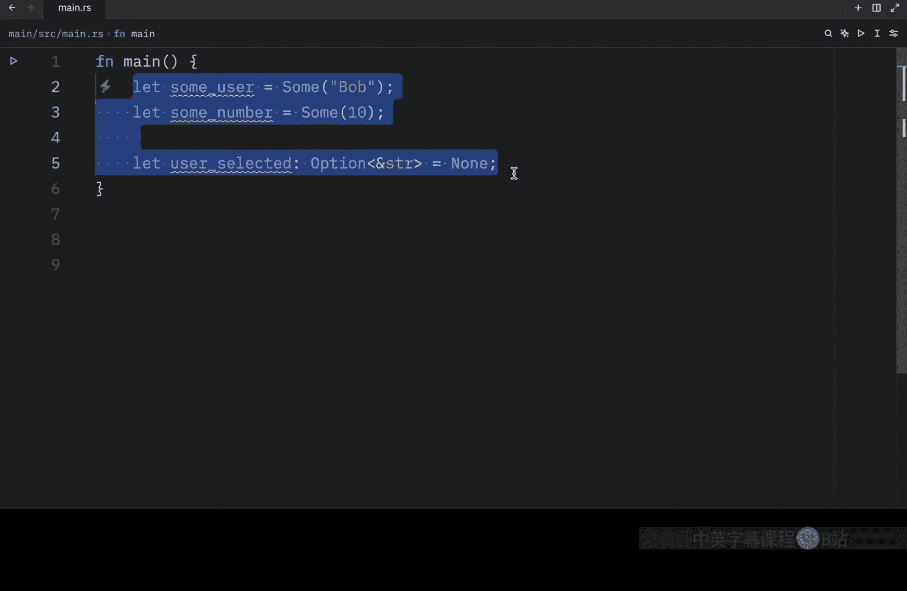
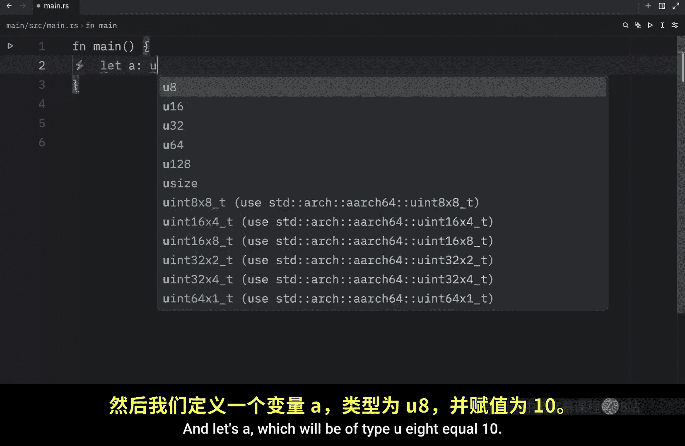
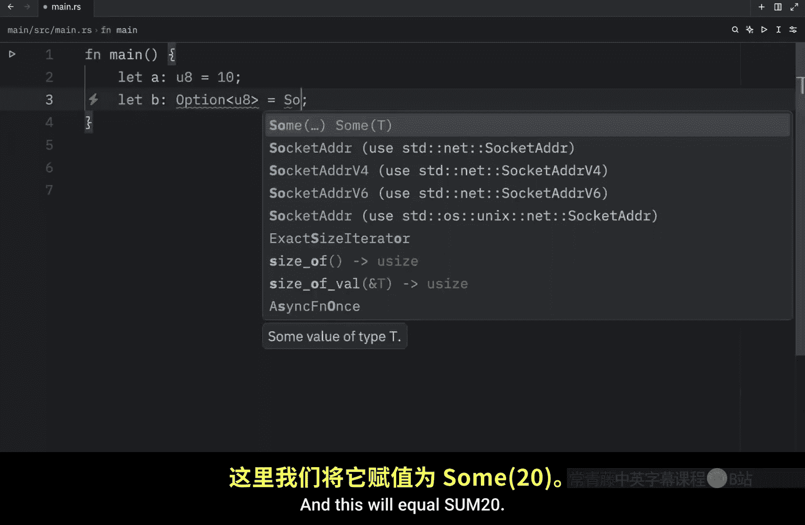
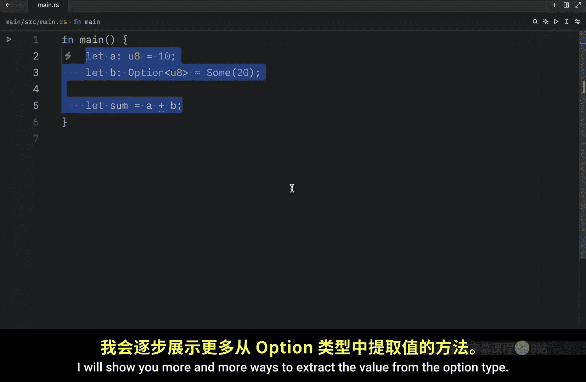
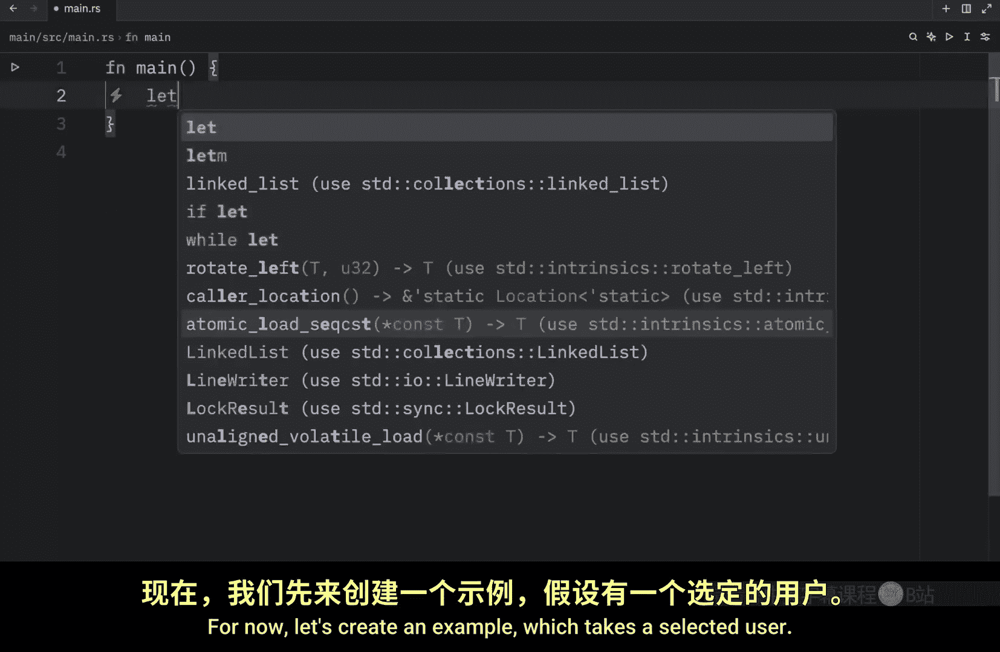
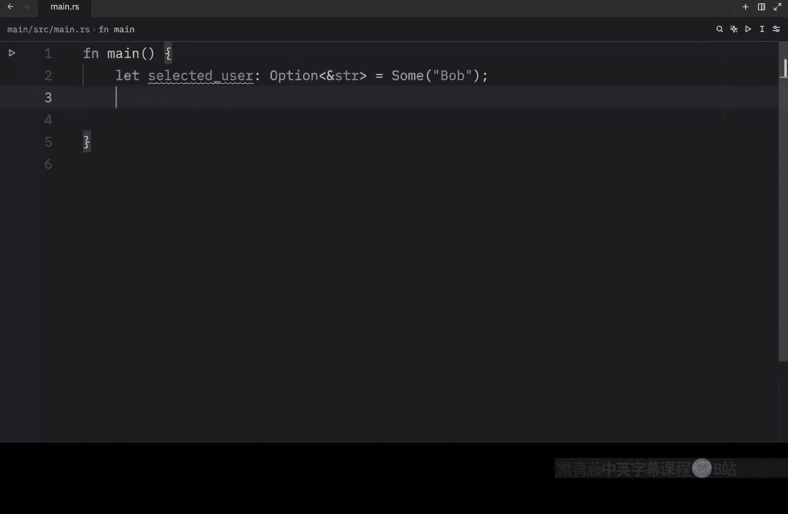
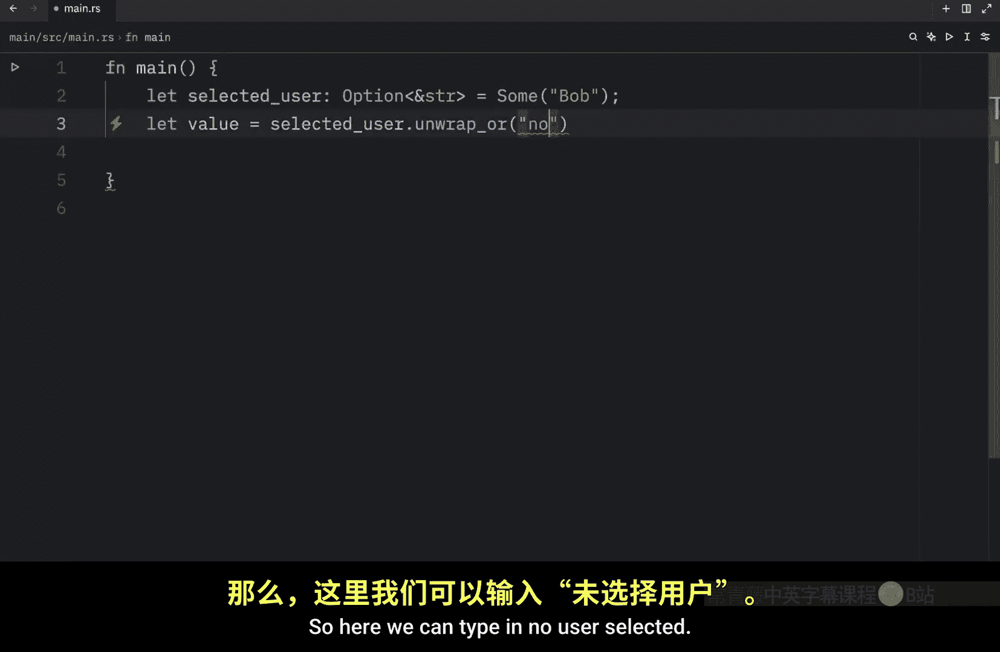
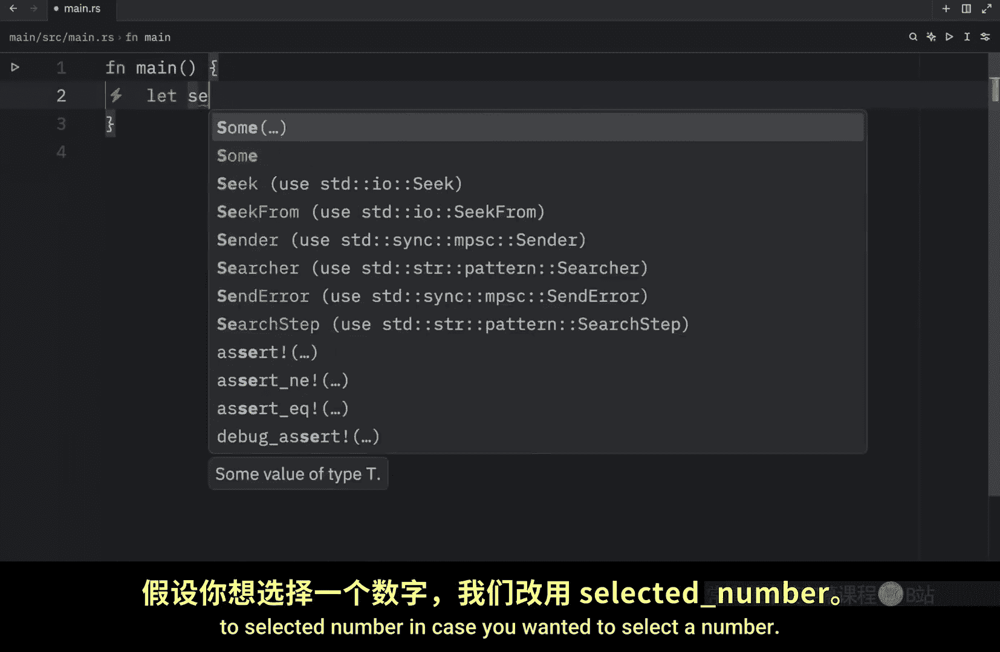
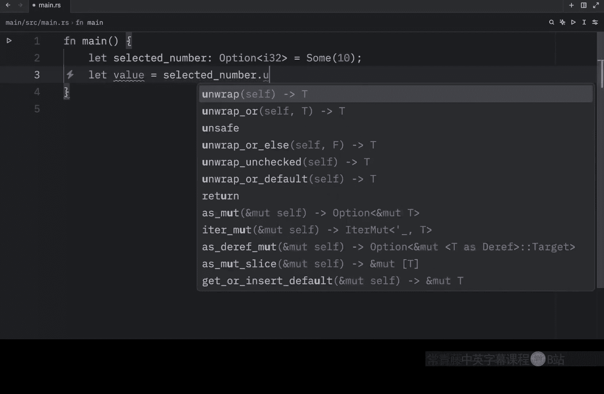
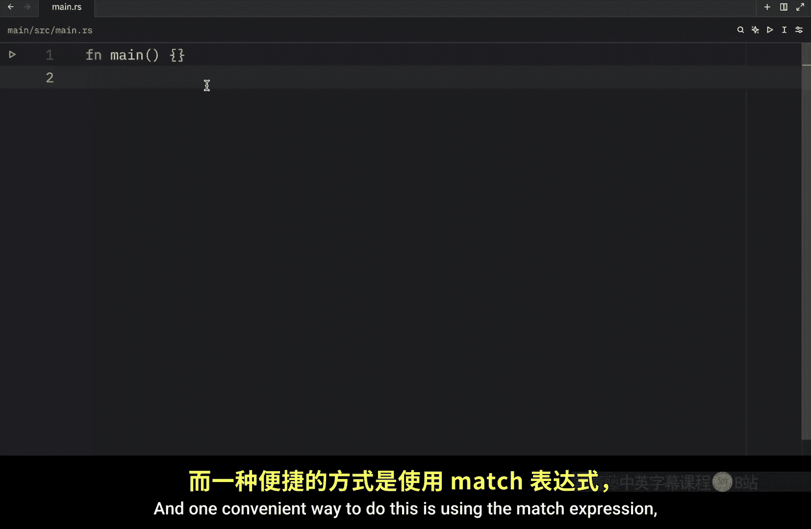

# Rustfully【中英⚡Rust 初学者教程（2025）｜Rust for beginners (2025)】 p41 P41 Rust中没有null类型 -BV1eyAkzPEhj_p41-

In today's video， we're going to be learning about the option enum and its advantages over null values。

 The option type is an enum， which is defined by the standard library。

 and it represents an optional value， which is a value that might be something or might be nothing。

 For example， if you were to search for a term in a dictionary。

 you'd get a result for the term you were searching for only if it was present in the dictionary。

 Otherwise you'd get nothing back because that term didn't exist。

 Ru doesn't have the null feature that many other programming languages have。 in Python。

 we have the nun type which represents no value。 but in rust。

 we don't have anything that represents that。 The problem with null values is that if you try to use one as a not null value。

 you'll get an error of some sort， but that doesn't mean we should discard the concept of null values entirely。

 there are still places where the concept can be useful。 So again， rust doesn't。

Exactly have a null value， but it does have an enum that can convey the same concept of a value being present or absent。

 This enum is called option and it looks like this。

 so let's type it out option which takes a generic type of T and I'm going to explain that in just a moment but as variants we will have none and sum of t so t is just a generic type。

 it can be an integer， it can be a string whatever type you use is what t ends up becoming。 anyway。

 now that we understand what the option enum looks like we can get rid of this because it's already included in the prelude。

 which means that we can use it without having to import it so to use it we will create some user which will equal sum what the value of bo otherwise we can type in something such as some number and it will contain some value of10。

 Otherwise we can type in something such as user selected of type option。

And inside here will pass in a string reference。 And that's going to be set to nu。

 So option just means it might contain a value， or it might not contain a value。

 And this can also be set to some value， such as Bob。 It has to either be sum or none。

 Those are the only two options we have here。 When we have a sum value。

 We know that a value is present， and that it is held within the sum， a nu value on the other hand。

 means the same thing as null in some sense。 This does not contain a valid value。

 So why would having this be any better than having a null type。 Well， in short。

 it's because option T where t represents the type of the value。

 which can be any type and T are different types。 And what I mean by that is that this is completely different。

Than this， an option of a string reference is not a string reference。

 and option cannot be used as a definite valid value。 So here we can't type in， for example， Bob。

This is definite， and that cannot be used with option。 It has to be a sum value or a none value。

 But let's take a look at an example where this can be quite useful。

 So let's just remove all of this and lets a。

Which will be if type U8 equal 10。

Then we will create B， which will be an option type of U8， and this will equal sum 20。

 Now if we try to create something such as a sum and assign it the value of a plus B。

You're going to notice that rust is not going to compile this garbage because it's garbage and you should feel bad。

 I'm just kidding of course it won't compile because they are two different types and rust doesn't understand how to add these two together。

One is a potential value and one is a fixed value。 When we have a regular value like U8。

 the compiler will ensure that it's always going to be a valid value we don't have to check whether it exists before using it we are guaranteed to have that value but when we have an option of type U8 then there's a possibility that we might not have a value so we have to worry about that before using it at the end of the day。

 this was a good design choice enforced by rust because it helps us avoid the billion dollar mistake that many devs experienced in other languages using a value that is null as if it actually contained a value which obviously led to bugs and crashes So that's good null。

 but how do we extract that value from option T Since right here we weren't able to use it even if we wanted to Well。

 there are plenty of ways you can do that and in this lesson I'm only going to be showing you a few of them but as we progress with this。

courseour I will show you more and more ways to extract the value from the option type for now let's create an example which takes a selected user pretend you are trying to select a user from a database or you're in a video game and you want to select a user now here we're going to type in option of type stringing slice and that's going to equal sum with Bob that is the user we want to select。

Obviously， we can't use this the way it is， because what we're telling Gria is that this value might or might not exist。

 and we can't use a value that doesn't exist， so we need to explicitly extract it before we use it。

 One way to do this。

Is to extract it directly by typing in selected user and typing in unrap or And what we insert here is the default value。

 a value to return in case selected user is none。 So here we can type in no。

User selected。Now， if we were to debug this value。

And run our program。You'll notice that the value will be set to Bob。

 but in the event that the selected user ends up being none。

What we're going to get back is that the value is set to no user selected。

 Now let's change the example slightly to selected number in case you wanted to select a number。

And this will be an option type of i32。And it'll be set to sum 10。

 That's just a random number we are picking。 and something else we can do is type in let value equal selected number dot unwrap。

 Now if we were to debug this and pass in D value。

What we're going to get back， or let's actually clear the console first so we can see。

And run it in quiet mode what we're going to get back is that the value is equal to 10 So unwrapap essentially does the same thing as unwrap or but if the value is none here。

 the whole program is going to panic So if you type in none and you rerun this program you'll see that it panicked which is not ideal So in most cases this should be avoided and there are many more ways to retrieve the value out of the option type once again I'm not going to cover all of those in this video but what I am going to do is leave a link in the description box down below which allows you to explore them all Also in general you're going to want to have a way to handle each variant when you are using the option type and one convenient way to do this is using the match expression which we will cover in the next lesson。

