# Rustfully【中英⚡Rust 初学者教程（2025）｜Rust for beginners (2025)】 p42 P42 我喜欢Rust中的match -BV1eyAkzPEhj_p42-

How's it going everyone in today's video we're finally going to start learning about the Match control flow construct in rust and Mat allows us to compare a value against a series of patterns and then execute code based on which pattern matches。

😊，And there's a lot we can do with Mat， so let's get started with a quick example of what it looks like and actually before we do anything we're going to create an enum called data size and this will hold byte。

😊。

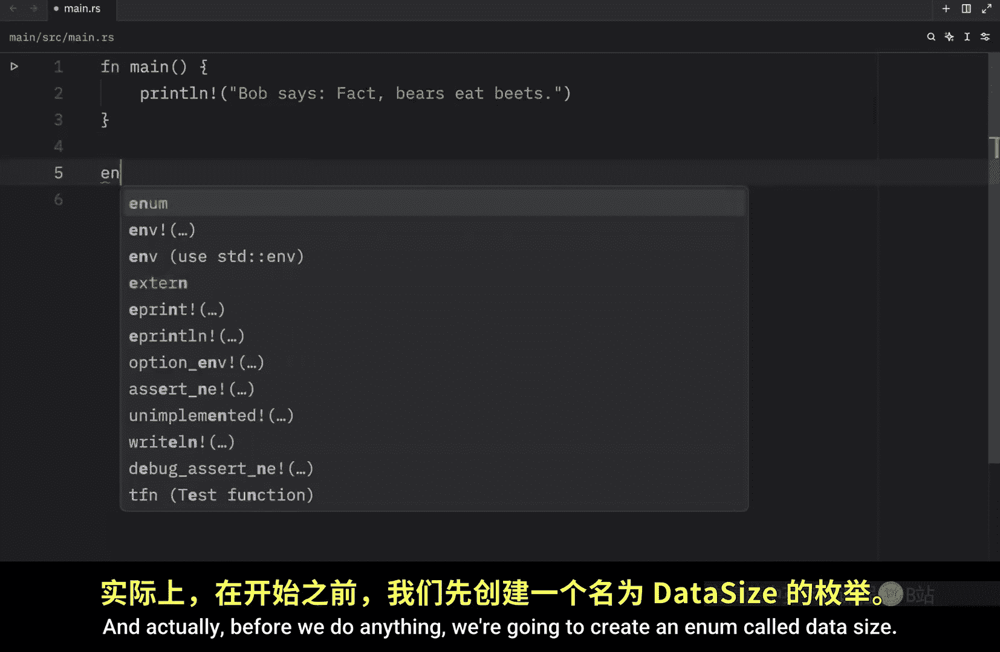

Kilabbyte。Mgabyte and gigabyte， then we will create a function called bytes。

And this function will convert the data size that we select to bytes。

 so he'll type in size and specify that to be of type data size and we will return a U64。

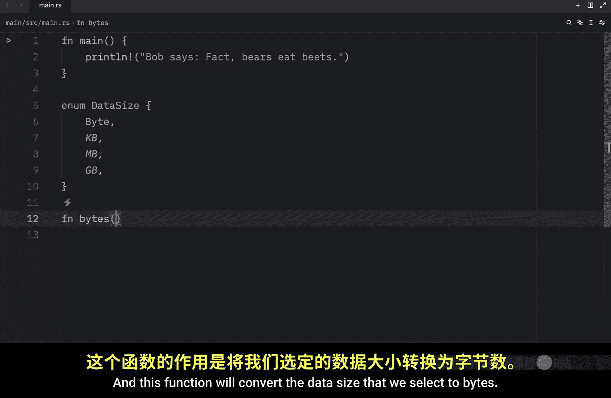

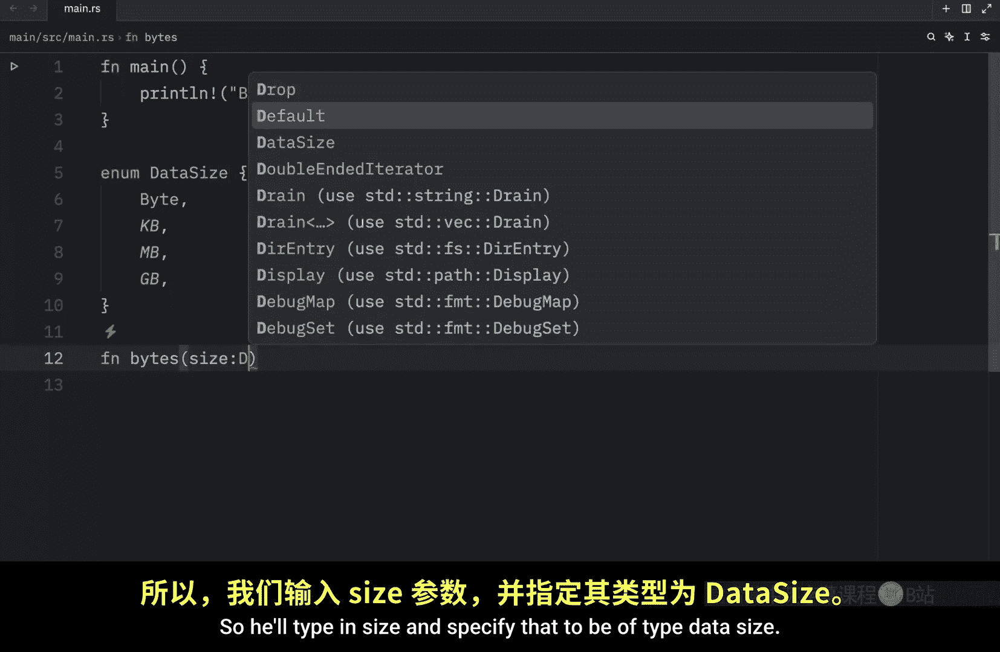

Now to use match， we need to use the match keyword followed by the expression we want to match against。

 which in this example is going to be the size and now when the match expression executes。

 it's going to compare the resultant value against the pattern of each arm inside this match expression and I'll explain what an arm is in just a second So first we need to cover what should happen if size evaluates to a byte。

 for example here we can type in data size of type byte and we can use this arrow to separate the pattern from the code we want to run In this example we just want to return1 byte if we use the data size of byte otherwise we can add data size kilobytes with an arrow and that's going to return 1000 and we have data size megabyte which will return 1000 times 1000 and data size gigabyte which will return 1000。

Times 1000 times 1000。 Now each one of these are called an arm and this match expression has four arms。

 Now let's use our function to convert1 kilobyte into bys So here we're going to type in let kiloby equal bytes and we're going to pass in data size kilobyte。

 then we can print line or I'm going to use my special debug statement。

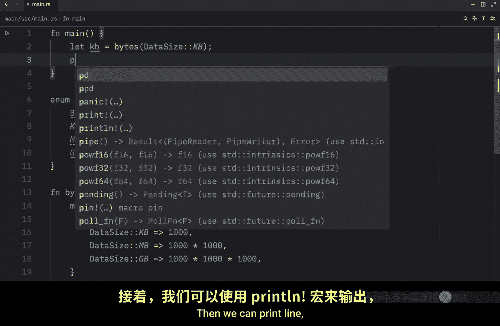

To pass in the kilobyte， now we can open up the terminal and type in cargo run in Qui mode。

And what we should get as an output is that 1 kiloby is equal to 1000 by and this was all possible thanks to our match expression here we inserted data size of type kilobytes and that was transferred here So once it founded inside our match expression it was able to use that arm to return the result of 1000 Also in this example we decided to only return one value for each arm but what if you want to run more lines of code and return another value based on that code。

 Well for each arm you can also choose to specify curly brackets。

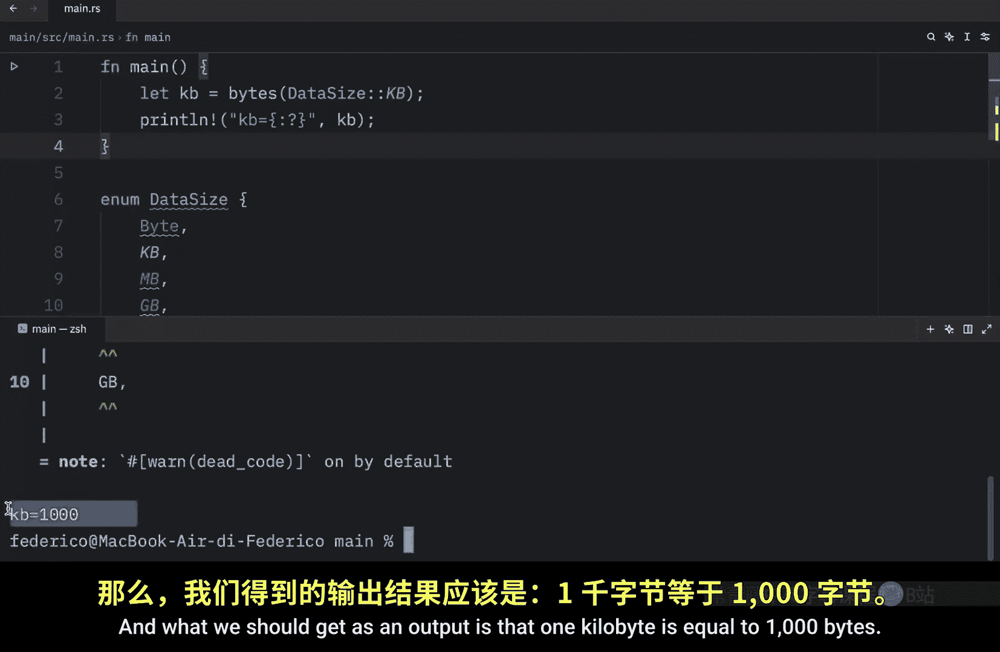

And this allows us to add multiple lines of code。 For example， for the first arm。

 we can type in something such as。

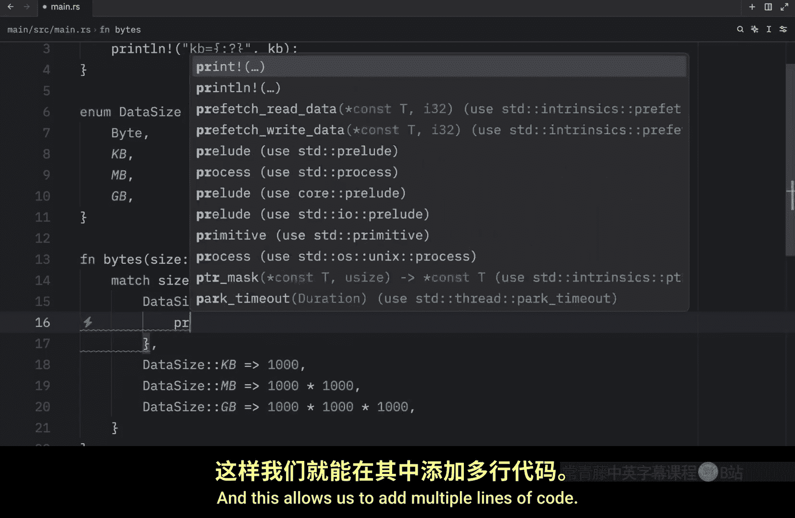

One bite is one bite mate。Because I mean one bite is one by。

 and then we can return one at the bottom of this block and now if we go back to our main function and change this2 byte and change this to B and B。

 you'll see that when we run our code that we will get the following output1 byte is one bymate and B is going to equal one and we can do this for every single one of our arms。

 they don't have to be an order， you can also choose to add an arm here， say 1000 times 1000。

And print something else。

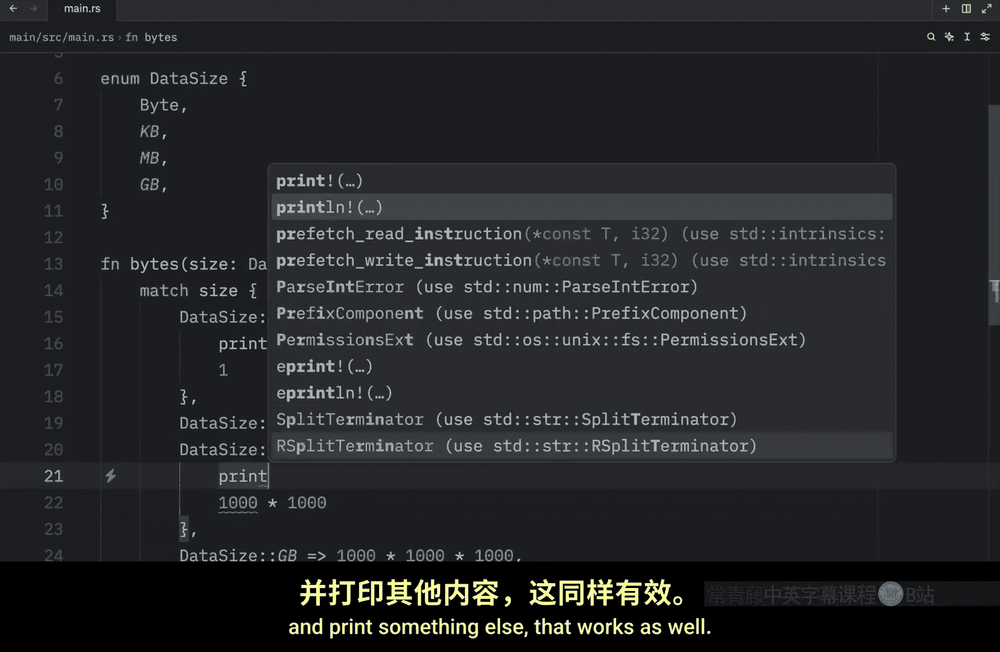

That works as well。 You can add this anywhere you want inside your match expression。 Also。

 you are not required to use a comma when you are using this syntax。

 the code will run exactly the same way， whether you specify a comma or not。

 it is completely optional。 Anyway， let's change this back to one。

Because it's time we move on to the next example which will teach us about patterns that bind two values so for this next example we need to go to our enum and specify that gigabyte it's going to be a type U64 so now it takes a U64 as a value and you'll notice immediately that we're going to get some syntax highlighting inside our match expression and that's because we need to supply the U64 so here we can insert a variable name that will absorb that value or not only absorb but it's going to allow us to use it as a variable inside this arm so here we can type in amount just as an example it doesn't have to be amount it can be literally any variable name you want。

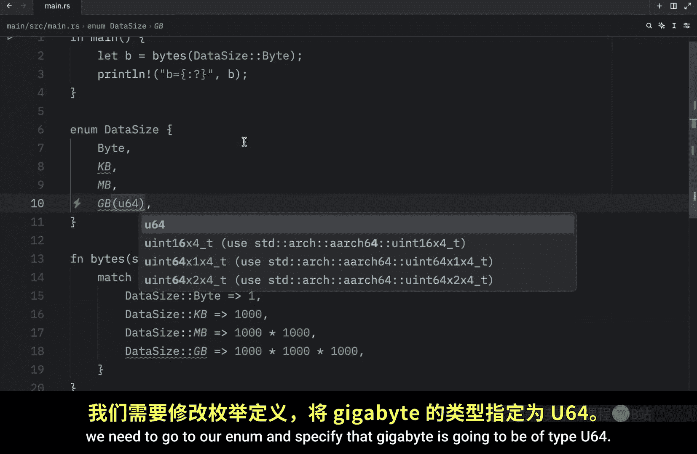

You can even type inva。Or let's say。Value whatever you want to insert there， you can do that。

 but for this example I'm going to keep it as an amount。Now with this， I'm going to create a block。

Because I want to execute some extra code。 And I'm very upset it took away the 3100s。

 So let's keep that and tap on enter。And then I'm going to type in let total equal all of these times the amount。

 because what we want to do here is specify an amount of gigabytes and return the conversion in bytes。

 and of course it's going to complain， but at the bottom what we want to return is the total。

 but before we get to that total I also want to print some text that tells us exactly how many bytes that is in billions。

 so let billions equal the total divided by 1 billion。

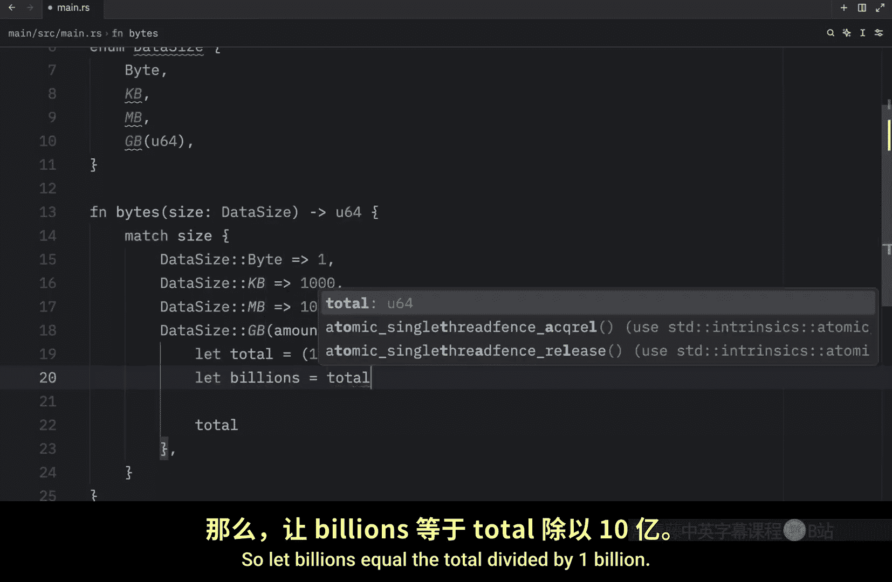

Then we can print line。That the amount。And gigabytes is。Billions。Billion bytes。

And that will just make it a bit more legible because this is a lot of bytes we're dealing with now to actually use this。

 we need to go back to our main function and create a new variable and this one's going to be called 2 gigabys。

 which will equal bytes and that will take a data size of type gigabyte which will take an unsigned integer of 64 bits so here we can type in something such as two and we can do another one that says5。

😊，And another one that says25， so here I'll type in 5 and 25。

 and finally we can debug this and pass in two gigabytes。

And we'll do the same thing for5 gigys。

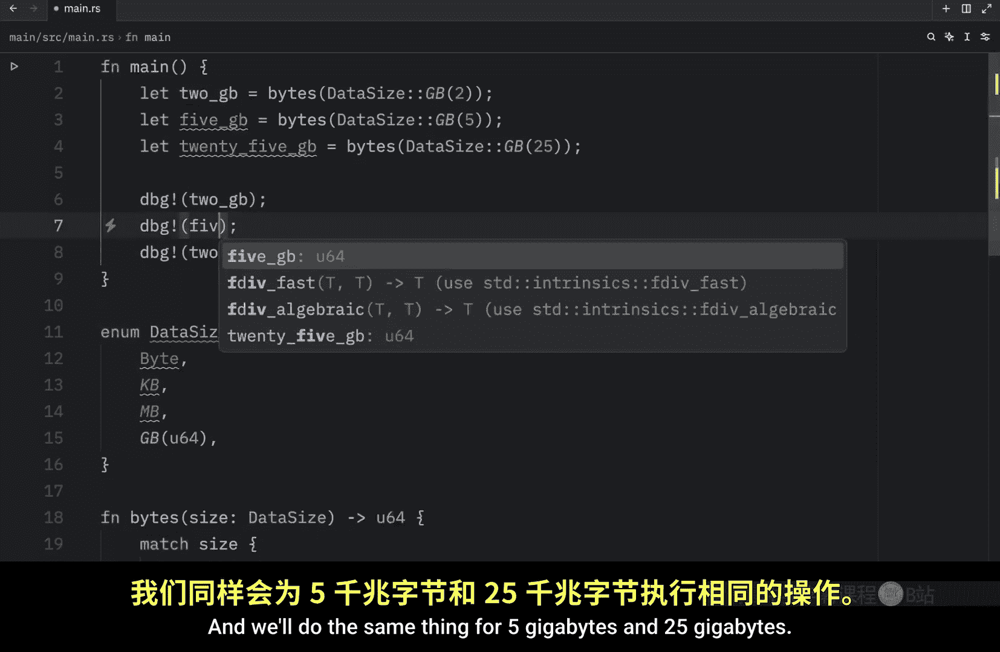

And 25 GB。Next we can open up the terminal and run this one last time。

And what we're going to get as an output is the print statement for each one of these plus the actual value。

 so 2 gigabte is 2 billion， 5 gigab is 5 billion， and you can see that down here。

 but as you can see this is quite illegible so it can be nice to have this print statement to make things a bit more clear。

 but what's important here is that we were able to extract this value and use it as part of the pattern inside our match expression。

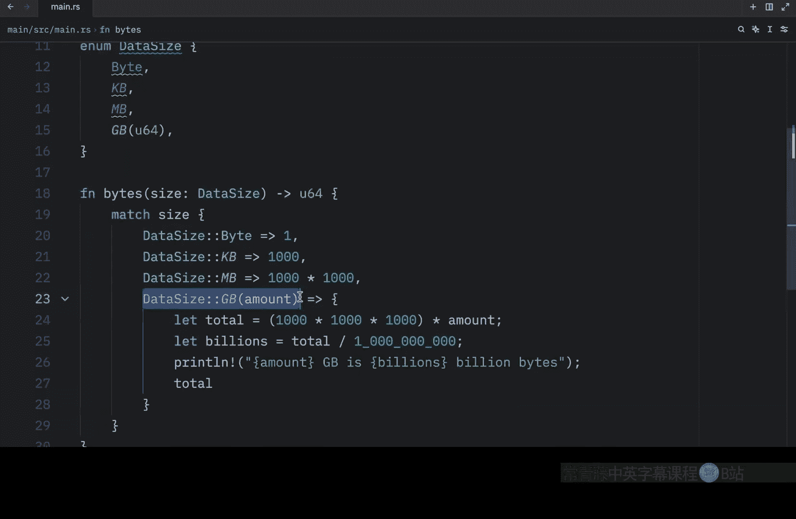