# Rustfully【中英⚡Rust 初学者教程（2025）｜Rust for beginners (2025)】 p43 P43 像专家一样使用Rust中的match -BV1eyAkzPEhj_p43-

Not so long ago。 we started learning about the option type in rust。

 Let's go back to that real quick and learn how we can use our new match expression to handle optionals in rust so to get started。

 we're going to create a function I don't know why I wrote so I guess because I was saying so So to get started we're going to create a function that takes an option of type string slice and handles that value accordingly using the match expression and this function is going to check whether a user exists in a user database So here we can type in user exists passing the user which will be an option of type string slice and then here we can return a boolean。

 If the user exists， we want to return true otherwise false。

 but we're going to do this using the match expression。 So here we type in match user。

 which is an option of type string slice and with that being kept in mind we can handle both of the scenarios starting with what happens if the user is none So here we will create。

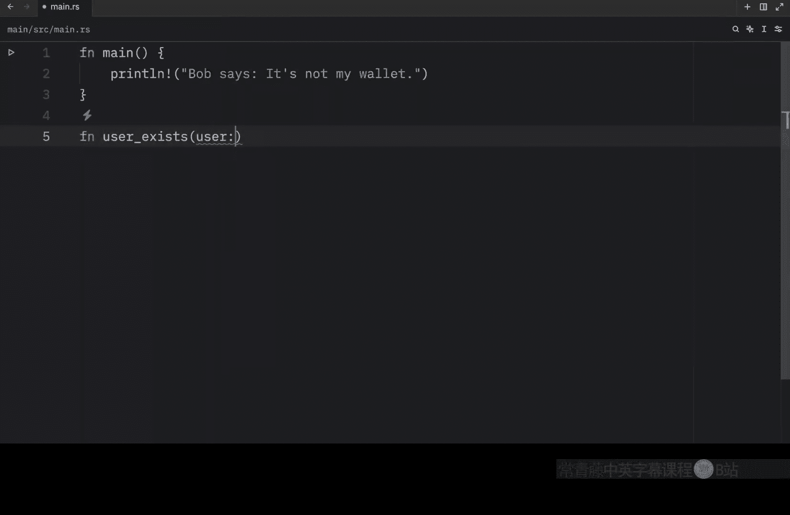

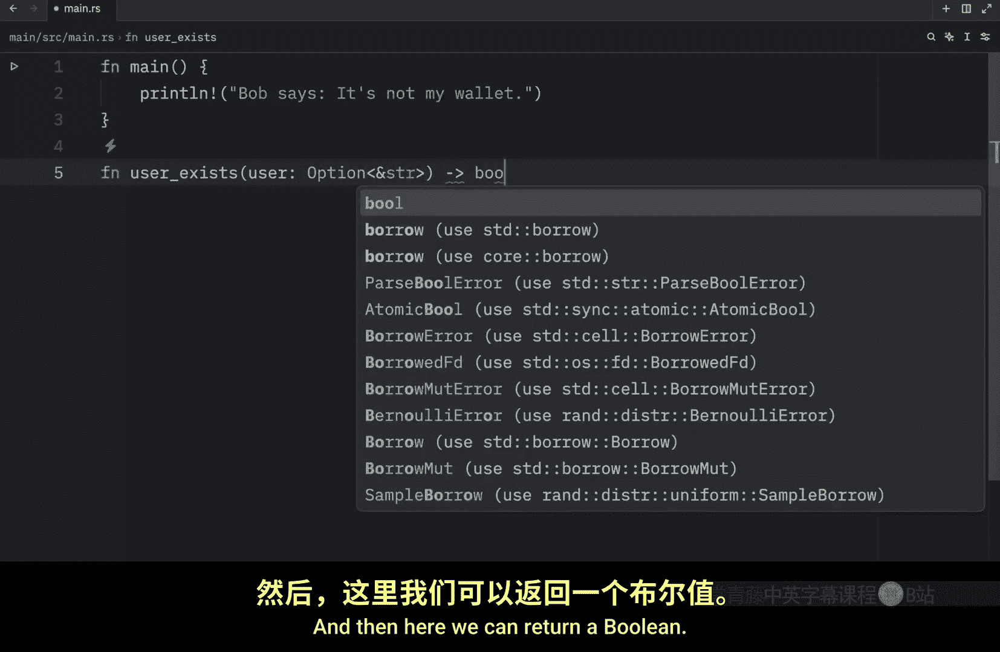

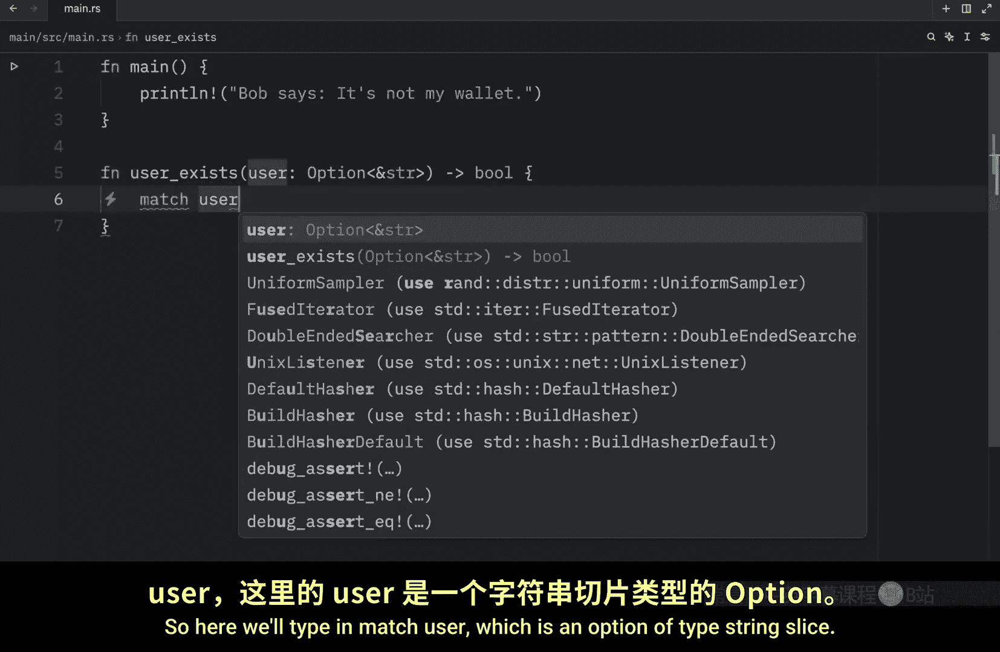

Arrow， open up a block and type in print line。 please insert a username to search for。

And we're going to return false because obviously we didn't search for a user。

 which means 100% of the time。 It's not going to be able to return to us a user。

 so that user does not exist。 Otherwise we can handle what happens if there's some user。

 and here we're going to simulate that we find that user 100% of the time。

 So we're going to printline searching or looking。

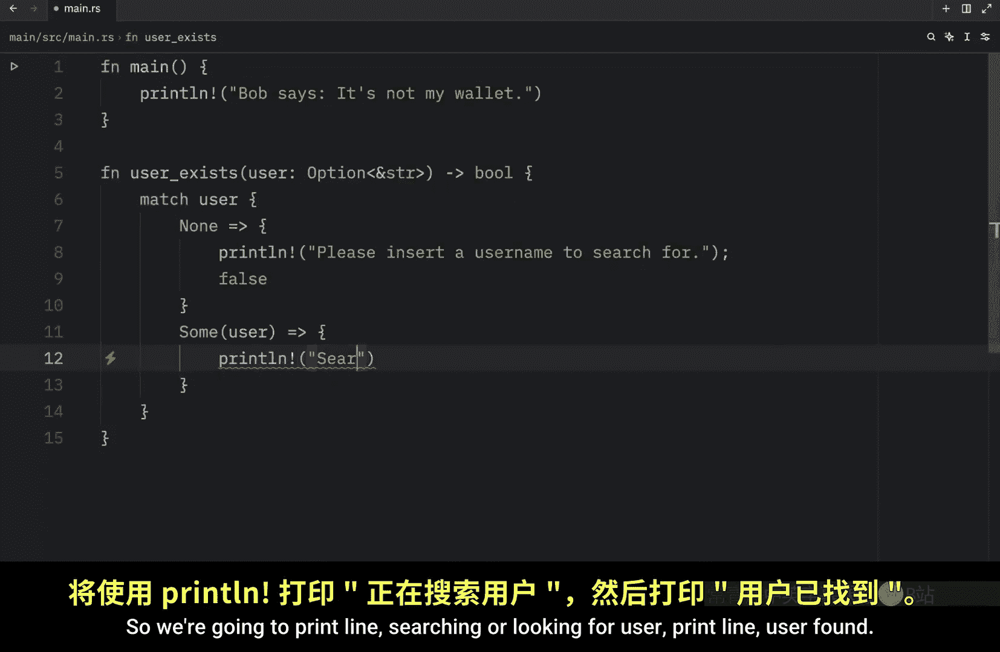

For user， printline， user Fo。

I want this to be in quotes with an exclamation mark and finally we're going to return true and just like that we handled both variants of the option type Now to use this。

 we can go inside our main function and type in let user equals sum。Bob。

 that's going to be the username。

Then we can let the result equal user exists。

And pass in the user， and I'm going to debug。What the result is going to be now if we open up the terminal。

 type in cargo run in Qui mode， what we should get as in output is that our function looked for the user。

 found the user and was able to return true because of that otherwise if user exists was set to none。

It's going to ask us to insert a username to search for and it's going to return false because it was unable to find out whether a user existed or not moving on one thing we didn't quite cover yet is that matches are exhaustive meaning that if we try to match something we must cover all the possibilities or the code won't compile so to show you what I mean by that I'm going to create a new example so here we're going to have some grades A B。

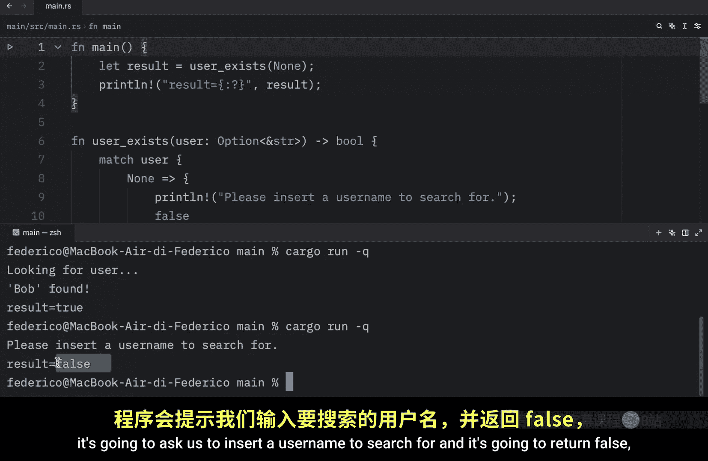

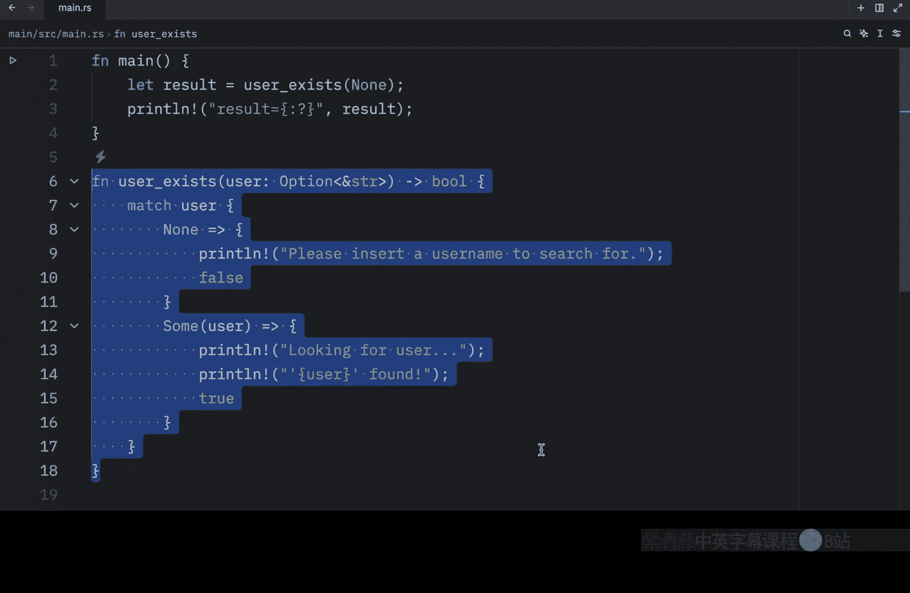

And see。And what we want to do with these grades is convert to a score。

So we can create a function called grade2 score。

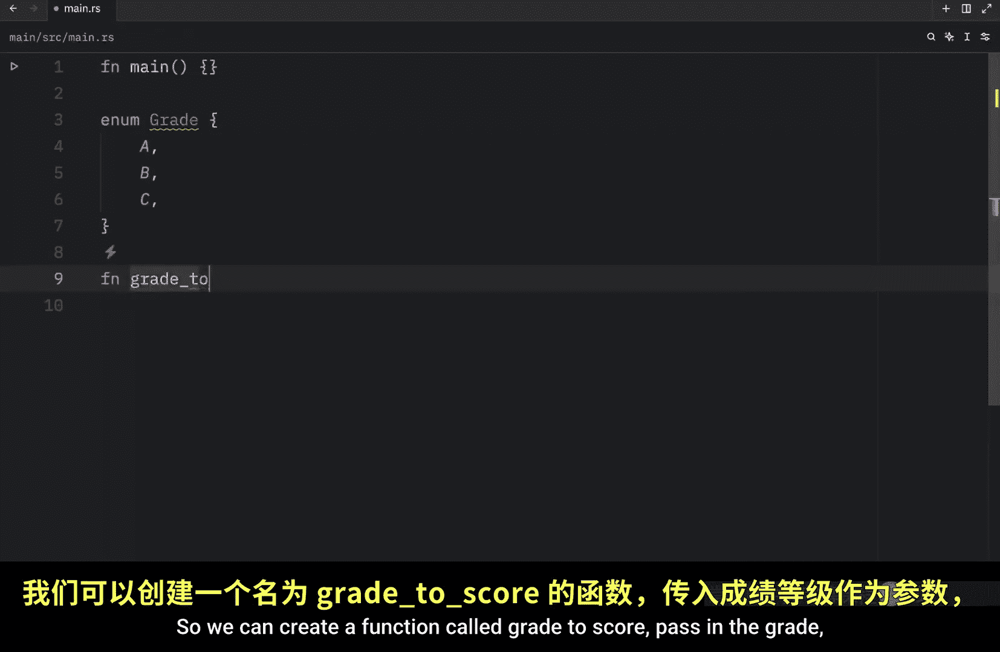

Pass in the grid。And that will return to us a U8。 Now inside here， we will match the grade。

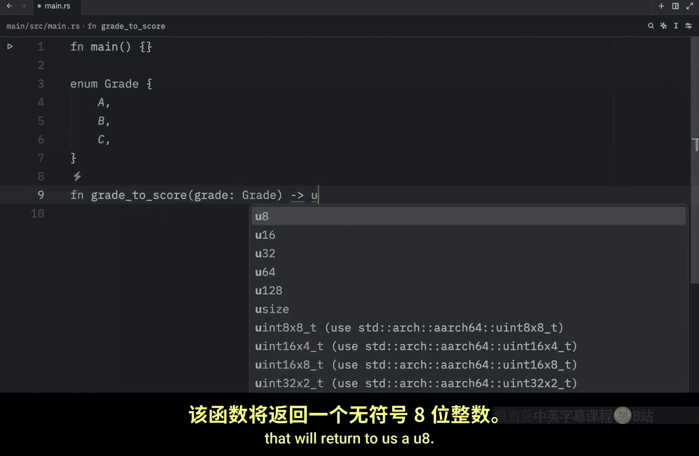

And we'll type in grade A。

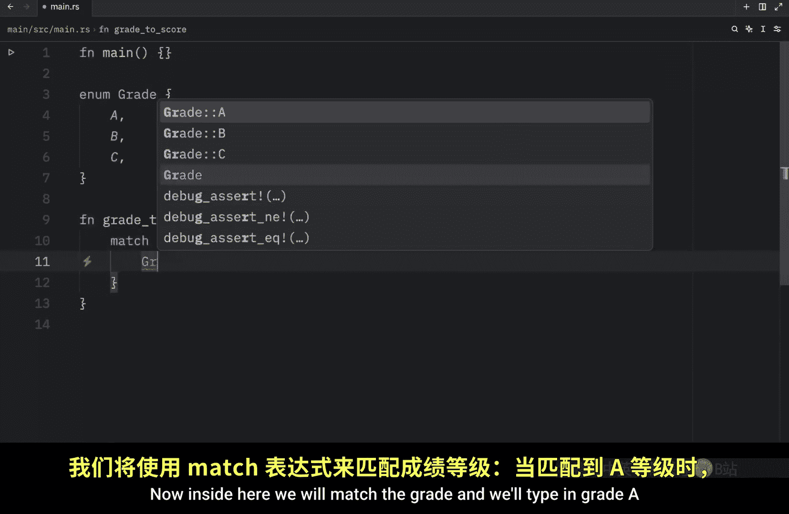

Which will return to us 100 as the score。 Not that we cannot leave it like this。

 We're going to get some syntax highlighting that tells us that we are missing arms and I don't mean that literally we are missing both the B and C arm we must cover these or program will not compile and if we were to run this you'll see that it will not compile because we are missing the other arms。

 So to fix that we need to define those by passing in B and C every scenario must be covered for match to work。

 and finally there's one last important feature that I want to cover today that will help us take full advantage of match in rust and what I'm talking about our default values。

 So for our next function we're going to create something called board of it because we're creating a virtual board game and that's going to take a role Now imagine you roll some dice and you land on one or I guess you can't really land on one if you。

😊。

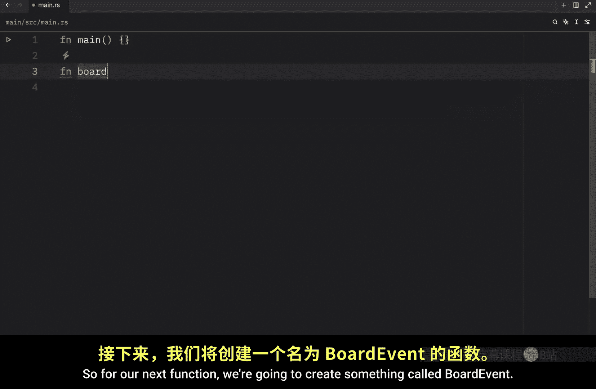

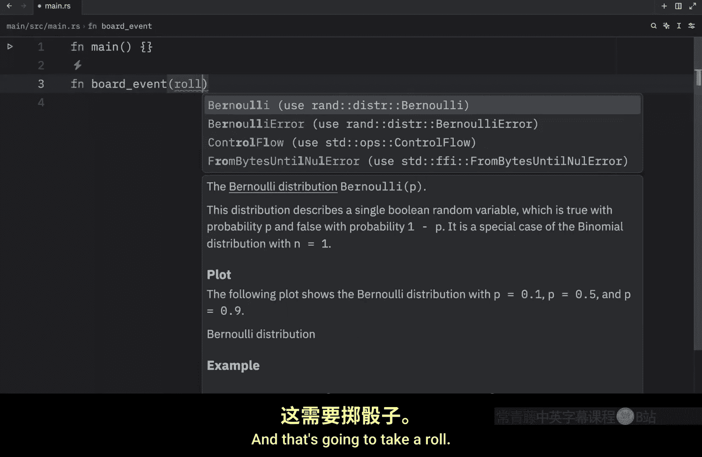

Roll multiple dice。 So imagine you roll a die and that lands on one。 Well。

 then you're going to trigger this event。 Bob goes to jail。 Otherwise， if you land on2。

 we can print line， that Bob wins the lottery。Now considering we defined the role to be of type U8。

 writing out every single case for U8 is going to be quite hard and annoying and we only want this to go up to6 anyway。

 so what we can do is define a default arm that will handle all the other roles and to do that we just create a variable name。

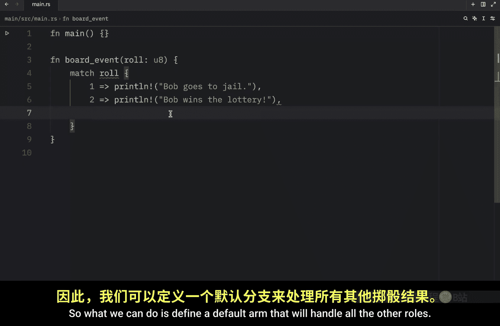

Use the arrow and then define what we want to happen with that。 Here we can type in。

 Bob moves forward， other。

Spaces。So this is what we call the catch all arm and it must come last because all of these arms are evaluated in order。

 Now， of course， we could have created some functionality that keeps track of the die。

 so we make sure we only have six moves， but in this case it doesn't matter if you magically throw a die and it has。

 let's say 500 sides this will handle it and Barb will move forward 500 spaces。

 that's not an issue here， but to keep this program more realistic we're also going to create a function that rules dies。

 So here will type in function roll。😊，Dice， and that will return towards AU 8。

Then we'll type in let mute。RNG equal random RG and before we continue we do need to import the random crate So here I'll type in use random RG and I already added this to my project but if you want to do the same you need to go to your console or to your terminal and type in cargo add Rand。

And that's going to add that functionality to your program。

 and the reason we added that is so that we can use the following functionality。

Let's roll equal R N G dot random range from 1 to 6 with 6 pink inclusive。

 And we can write that Bob rolled a。

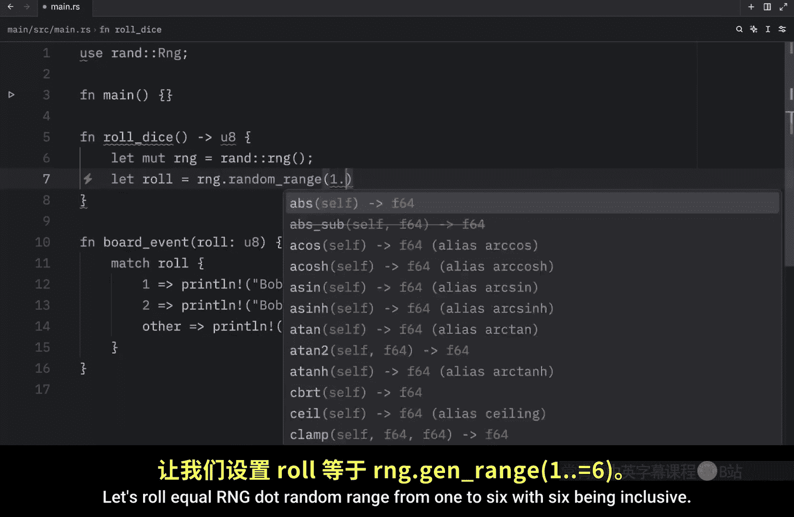

Roll and finally we want to return that roll now to use this we will go to our main function。

 type in let roll equal roll dice， and we will trigger that board event by passing in the roll now let's open up the terminal type in cargo run and what we should get as an output is that Bob rolled a3 so Bob moves forward three spaces。

If we run this again， we'll get another three。 Am I only getting threes。 Okay， that was just lucky。

 Now we magically rolled a 2。 So we win the lottery。 And because I'm tired of relying on R And G。

 I'm just going to pass in one to the board event to show you what happens if we roll a 1。😊。

And here we're going to get a one Bob goes to jail so as you can see our function works quite well if role happens to be one or two it triggers these two events。

 otherwise it triggers this event and whatever value goes into other gets used here but now imagine that you don't care about the catch all value well we're not required to specify a name here we can also add an underscore and instead of saying that Bob moves forward this amount of spaces。

 we can type in Bob does nothing。Now we can open up the terminal and run our program and what we should get as an output is Bob going to jail because we rolled on one。

Otherwise， Bob wins the lottery， very lucky。 and for literally any other value it's going to trigger the bo does nothing event。

 so now we can catch every other case without caring about the value and just to finish this off if you don't even care about executing code here。

 you can just pass in the unit type this tells rust explicitly that we don't want to do anything in the event we catch a value here。

 So now if we run the code， you'll see that nothing happens if we end up triggering the catch all arm。

