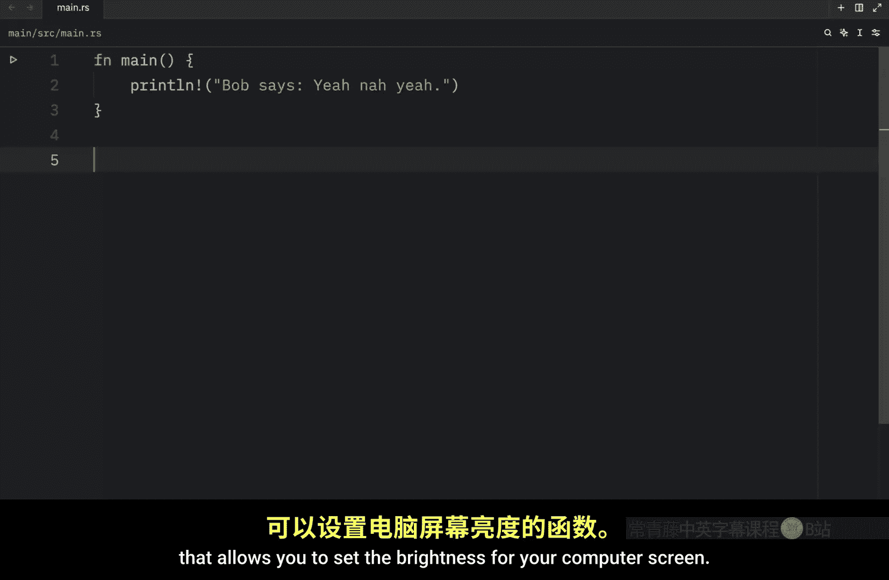
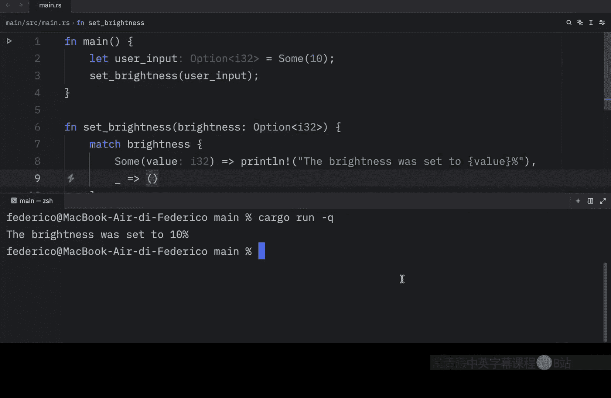
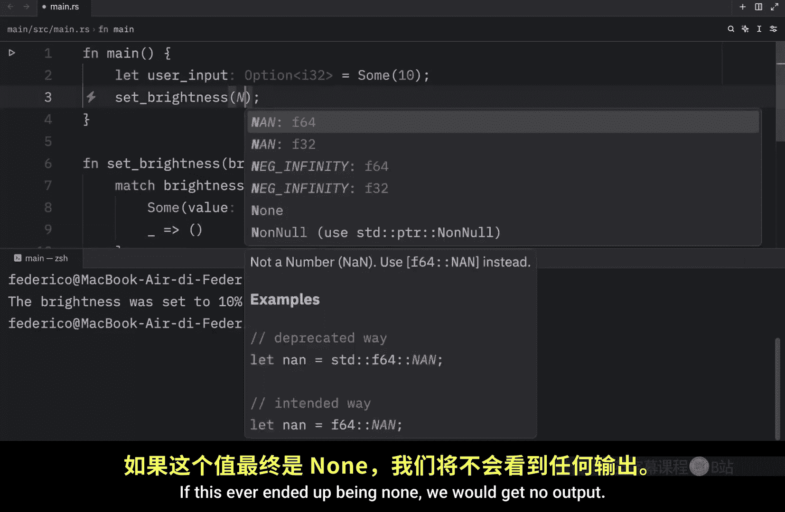
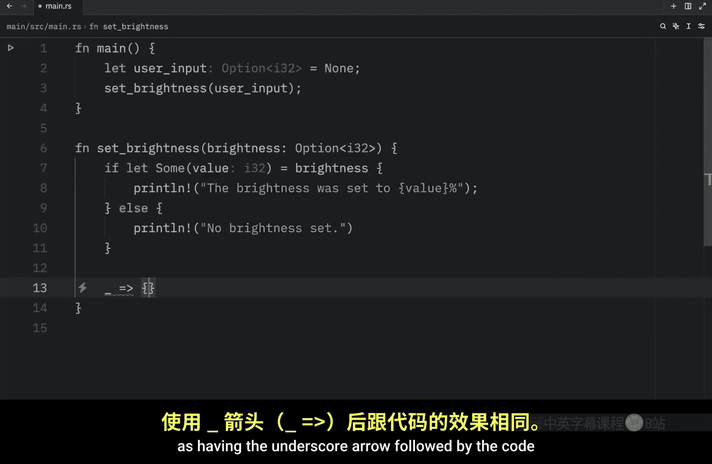
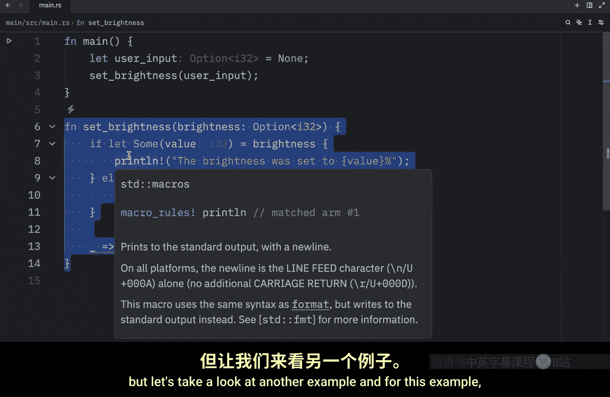
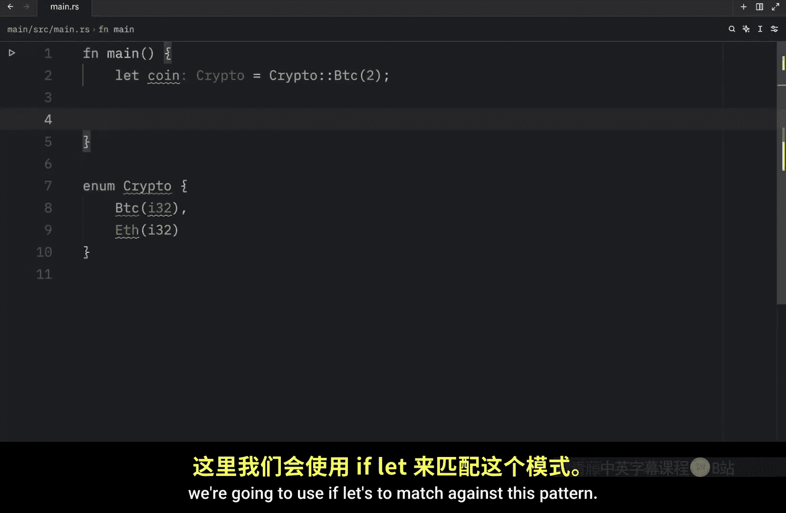
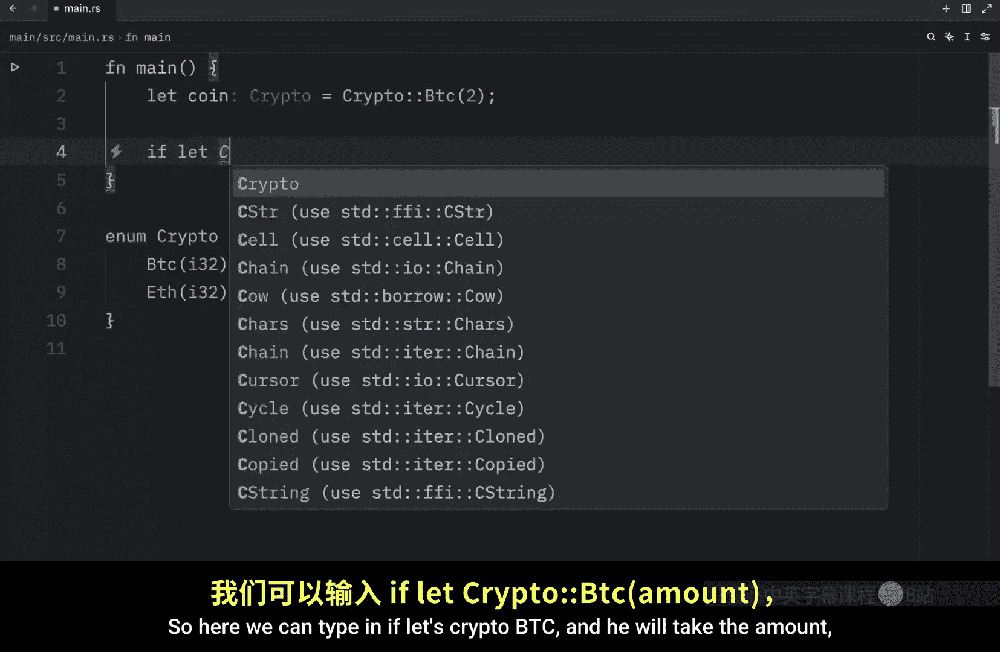
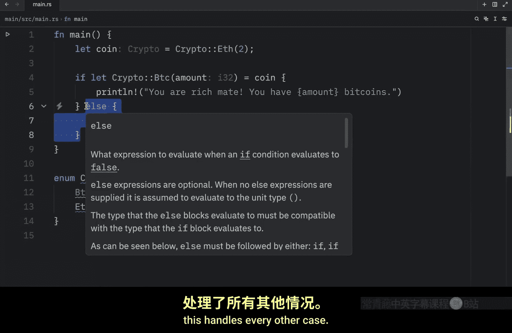

# Rustfully【中英⚡Rust 初学者教程（2025）｜Rust for beginners (2025)】 p44 P44 Rust中的if let相当流行 -BV1eyAkzPEhj_p44-

In today's video， we're going to be learning about iflet in rust。

 which is a less vi way of handling values that only match one pattern while ignoring the rest。

 For example， imagine you have a function that allows you to set the brightness for your computer screen Here we're going to type in function set brightness and that's going to take a brightness of type option of type I32 and it's not going to return anything。

 we're just going to set the brightness here。 Next。

 we're going to create our match expression and insert the brightness。

 And here we only have two cases that we want to handle。

 So let's handle both of those cases we'll insert some which will take the value and we're going to printline that the brightness was set to value percent and for every other case we're going to do nothing Also I just want to mention real quick that from now on you're going to see inlay hints in all of my videos or at least I'm testing it out All it does is tell me what type a certain variable is in gray It doesn't。

Affect the code in any way， but it helps me out with understanding what type a certain variable currently is Anyway。

 going back to the example here we have a match expression with two arms。

 one that handles the value if it contains a value and one that handles every other case。

 but as you can see in this example， we just want to handle what happens if there is a value So this can be seen as a bit ver both considering we don't care about what happens if the brightness is none Now just to show you how the function works。

 we're going to go to our main function and let's user input equal sum。

10 and this is hypothetical， of course， we're not taking any user input。

 but in case we were we're going to pretend that the user inserted 10 and then we can set the brightness to the user input。

 Now if we were to clear the console and then run this in quiet mode what we should get as an output is that the brightness was set to 10%。

 If this ever ended up being none we would get no output。 So this works fine。

 but there's an even simpler approach that we can take and that approach will use iflet instead So what we're going to do is create immediately above the match expression so you can see the difference。

 and here we're going to type in if let some value equal brightness。

 then we're going to print this statement and that's all it took to achieve the exact same result。

 So instead of doing match brightness， we're using equal brightness and the pattern we want to match against will be right here right after let So we're practically just creating a match expression with a single arm Now we can remove this。

And rerun the code and we should get the same result as from earlier and just to change things up。

 we can change this to 50% and we will get that the brightness is set  to 50%。

 Otherwise if we insert none once again， we're not going to get any output。

 we can also choose to include an else block when using if flat， for example。

 right now we have this if condition and right below it， we can add the else block。

 and then we can print that no brightness。Was set。So now if we were to clear that， run the code。

 we'll get 50%， but if this ended up being none， I don't know why I kept on inserting it immediately inside here。

 but if this ended up being none， we would get that there was no brightness set。

 So the else block is essentially the same thing as having the underscore arrow followed by the code when you are using a match expression。

 but let's take a look at another example。 And for this example we will create an enum called crypto which will contain BTC。

Of type I32 and Ethereum of type I32， then inside our main function， we can create a coin。

And let that coin equal crypto BTC and we're going to insert two bitcoins right below it。

 we're going to use iflet to match against this pattern。

 so here we can type in iflet crypto BtC and you will take the amount which will end up being this value over here and check whether we can take that from coin and if we can we will print line。

 you are rich might you have。

Commounts。Bitcoins。Else， we will print the sad truth of no。Bitcoins。

Now we can open up the terminal and run this code once again and what we should get as an output is that we are rich。

 we have two bitcoins otherwise if we changed this to Ethereum we would get the else block executed because it does not match this pattern which means everything else will be handled by this statement over here so we can now run that code and you'll see that it will output no bitcoins or something more accurate to say would be other crypto because once again this handles every other case and just for practice I'm going to create it once again using the match expression so here we can type in match coin then we can define some crypto of type Bitcoincoin and the amount followed by the arrow and the code we want to execute and right below that we can define the catch all block or the catch all arm and then print other crypto personally in this case I find this approach to be much cleaner then if you were to use iflet with an else block。

But if you happen to use iflets with a catch all condition that you don't care about。

Iflet could easily end up looking much cleaner。 So what's important to remember is that the iflet syntactic sugar was introduced to make our lives easier in certain situations。

 You should not force yourself to use it if you feel like using match would make your code look cleaner。

 This video is nothing but a mere introduction to iflet。

 We will cover other use cases as we progress with the rust language because there will be situations where iflet will just be much more preferable than using the match expression。

 I just can't show you those situations right now because we're still at the beginning of learning rust。

 as soon as we start building some projects。 I'll be able to give you some more real examples of where iflet could be preferable but for now all you need to know is that it makes our life a bit easier when we're dealing with catch all cases that do nothing。

