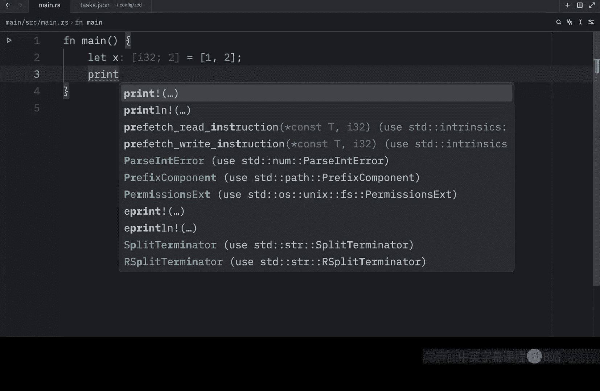
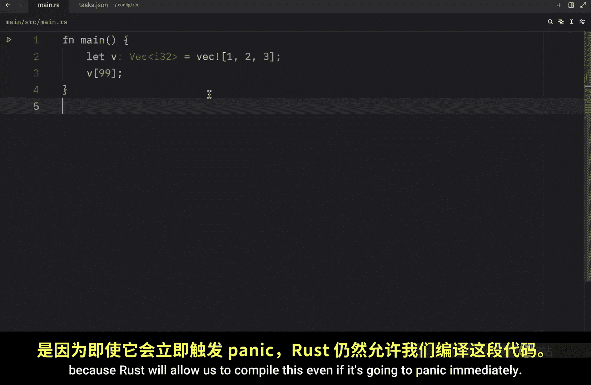
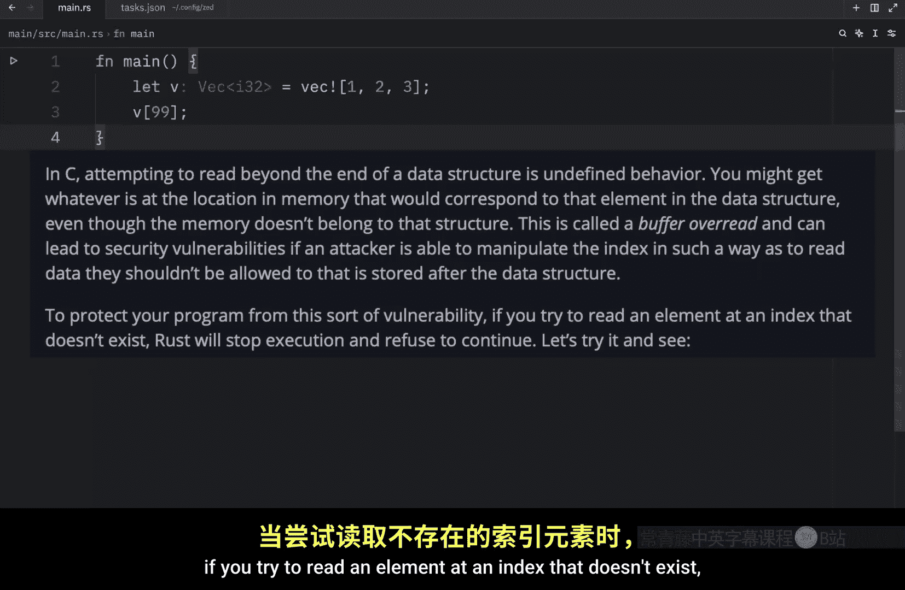
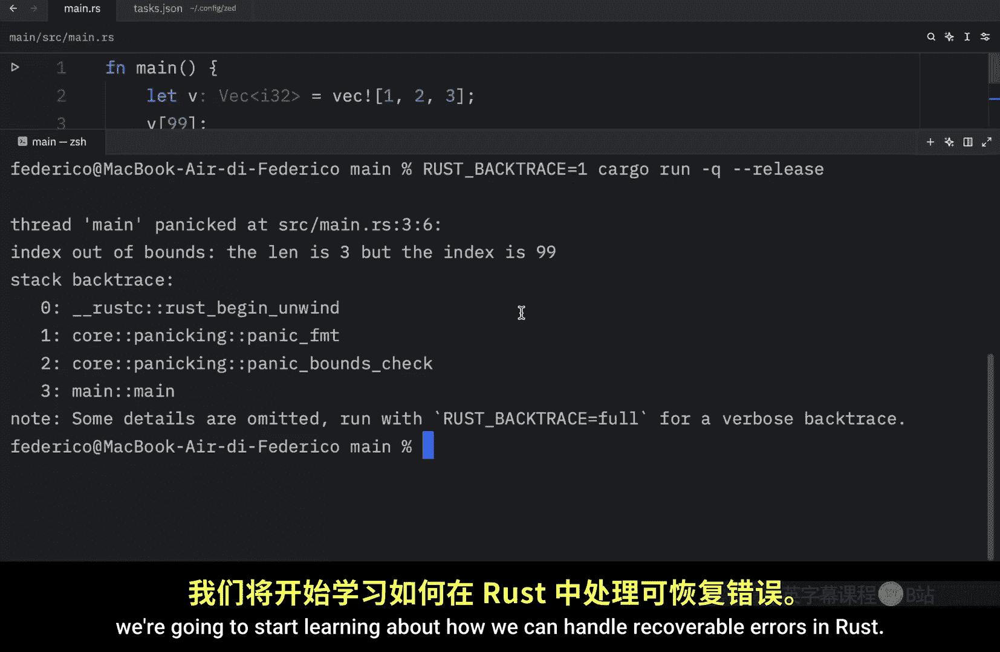

# Rustfully【中英⚡Rust 初学者教程（2025）｜Rust for beginners (2025)】 p45 P45 Rust中的错误处理 - 是时候panic了！ -BV1eyAkzPEhj_p45-

Up next， we're going to learn about error handling in rust。 If you're following the book。

 you'll notice that we skipped a few sections。 The reason I'm doing this is because error handling is really all we're missing to start creating some projects In a lot of cases。

 Ru will require you to acknowledge that some of the code you write might result in an error。

 This requirement makes our programs more robust， because it forces us to properly handle that code before we try to compile it。

 Ru groups errors into two major categories。 Reable errors and unrecoverable errors。

 A recoverable error in most cases will be something that went wrong， in our program。

 but that can be fixed at runtime。 For example， if a user tries to use a file that doesn't exist。

 Ru will probably give that user a file not found error。

 but the user can easily be prompted to retry the operation by providing a different file name。

 and unrecoverable error， on the other hand， is something that can be fixed during。😊。

Runtime because it's something that's more attached to the program itself。

And it's also a sign that the program has bugs and issues that we need to address。

 Most languages don't really distinguish between these two kinds of errors and handle both in the same way。

 like in Python， whatever happens we simply raise an exception and handle it。

 But what's interesting about rust is that it doesn't have exceptions。

 All it has is the result type for recoverable errors and the panic macro for unrecoverable errors。

 we're going to cover both of these in the next few videos。 but first。

 we will cover unrecoverable errors with the panic macro。

 Sometimes bad things are going to happen in our code。 and there's nothing we can do about that。

 In these cases， rust has a macro called panic In practice there are two ways to cause a panic。

 One is by performing an action that causes our code to panic such as accessing an invalid index in an array。

 For example， we might have a variable called X which contains the value of1 and2 and then we might try to。

Aess a third element or an element at the index of three from it。

 So here I'll type in print line pass in these quotes and then type in x at the index of three。

 Now luckily this code will not compile because we're trying to do something very silly here。

 We're trying to access an element that does not exist and honestly I could have typed in two because we only have two elements anyway。

 and this would be out of bound as well。 as you can see when I rerun the code we're still going to get an error。

 And if we scroll up， you'll see that this operation will panic at runtime so this operation didn't cause a panic per se but it would have caused one if we did this at runtime。

 Now the second way to cause a panic is by explicitly calling the panic macro by default。

 this panics will print a failure message unwind， clean up the stack and then quit using an environment variable。

 we can have rust display the Col stack when a panic occurs to make it easy to track down what caused it。

That part was stripped directly from the rust book hopefully with a few examples I can explain it better So let's try manually calling panic in our program panic with an exclamation mark because it's a macro and we will type in Bob ran away and this is the error message when we run this code you'll see something like this the first message shows where the panic occurred as you can see on our main thread the code at this location panicked and this was our main file on the second line at the fifth character as you can see here this is at the second line and if I highlight this section here you should notice four spaces So starting here our code panicked and everything past that is the error message or to be more concise this part here is the error message and this is a note regarding the error message in this example the panic was easy to trace down because it was located directly in our current file but sometimes we're going to have to call code。

That panics indirectly， meaning that our function in the current file will not be the source of the panic。

 but it will have called another function from somewhere else in the project that caused the panic in this case we can use a back trace to track it down So let's create another quick example that shows us exactly what that means。

 and in this example we're going to use a vector which is like an array except it dynamic and growable。

 This means we can add and remove elements at runtime。

 unlike with a regular array which is fixed in size。

 we will learn more about vectors in a separate lesson but for now imagine you have the following code let V equal a vector of12 and3 and next we're going to try to access the elements at the position of 99 which is far beyond the bounds of this vector。

 and the reason we're using a vector here is because rust will allow us to compile this even if it'。

Going to panic immediately as you can see when we run this。

 our program is going to panic because the index is out of bounds。

 We try to access an element at the index of 99 when our vector only had a length of three in C attempting to read beyond the end of a data structure would cause undefined behavior you might get whatever is at the location in memory that would correspond to that element in the data structure even though the memory doesn't belong to that structure。

 this is called a buffer overread and can lead to security vulnerabilities if an attacker is able to manipulate the index in such a way as to read data。

 they shouldn't be allowed to that is stored after the data structure to protect your program from this sort of vulnerability if you try to read an element at an index that doesn't exist rust will stop execution and refuse to continue opening up the console once again you'll notice that the note is going to tell us that we can。

Set an environment variable to get a back trace of exactly what happened to cause the error and a back trace is just a list of all the functions that have been called to get to this point so let's close this and I'm kind of confused I don't know why we're not in main CD main so let's try using this So what I'm going to do is copy this and then type in cargo run inqui mode and what you should notice is that we got back a back trace Also when running the code in debug mode you get debug symbols but watch what happens when we run our code in release mode so I'm just going to clear all of this and add the flag for release mode。

We end up with a much shorter back trace that omits all the debug symbols Anyway that was just a quick intro to error handling and panic we'll learn more about the panic macro as we progress with the rust language in the next video we're going to start learning about how we can handle recoverable errors in rust。

