# Rustfully【中英⚡Rust 初学者教程（2025）｜Rust for beginners (2025)】 p46 P46 使用Rust中的Result处理多个错误 -BV1eyAkzPEhj_p46-

In today's video， we're going to learn about recoverable errors in rust。

 Many errors you encounter probably won't be serious enough to require that your program stops entirely。

 For example， if a user is prompted to enter a number into a program but accidentally enters a letter or a symbol we don't want that to crash the program it's something that can easily be fixed by prompting the user to do the right thing and enter a number earlier in our rust journey we created a guessing game。

 which used a lot of random rust syntax。 But one thing we used in particular was the result inum and it looks something like this。

 So here we have a result that takes some generic parameters such as T and E inside here we have what happens if the result is okay and here T represents the type of value returned in the success case。

 otherwise we get an error back where E represents the type of error that will be returned in the failure case。

So next， let's try calling a function that uses this result type and what we're going to do in main is create a path。

 which is going to equal secret do Txt。And this is a file that I have created right here。

 as you can see it exists， and right below that we're going to create TXT。

 and we're going to try to open it using the file crate。😊。

And that's going to import this over here from the standard library。

 and then we can type in open and pass in the path as you can see by the inlay type end。

 this might return a file or might return an error This makes sense considering that there are many things that can go wrong。

 such as trying to access a file that doesn't exist or not having sufficient permissions to access a certain file。

The result inum conveys this information for us to process later and we can practically handle it the same way we handle the option type so we can use our match expression pass in what we want to match against and then create those arms so first we're going to cover what happens if we successfully open the file and here I'm going to type in OK create a mutable variable so mutable file and I'm going to create a block which is going to be the first arm then I'm going to type in let mutable contents equal string new let text which will be a file read2 string and inside here I'm going to pass in a mutable reference of the content or of the contents and then I'm going to print line。

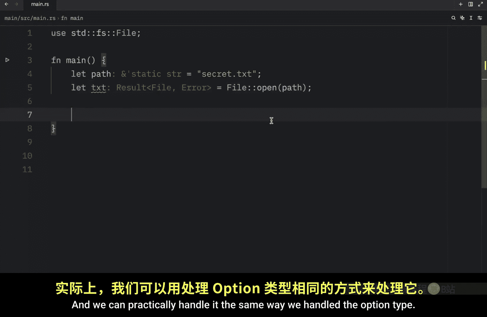

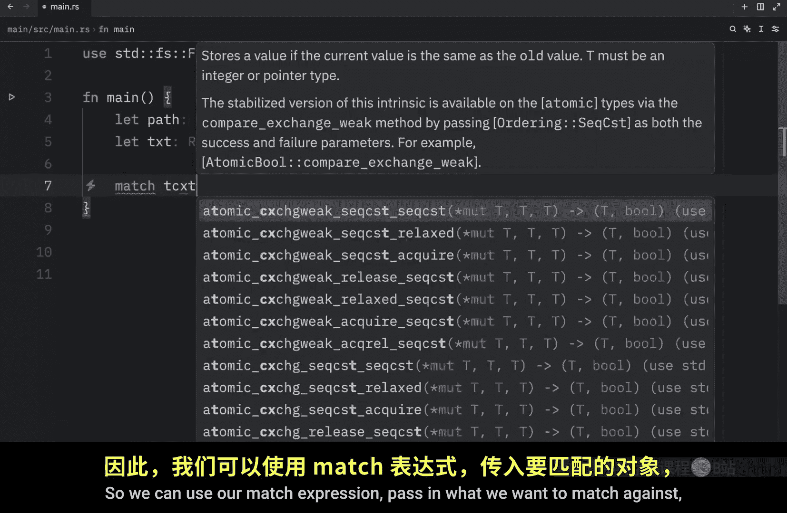

File。Loaded and pass in the contents so we can read the file and in case of failure we're going to type in error。

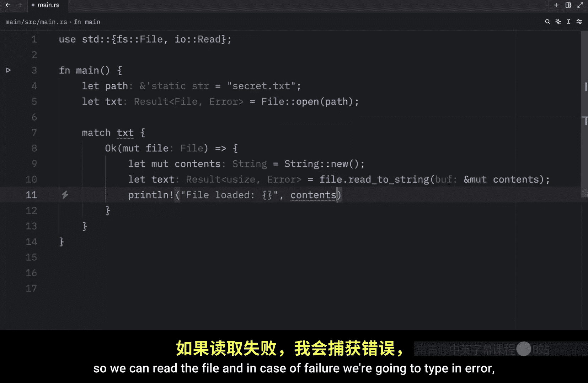

Pass in the error。

And we're going to panic and type in that there was a problem opening the file。

 and then of course we want to read the error message so we will put that there and debug it and you might be wondering why aren't we using this text variable Well in this case this operation only changes the contents of our contents and that's all we wanted here。

We wanted to read the information and update the contents to display information that our file contains。

 so this could really be any file name at this point， Even an underscore should be fine。

 but this entire operation will lead to another result type which could either be a use size or an error So I'm going to change that to an underscore and what we're going to do next is run this script and what we should get as an output is that the file loaded。

 and that Bob Wes Sox inbed。 That was the secret Txt and this all worked because it successfully found that file Now in the case we selected a path that did not exist such as Bob dopng。

 What we're going to get back as an output is that our thread panicked at this location and then it will also give us a detailed error message So here we get the message that we used in panic followed by the actual error with the message no such file or directory So this does not exist。

As I mentioned earlier though we can encounter multiple errors when trying to open a file so how do we go about handling each error separately Well。

 for our next example， I'm going to change this to sample do Txt a file that we do not have in our project the only one I created ahead of time was secret do Txt So now we have a file that does not exist Next we're going to change this to result Txt and we're going to write all of this from scratch because we want to create another variable called Txt which will match the text result and inside here we can type in what happens if it's okay。

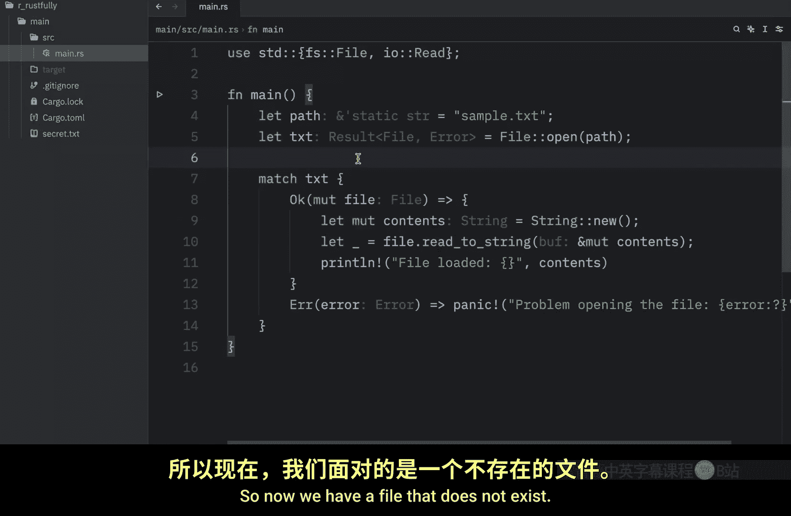

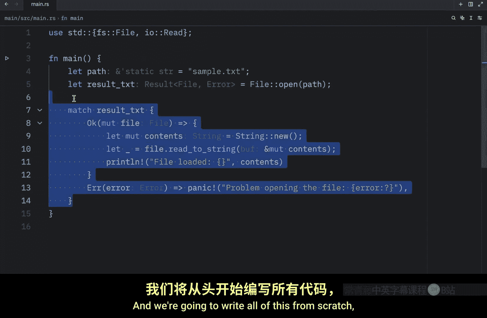

And we'll pass in the file。And then we're going to print line。That we loaded the path successfully。

And we need to return a file and right below we need to specify what happens when there is an error。

 so we're going to type in error with the error and here we want to match against the error dot kind and for this to work we need to import error kind so here we can type in standard IO error kind。

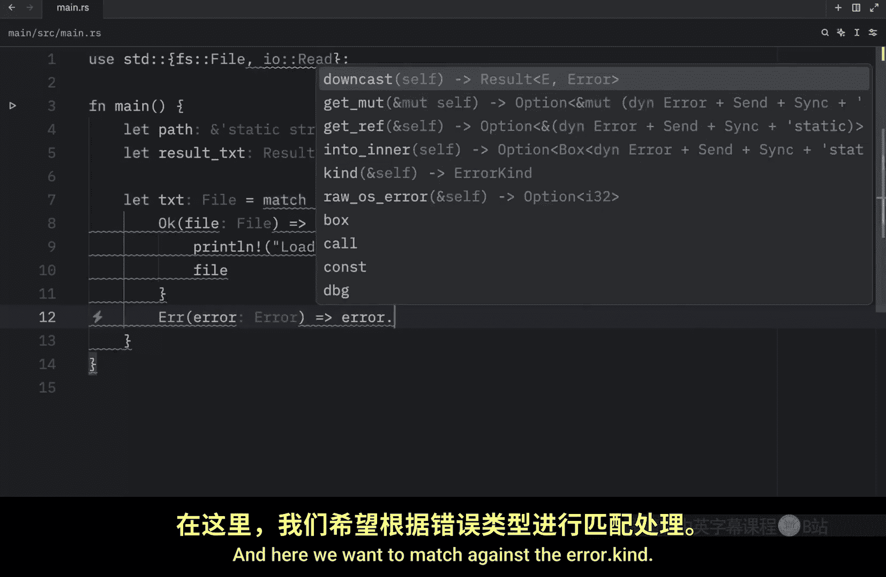

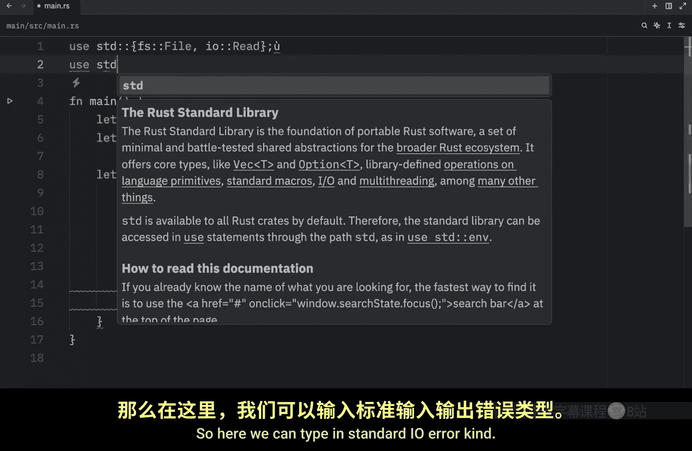

And with this inside the error block we can start typing in things such as error kind not found and as you can see we have a lot of errors showing up so we can handle each of these separately if that's what we want to do but we're just going to handle this error over here which is going to open a new match block and here we want to match file create path So we're going to create a path if it does not find one and once again inside here we need to handle what happens if everything's okay。

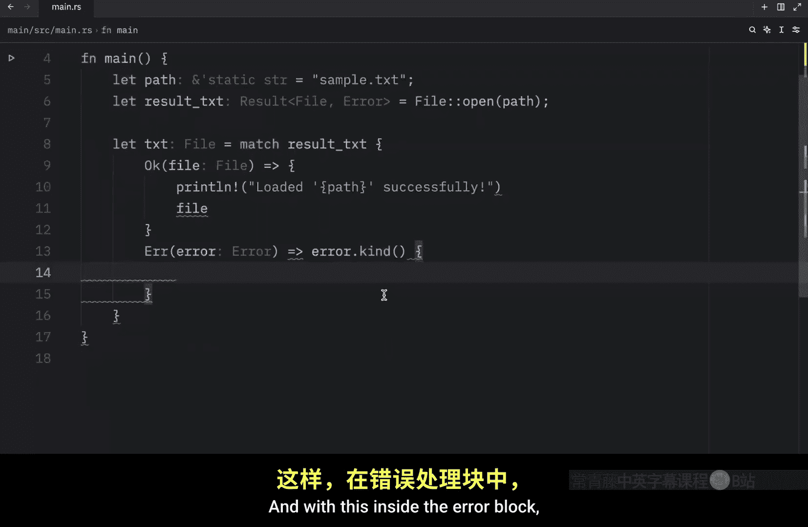

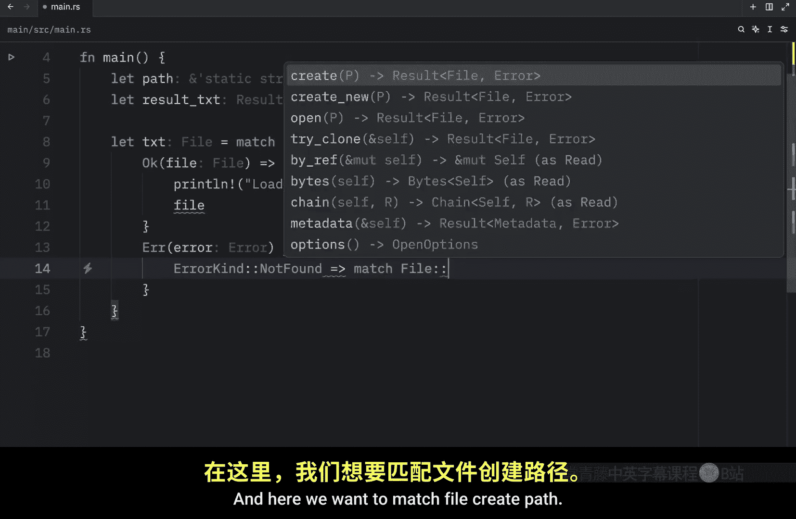

And as you can see there are quite a lot of errors here because I forgot a semicolon here and I forgot to match this error kind and now both of these are highlighted in red because we did not cover all of the arms and that's perfectly fine we need to handle that and those errors will go away。

So here we'll print line。That a new file was created。

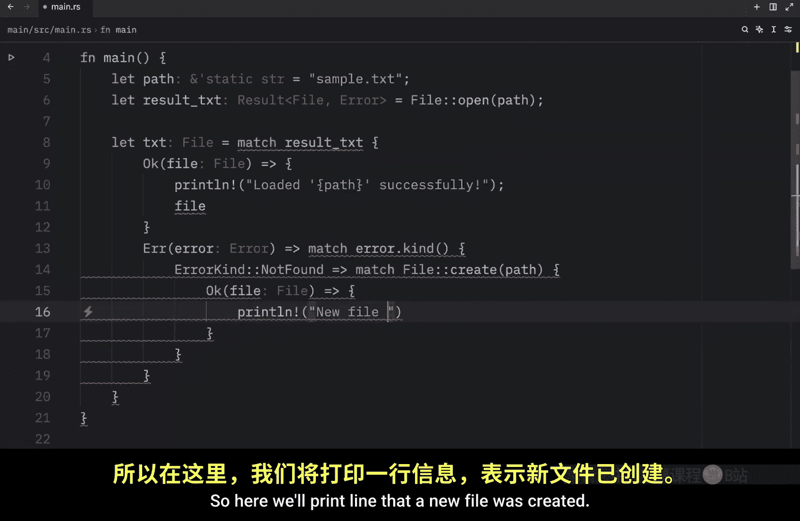

At the following path， and then we're going to return a file here。 and for the error。

 we're just going to panic。 so we're going to type in error。

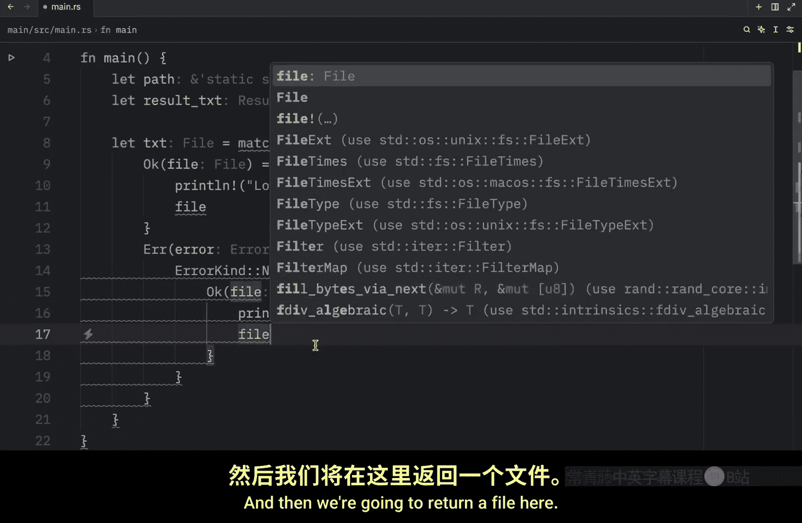

Add the arrow and panic。Problem creating the file and pass in the error and since we have a lot of error kinds to cover。

 we're obviously going to use the underscore to catch everything else and just panic with a default message since we don't really care about all those other cases。

So here we can an。 And what I meant to write is panic problem opening。The file。

 and at the bottom of this let block， we need to add a semicolon。

 but this is how you would handle multiple errors。 You would check the error kind and match against that。

 This is very silly。 I have no idea why it's doing this twice。What a silly Billy。 Now。

 the next time we run this， it's going to be able to load that file because it exists now。

 And you'll see that inside your directory。 We now have some sample dot T X T。 And in the case。

 something else goes wrong。 Our program is going to panic。

 So we're going to have to remember to handle that if we want our program to run smoothly。

 And I'll be showing you other ways to extract values from results later on in our Ru journey。

 But for now， the match approach is more than enough for what we're doing。😊。

