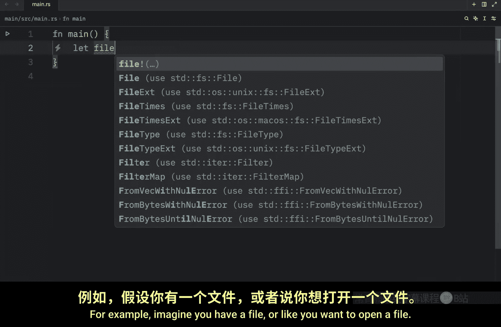
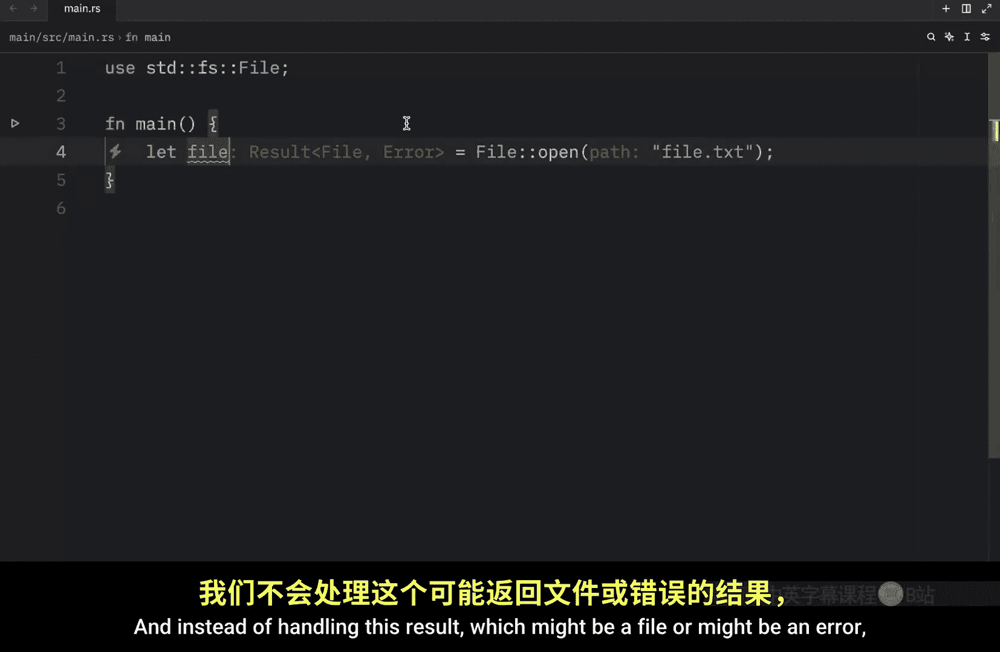
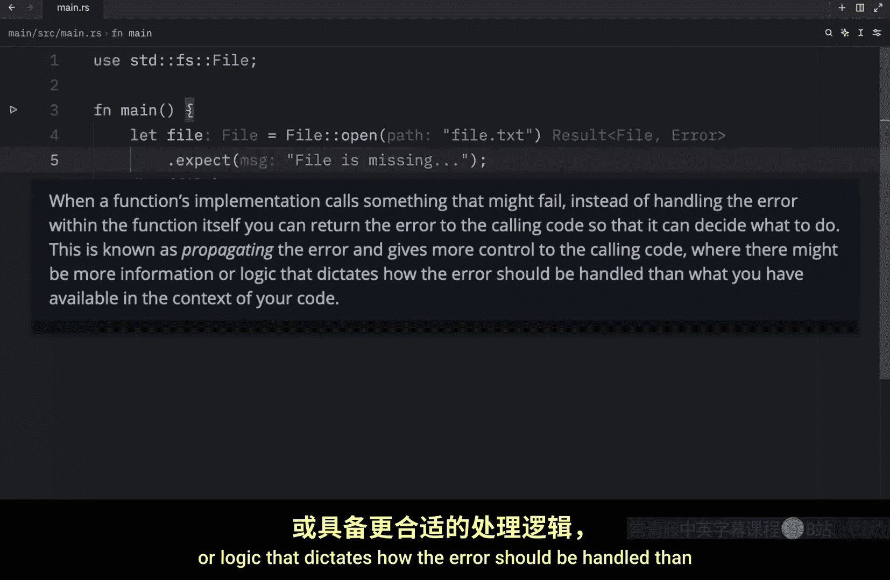
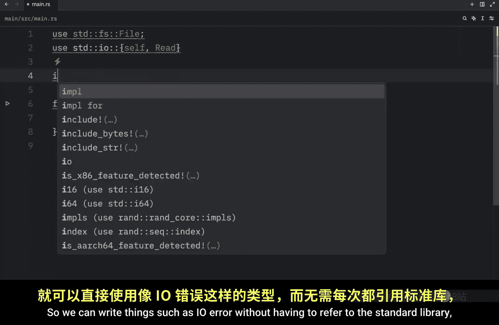
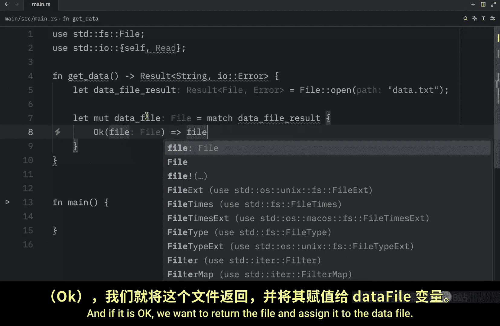
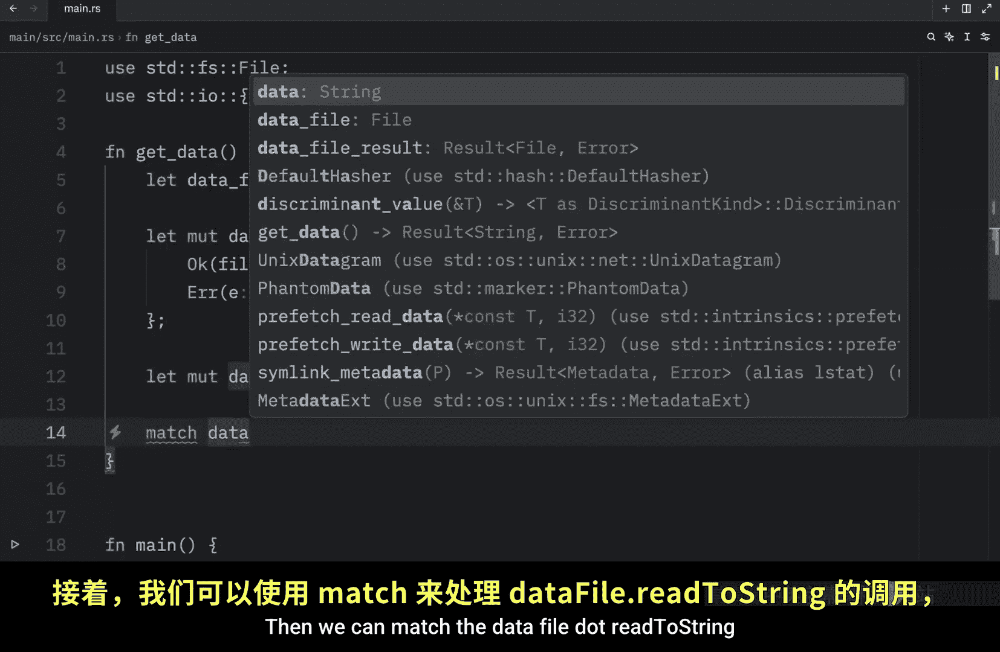
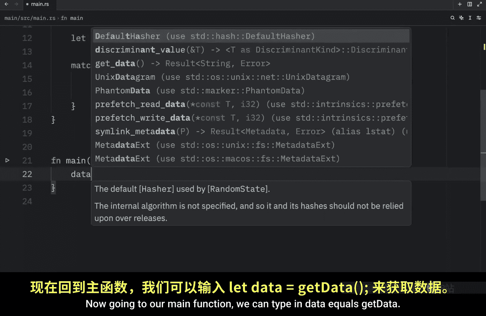

# Rustfully【中英⚡Rust 初学者教程（2025）｜Rust for beginners (2025)】 p47 P47 在Rust中传播错误 -BV1eyAkzPEhj_p47-

In the previous video， we learned about how we could use match to handle the result type。

 but sometimes that can be considered complete overkill for the task that we want to achieve。

 The result type actually has many helper methods defined on it to do various more specific tasks。

 For example， imagine you have a file or like you want to open a file So we do what any s developer would do and call file do open or we use that namespace。

 And Ru is going to import that or use that automatically as soon as I type on enter。

 otherwise you do need to manually type this out。 if you want to use the open functionality from file anyway。

 here we're going to add file do Txt， which is a file that doesn't exist And instead of handling this result。

 which might be a file or might be an error， we're just going to call do unwrap on it just like we did with the option type。

 So once again， if there is a value it's going to return that value。

 Otherwise if it encounters an error。

To call the panic macro for us。 So right now， if we were to run this。

 it would panic because this file does not exist anywhere in my project。

 But if we were to change this to a file that actually existed， such as secret or Txt。

 And I think we can debug this file。And then rerun our program。

 what we should get as an output is our file because secret dottxt does exist。

 meaning this returned a status of OK which allowed us to grab the file directly and similarly we can use that sounds so weird now similarly。

Similarly similar I can't say that but we can also use another helper method。

 one which is called expect and the expect method allows us to specify a message for panic in case something goes wrong For example。

 here we can type in file is missing so that the next time we encounter an error this message will be used for the panic So let's go back to file do Txt。

 which does not exist in my project and run this program and as an output we will get that thread main panic at this location with our panic message and it also gives us a more descriptive message thank God but as you could see we were able to provide our own custom message Now which one you will use will depend on the context the benefit of using the expect method is that you can also provide a detailed message with more information regarding what went wrong and wrap on the other hand could be perfect for prototyping since it takes minimal effort to type out。

Letttting you test a concept much faster up next we're going to talk about propagating errors and this introduction was taken directly from the rust book when a functions implementation calls something that might fail instead of handling the error within the function itself you can return the error to the calling code so that it can decide what to do this is known as propagating the error and gives more control to the calling code where it might be more information or logic that dictates how the error should be handled。

 then what you have available in the context of your code Now personally。

 I think that that explanation sounded much more complicated than it should have。

 but that's okay because we're going to be covering or breaking down what all of that meant with an example so to get started I'm going to remove all of this and we're going to have to take care of a few inputs right now we can keep this one but something else we should use from the standard library which comes from the IO namespace is self and read Now self brings。

IO itself into scope so we can write things such as IO error without having to refer to the standard library。

 which is much more convenient than doing this every single time we want to use it。

The curly brackets just make it easier for us to use this functionality without having to import each one of these separately。

 otherwise we could achieve the same thing by doing this。

But since we are using functionality from the same namespace。

 we can just group that using curly brackets。And if we ever have anything else we want to use from IO。

 we can include it inside here anyway， what we want to do next is create a function called get data and that's going to return to us a result of type string or of type IO error As you can see we are returning a result here we're not returning the actual string Now inside here we can create something called data file result which is going to attempt to open a file。

Such as data dot T X T。 And that currently does not exist in my program。

 So that's going to return an error。 But at this point， we don't know about that。

 So let's continue with this function。 Here， we can type in let mutable。

Data file。Equal match data file result， then we have to handle what happens if it's okay and if it is okay。

 we want to return the file and assign it to the data file otherwise we want to grab the error。

And return the error and since this is an early return。

 we need to use the return keyword to exit the function early Now below that we can create a mutable string called data and that's going to equal string new。

 then we can match the data file do read2 string and pass in the mutable reference of data because we want to load all the content from the data file into the data Now if this is okay。

 we're not going to care about whatever this is and we're just going to return okay with the data。

Otherwise， we're going to return another error。 Whatever went wrong while we're trying to read the string。

 And here we don't need to specify the return keyword。

 because this is the last expression in our function。

 The return keyword was used here to mark an early return。 Now going to our main function。

 We can type in data。 equals get data。 And that's very pythonic。 So let's add the let there。

 And as you can see， when we try to get that data。 what we will get back is a result of type string or error。

 So practically， all we're doing is telling whoever' is calling this function to handle the error themselves。

 This function will only inform them of the error， but won't be handling it。

 It has now become the responsibility of the code that's calling it。

 And that's what it means to propagate the error。 We're not handling the error within the function。

 We're just passing it along。

