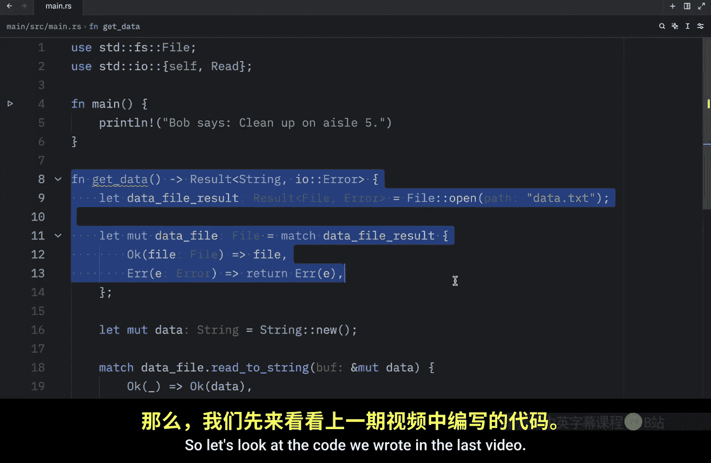
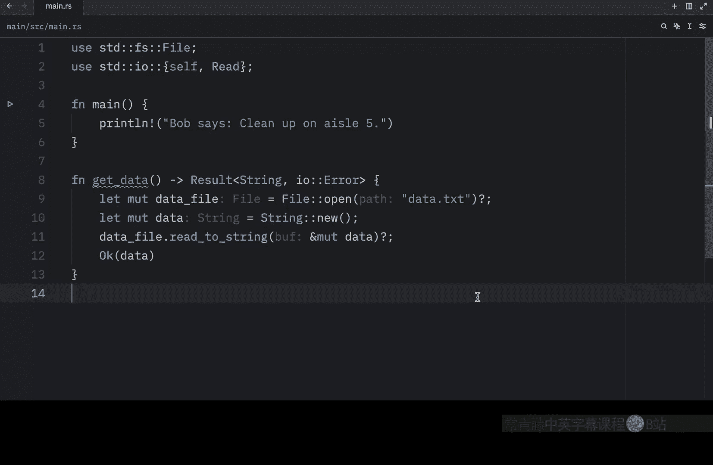
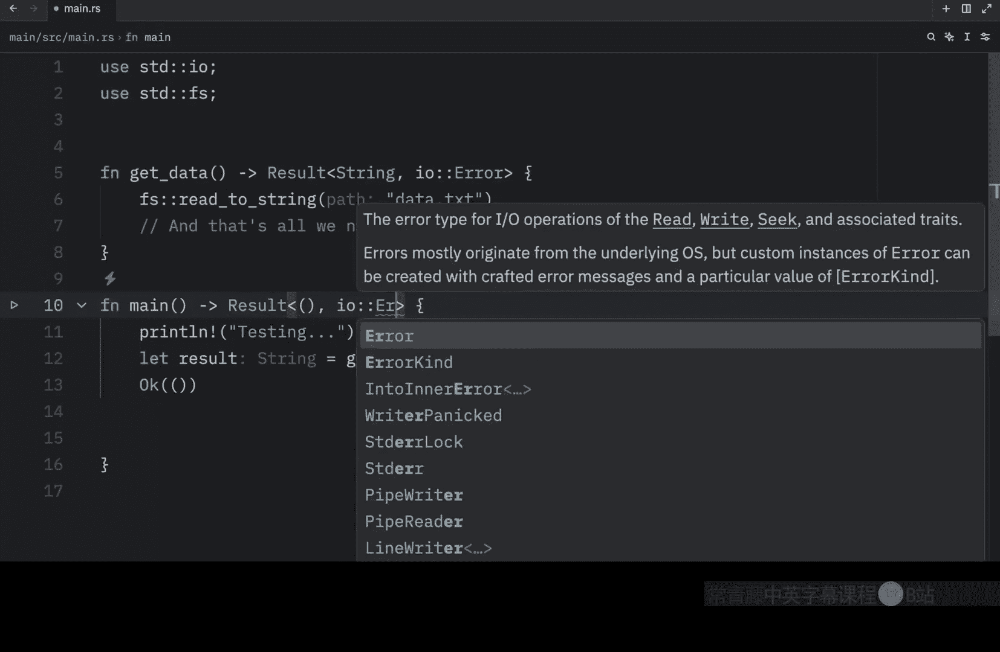
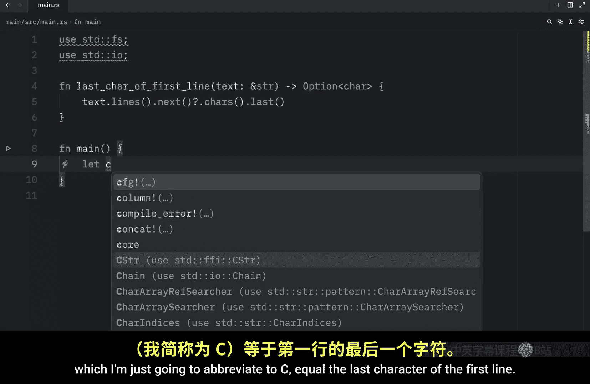
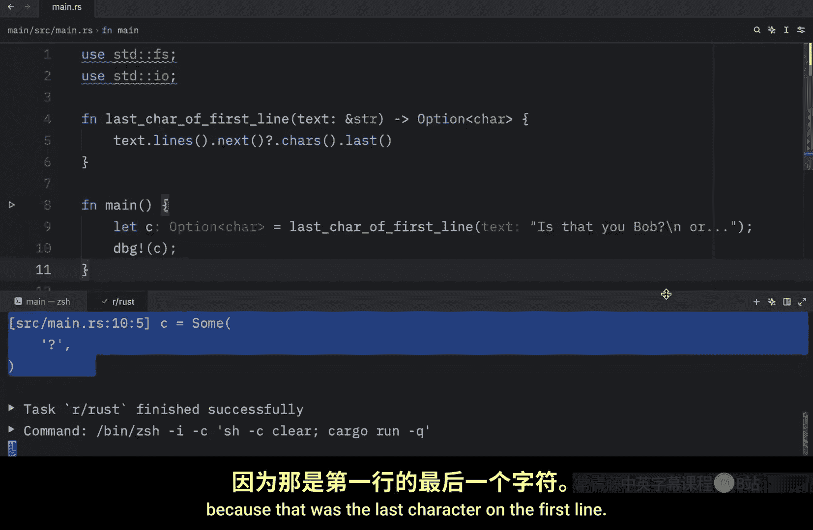

# Rustfully【中英⚡Rust 初学者教程（2025）｜Rust for beginners (2025)】 p48 P48 Rust中的Try运算符(_)很神奇 -BV1eyAkzPEhj_p48-

In the previous video， we took a look at how we could propagate errors in rust。

 and in this video we're going to continue on that subject。

So let's look at the code we wrote in the last video here we created a function which returned a result of type string or error。

 so here we're propagating all of that information to the calling code if any of this fails we just return the error otherwise we can return that string or realistically we're returning a result but we're not handling any of the errors inside the function both of these are being transferred out to the calling code and this code is all right but what if I told you there was a much cleaner way to write the same code well there is so let me show you so right now at the top we have a data file result。

But what we can do instead is rename it to data file and add a question mark at the end and thanks to this we don't need to use this anymore it practically does the same thing and we can also do this here since we are returning OK or an error but instead of deleting or editing that I'm just going to create it up here type in data file do read the string。

And pass in our mutable buffer， which is going to be the data。And at the end。

 we're going to add a question mark and a semicolon Now we can remove this and the last thing we need to do is return OK since we still need to return something and we're getting an error here because this has to be mutable But once we fix that。

That's all we had to do to change our code to something much more readable。

 but really how crazy is that by simply adding the try operator at the end of any code that returns a result。

 we're telling Ru to roughly do what we did in the previous function if the operation succeeds or returns okay unwrap and use that value but if it fails or returns an error immediately return that error from the whole function and propagate that error value to the calling code。

 although there is a difference between the code in our match expression and the code using the tryop error values that have the tryop called on them go through the from function defined in the from trait in the standard library which is used to convert values from one type into another when the tryop calls the from function。

 the error type receive is converted into the error type defined in the return type of the current function this is useful when a function returns one error type to represent all the ways。

A function might fail。Even if parts might fail for many different reasons and that was taken directly from the rust book and the reason I'm not going to explain that in detail is because we still haven't covered traits。

 but moving on the triop eliminates a lot of boilerplate and makes our functions implementation much simpler we could even shorten our code further by chaining method calls that use the triop for example with this we can actually remove this part here and then instead of data file we can type in file open data do Txt try operator Reta string tryop。

Right there we eliminated one more line of code while maintaining readability Anyway。

 what I showed you in today's lesson was just for demonstration purposes because oftentimes in rust we're going to have premade functionality that takes care of these kinds of operations for us for example。

 reading a file into a string is a fairly common operation so the standard library provides the convenient FS read the string function that opens the file。

 creates a new string， reads the contents of the file puts the contents into that string and then returns it and to use it。

 we're going to add some curly braces here followed by self Since we need to use the FS part and instead of all of this nonsense。

 we can remove all of that type in FS read the string。

And then pass in our path and that replaced all the code we wrote until now and now we can use it as normal。

 we can type in let result equal， get data， and then we can try to debug that data。

And that should give us something as an output。Such as the error message that we got from the result。

Or the error itself。 But moving on， where can the try operator be used？ Well。

 you can only use the try operator inside functions that return a type compatible with the value you're using tryon For the result type。

 your function must return a result for the option type， your function must return an option。

 If we were to use it in our main function， which returns a unit by default。

 you'll notice that rust won't be happy with that。 I mean， watch what happens if I print line。

Testing。And then I say let result equal get data， which unfortunately I removed。

 so I need to go find that code on my other monitor， So I'm just going to paste it up here。

Water mess and change it to get data。So many errors just from copying and pasting code who would have thought anyway inside here we're getting that data and we need to remember to add theT operator and with that at the bottom we want to return OK as you can see rust is not going to be happy with this the tri operator can only be used in a function that returns result or option and main doesn't return any of that main just essentially does this。

Which doesn't help our case， but to fix that， we can easily just return a result here。

And that result is going to contain the unit type and IO error。

 and then our function will not complain anymore。 and as I mentioned earlier。

 it also works with the option type。

So I'm just going to show you what that looks like real quick。

 And here we're going to use the exact same example as they used in the rustbook last car of。

First line。So this will extract the last character of the first line from some sort of file or from some text。

 which will be of type string slice， and it will return to us an option because there's a chance that there might not be a first line or that the string might be empty so it's important we use the option type here because the value can potentially be null anyway inside here we type in text。

Lines dot next， and next will return none if the string is empty。

 otherwise it's going to return the first line so there we can use the trial operator。

And we can type in Ca dot last to grab the last character。

And that's our entire function。 So now we have a moment where this can return none。 Otherwise。

 if everything's okay， it will continue and return some value。 Now in our main function。

 we can let the character， which I'm just going to abbreviate to see。

Equal the last character of the first line and here we can type in is that you Bob slash new line or probably a ghost when we debug see here what we should get as an output。

Is some question mark， because that was the last character on the first line。 Otherwise。

 if this were to be an empty string， what we would get as an output is none。

 And this was all thanks to the try operator。 It made things a lot more simple for us。

 We didn't have to write all that boilerplate to handle what happens if next returns none internally。

😊。

