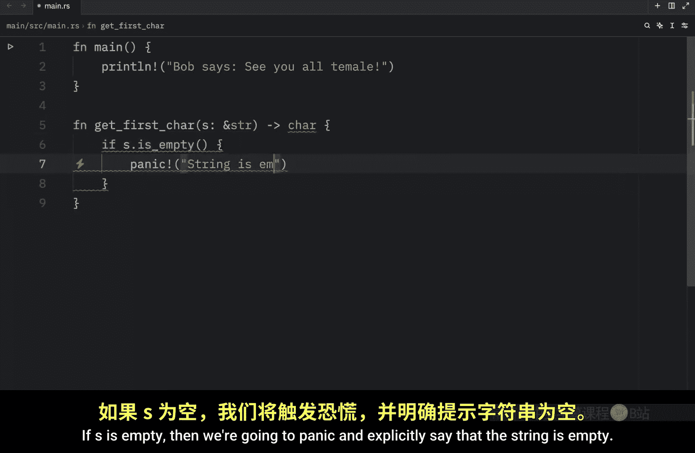
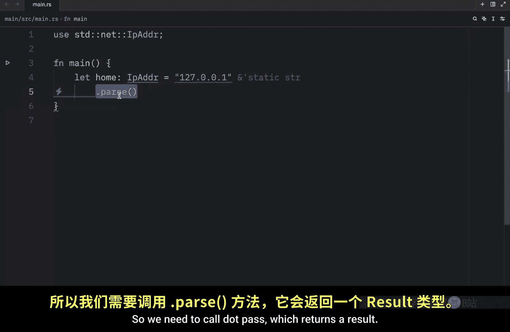
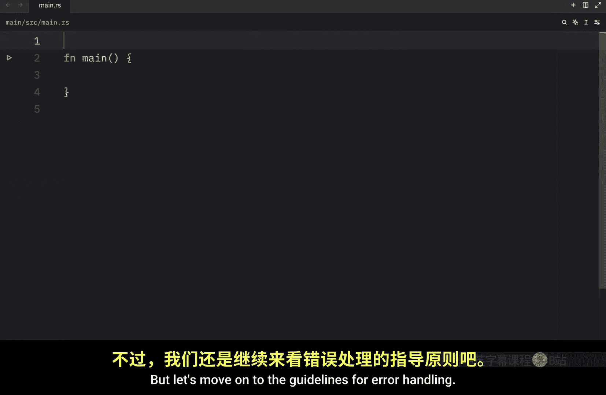
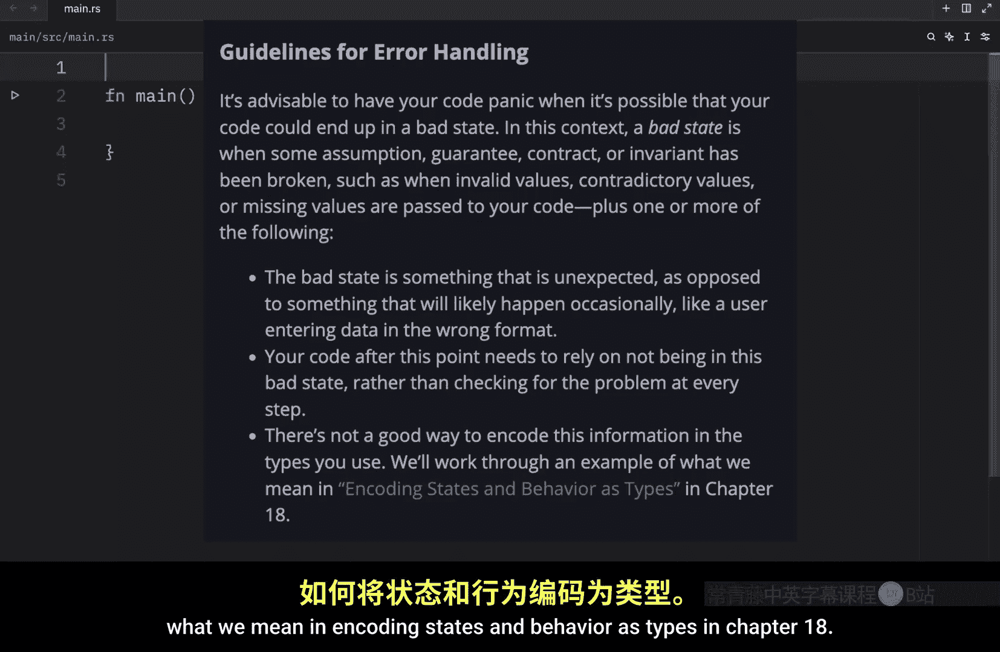
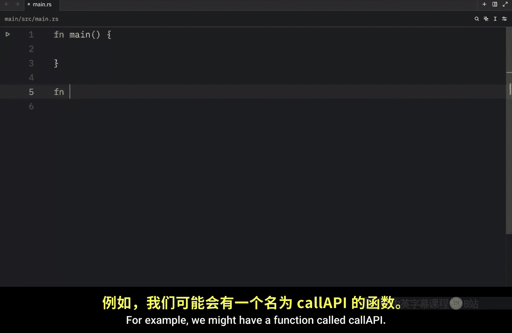
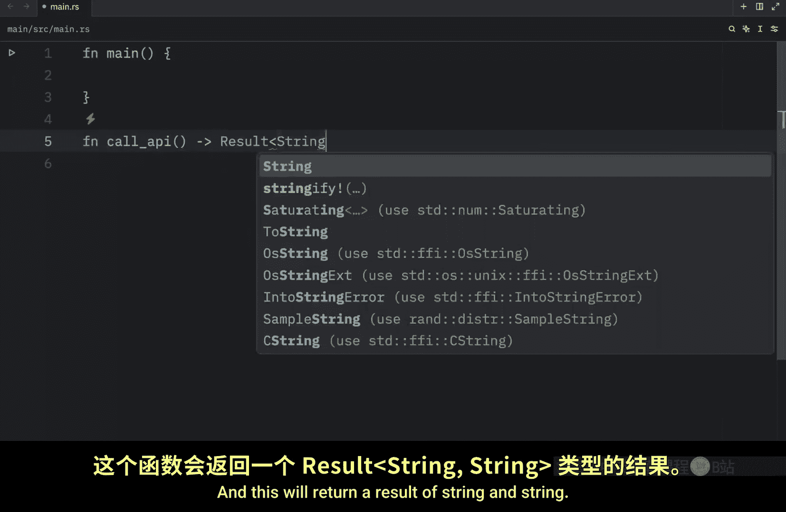
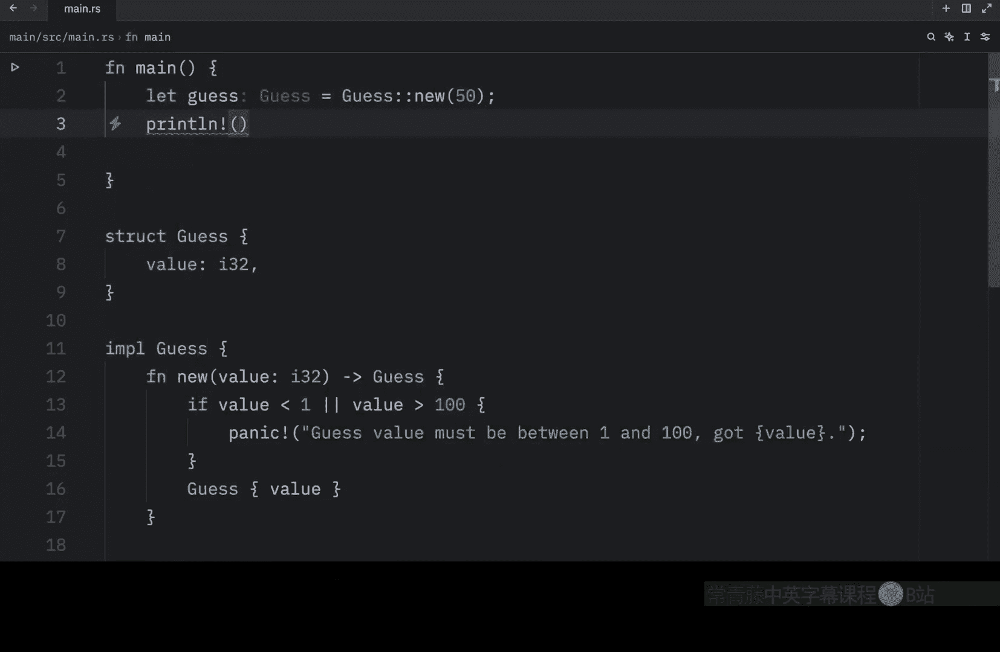
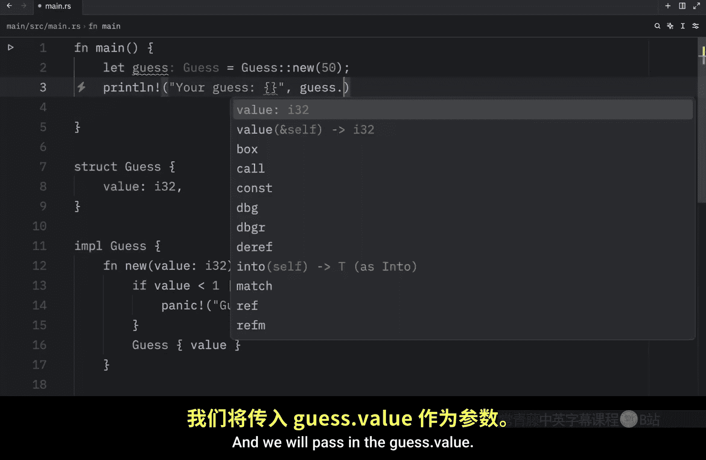
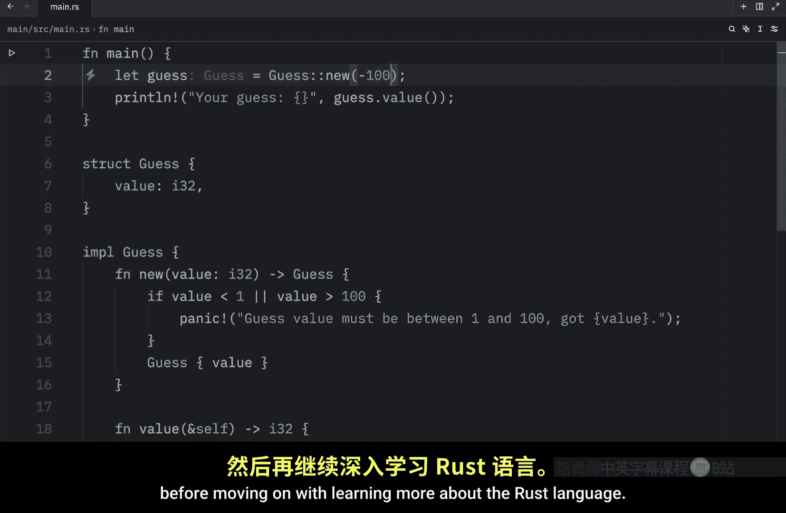

# Rustfully【中英⚡Rust 初学者教程（2025）｜Rust for beginners (2025)】 p49 P49 何时使用panic! vs. 何时使用Result in Rust -BV1eyAkzPEhj_p49-

To panic or not to panic that is the question Now that we know about panic and result。

 how do we determine which one we should use in our code Well， as I mentioned in the past few videos。

 if you have code with errors that can potentially be fixed like the user being silly and entering the name instead of their age into the program you should use a result because that's an error that can easily be fixed by prompting the user to wake up and try again on the other hand。

 if you're trying to perform an operation that could lead to bugs or security vulnerabilities。

 it will be much better to panic as soon as possible Sure the program crashing is bad but opening yourself to getting hacked or allowing whoever is using your program to exploit a particular bug can be far worse Another great place to panic is when you are prototyping or testing code it's much faster to write and test a concept with code that panics rather than code that returns results for you to deal with。

Here we're going to create a function that grabs the first character of a string。

 and we just want to quickly write it and test it to see if it works。

 So here we're just going to type in get first character add S of type string slice and what we're going to return is a character。

 The first character of the string。 If S is empty， then we're going to panic and explicitly say that the string is empty。

 if it's not empty， we can type in string do cars dot next do unwrap。

 So pretty much it's going to dissect the string and grab the first character of that string。

 and since next returns an option we need to unwrap that because potentially this can be empty even if we have this check to prevent this from being empty next。

 let's try to use this code in our main function。 So first of all。

 we will let the word equal hellello， then we will let first equal get first character。

 and we'll pass in the word。

And finally， we can print line that the。First character。Is。The first character， and right now。

 if we were to run this， what we should get back as an output。

Apparently some invalid syntax because I am running this in Python。 I'm very silly sometimes。

 but when we run this in rust， we're going to get back that the first character is H。

 So as long as we have a non-empty string， this works perfectly fine。

 But the second we make this an empty string and rerun our program。

 We end up with a panic and the benefit of calling panic here is that we know exactly what's going wrong。

 we're the one who caused the panic and we included a message for that panic so that we can quickly read it and change the variables or the values in our code to make it work once again。

Of course， this is no replacement for result， but while you are prototyping， this is very convenient。

 Another place where it could be appropriate to risk a panic by calling either unwrap or expect is when you have some other logic where result will always have an OK value but the logic isn't something that the compiler understands。

 For example， let's use the standard library and inside there we want to use the IP address because with that we want to create an IP address and to do that we'll type in let home of type IP address equal 127。

0 dot0 do1 and we want to pass that， or we want to pass the string to an IP address so we need to call dot pass which returns a result but instead of handling the result we're just going to call dot expect directly on it and here will type in that the hardcoded IP is invalid then right below we will debug our home IP address So here we created an IP address that contains a value that we know will always be valid yet rust can't know that because all its is a random string which might cause problems when trying to be passed like Ru has no idea that this is a valid IP address So if we try to call pass on it it thinks that it might return an add pass error or an address pass error but with expect we're taking full responsibility for the potential panic because the only possible case for a panic here is human error caused by the。

And that means that if we were to write hello here。

 that's the only possible scenario where this would panic。 Otherwise。

 if we made sure to provide the proper IP address， this would never panic。

 So this is another place where it's appropriate to risk a panic if the logic is wrong。

 And right now if we run this all we're going to get back is the IP address。

 but let's move on to the guidelines for error handling。

 and this is taken directly from the rust book。 it's advisable to have your code panic when it's possible that your code could end up in a bad state。

 in this context， a bad state is when some assumption guarantee contract or invariant has been broken such as when invalid values contradictory values or missing values are past to your code plus one or more of the following the bad state is something that is unexpected as opposed to something that will likely happen occasionally like a user entering data in the wrong format。

Your code after this point needs to rely on not being in this bad state rather than checking for the problem at every step and there's not a good way to encode this information in the types you use but according to the restbook will work through an example of what we mean in encoding states and behavior as types in chapter 18 the chapter 18 part is irrelevant in this context because you know how the channel works I'm going to cover that eventually I just don't know when now another example of where you might want to get a result back is if you're making an API call because the error won't be a fault of your program but rather of the API itself。

 for example we might have a function called call API and this will return a result of string and string and all we're going to do here is simulate that we have reached the API limit so return and error with the message of API limits。

Reached two string now all we have to do inside our main function is match。

 call API and handle the response so if it's okay which it will never be。

 we're going to use the response and print out that information or use it however you would have used it。

Here we're just going to type in API response and pass in that response。

 otherwise we need to handle the error and that's going to include the error message。

 which is just a string。And here we can printline that the error is the following error Now when we run this code。

 what we should get back as an output is an error that the API limit has been reached and that's something that you can recover from it's not an error that's fatal to the program it might prevent the program from functioning correctly but it's not going to introduce security vulnerabilities or anything like that it's just going to let you know that your API limit has been reached and finally I want to talk about creating custom types for validation around 40 to 50 videos ago。

 we created a number guessing game， something that would have been nice to do for that project is creating our very own custom type for validation because at the time our program only told the user whether the number they guessed was too high or too low this means that the user hypothetically could enter numbers like 1 million or even minus 5 million or negative 5 million if they were extra special。

While our program wouldn't be wrong in telling the user that the guess is too high or too low。

 we failed to handle guesses that have nothing to do with the game that asks the user to only guess between the values of1 and 100 and although this isn't particularly a problem for our silly game in more serious applications you're going to want to handle values accordingly if you don't want to run into more problems。

 creating a custom type eliminates the need for further validation because the custom type makes sure to handle everything itself。

 For example， we could have our very own guess type that ensures a number lies within  one and 100 and also provide a getter that allows us to access the value and that will be all the validation we need to ensure that the user uses a valid guess so just to demonstrate what that could look like we're going to create a guess give it a value of type I32 and then we want to implement the logic for that So we're going to type an I guess and the first thing we're going to handle。

Is what happens when we create a new guess。 And this is going to take a value of type I 32 and return to us a guess。

 Now， if the value。Is less than1 or if the value is greater than 100。 we're just going to panic。

 We're going to keep it nice and simple and panic。 This should never happen。

 guess value must be between1 and 100 got value full stop。 Otherwise。

 let's return that guess with the value set to the value。

 and we don't have to type in value value twice， so we can just insert value。 next。

 let's create that getta that allows us to get the value。

 So here we'll type in value pass a reference to self and return the I 32。

 Then we're going to get or return the self dot value。 Now。

 as long as we use our guess type were golden， for example。

 let's create our guess which will equal a guess。 and that's going to be a new guess from the value of 50。

 Now we're going to print line that your guess was the following and we will pass in the guess dot value。

 Now， when we run this what we should。

As an output once again is a syntax error if you run this in Python， but if you run it in rust。

 you should get that your guess is 50 and now we were to insert something such as 101。

And run our program Our program is going to panic because the guest value must be between 1 and 100 but we got 101 instead。

 and if we guess something negative such as negative 100。

 our program is also going to panic So having a custom type is nice because it follows our guest to follow a certain standard which reduces the amount of validation。

 we will need to make our program work although we still need some validation because the user can input anything and we obviously don't want the program to panic each time the use it as something stupid but yeah that just about covers everything we need to know regarding how to get started with error handling in rust up next we're going to build a few projects before moving on with learning more about the rust language。

