# Rustfully【中英⚡Rust 初学者教程（2025）｜Rust for beginners (2025)】 p51 P51 这让Rust编程变得更加方便 -BV1eyAkzPEhj_p51-

I know that I said in the previous video that we'd cover vectors。

 but there's actually one thing I'd like to cover before that because it's something you'll find very useful when working on functionality Oftentimes you'll have a very clear idea of what your program should look like but the difficult part is always coding the functionality in the previous lesson we created a project where I forgot to code a certain function to prevent nasty surprises from happening later。

 I chose to panic in that block and while that worked fine。

 it was not the appropriate thing to do in that context because rust has two very convenient macros that we can use for functionality that has not been implemented yet。

 these macros are called to do and unimplemented and they pretty much do the exact same thing but convey different intent For example。

 you might have a function called order food that takes a certain food as a parameter of type string so the user can。

😊，Order whatever food they want from a website and since we do not know how this works yet or since we're working on other functionality at the exact same time。

 we're going to want to insert to do and once we add this。

 we can call order food passing in a string slice such as a banana and this will work fine we can use it even if we did not finish coding the functionality for this and if we were to run this what would get back as an output is our program panicking that this has not yet been implemented and optionally you can also add a message that says order food still has to be coded。

And you can make that as descriptive as you want Now the next time we run this we will get that message as an output。

 but as I mentioned we also have a macro called unimplemented and it works exactly the same way as to do but it conveys a different intent。

 for example here we might have something called order food fast mode and then we'll add food。

Of type string slice。 and theoretically， this function should order the food but much faster。

 or it might deliver the food faster。 Sorry if this is a terrible example。

 but I just want to show you that here we have a concept for a function that we might want to test out later。

 but we're making no guarantee that we will code this later。

 It's more of just like a concept here we can add unimplemented and the only difference between these two is the intent to do conveys the intent that you are going to code this later。

 unimplemented conveys the intent that you might never code this later。

 It's just a concept or just an idea。 So here we can type in potential concept and what's good about this is we still have the skeleton for the function in that one day if we ever get the technology to order food faster。

 we can implement it。 So here we can type in order food in fast mode and I want to get my oranges as soon as possible Now when we run。

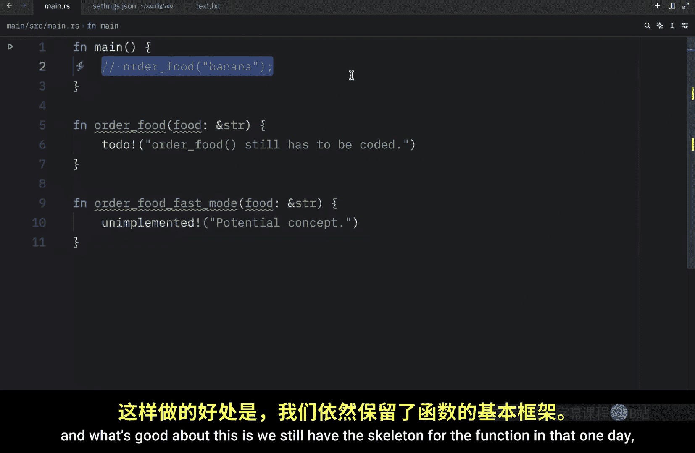

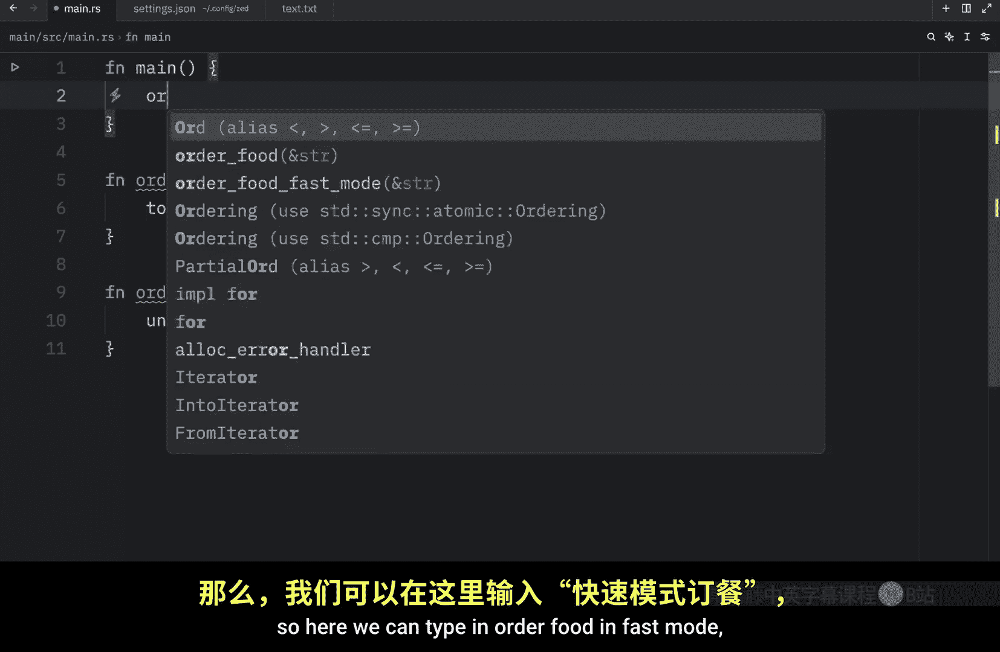

This we're still going to get a not implemented error， or it's not really an error。

 it's just panicking with the message of not implemented and going back to what we had earlier with order food。

 you're going to notice a slight variation in this message。

Unimplemented gives us back the not implemented message。

While to do gives us back a not yet implemented message。 Now。

 an example of where this could be useful is when defining functionality for one of ourstructs。

 we might know what we wanted to do， but we won't have the code ready for everything just yet。

 So here we're going to create something called custom file and we will create a path of type string regarding the implementation we're going to want to be able to read this custom files so we'll create read pass in a reference to the instance and here willll printline reading。

Quotesplaceholder selftpath。 so we're reading that custom file。

 Next we might have a function that allows us to copy this file so here we'll pass in the reference once again and since we don't know how to code this yet。

 we'll just add in to do and we can add the message copy does not exist yet or even better copy still has to be coded and we'll copy this paste it directly under add a delete method and type in that delete still has to be coded as well So as you can see using to do helps us create that blueprint for custom file without having to implement all the functionality immediately and we can include one more method called Apple intelligence and here we can choose to call unimplemented designed for Apple In and once again our program will only panic if we decide to use these here we use unimplemented because we want to convey the intent that this。

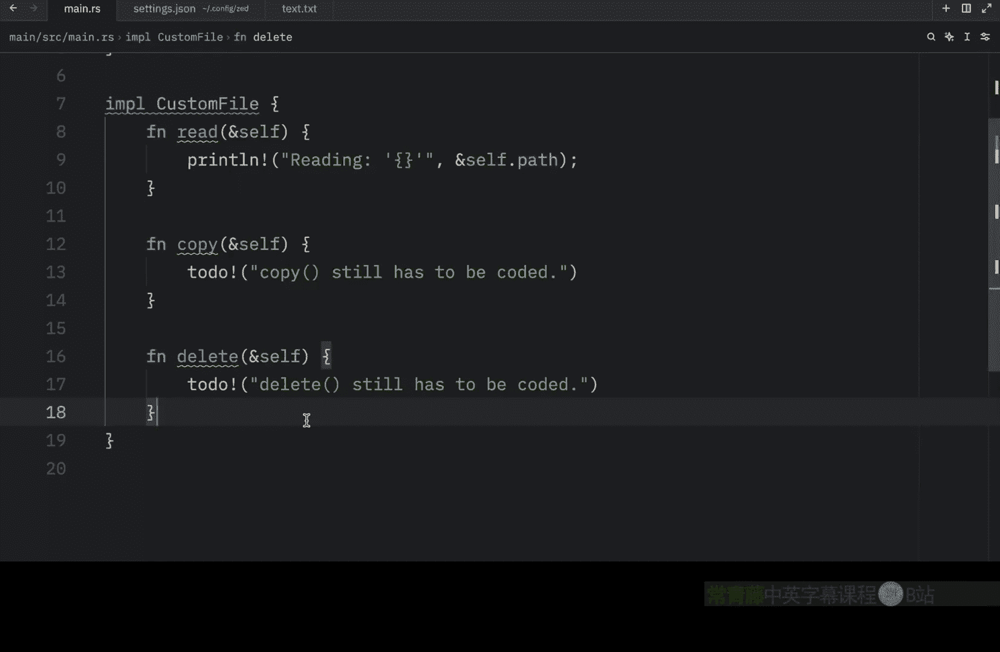

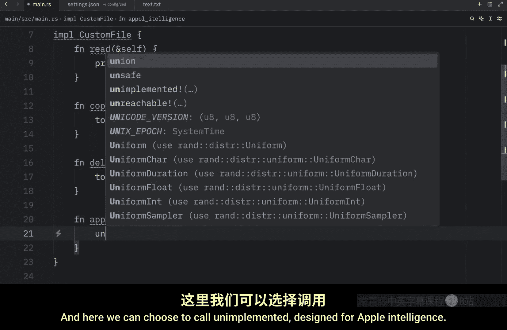

Never be coded ever， but that it's still a concept。 And if you're using any Apple products。

 you'll understand exactly what I mean。 Now， just to demonstrate how this works。

 we're going to go back to main create a path and that's going to equal string from text do Txt and I still have the text file from our project So I'm just going to be using that whenever it's convenient and we'll create a custom file which will equal the custom file with the path。

 then what I'm going to do is type in custom file do read。

 and this is the only method that works at the moment。

 So if we run this what we'll get as an output is that we are reading text do Txt the fridges open。

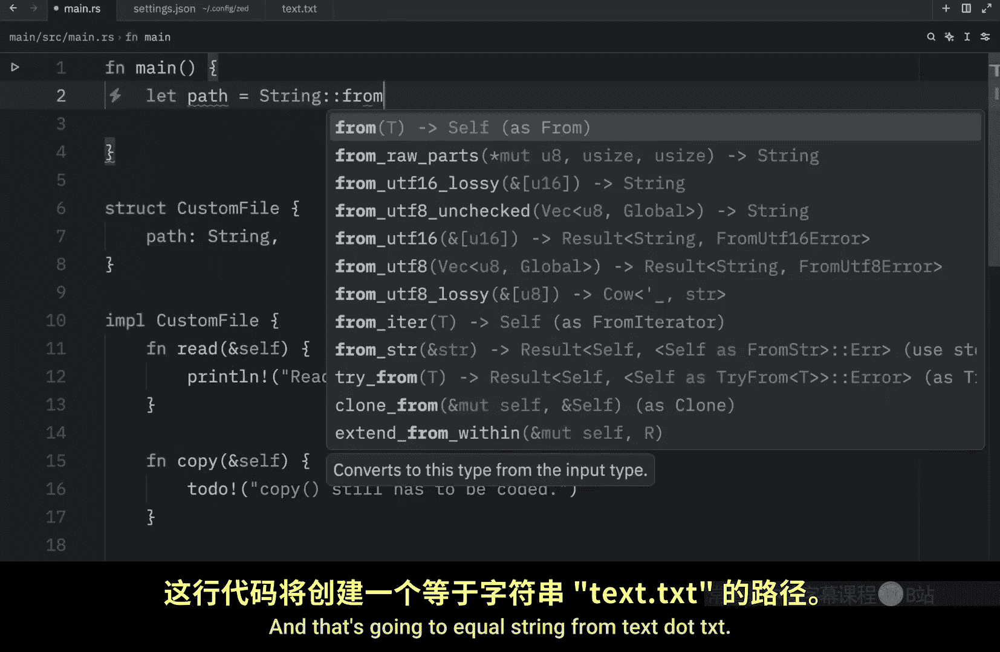

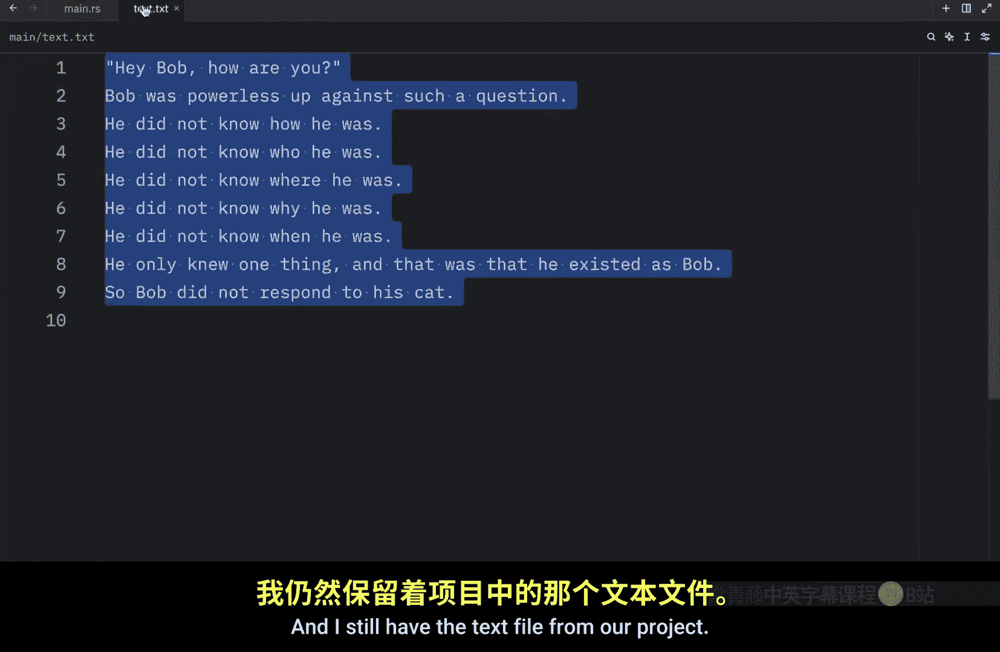

I completely forgot what I was saying because my fridge was panicking， it made a lot of beep sounds。

 but from what I remember I was talking about how this works because we coded it Now if we tried to use any of the other methods such as copy or delete or Apple intelligence our program is going to panic and it's going to tell us that this functionality was not yet implemented or if we tried to use that experimental feature Apple In and I even spellelt it wrong let's change that to intelligence this will not work as well because it is not implemented and this might never be implemented。

 that's why we're using the unimplemented macro here Now this's one last thing I want to cover regarding to do and unimplemented and this has to do with the LSP to do is also very useful for silencing R LSP when we're trying to code functionality in the previous video I just added okay at the bottom but a better alternative would have been to use the to- do macro at the bottom。

So to demonstrate what I mean， we're going to import all of this。

And we're going to create astruct called contents and it's going to contain a path and the contents of that path。

 which is just going to be a string in this example。

 right below that we're going to create a function called get and display contents and that's going to take a path of type string slice and we'll return to us a result。

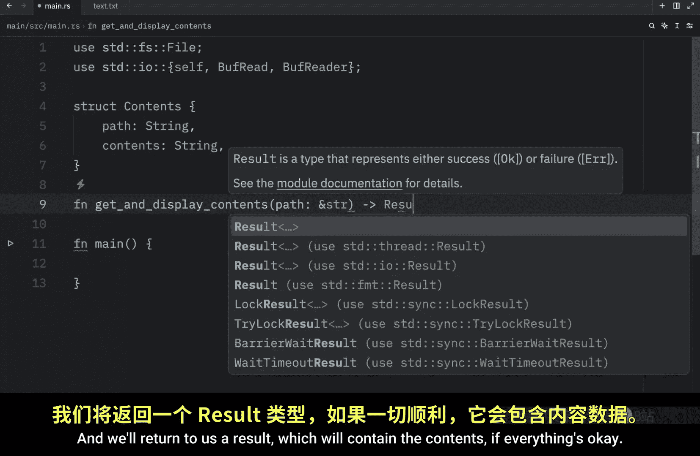

Wwhich will contain the contents if everything's okay otherwise it's going to contain an IO error then inside here we can type in let file equalal file open and pass in the path which is just the path and we're going to use the try operator here so we make sure we get the file back if everything works of course。

 then we're going to create our reader which will equal a buff reader and we want to create a new one from the file right below that we're going to create our contents which will equal a new string then right below that full line in a reader dot lines。

 we're going to want to do the following。

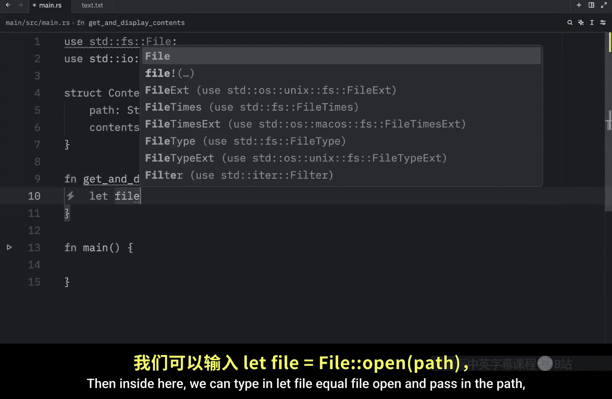

Let's line equal line， try operator， and if that works， we're going to print that line。

 the current line， and as you might have noticed， we have a lot of syntax highlighting here。

 which is incredibly annoying。

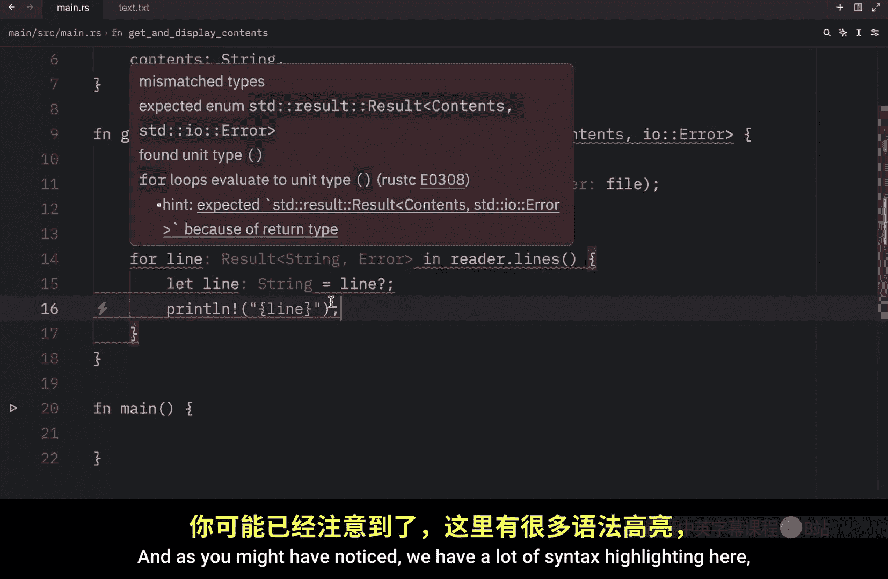

So one thing we could do is add okay at the bottom and that's all right。

 but we still don't know what we're going to insert inside the contents。

 So a better approach is to add to do this allows us to work out our code without having to worry about all that syntax highlighting while we're working on it and the best part is we can't forget about to do because it's going to make our program panic if we try to call it so now we can finish coding this function by adding contents do push string and passing in a reference of the line and then contents do push and add the character of new line。

 So all of this is going to modify the contents which is just a string in this example now at the bottom we can replace to do with the type we want to return which is obviously the contents and that's going to take a path which we need to convert into a string and the contents which are just going to be the contents themselves So using to do there made this much easier。

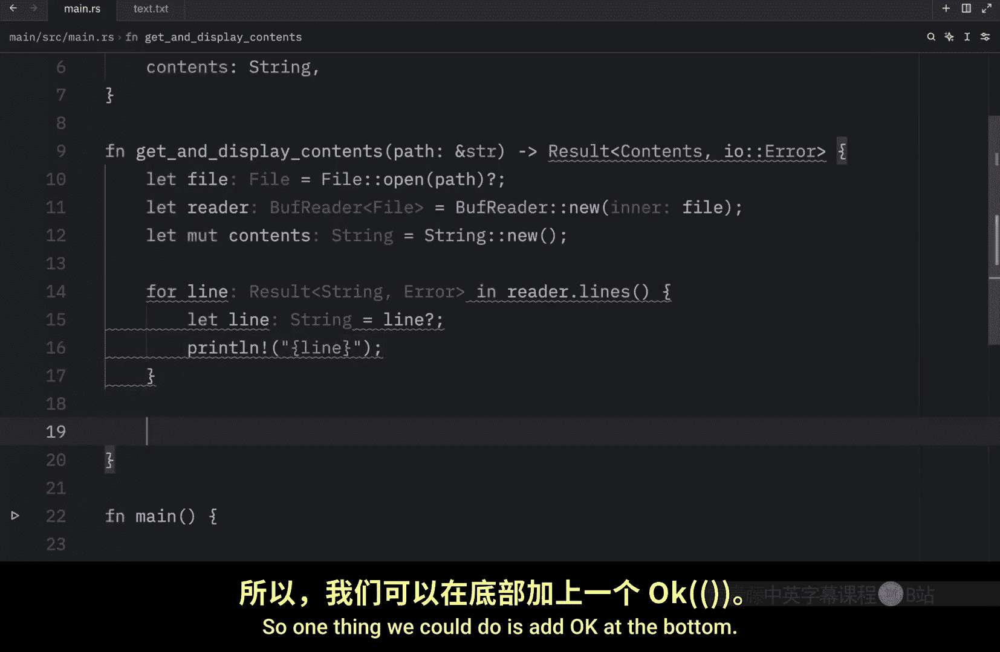

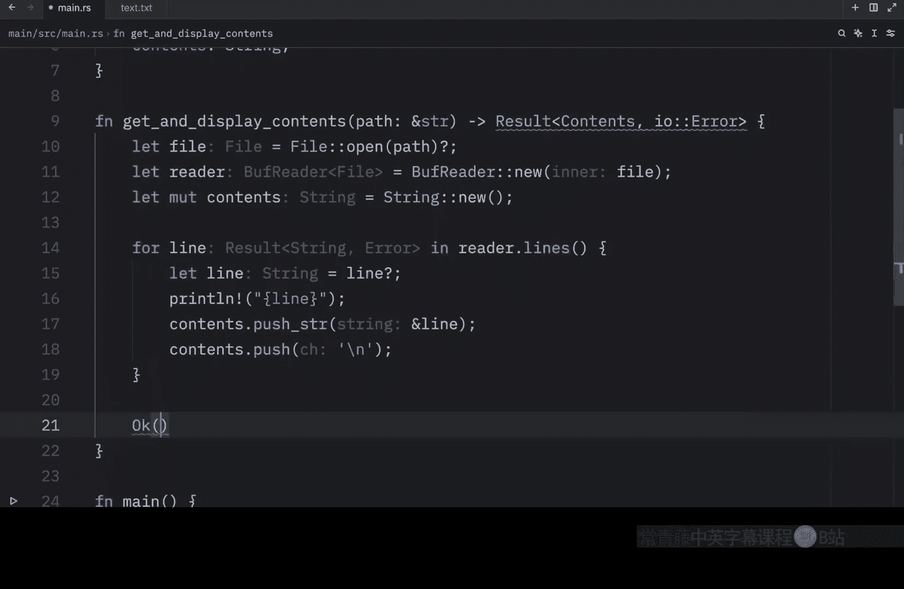

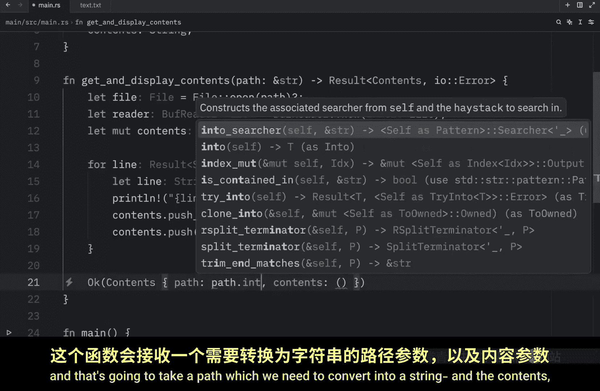

to code， or at least much more convenient because we didn't have to deal with all that red syntax highlighting until we were done with our function。

 Now， going into our main function， we can grab those contents by typing in let contents equal get and display contents and passing in text do Txt dot unwrap Since we are just prototyping here。

 and then we can print line the placeholder， what the contents dot contents。

 just to see if we get anything back。 Now， if we run this， what we should get as an output。

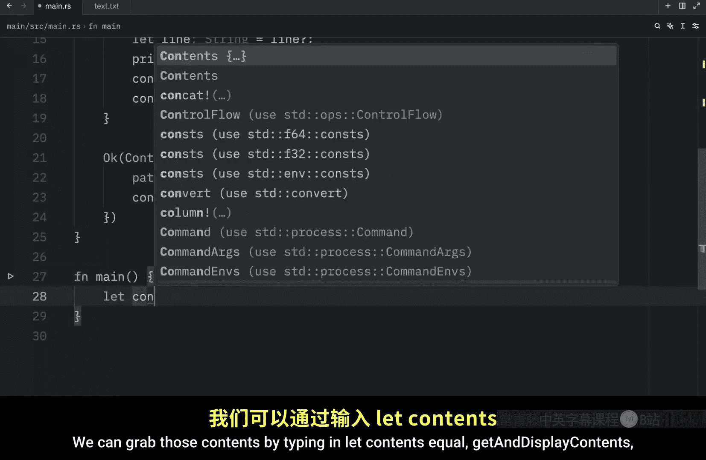

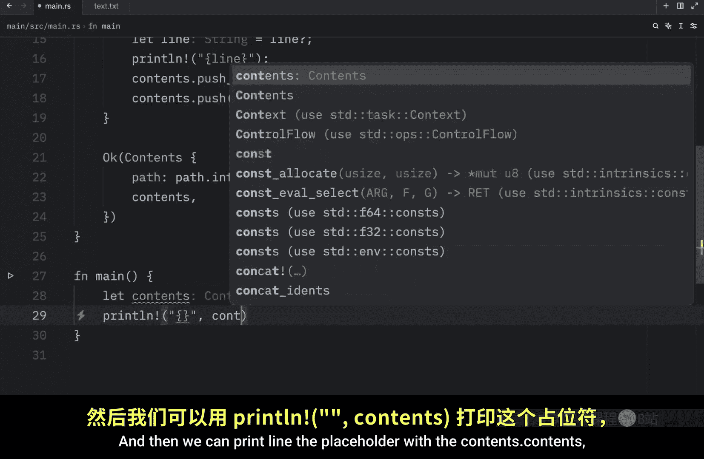

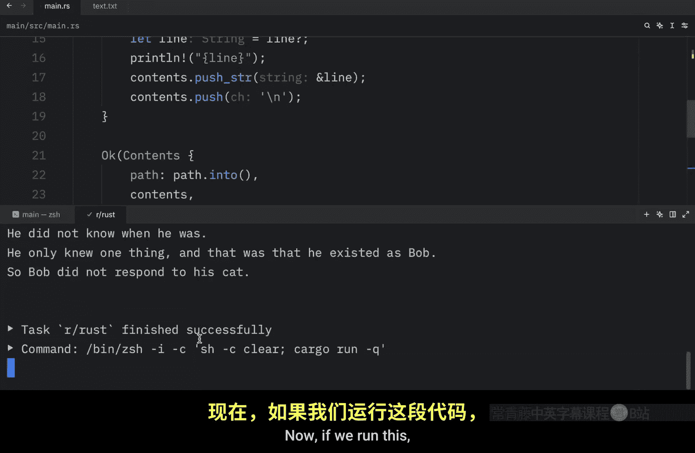

Is the text dot TXT file being printed twice， the first time is when we display the contents and the second time is when we just display the contents of the contents that's starting to sound very confusing。

Maybe we can do something better like getting the length back or if I remember anything we need to get the characters first and then call dot count and then we can modify the string to say length。

Equals or is of this length。Now the next time we run this all we're going to get back is our poem being displayed and the length of it so we successfully got and displayed those contents anyway I hope that helped you understand why we should use to do and unimplement it in our projects do let me know in the comment section down below whether you have any comments regarding it otherwise it's time we finally move on to vectors。

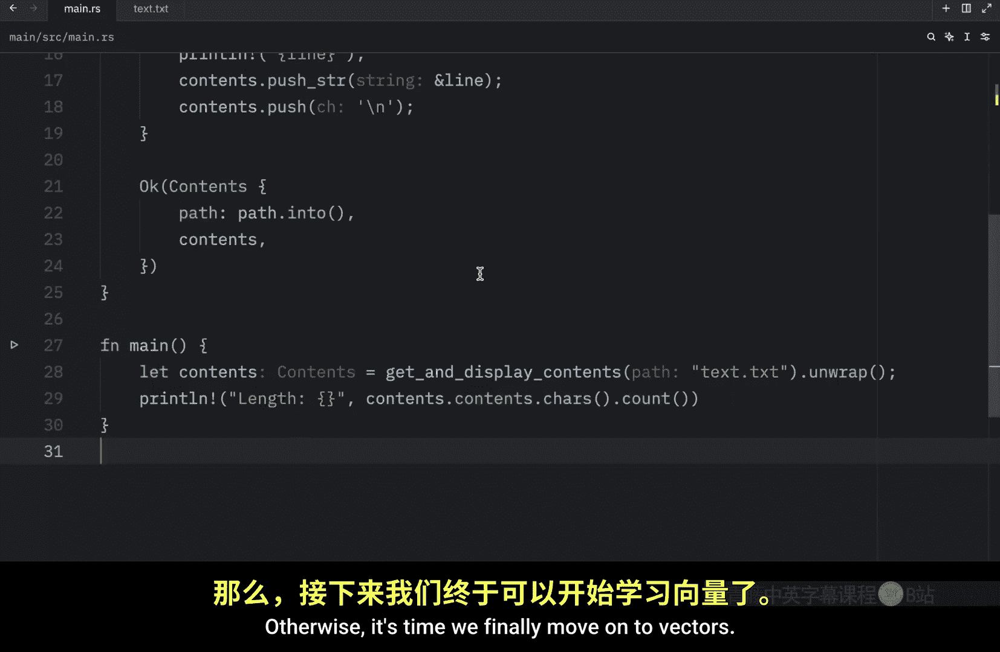