# Rustfully【中英⚡Rust 初学者教程（2025）｜Rust for beginners (2025)】 p52 P52 Rust中的向量非常棒 -BV1eyAkzPEhj_p52-

In today's video we're finally going to learn about vectors in rust。

 We've been using them quite often， and I keep describing them as mutable arrays。

 which is an oversimplified explanation。 vectors allow us to store more than one value in a single data structure that puts all the values next to each other in memory unlike Python lists vectors can only store values of the same type They are quite useful when you have a list of items such as lines of text in a file or the prices of items in a shopping cart。

 The data that a vector points to is stored on the heap。

 which means the amount of data does not need to be known at compile time and can grow or shrink as the program runs to create a new empty vector we use the new function for example。

 he will create V which will stand for vector and we will define this to be a type vector of I32 because that will contain I32 and then we type in vector new and we can also。

ug get to see what it looks like and we'll pass in V and of course。

 this should be a macro and when we run this， what we should get as an output is an empty pair of square brackets because we have an empty vector here and creating an empty vector requires you to specify the type because rust has no information to work on regarding this vector and it needs to know which type to hold ahead of time but rust also has a macro for creating vectors which is very convenient when you want to create a nonemp vector for example it's recreate this vector except this time I'm going to use de vector macro and inside here I'll pass in12 and3 then right below that we can debug or use my special debug statement that V is equal to V and the reason I'm doing this is because if we use debug it's going to pretty print it and ruin my day but as you can see as soon as we run our program we're going to get our vector back as an output up next。

 let's take a look at how we can modify a vector and for this example。

 I'm going to create a mut vector。

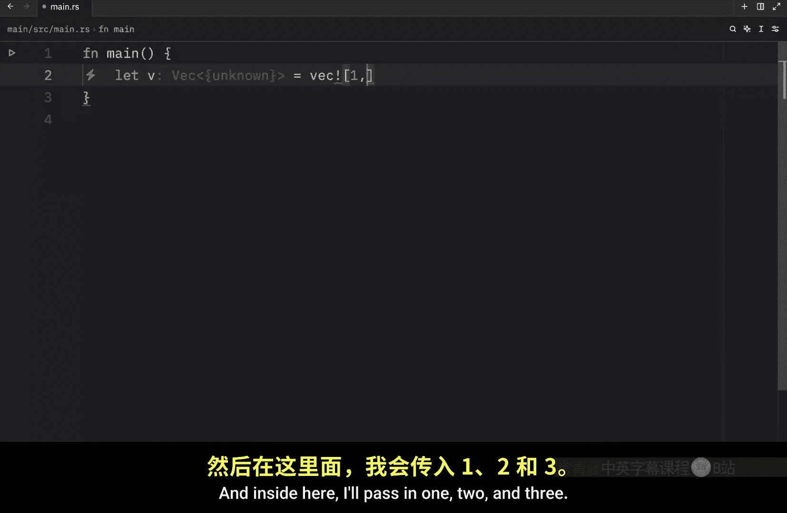

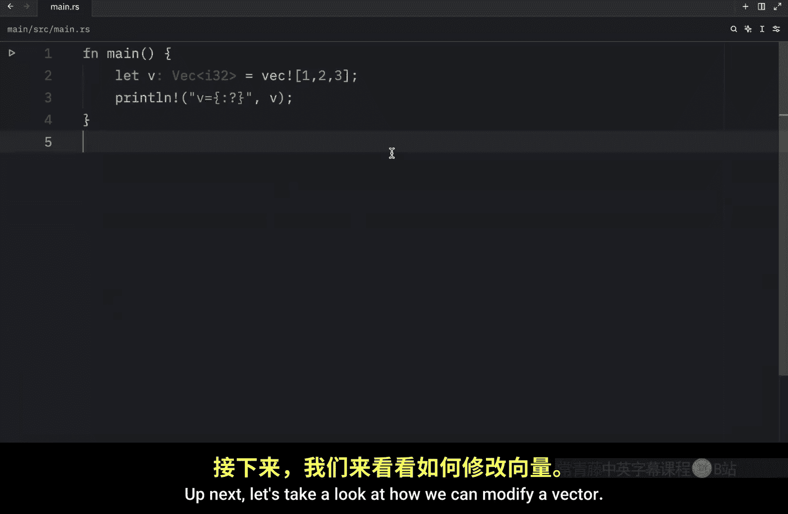

C numbers and we need to make this mutable if we want to modify it。

 and here we will use the vector macro and pass in 12 or let's just add 0， who cares。

Now if you want to add an element to a vector， you're going to want to use the push method。

 for example， numbers do push one， and we can do that two more times so push2 and push3 and this will append an element to the back of this collection Now when we debug numbers what you'll see is that we have all of these numbers in the vector we are able to add numbers or append numbers after the creation of the vector also just to show you why I'm not using debug I'm just going to use that real quickly。

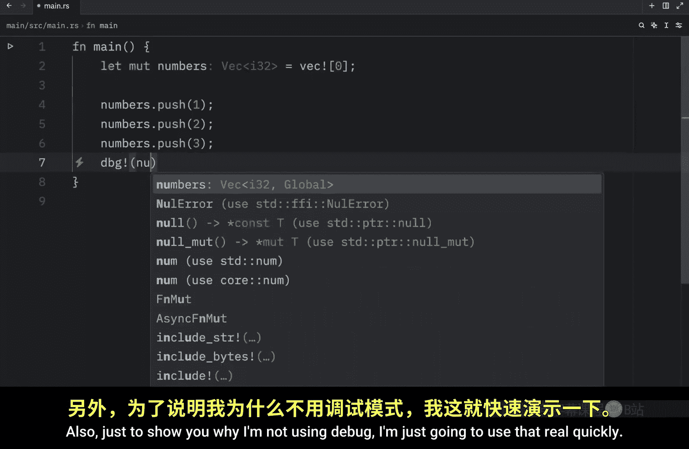

And when we run this， what you'll notice is that we get this very crazy output which might be very useful for complex data types。

 but for this case it doesn't make any sense to me， I don't like it。

 I don't like the pretty printing anyway going back to what I had earlier I also want to show you that if you want to remove and return the last element in a vector you can do so using the pop method so here we can type in numbers do pop。

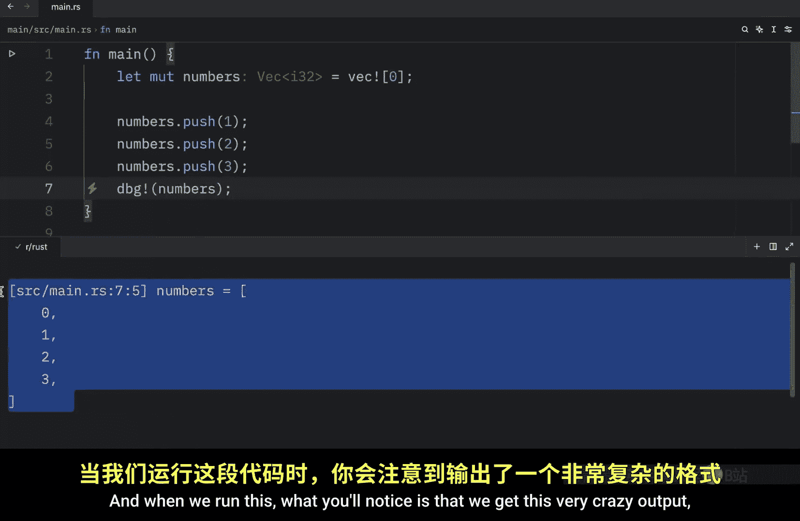

And this returns an element as well。 so if you want to create， let's say popped， you can do that。

 it's going to both remove the element from the array if it exists。

And return to you the result of that or the optional of that because if you don't pop anything。

 then it's probably going to return none anyway， as soon as we pop it。

 we can copy and paste this and werun our program and what you'll notice is that we popped3 from this vector moving on in rust we have two ways to reference a value stored in a vector and we can do that via indexing or via the get method So recreating our numbers which will equal this vector of12 and3 and just to make all that syntax highlighting go away we're going to push a number otherwise rust thinks we did this for nothing and what we're going to do is try to retrieve the element2 via indexing so here we can type in second because that will be the second item of the vector as soon as I can spell it and that's going to equal a reference of I32 and here we're just going to reference the vector and pass in one So just like in many programming languages indexing starts at zero so if we want to grab the。

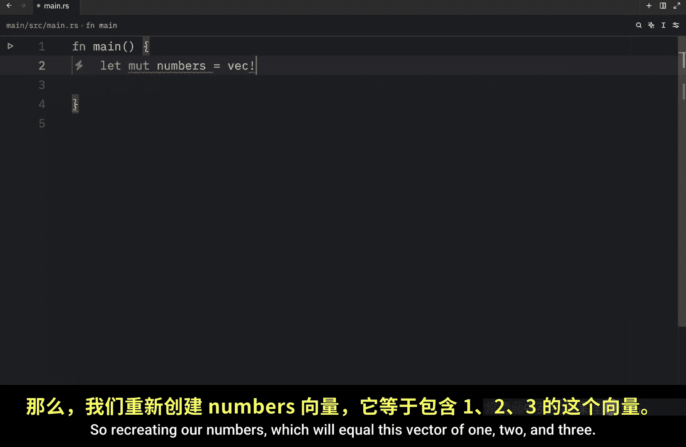

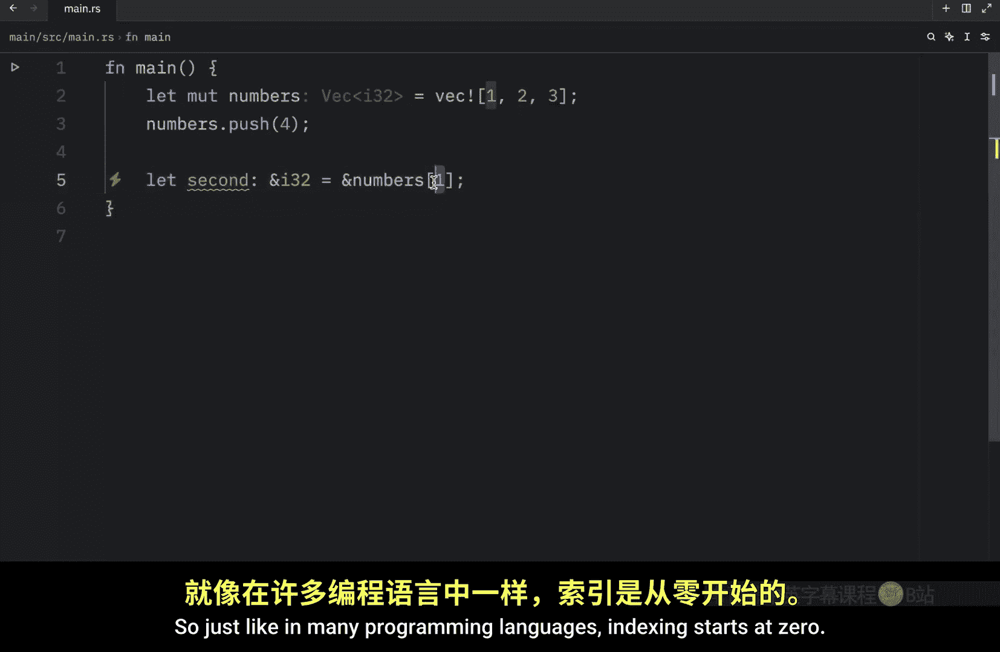

Second element， we have to pass in one。 Then we can debug this element， which is the second element。

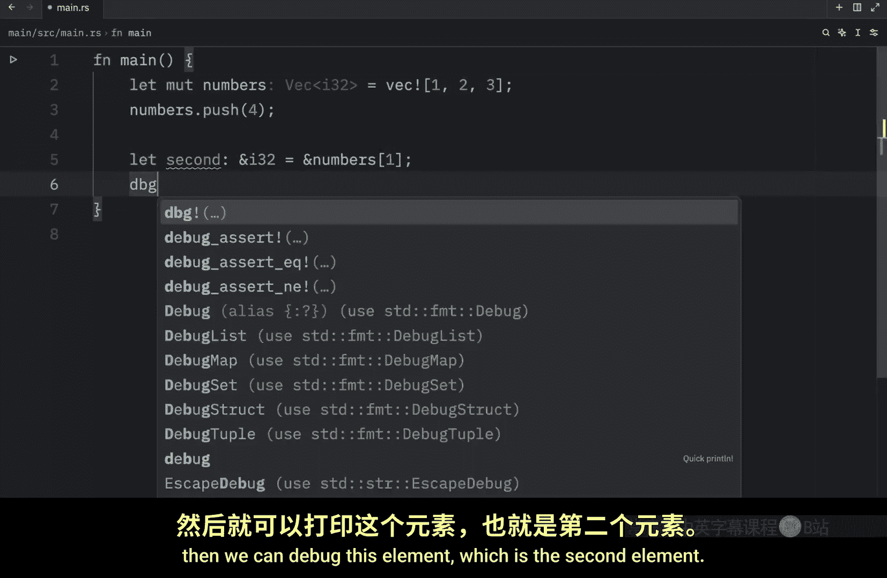

And as soon as we run this， you'll notice that we will get two as an output because this is the second element。

 I'm sorry， this over here is the second element。Now the other way to retrieve a value is using the get method so we can create second once again。

 and this time it's going to be of type option I32 and that's going to equal numbers do get and here we want to pass in one as the index so we're pretty much doing the exact same thing we did here except this time we're returning an optional then we need to match second and since you already know how this works I'm just going to copy and paste in the two arms one that handle sum which will take second of type I32 and return this print statement that the second element is second Now if there is no value at the index of1 it's going to trigger the nuar and print this statement So this was the second way we had for referencing a value and the reason we have these two methods is so we can decide how the program behaves when we access a value that is out of range for example we might have some people which will equal a vector with Bob and James Now we're going to pretend。

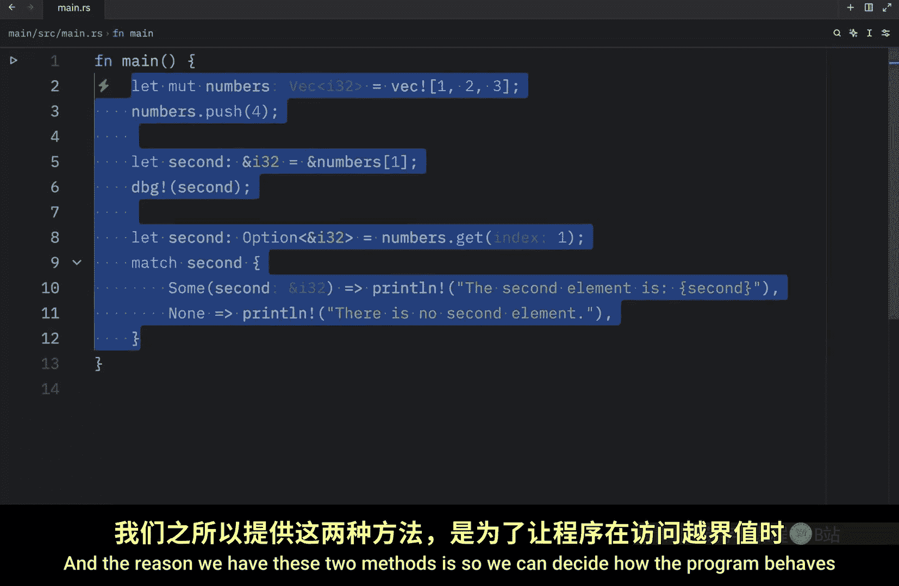

That we think there's a third element in this vector， such as Sara。

 So we will let Sara equal a reference to people， not a percent。 I don't know what that does。

At the index of 10， we're just going to pretend that hypothetically Sandra is supposed to be in here。

 but for whatever reason she left the party so she's not right now if we were to debug or try to use the value of Sandra。

 what you're going to notice when we run the program is that it's going to panic。

Because the index is out of bounds and it will tell you exactly what went wrong here。

 The length is 2， but the index is 10。 We tried to access an index which did not exist。

 So obviously that led to a panic。 Now if we were to change this to people dot get at the index of 10。

 this would return an option which means that when we run the program， it would not panic。

 it would either return some value or it would return none， but it would not make our program panic。

 So that's the difference between the two approaches。 Also。

 one thing to remember is that when the program has a valid reference the borrowcheer enforces ownership and borrowing rules to ensure the reference and any other references to the contents of the vector remain valid。

 So if you type in let's mute numbers equal。A vector of 1，2，3。

4 and5 and you try to reference the first number so you type in let first equal a reference to numbers at the index of 0。

 and then you try to modify the vector by typing in numbers push and6 you're going to notice that rust will not allow us to use first anymore。

If we were to print line。

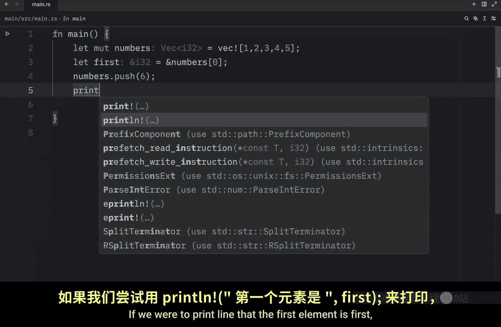

That the first element is first we would get a bunch of syntax highlighting。

 We need to make sure we use the reference before we attempt to modify it。

 so to make this work we'd either have to push before first or after the print statement then the program would compile Next I want to talk about how you can iterate overvalues in a vector。

 So on this example we'll type in let people equal a vector with our favorite friends。

 I don't know why it took so long to say friends。

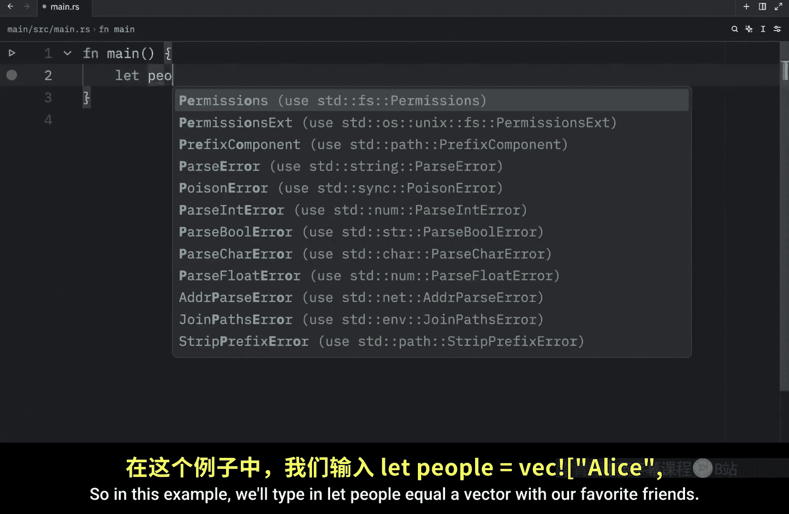

Maybe I don't have any friends。 Bob， James and Sandra， now for person。In the reference to people。

 we can print。Whatever person is at that index。 So person， and that's it。

 Now when we run the program， we should get bobs， James and Sara back。

 And if we make our vector mutable， we can also apply changes to it as we iterate over it。

 So maybe we want to do some mathematical computations to a vector of numbers numbers。

 and here we'll create a vector with1，2 and3 then4 n in the mutable numbers。

 we're going to d reference n plus equals 10 and all this does is add 10 to each one of these numbers and the asterisk is used to d reference a variable to get its value but we will discuss the dereference operator in a future video For now just know that we're modifying the original elements and we can verify that by typing in printlin I don't know why I call it printlin I know it's printline but in my head I've always said printlin。

 I'm going to go back to my debug shortcut so I can just type in numbers and when we run this what we should get as an output。

That numbers now equal 1112 and 13。 So vectors are super cool and all。

 but what if you want them to contain different types。 Well， one workaround would be to use enums。

 So in this example we're going to create an enum called value and inside here I'm going to type in int of type I32 float of type F64 and text of type string。

 which means that now we can type in let mutable values equal a vector with the following values。

 The first one is going to be a float， which contains pi which is a constant we can import and the reason I imported that is because rust complains when I type in 3。

14 it did not like that last time as you can see if I hover over it。

 it yells at me So I just thought whatever I'll just pass in pi and then we can pass in another value such as an int that contains the value of 42 I hope you're not complaining about that either that would be insane if it complain about 42 and write。

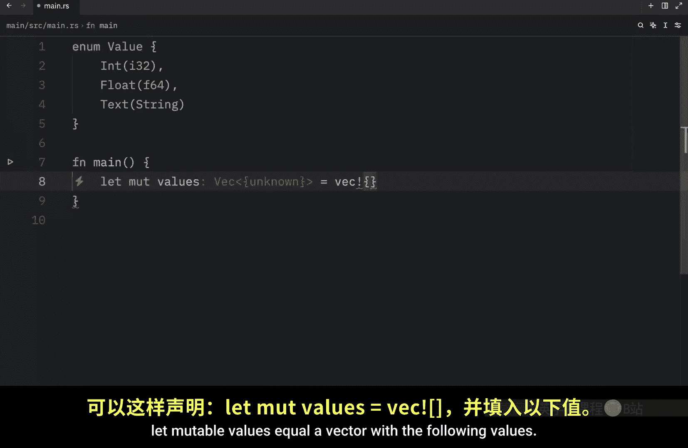

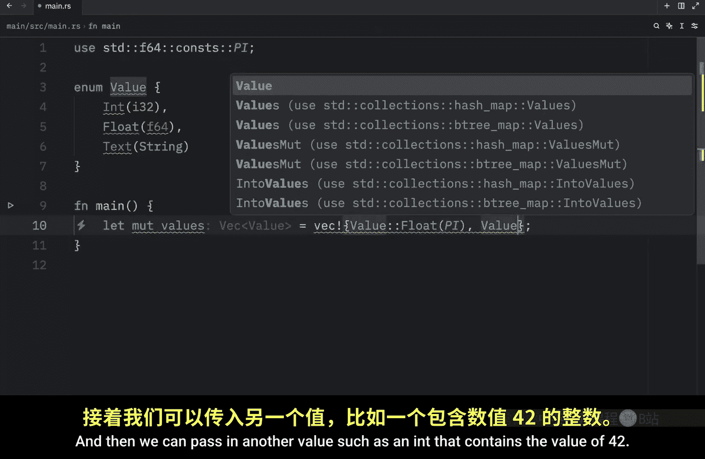

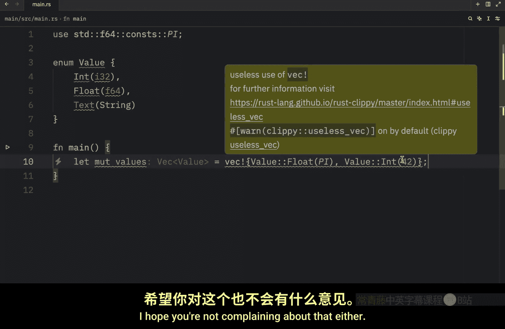

low it I'm going to push a new value， which will be of type text and that will be a string from Bob and finally I want to display the information so I'll type in debug and pass in the values and this is not going to work by itself because we are missing a trait and to see which trait we're missing we can hover over values。

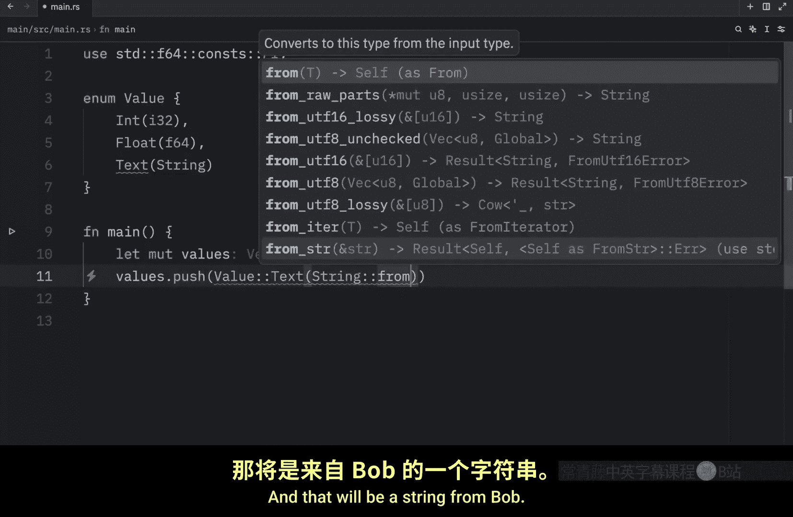

And you'll notice that we are missing the debug trait。

 So what we're going to do real quick is just type in derive。And debug and now when we run this。

 what you're going to notice is that we're going to get our values back with the float。

 the integer and the string， so why must rust know what types will be in the vector at compile time Well it needs to know exactly how much memory on the heap will be needed to store each element and that's why we have to be explicit about what types are allowed in the vector。

