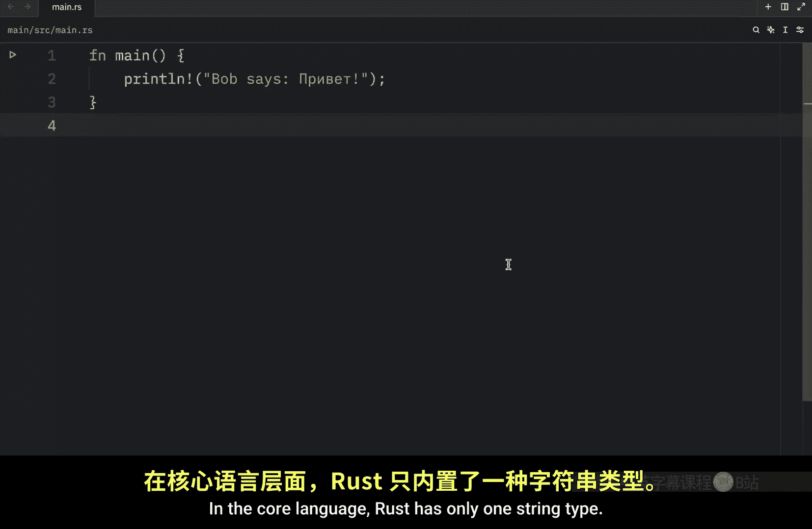
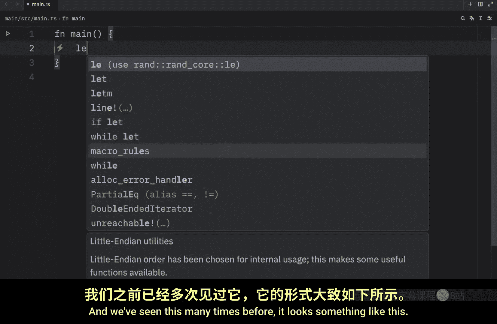
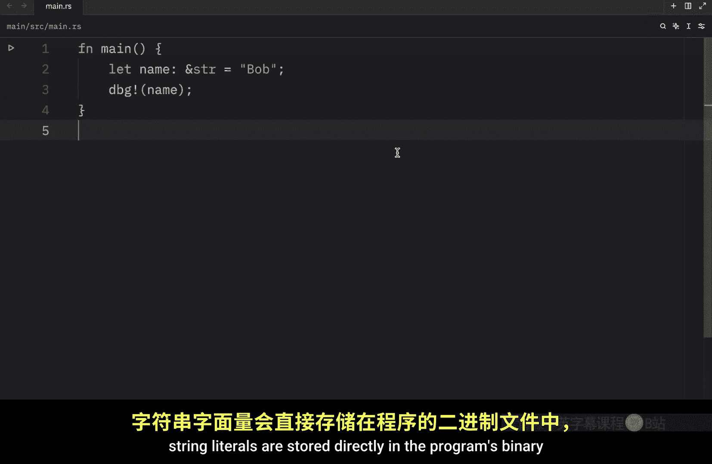
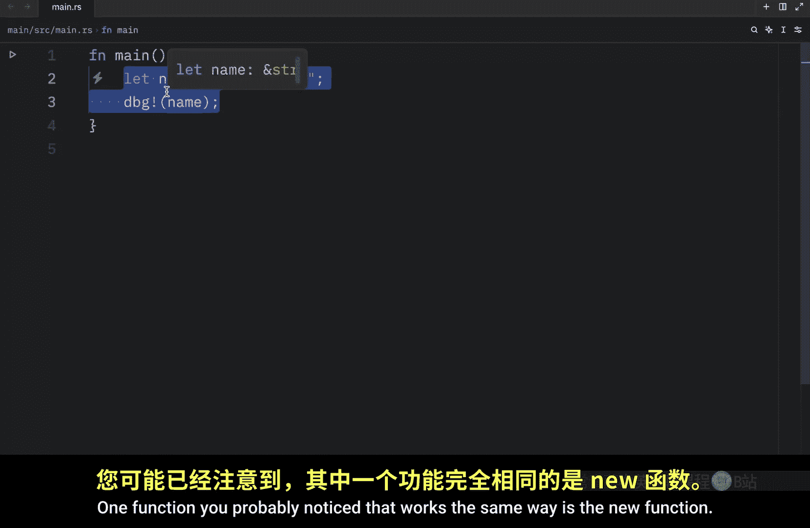
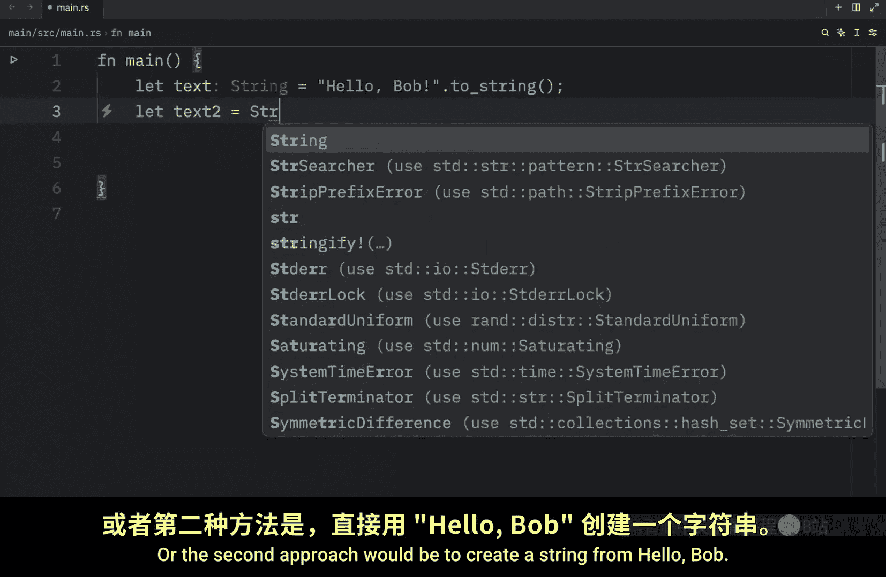
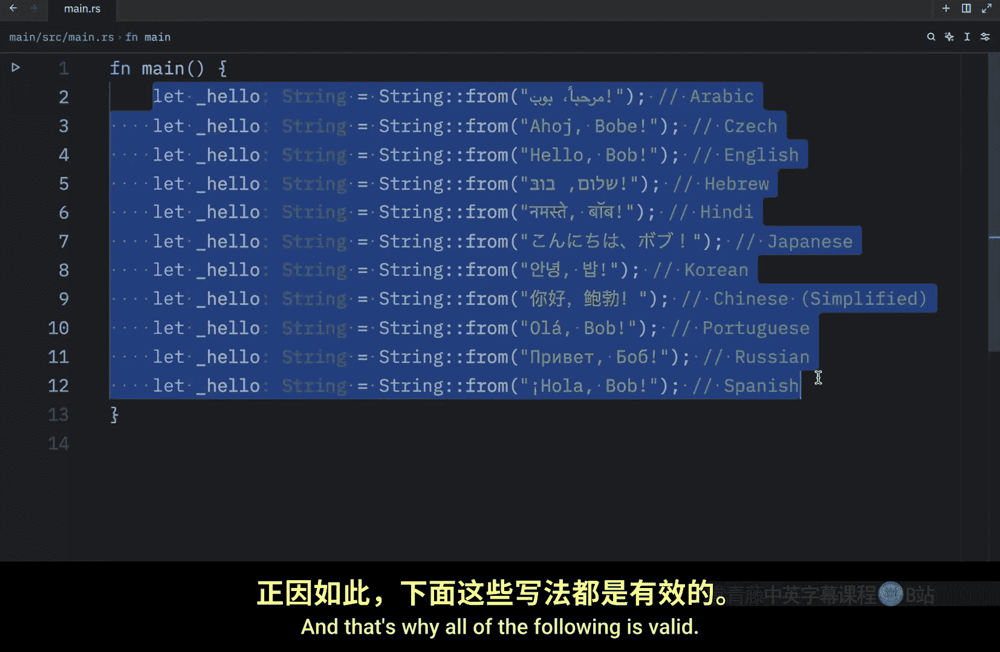
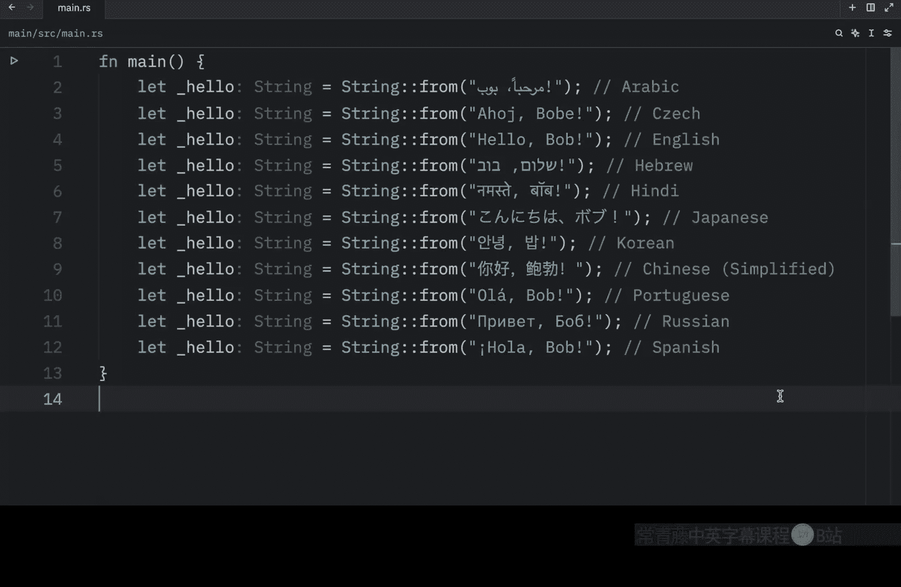

# Rustfully【中英⚡Rust 初学者教程（2025）｜Rust for beginners (2025)】 p53 P53 Rust中的字符串很复杂 -BV1eyAkzPEhj_p53-

Today， we'll learn about the string type in more depth。 In general。

 we refer to strings as collections because in rust。

 a string is implemented as a collection of bytes in other languages like Python。

 We usually think of a string as a collection of characters。

 which is still a collection and can be treated as such in the next couple of videos。

 We'll talk about the operations that every collection type has such as creating updating and reading。

 We'll also look at how string differs from other collections。 But first。

 let's start this lesson by learning what a string is In the core language。

 rust has only one string type。 The string slice。 And we've seen this many times before。

 it looks something like this。

This is a string slice。And if we were to debug that， what we get as an output？

Is Bob In a previous lesson， we talked about string slices。

 which are references to some UTF 8 encoded string data stored elsewhere。 For example。

 string literals are stored directly in the program's binary and are therefore string slices。

 The string type， which is provided by rust's standard library rather than built into the core language is a growable mutable。

 owned UTF 8 encoded string type， When rust stations refer to strings in rust。

 they might mean either the string type or the string slice type， not just one or the other。

 although this section of the series will focus largely on the string type。

 but both types are used heavily in rust's standard library and both are UTF8 encoded。 Now。

 many of the same operations we have for vectors， are also available for the string type。

 This is because string is actually implemented as a wrapper around a vector of。😊。

ByWith some extra guarantees， restrictions and capabilities。

 One function you probably noticed that works the same way is the new function Here we could have a string。

 which will equal string。

New and that would create an empty string。 Now， if we wanted to create an empty vector with type in let v or whatever variable name you want of type vector with the type set to I 32 equal a vector new and that would create a new empty vector of type I 32。

 Now if we were to debug both of these。What we would get as an output is an empty string and an empty vector。

 But let's remove that vector for now and continue learning about the string type。

 This line creates a new empty string into which we can load data later。 Often。

 we'll have an initial value for our string that we want to use。 For example。

 we might have some text of type string。 and I can equal， hello， Bob。 And at the moment。

 this is a string slice。 As you can tell， we're not using the string constructor。😊。

And when we use quotation marks like this by default。

 we create a string slice to turn this into an own string。

 We're going to have to use the following method。 so here we can type in let text Eal text to string and now text is owned And if you are an experienced thrustation you're probably going to look at this and say what are you doing Are you drunk and the answer is no。

 I am not drunk。 maybe just a little bit。 The reason I created two variables here was just to demonstrate how we could convert an already created variable into a string。

 but there's nothing stopping you from doing it directly。 For example。

 you can type in two string right here， and it would work exactly the same way or the second approach would be to create a string。

From。Hello Bob and this also works Both of these do the exact same thing so which one you choose is a matter of preference Also remember that strings are UTF encoded which means we can include any properly encoded data in them and that's why all of the following is valid even if there are special characters but strings are quite a long topic and that's why I'm going to conclude today's video here and in the next video we're going to cover how we can update a string in rust。

