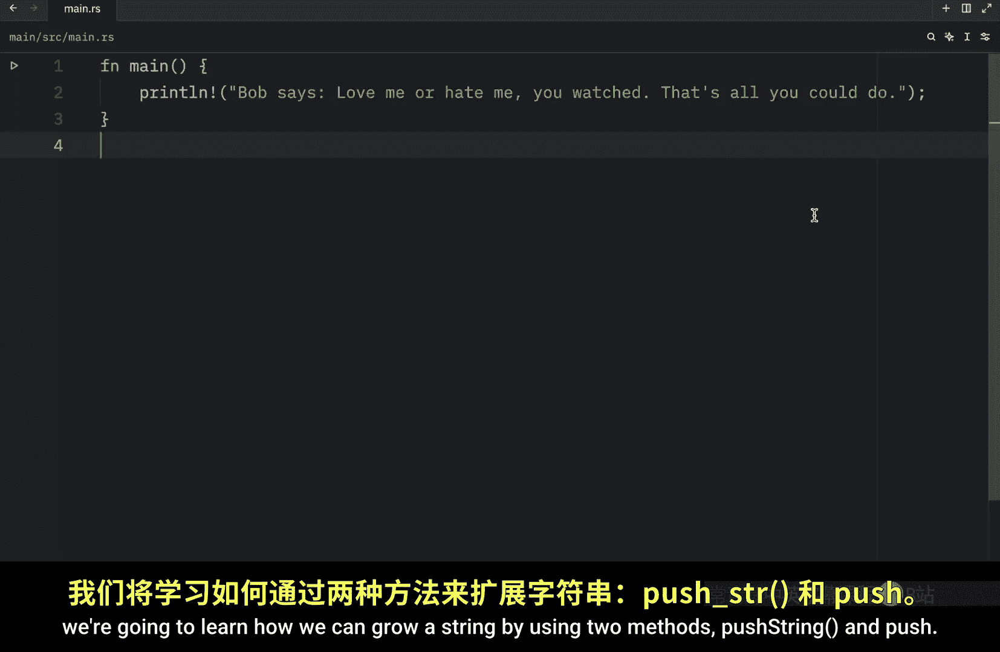
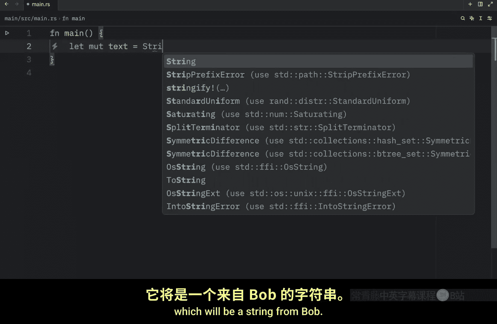
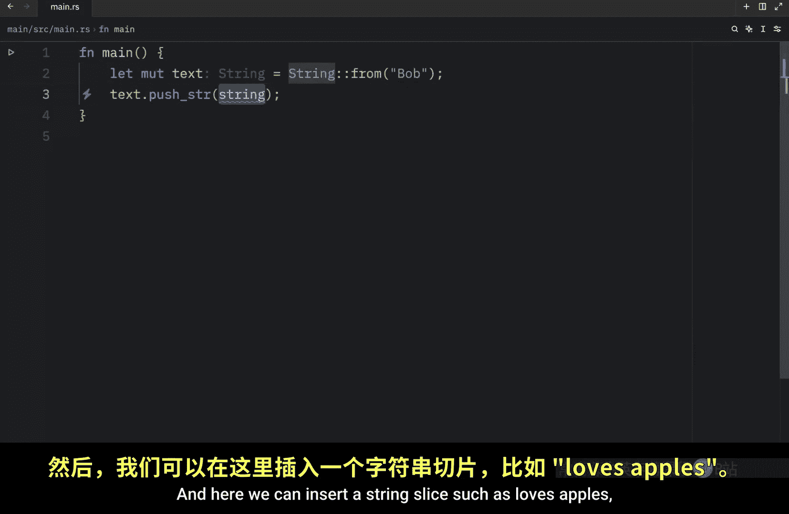
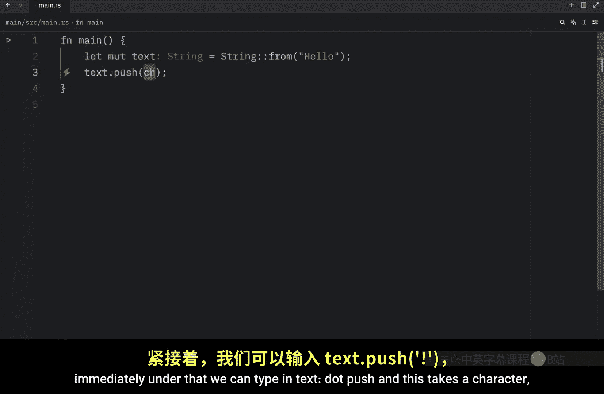
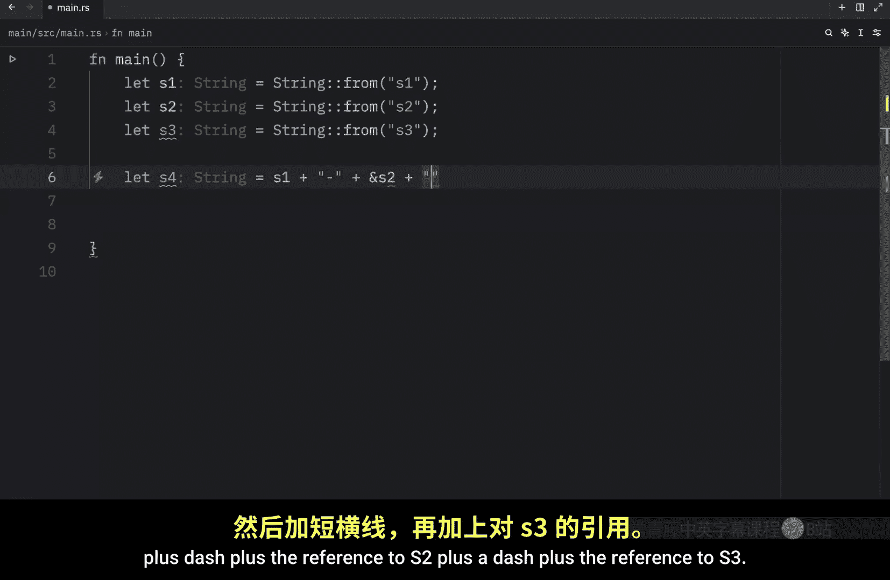
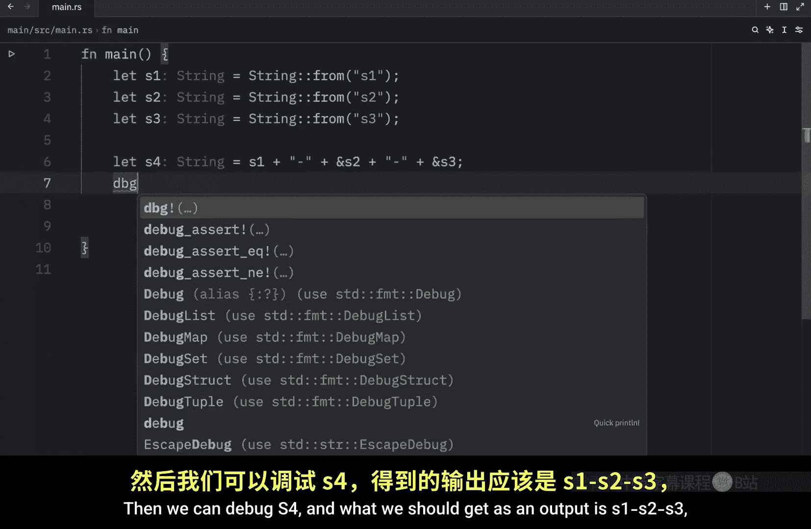

# Rustfully【中英⚡Rust 初学者教程（2025）｜Rust for beginners (2025)】 p54 P54 我喜欢Rust中的_format!_宏 -BV1eyAkzPEhj_p54-

In today's video， we're going to continue on the subject of strings in rust。

 A string can grow in size and contents like the contents of a vector。

 All you need to do is push more data onto it to start off this lesson we're going to learn how we can grow a string by using two methods。

 push string and push So let's create a mutable variable called text。

 which will be a string from Bob So here we have our start point。 Next we're going to type in text。

 push string and here we can insert a string slice such as loves apples so that when we debug this text or print it we end up with a result that says Bob loves apples and push string string string Now sounds weird and this method takes a string slice because we don't want to take ownership of the parameter here。

 We want to continue to be able to use it afterwards。

For example， instead of hard coding this into this method。

 we're going to create a variable called ending， which will equal was here and instead of Bob。

 we're going to change the example to James。And now we're going to type in text push and pass in the ending Now the next time we run this。

 we should end up with the result of James was here， and since this takes a string slice。

 we can still use that ending， meaning we can type in debug ending。And that will work perfectly fine。

 even if for whatever reason ending was to be of type string。

 so we were to type in string from was here Rus would make sure that we passed in a slice so that we wouldn't end up with any ugly surprises。

But I also mentioned that we had the push method， and the push method is practically the same。

 but only allows us to append a single character to a string。

For example， let's pretend we have this text and that's going to equal a string from hello immediately under that we can type in text。

 push and this takes a character as I mentioned before。

 so all we have to do is pass in some sort of character。

And now we can debug our text and what we should get as an output is the combination or the concatenation of hello plus that character。

 So those were the basic ways to push data into our string up next。

 let's look at how we can concatenate strings using the plus operator and the format macro starting with the plus operator。

 which is a bit trickier than what we have to deal with in other languages。 like in Python。

 it's just string plus string equals new string simple But in rust。

 it behaves a little bit differently。 So here we will create a variable called S1。

 which will be a string from hello， then I'm going to duplicate that called the second one S2 and pass in Bob。

 And finally I want S3 to equal S1 plus S2。 But what you're going to notice immediately is that we're going to get some complaining from rust And if we hover our over。

S2 you'll notice that we need to borrow S2 so here we have to pass in the ampersand then we can debug S3 and when we run this we should end up with hello Bob as the final string but after all of this you're going to notice a couple of things such as S1 will no longer be valid after the operation if we try to use S1 we're not going to be able to use it because the value was moved and the second thing that you're going to notice which I already mentioned is that we were required to pass in S2 as a reference and the reason we have to do this is because the addd method has a signature that looks something like this。

As you can see， it starts by taking self， which is the first value。 S1 is referred to as self。

 so that takes ownership， and then it takes the element that we want to concatenate。

 which as you can see is of type string slice and that's why we are required to pass in a string slice then it returns to us a string。

 So here S1 is moved and the result of this operation is assigned to S3。

 that's why we are no longer able to use S1 afterwards。

 Now if we had to concatenate more than two strings。

 the behavior of the plus operator would be quite overwhelming to follow For example。

 imagine we have these three strings S1 S2 and S3 and we wanted to concatenate them into something new such as S4 here we can type in S1 plus dash plus the reference to S2 plus a dash plus the reference2 S3 then we can debug S4 and what we should get as an output。

Is S1 S2 S3， which was assigned to S4， but once again we can no longer use S1 because S1 was moved So this isn't really the ideal way to concatenate more than two strings because there's so much we need to keep track of and it just looks messy So what we're going to do instead is use the format macro and the format macro works like the printline macro but instead of printing the output to the screen it returns it as a string and this is far easier to read In addition。

 the codegene by the format macro uses references so that it doesn't take ownership of any of its parameters so here we can pass an a string use our regular formatting syntax or the one we use in printline S2 S3 and now when we run this we should end up with the exact same result except this time it was much easier to read and on top of that。

 we can still refer to。

1 or to demonstrate that I'm just going to debug S1， S2 and S3， as you can see when we run this。

 we can still refer to all of them， although just as a quick reminder。

 the debug macro does take ownership So if we were to call this twice it would not work the second time because all of these values will have been dropped if you want to make sure you can use them again make sure you pass in a reference to each and then we can use them again and drop them later。

