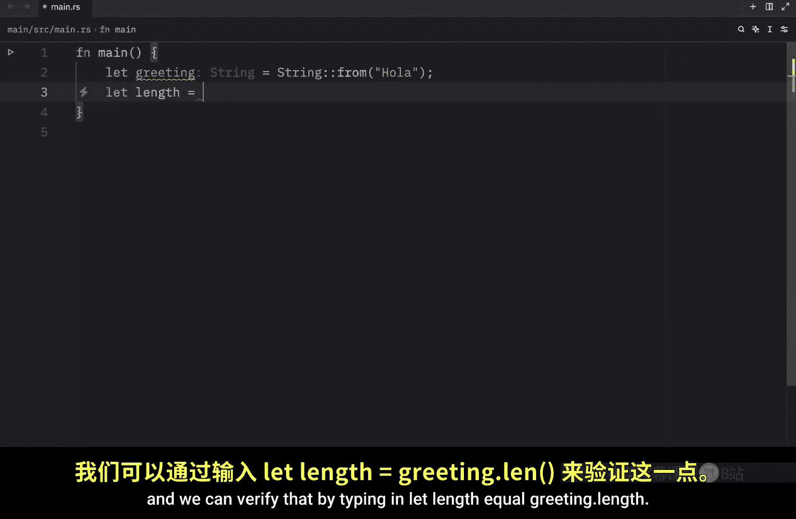
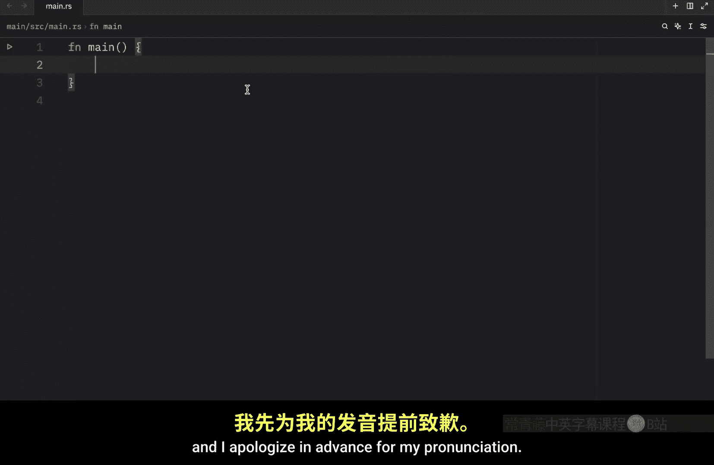
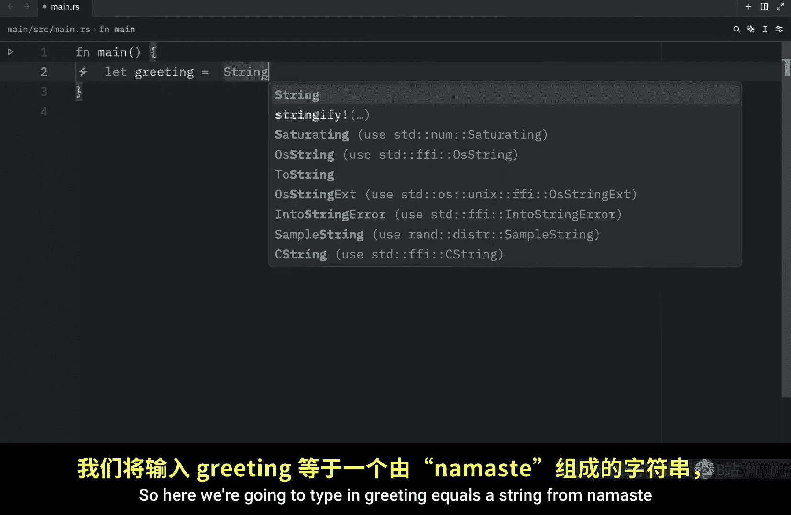
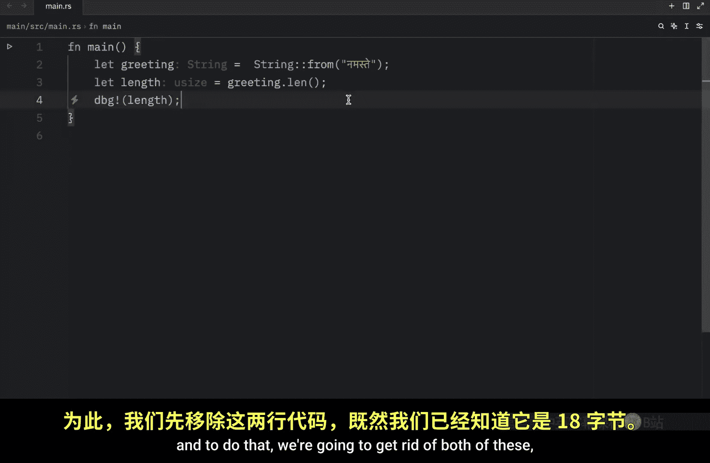
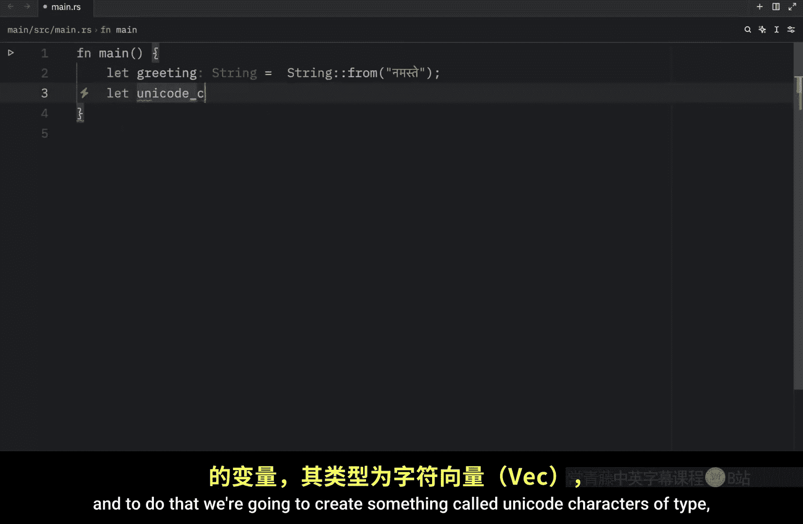
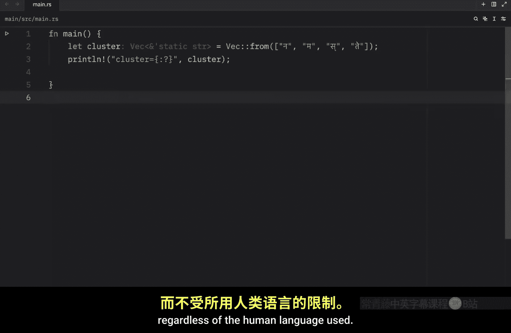
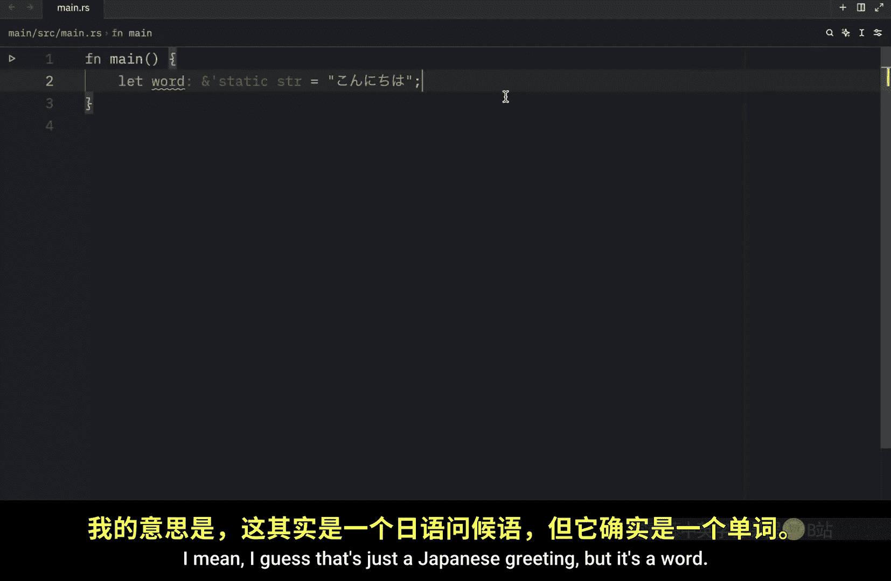
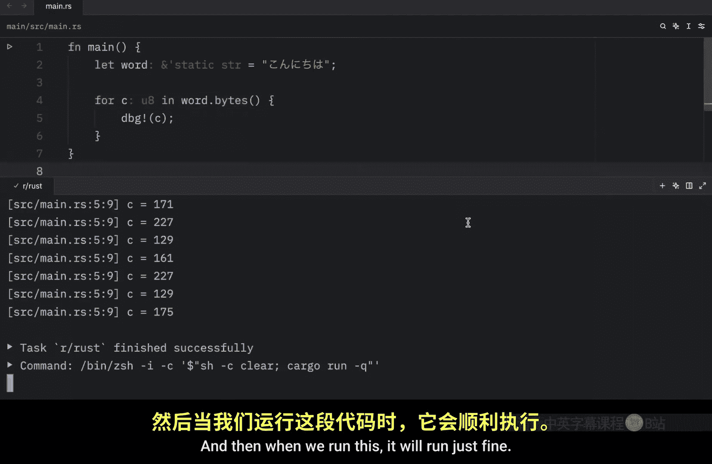
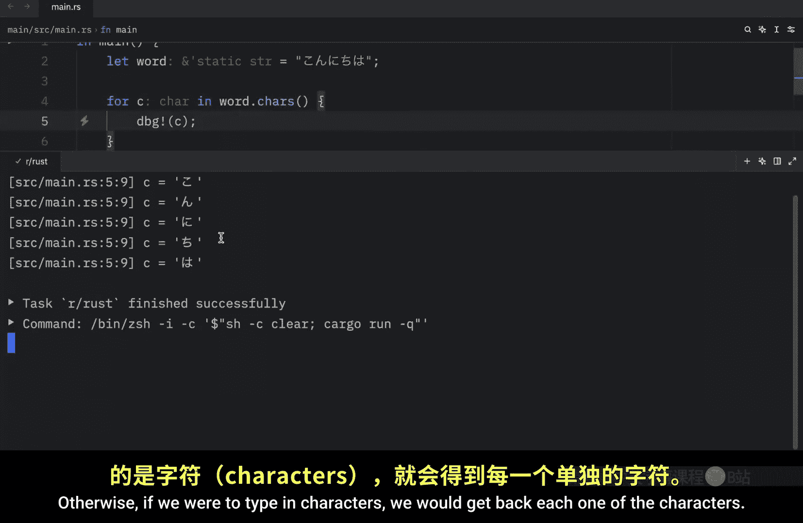
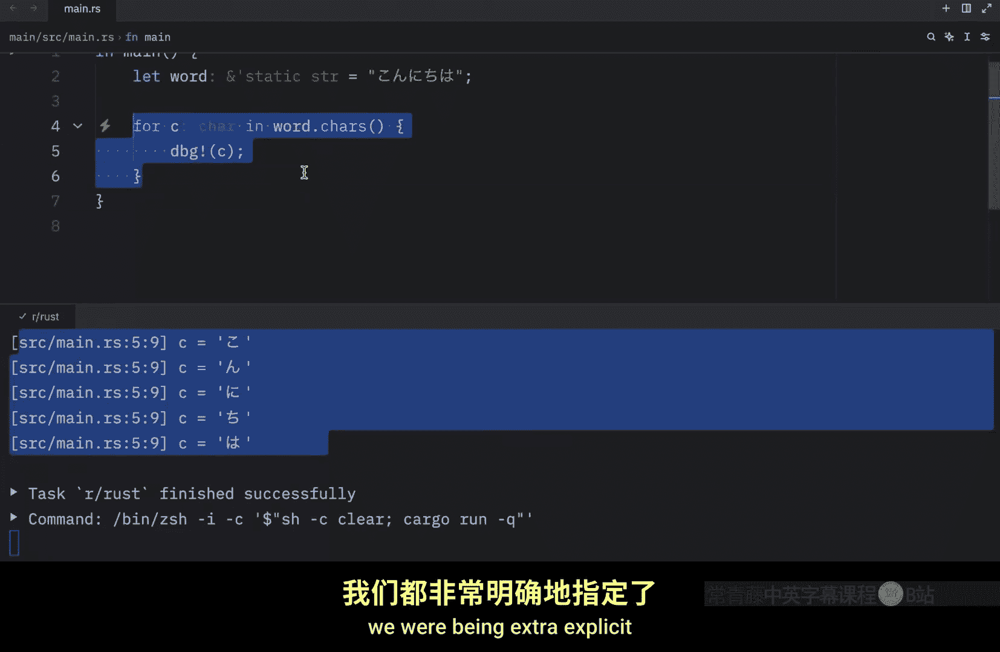

# Rustfully【中英⚡Rust 初学者教程（2025）｜Rust for beginners (2025)】 p55 P55 在Rust中索引字符串并不容易 -BV1eyAkzPEhj_p55-

In the previous video， we learned how to update a string and in today's lesson we're going to cover the final important topic of this section。

 indexing into strings in many programming languages。

 accessing individual characters in a string by referencing them via their index is a fairly common operation however。

 in rust， it's not so simple， For example， imagine you have a name。And that name is going to be Bob。

 And as I mentioned in a lot of programming languages。

 if we want to reference B or O or any one of these letters， we can do so by indexing。

 So here we're going to type in first letter and that's going to equal the name at the index of0 in a lot of programming languages this would work but unfortunately in rust this does not work。

 if we were to run the program。 would get this message that we could not compile our program and that's because the type string cannot be indexed by an integer。

 but to explain what's going on we first need to discuss how rust stores strings in memory。

 So let's move on to the internal representation of strings。

 our string is essentially a wrapper over a vector of type U 8。

 Let's look at some examples of properly encoded UTF 8 strings here we're going to create a greeting which is going to equal a string from。

オら。In other words， here we have a vector storing a string of four bytes Each character here uses one byte and we can verify that by typing in let length equal greeting dot length and just as a friendly reminder length returns the length of the string in bytes not characters or graphs so let's debug that length and see what we get as an output and what you'll notice is that we will get four as an output because this string contains four bytes and that was a fairly simple example because we just used regular Latin characters but what if we start introducing special characters such as halloa well in this case we're going to end up with six bytes and that's because or takes two bytes of storage and this is what makes simple indexing so difficult if we were ever to try to index the greeting at the index of four hypothetically。

We'd only be requesting part of the character since we'd be referring to one of the two bytes and that doesn't even make sense on its own。

 I mean， this is clearly at the index of four。 but once again。

 it's made up of two bytes So we can't just refer to it using a single index when it comes to UTF8。

 there are three relevant ways to look at strings from rust's perspective as bytes scalar values and graphme clusters and graphme clusters are the closest thing to what we'd call letters let's take a look at these three views for this example。

 we're going to use the Hindi word Namat written in the Vangari script and I apologize in advance for my pronunciation So here we're going to type in greeting equals a string from Namat and we are missing a character here Next we're going to type in let length equal greeting dot length and when we debug this length what we're going to get as an output。

Is 18 bytes With that basic information， let's take a look at how this string looks like as bytes And to do that we're going to get rid of both of these since now we know that this is 18 bytes and here we're going to type in let bytes equal greeting do as bytes and now I'm going to print the result using my special debug syntax and provide the bytes so that when we run this we'll get back the following output and these are the 18 bytes that are used to create R string。

 This is ultimately how computers store this data so that was the first way to view this。

 The second way is to view it as a scalar value and to do that we're going to create something called uncode characters of type vector。

Of characters。 and that's going to equal greeting dot characters dot collect。 Then once again。

 I'm going to print the Uniicode， and it's not supposed to be called Unicode characters。

 It was actually supposed to be called Uniicode Scalar or scalrs， and we will rewrite this。

Unicode scales。 and when we run it， what we're going to get back are these characters。

 And here there are six characters。 but the fourth and the sixth are not letters。

 They are diocritics。 diocritics are signs such as accents which indicate different pronunciations of the same letter。

 As you can see this E right here has a small accent right above the E。

 and this indicates a different pronunciation of the exact same letter and it might even been the other direction。

 and that can mean something completely different。 or there's also the French sililla。

 which I honestly don't know how to pronounce in English。 I keep on saying saiddi。

 but in English it just looks hard to pronounce Seilla or whatever。 anyway。

 it's the small accent that you have under the C。 So that's why we get these six back。

 These are diritics。 So that was the second view，  moving on to the third view。

 which is viewing them as graphme clusters and I've honestly never said the word。Graphme out loud。

 Do let me know in the comments section down below how that's actually supposed to be pronounced。

 I think it's called graphme， but it might be graphem。 I have honestly no clue。

 I hope you guys understand that I'm referring to this word here。Anyway。

 if we look at this word as graphme clusters， we end up with what humans would call the four letters that make up the Hindiwood namat。

 although when you run this， you're probably not going to get a perfectly human readable output because once again。

 this contains some diritics but regardless it contains the four characters Now rust provides us with different ways to interpret the raw string data so that each program can choose the interpretation it needs regardless of the human language used and a final reason why rust doesn't allow us to index into a string to get a character is that indexing operations are expected to always take constant time01 but that performance guarantee isn't possible with a string because rust would need to walk through the contents from the beginning to the specified index to determine how many valid characters there are moving on it's finally time to talk about slicing strings As we've just learned indexing。

To a string is often a bad idea because it's unclear what the return type should be。

 should it be a byte， a character， a graphheme cluster or a string slice。

 Therefore rust asks us to be more specific when we use indices to create string slices So here we'll type in let greeting equal string from halo and what we're going to do next is grab a slice by typing in greeting at the slice of426 and then we can debug S and as an output。

 we should get that S is equal to or。 So in other words。

 we need to be very specific with the section of data that we want to pull out of the string we can just say at the index of 4 because rust doesn't understand what we mean by that。

 it doesn't know if we want the character or the bytes it doesn't know so we need to be extremely specific with what we want。

 And in this case it's the slice from4。S， which contains or Now if we were to do zero to2。

 we' would get back how。Or even ha， because2 is not inclusive。

 we have to do dot dot equals if we want two to be inclusive。By going back to or。

 if we were to incorrectly index it or slice it， for example。

 adding the index of4 to5 or the slice of4 to5 Ru will panic。

 and it will actually give us back a very descriptive message。

 something far more descriptive than what I told you Bte index 5 is not a character boundary。

 It is inside or。 and these are the bytes from4 to6。 So once again。

 we did not grab the entire character。 we only grab one of the two bytes。

 which doesn't really mean anything on its own。 or it might mean something but it just wouldn't be the information that we are looking for。

 the best way to work with parts of strings is to be explicit about what you want from them。

 Do you want characters or bys。 For example here we have a word called Koichua or I mean。

's I guess that's just a Japanese greeting， but it's a word and we want to do is loop through it。

 we can type in4 c in word。 And I don't know why did the Python。

I know very well。 it's because I program in Python。

 debug C This will not work because a string slice is not an iterator， and it's not specific enough。

 Rus will tell us to either use characters or bytes。

 So here we either have to insert bytes or characters。

 And then when we run this it will run just fine。 It's going to be able to loop through the bytes of the word。

 And as you can see we have a lot of them。 otherwise， if we were to type in characters。

 we would get back each one of the characters。 and in both cases。

 we were being extra explicit about which data we wanted to get back from that string slice。

 Now getting the graphme clusters from strings is more complex。

 and it's not even included in these standard library。

 That's why I haven't shown you how to do it yet。 We'll have to save that for a future video just to sum up today's video strings might look complicated but generally as long as you're explicit about what you wanted to get back from them。

 theyre quite easy to work with。

