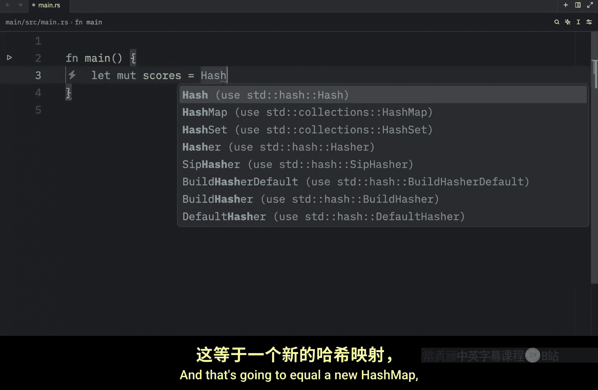
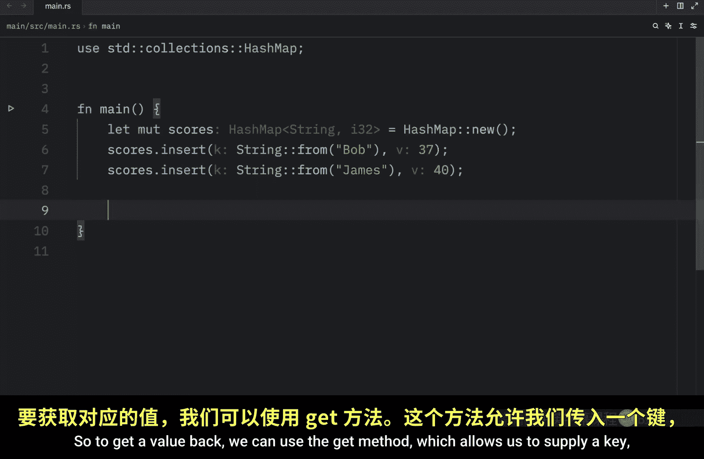
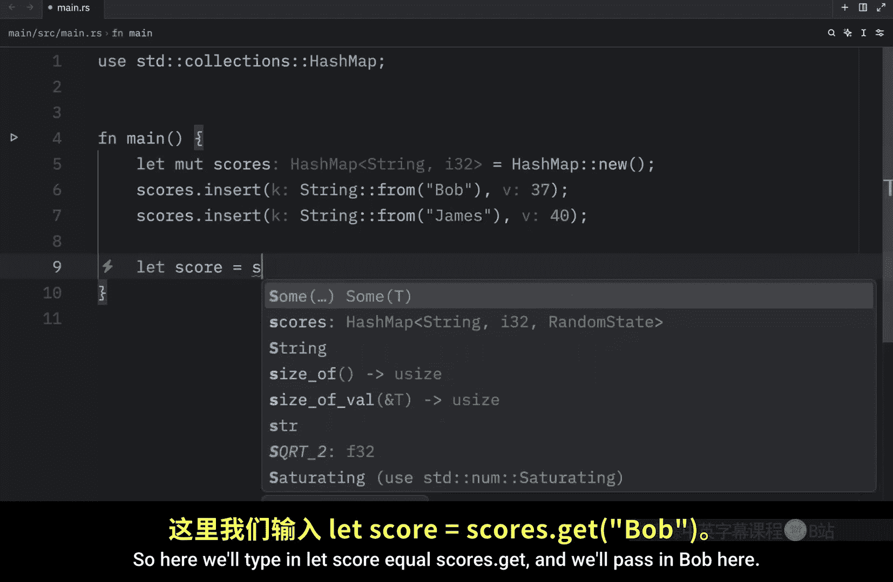
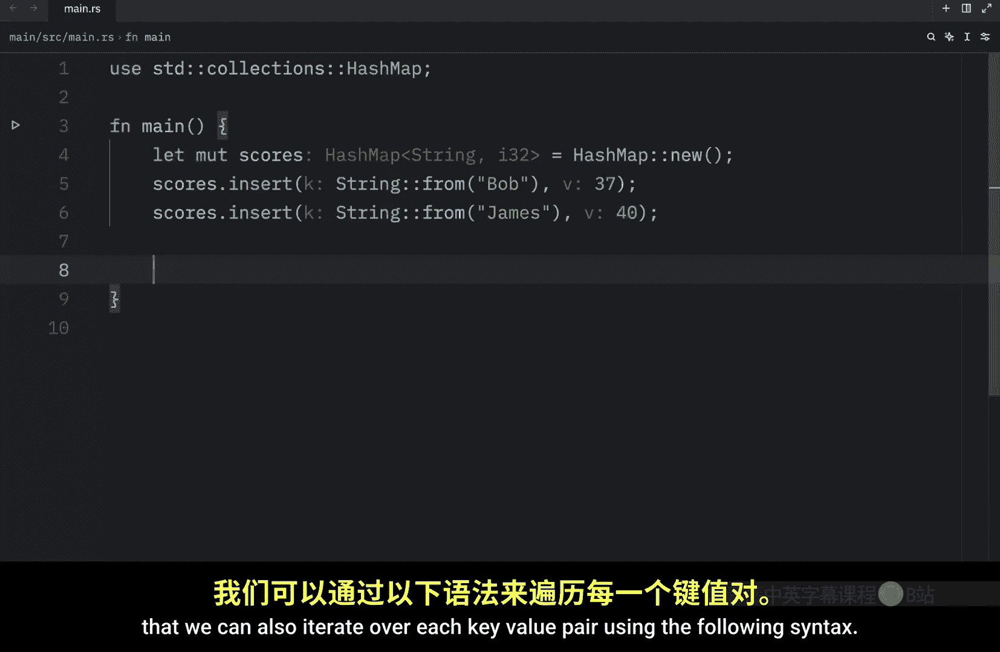
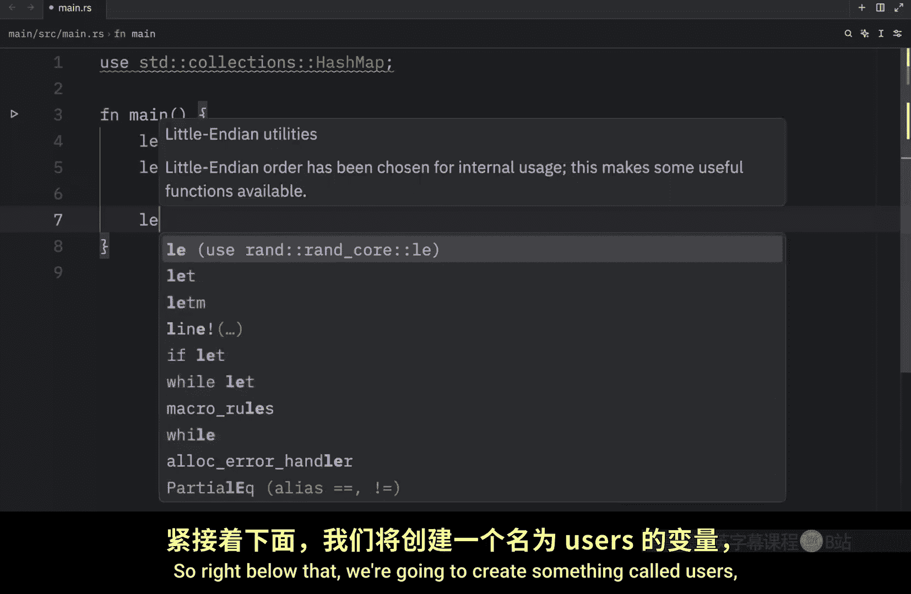
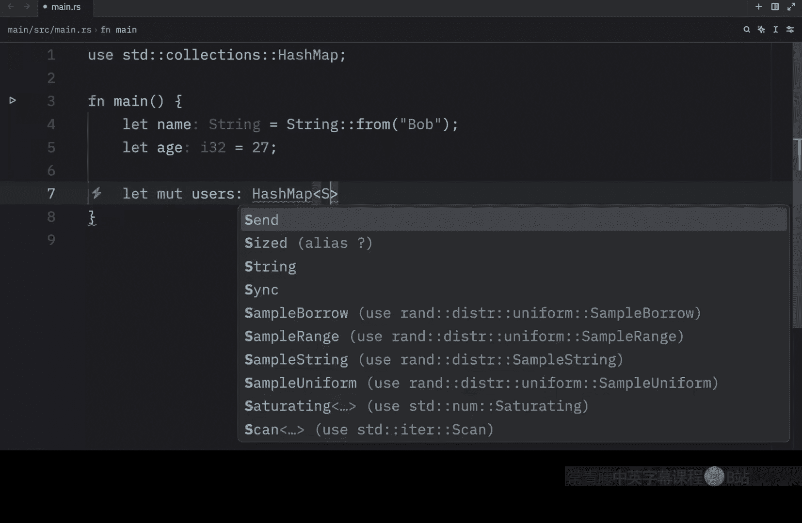
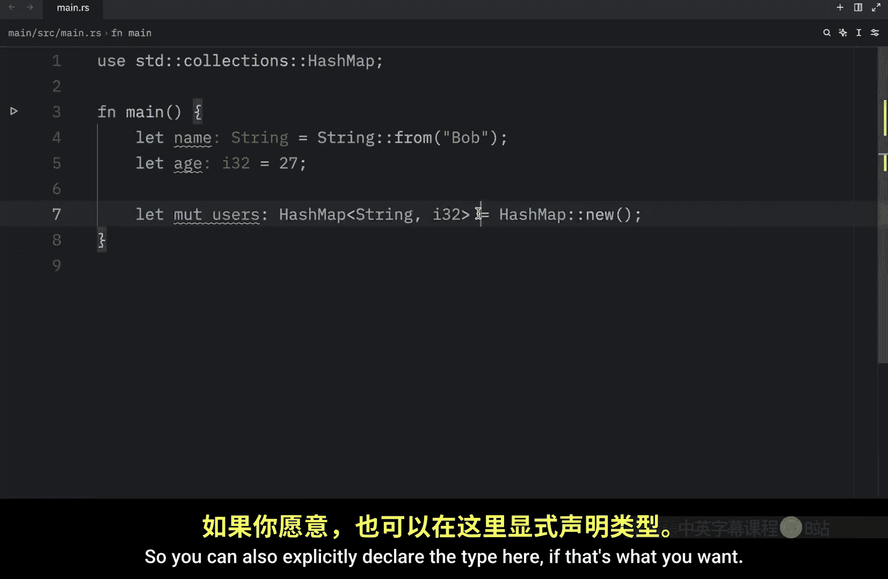
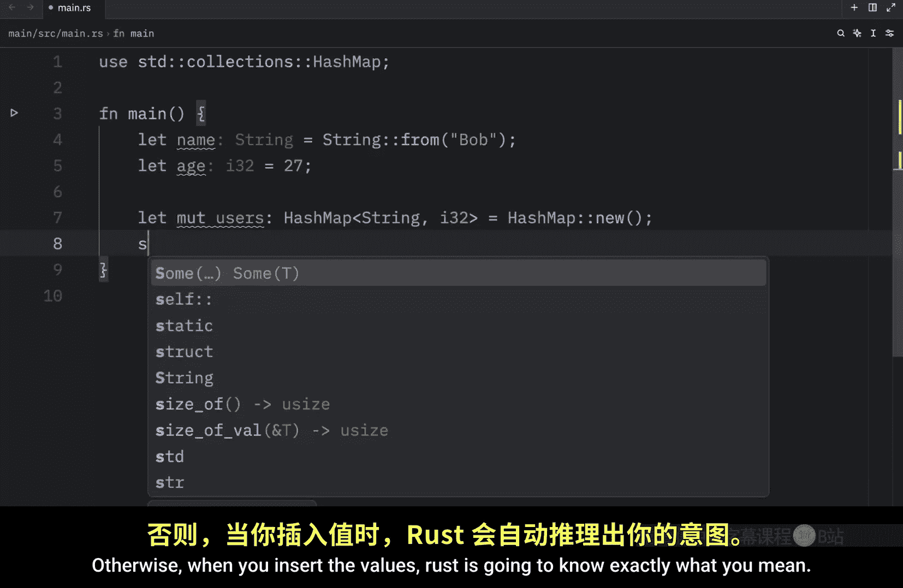
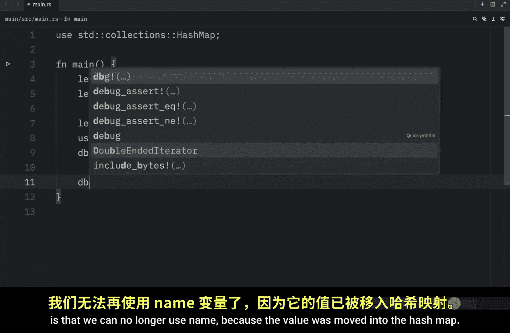

# Rustfully【中英⚡Rust 初学者教程（2025）｜Rust for beginners (2025)】 p56 P56 Rust中的哈希映射是什么 -BV1eyAkzPEhj_p56-

In today's video， we're going to start learning about hash maps。

 which are another very useful collection type that we have in rust。

 The hash map type stores values in key value pairs。

 It is quite useful when you want to look up data using a key instead of an index。

 So let's get started by creating a new hash map。 And for this example。

 we're going to create some scores。 And that's going to equal a new hash map。

 which we need to import from the standard library。😊。

And as always， if we define a new data structure without data。

 we are required to explicitly declare what type the data will be。

 because rusts has no idea what we want to insert inside this hash map。

 and it must know that before it compiles So we can either declare it there。

 or we can insert some data immediately so that rust understands what type this hash map should hold。

 So here we're going to type in scores insert。 And we're going to pass in a string from Bob。

 and the value is going to be 37。 And just like that。

 Ru is able to infer what type the new hash mapap will be。 As you can see。

 the hash mapap is of type string and I 32。 The key is of type string and the value is of type I 32 I was going to say I 37。

 Imagine how confusing the world would be if there was an I 37 type anyway。

 we're going to duplicate this and add another user called James， who will have a score of。

40 and with this we can debug the scores。 and this time I'm not going to complain about the pretty printing because it's going to look quite nice in the terminal。

 but as you can see， we have a hashmap here with the keys and the values Also it's good to know that just like vectors hash mapps store their data on the heap and that hash mapps are homogeneous meaning that all the keys must have the same type。

 So once you insert a string as a key， all the keys must be strings。

 and if you insert an integer as the value， then all the values must be integers。

 you can't just pass in a string instead of an integer。 Rus is going to complain。

 and your parents are also going to be very disappointed and you anyway， now that we have a hashmap。

 let's take a look at how we can access the values that it contains So we're going to continue with this example over here。

 but now we're going to try to access the value that Bob contains。

 So to get a value back we can use the get method， which allows us to。

ly a key and that will return to us an option。 So he we'll type in let's score equal scores do get and we'll pass in bo here。

 But as you can see this is going to return to us an option that might contain a reference to an I32 which is not what we want So we're going to call docoied on this to make sure that it is an I32 that we unwrap because right under that we're going to call unwrap or and pass in a default value of0 and this is quite nice because we can forcefully unwrap thevalue。

 even if it doesn't exist， and if it doesn't exist， we will return0。 So the score will be set to0。

 if the key of bob does not exist in our hashmap and that's quite convenient because if we were to use unwrap on its own as soon as we provide a key that doesn't exist our program is going to panic and we don't want that not in this scenario now we can debug this score and what we should get as an output is Bob's score which is 37。

Something else that's very useful to know is that we can also iterate over each key value pair using the following syntax。

 For example， here we can type in four key and value and this can be renamed to whatever you like I'm just keeping it at K and V because it's simple but you can even type in key value or whatever you want in the reference to scores print line the key colon and the value points and that's all we had to do Now when we run this we should get both of the points back or both of the key value pairs back and that's how you can use it inside a loop Now as always it's important to cover the topic of ownership how do hash maps handle ownership Well。

 for types that implement the copy trade like I32 the values are copied into the hashm for owned values such as a string the values will be moved and the hash mapap will take ownership of them So here we're going to create a name and it's。

Going to be a completely random name。 Bob， then the age is going to be set to 27。

 and that's going to be the key value pair that I want to insert into the hash map。

 So right below that， we're going to create something called users what will be of type hashmap of string and I 32。

 And that's going to equal a new hashmap。 So you can also explicitly declare the type here。

 If that's what you want， Otherwise， when you insert the values。

 Ru is going to know exactly what you mean。 Now here I'm going to type in users。

Insert。Passing the name。And the age and now when we debug the users or the reference to the users so that we can use the users again later without moving it。

 what we're going to get back is bo and 27， as you can see。

 we successfully added this to the users and all of that made sense but something that you might not have expected if you're still new to rust is that we can no longer used name because the value was moved into the hash map。

 so name is no longer valid， since it does not implement the copy trait。

 but if we were to refer to age that is still valid because integers do implement the copy trait。

 so this will work perfectly fine we could also insert references to values into the hashmap then the values won't be moved into the hashmap but the values that the references are pointing to must be valid for at least as long as the hashm is valid and that requires knowledge of lifetimes So we will cover that later。

