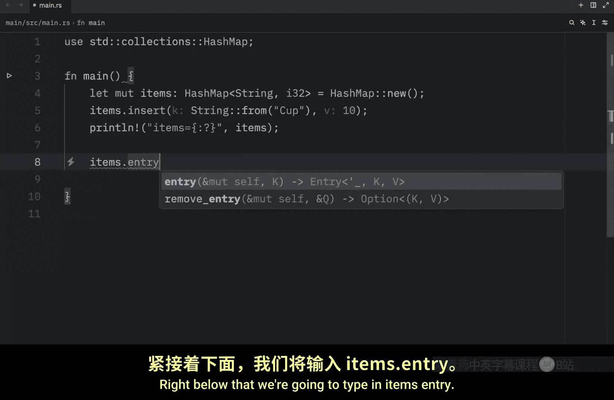
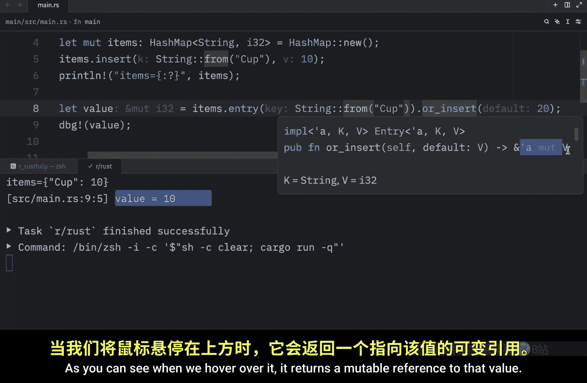
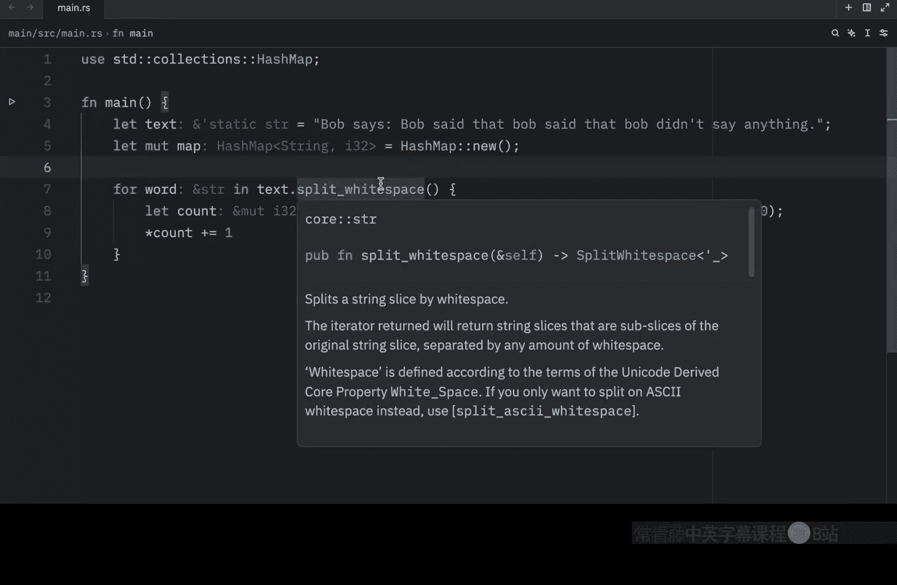
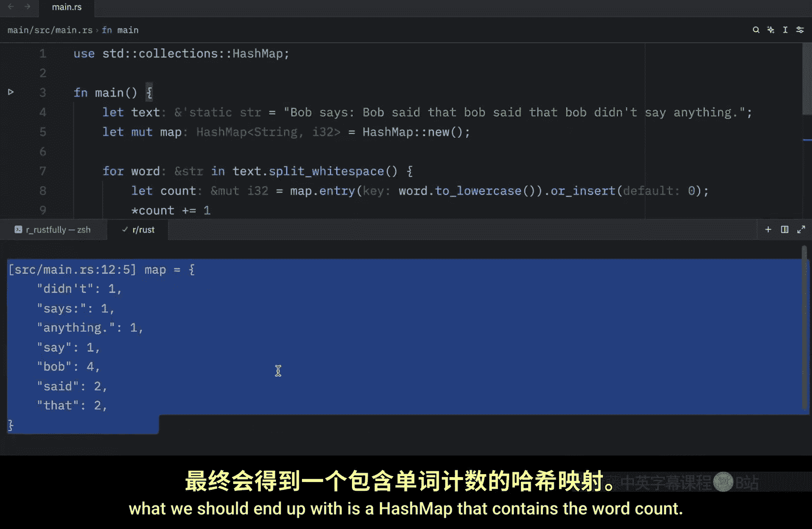
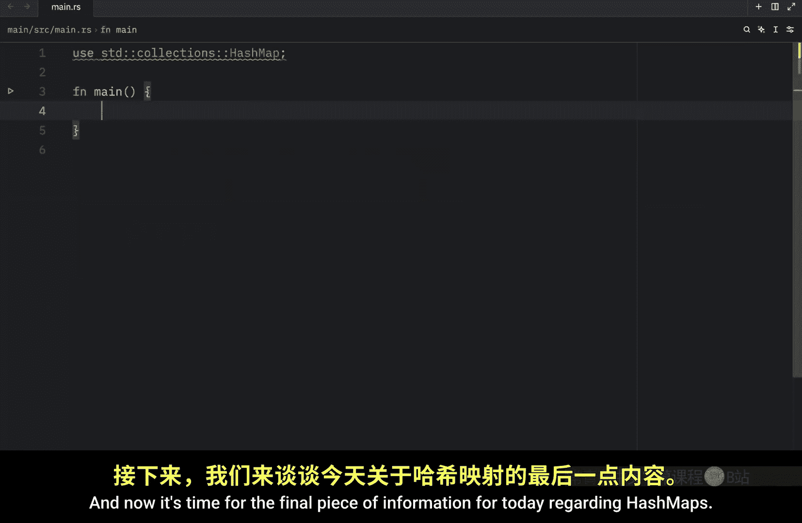
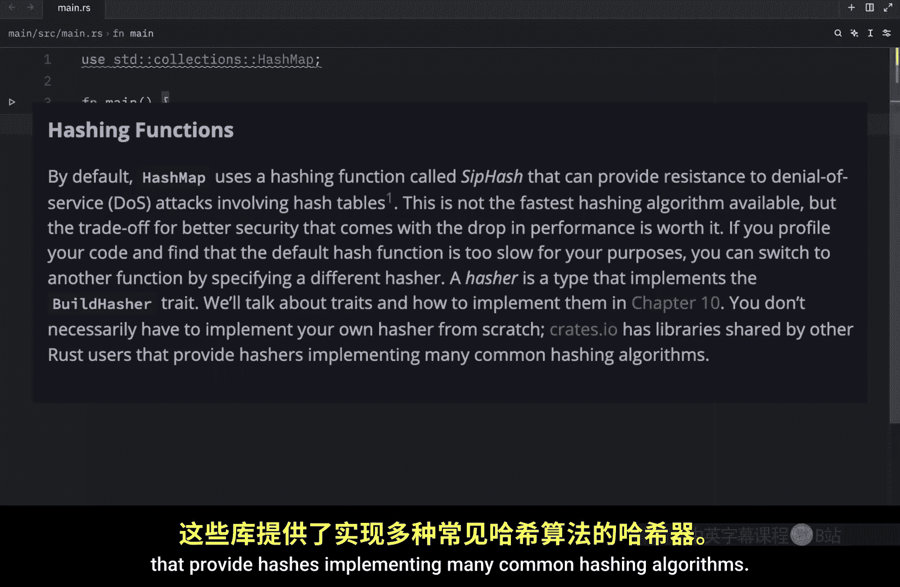

# Rustfully【中英⚡Rust 初学者教程（2025）｜Rust for beginners (2025)】 p57 P57 Rust中的哈希映射很酷 -BV1eyAkzPEhj_p57-

Previously， we learned how to create a hash map in rust。 Now it's time to learn how to update one。

 First of all， it's important to note that every key value pair in a hash mapap must have a unique key。

 you can't have two keys that are exactly the same because one will overrite the other and there are many ways to update the data in a hashm。

 Let's start this lesson with the first method。 So for this example。

 we will create some items which will be a hashmap of type string to I32 and that's going to equal hashm new immediately under that。

 we're going to insert an item。 The key is going to be a string from a cup and the I32 is going to be the value of the cup。

 which can be dollars， euros， whatever you want， it's the value of the cup right now when we debug this and insert our items。

 what we're going to get as an output is the cup and its value。 And since I want to use。

Again， I'm going to turn this into a reference。And then type inite。

 insertst string from cup with a value of 25 and once again I'm going to debug the items and this time you're going to notice that we're still going to have one item or one key value pair Since we cannot have duplicate keys in our hash mapap this insertion will completely override the previous key value pair but what if you want to add a key value pair only if a key isn't already present well hash maps have a special API for this called entry which takes the key you want to check for as a parameter so for this example I'm going to remove all of that use my special debug snippet and insert the items because for the next few examples I'm going to prefer to have this all on one line right below that we're going to type in items entry and here we're going to find the key which is going to be the cup and we're going to type in or insert 20。

Here we're only going to insert 20 if the key doesn't exist and I'm going to duplicate this and insert a spoon then I'm going to print the result using this print line and when we run it what we should end up with is a hashmap that contains a cup with the value of 10 and a spoon with the value of 20 since cup already exists we did not update the value to20 but right below that since spoon was not present in the hashmap we were able to insert it with the value of 20 so the or insert method on entry returns a mutable reference to the value for the corresponding key if it exists otherwise it inserts the provided value and returns a mutable reference to that so right here for example nothing really happened when we tried to insert a new value into cup because it already existed。

But this actually returns something so we can type in let value equal all of this and what it's going to return to us is a mutable reference to the value that cup contains。

 which means we can also use that value。 So here I'm going to debug and print the value。

And when we run this， we're going to get 10 as an output because that's what the or insert method returns。

 as you can see when we hover over it。It returns a mutable reference to that value。

 And even if we were to insert spoon here and rerun our program。

 we would end up with the value of the spoon because once again。

 or insert returns a mutable reference to the value。

 Another common use case for hash maps is to look up a keys value and update it based on the old value。

 So here we're going to create some text and it's going to equal Bob says。

That Bob said that。 Bob said that Bob。Bob， Bob didn't say anything so we have a lot of nonsense there。

 Next， let's create our hash map and make that mutable that's going to equal a new hash map and directly under it we're going to type in forward word in text dot split whitespace。

And then inside will'll type in let counts。Equal map dot entry。

And we're going to insert the word to lowercase， or insert。

Z and finally， we're going to dereference the count that we grabbed and type in plus equals1。

 So just to explain what we're doing here real quick。

 we started off by creating some text that we want to analyze then we created a new hash mapap which is going to contain the information regarding this string the plan is to create a word counter。

 So next we created a follow loop to iterate through this string ignoring the white spaces。

 What split whitespace does is split a string slice by whitespace。

 So what we should get back is Bob says Bob said that all as separate words Now for each one of these words we're going to try to keep count of it。

 If the word doesn't exist， we're going to enter it into the dictionary with the default value of zero。

 and just to make this better for processing I wrote word2 lowercase because as you probably know keys our case sensitive So Bob with an uppercase B and Bob with a lowercase B are going to be treated as two different。

Ts and as you noticed I didn't really pay that much attention to what I wrote in the string so we have some bobs that are lowercase。

 but we still want this to be considered Bob and since this returns to us a mutable reference we can update that if it exists so we're going to increment it by one once we run into that word and obviously the last thing to do is to display the information with either debug or print or however you want to do that and now when we run this what we should end up with is a hash mapap that contains the word count。

Also， huge disclaimer。 This code was written for demonstration purposes only。

 There's much more to consider when you're creating a word counter。 For example。

 says and anything were counted as a word with the punctuation and that's not ideal because it will consider any other occurrence of anything or says as a completely different word。

 For example if I changed this to says you'll see that when we rerun this。

 we're going to have two keys that look similar， but that are completely different。

 says with the colon and says without the colon。 So this program is far from perfect。

 but what was important here was that I was able to show you how you could use map dot entry with or insert。

 and now it's time for the final piece of information for today regarding hash maps and this was taken directly from the rust docs by default。

 hashmap uses a hashing function called sip hassh that provides resistance to denial of。

Service attackst involving hash tables。 This is not the fastest hashing algorithm available。

 but the tradeoff for better security is generally worth the drop in performance。

 If you profile your code and find that the default hash function is too slow for your purposes。

 you can switch to another function by specifying a different hass。

 A hashcha is a type that implements the build hasher trait。

 and you don't necessarily have to implement your own hassher from scratch。

 Cates Io has libraries shared by other rust users that provide hashes implementing many common hashing algorithms。

