# Rustfully【中英⚡Rust 初学者教程（2025）｜Rust for beginners (2025)】 p58 P58 Rust中的哈希集合很棒 -BV1eyAkzPEhj_p58-

In today's video， we're going to learn about hashets。

 a data structure that allows us to store values without duplicates to use a hashet we must first import it from the standard library。

 So up here we're going to type in use standard library collections。

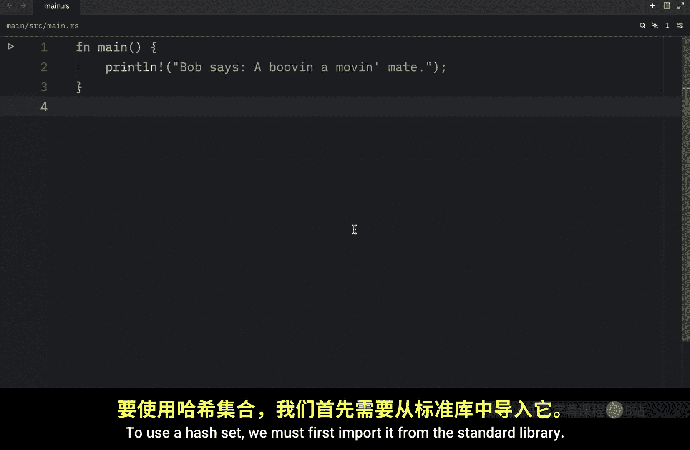

Hashet and just like with hash mapps， we can use the new function to create a new empty hashet。

 So here we'll type in let mutable numbers of type hashet， which will contain an I 32 equal a hashet。

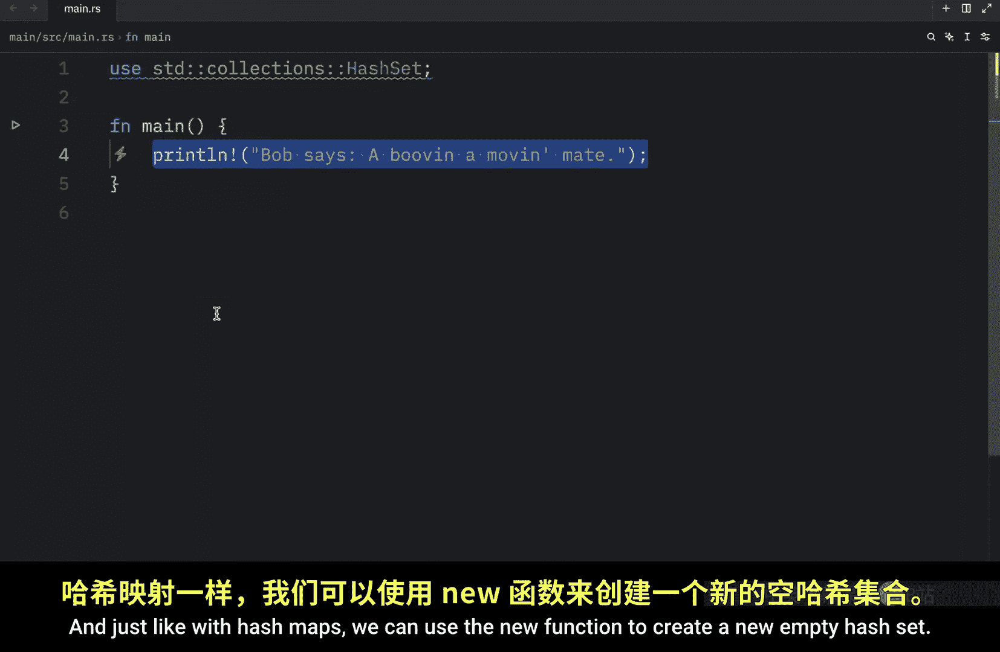

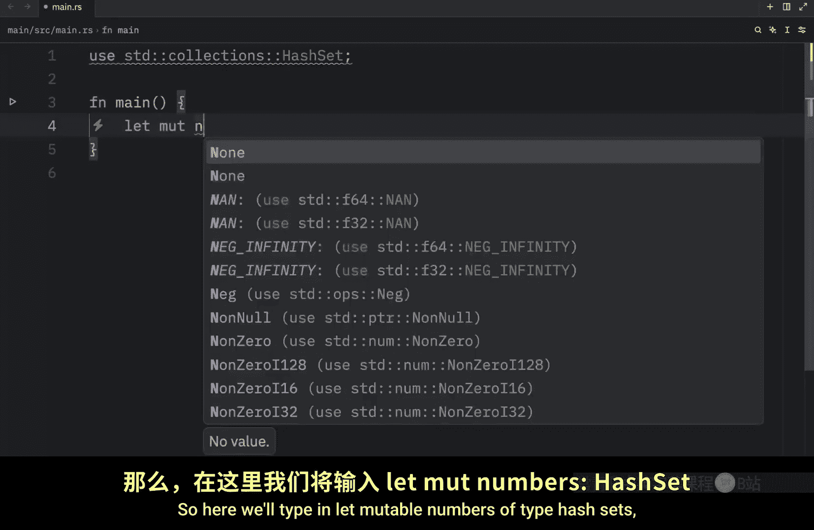

New， then we can insert elements into the hashet using the insert method。

 so let's type in numbers do insert and pass in a value such as 10 and I will duplicate that twice insert 20 and 10 again next I will print this set so that you can see what it contains so I'm going to type in numbers and run the program and what we will end up with as an output is that the numbers contain the values of 10 and 20 So just like with any other language sets cannot contain duplicates every value inside the set must be unique or will be unique because duplicates will be removed We can also create a hashet with values using the following function because what we did here is quite silly。

 especially if you already know which values you want to insert into your set from the start So we're going to remove all of that and type in letm numbers equal a hashet from 10。

20 and 10。 And the only reason I'm inserting duplicates here is to show you that all duplicates will eventually be removed when we use the set。

 So now when we run this， we should end up with the exact same result。

 Although rust is going to complain that we defined numbers to be mutable even if we did not use that feature next let's take a look at some of the common methods that we might want to use on our hashets So here I'm going to remove this printline or actually we're going to leave it there because we're going to use it quite a lot the only thing I'm going to change here really other values that we have inside here So I'm going to insert one22。

23 and three So once again， all the duplicates are going to be removed and since we're not going to do anything to the numbers we're going to remove the mutable keyword So the first method that we're going to cover is the contains method if at any point you want to check whether a value is present in a set you can use the contains method。

 So here we're going to debug whether the numbers。

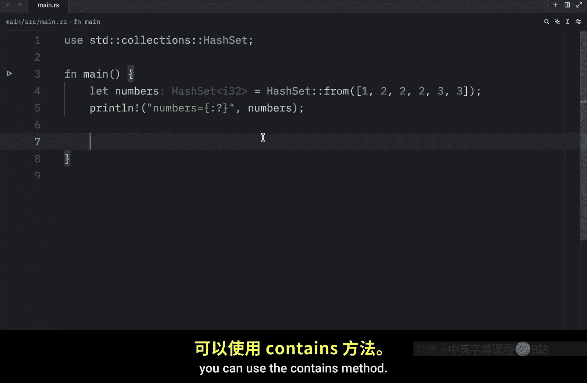

Contains and here we need to pass in a reference。 So for example。

 we can pass in the reference of two。 and when we run this。

 we're going to get true as an output because our set does contain the value of2。 if we pass in4。

 this will return false because it does not contain that value and the reason this requires a reference is to avoid unnecessary copying and to support flexible lookup via traits like borrow。

 but what do I mean by flexible lookup。 Well， in the previous lesson about hash mapps。

 you might recall me doing something a bit sneaky and just to demonstrate what I mean we're going to type in letmable users of type hashet。

 which will be a type string。

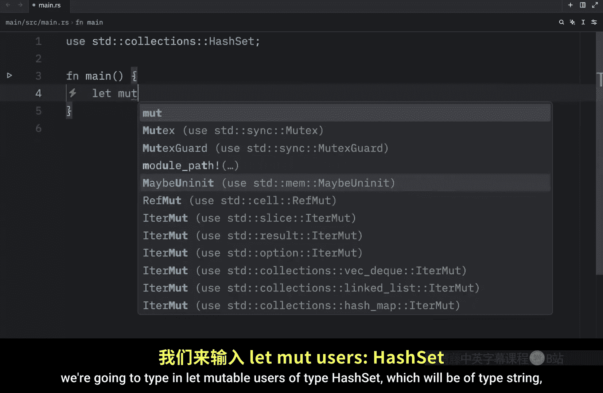

Equal a new hashet。 Then we can type in users dot insert and passing in a string from。

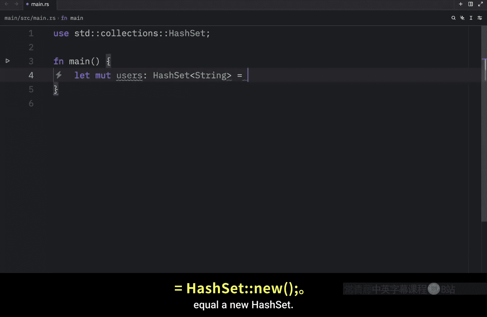

Bob and we're also going to pass in a string from James Next we're going to type in thebug uses contains and pass in Bob a string slice and this is going to work even if we defined our hashet to be of type string So that's what I mean by it being flexible because if we were to run this you'll see that it will work perfectly fine the users do in fact contain the string slice of Bob and this absolutely beats having to pass in a reference to the string from Bob which is a lot of typing and quite annoying Anyway。

 let's continue with some of the common hashet methods so let's create our mutable numbers once again which will equal a hashet from and this time we're going to pass in one2。

2，2，3，34 and5 so we have a lot of numbers this time and once again we're going to pass in the numbers so we can see it each time we run the program As you can see the numbers contain these values if at any point you want to remove an element from a hashet。

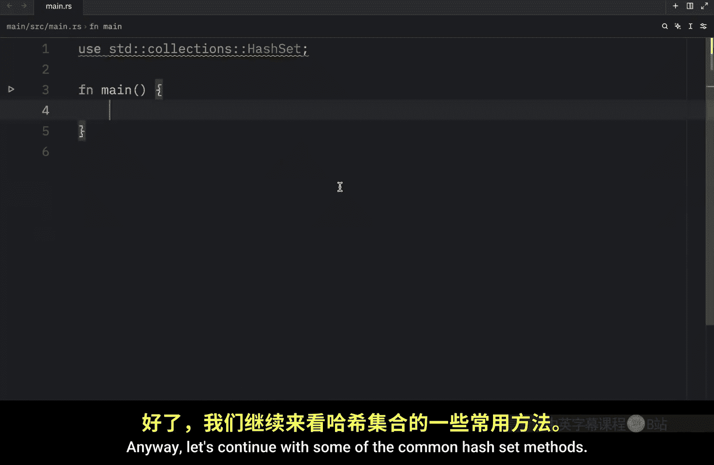

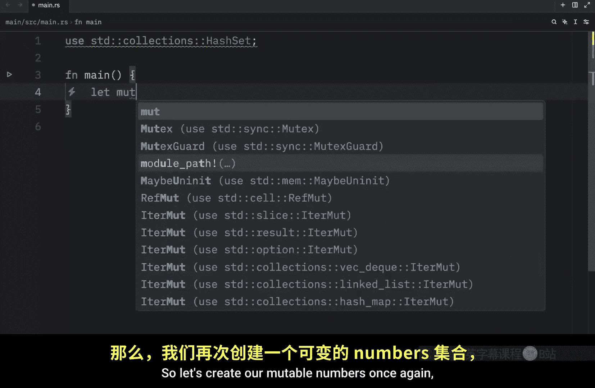

You can use the remove method so we'll type in numbers。

 remove and we need to pass in a reference such as the reference of two and this will remove two from the hashet but of course for us to see anything we need to display it in the console and now the second time we run it we won't have to inside our set and remove also returns a boolean informing us whether the value we try to remove was present or not so here what we're going to do to demonstrate that is create a variable called was present and we're going to change two to something obvious such as 99 and by obvious I mean something that obviously was not present then we're going to debug was present and what we're going to get as an output is that was present is false now if we were to pass in something such as one which does exist not only are we going to remove it but we're also going to get a boolean back that says that we did in fact remove it if you want to get the length of the hashet you can use。

The length method here we can debug Pass in the numbers dot length and when we run this what we should get as an output is that the length is5 This time length returns the length in terms of elements and you can verify that by hovering over the length method in your code editor the documentation will tell you that it returns the number of elements in the set you can also check whether a hashet is empty using the is empty method。

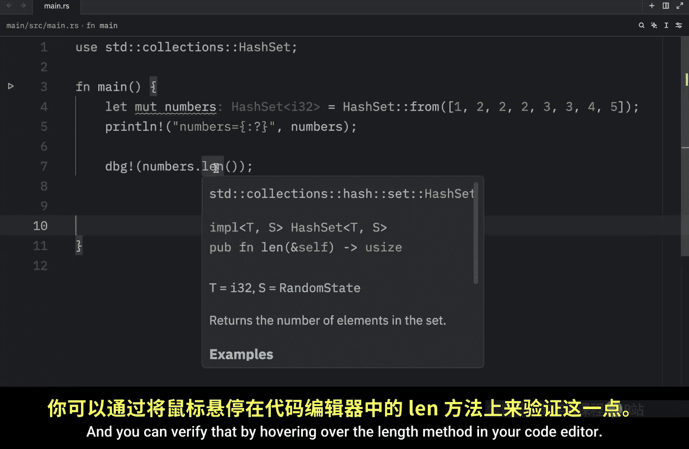

So here we can type in is empty and that's going to return to us a Boolean which in this case is going to return false to us because it's filled with elements now if you're tired of life and want to clear the hashet。

 you can use the clear method to remove all the elements from the hashet so here we can type in numbers dot clear and we're going to quickly debug it once again using my printline。

And as an output， we're going to have an empty set。

Another method that's very useful is the extent method。

 which allows us to repopulate our hashet using an iterable， for example。

 we can type in numbers do extentt and this time we can pass in one，2，3， and4。

And this is much more convenient than typing insert four times and I'm just going to copy and paste this and when we run it。

 we should notice that our set contains four elements now and finally now that we repopulated our hashet let's try to drain it and what drain does in rust is clear the hashet and return all the elements so to use it we're going to type in let drained of type vector which contains i32 equal numbers dot drain dot collect So after we drain the elements we want to put that into a vector so we can visualize that data much more easily and with that we can debug and pass in drained and finally I'm going to print what's remaining of our set So now when we run this we're going to get a syntax error in Python because I use the wrong shortcut。

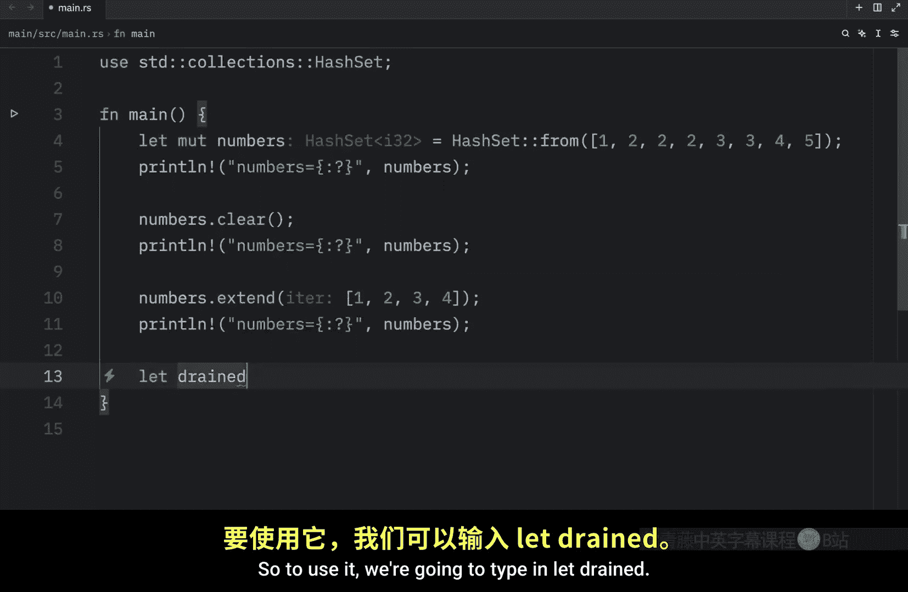

But if we run it in rust， what we're going to end up with is that drain now contains these elements in the form of a vector。

 So we were able to collect those。 And what's remaining of the set is nothing。

 because we drained everything from it。 So now it's empty once again。 Moving on。

 let's look at how we can iterate over values using the regular full loop syntax。😊。

So here I'm going to create some users， which will equal a hashet from the following users。 Bob。

 James and Sandra。 Anyway， now that we have our users， we can type in for users in users and。

We can printline， hello。Placeholder exclamation mark and pass in the user。

 or I don't know why I keep on doing that。 I can just pass in the user directly。

 And when we run this， we're going to get hello Sandra， hello James and hello Bob。

 although you should never rely on the order， sets can't guarantee anything when it comes to the order elements are stored Each run can yield different results in terms of order。

 So if we were to run this again， This time we have Bob that gets greeted first。

 So that's one thing you need to know sets can guarantee order。 And finally。

 this wouldn't be a proper hashet video if we didn't cover the common set operations。

 So for this example， we're going to create Hs1 which will equal a hashet。From the following values。

 Fmo。That's interesting。 What are you doing， What what are you inferring， This is incredible。

 That is the longest type hint I've ever seen in my life。 Anyway， we're going to insert 1， 2 and 3。

 and this is the inlay type hint I was hoping for。 Then we're going to duplicate this type in Hs 2 in Pass in 2。

3 and 4。 and the first operation we're going to look at is how we can combine sets using the union method。

 So let the result。😊。

Of type hashet that contains a reference to an I 32。Equal HS1 dot union。

And that takes other which will be a reference to Hs2 dot collect then we can debug and print the result and when we run this what we should get back is the union of these two sets。

 next， let's look at how we can find what two sets have in common and in programming we call this the intersection which also takes a reference to the second sets which will be Hs2 do collect And now when we run this we should notice that both sets contained three and two that is the intersection of these two sets Next let's find the difference between these two sets and we can get the difference of the two sets using the difference method So here we'll type in difference pass in a reference to Hs2 and once again callcol and when we run this what we should get as an output is one and one thing important to remember when you are using the difference method is that order matters here because right now we subtracted Hs2 from Hs1。

So these two elements were taken away from HS1， leaving us with the value of1。

 if we did it the other way around。We would end up with the value of4 because these two were subtracted from this。

 so all we would have left is4 and finally let's find out what the unique elements are in these two hashets and in programming we call this the symmetric difference。

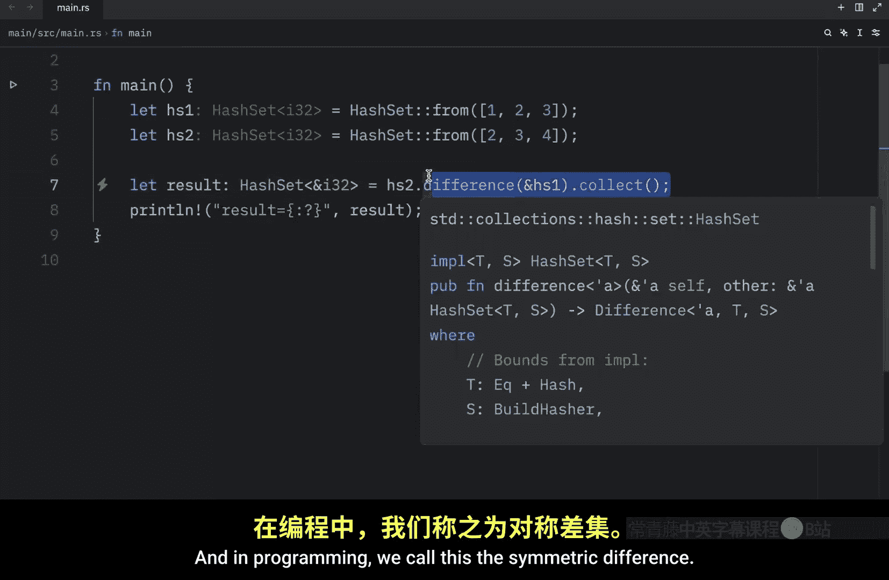

So he will type in symmetric difference， pass in HS2， and then call collect。And when we run this。

 we're going to notice that the result is going to be nothing because I looked for the difference between HS 2 and HS2。

 which is quite silly。 So let's change that to HS1。 rerun this。

And what we're going to get as a result is one and4。

 These are the truly unique elements that we have in these two sets。

 and what I mean by unique is that both of these sets do not share these two values。

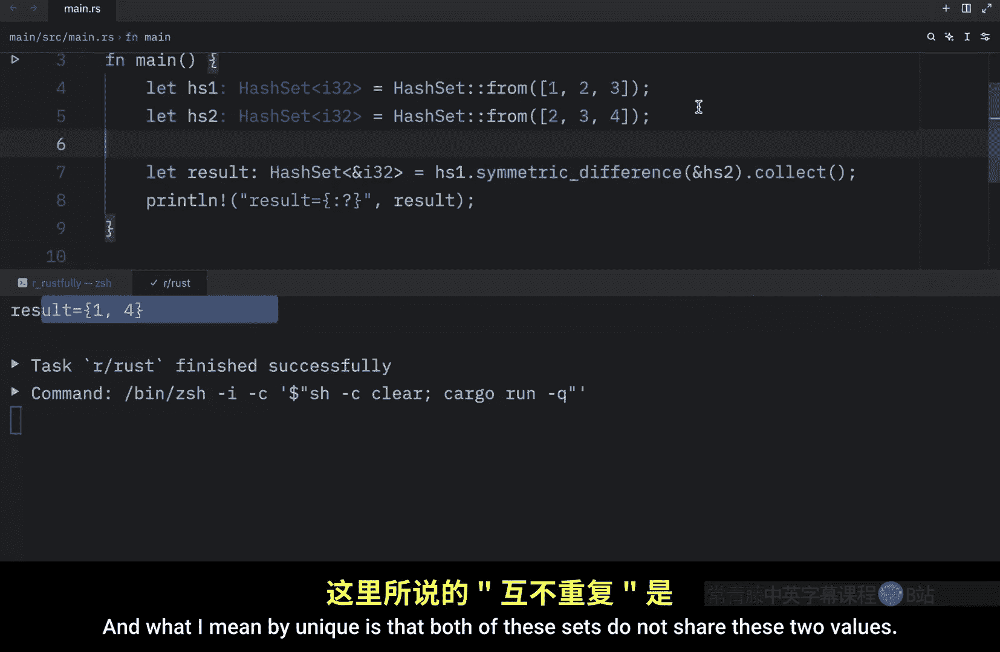