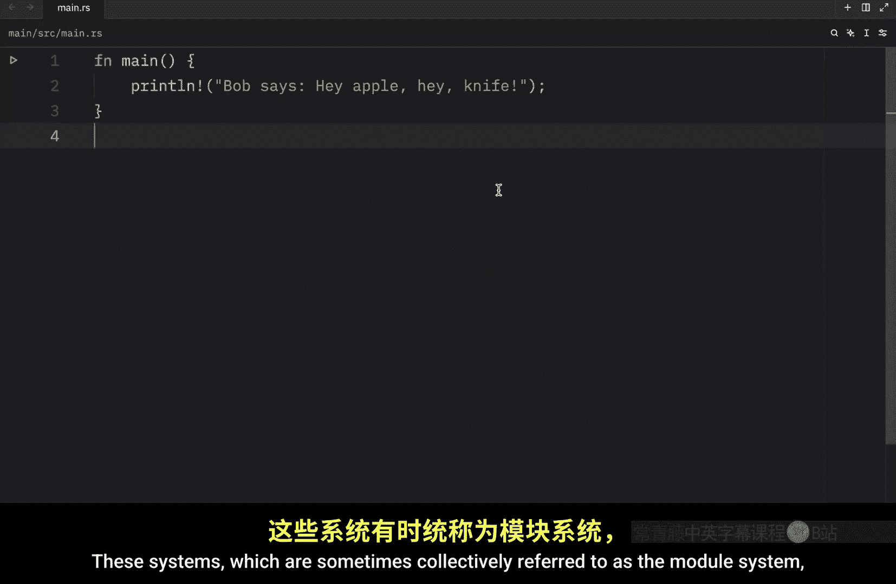
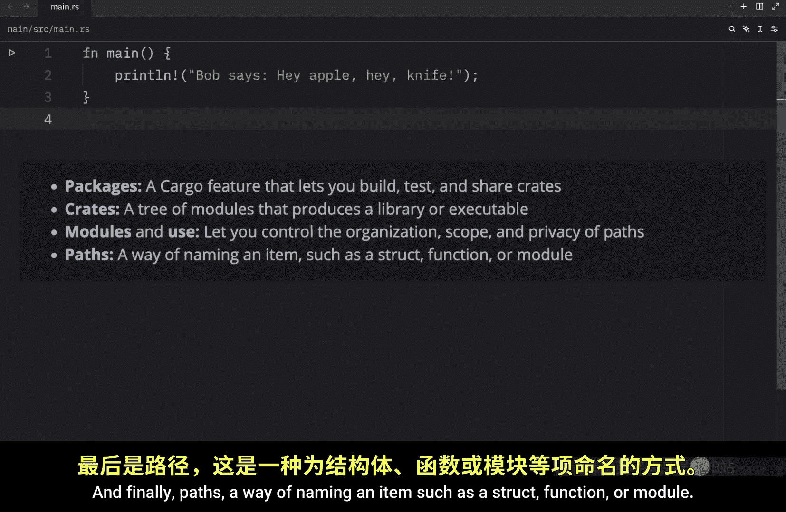
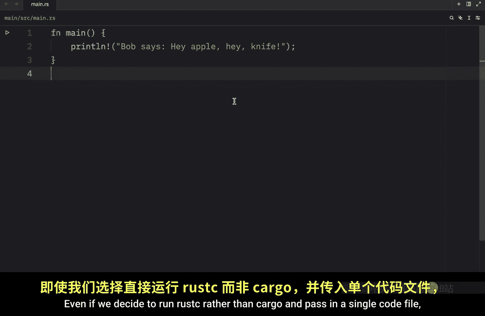
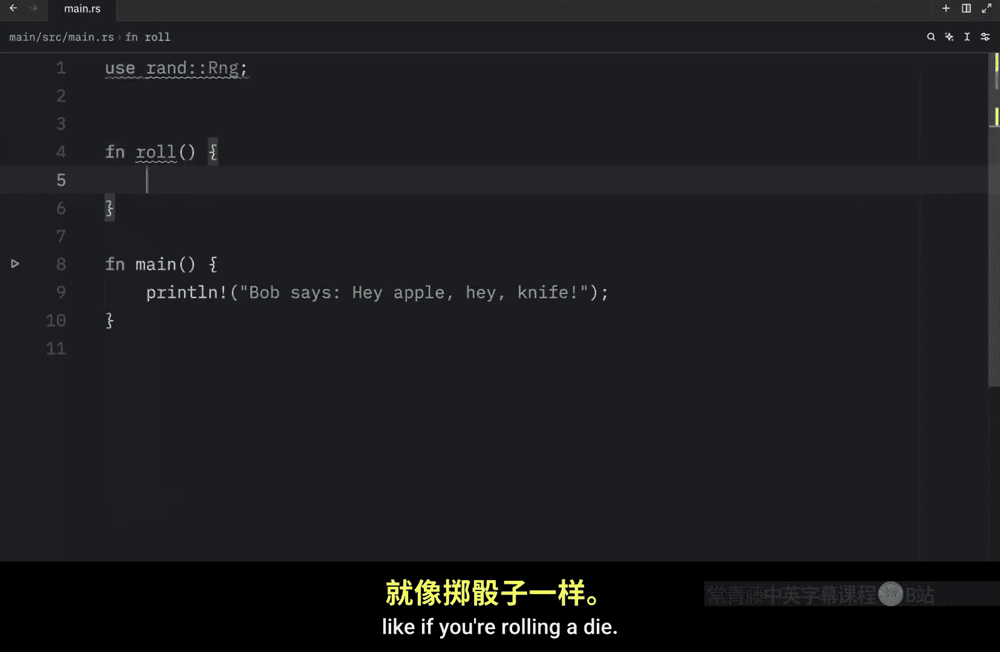
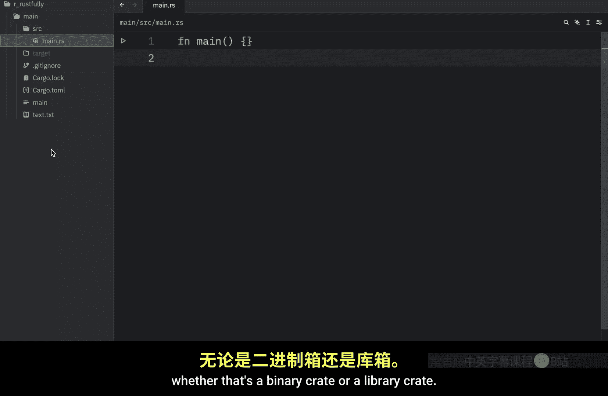
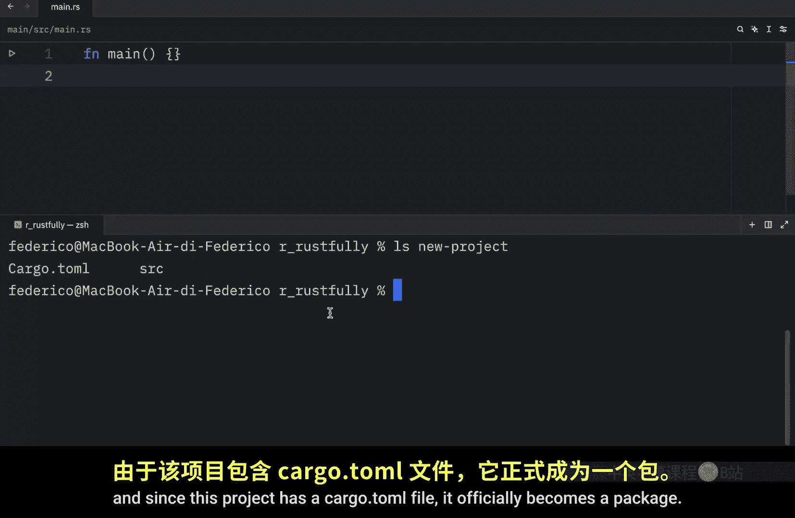
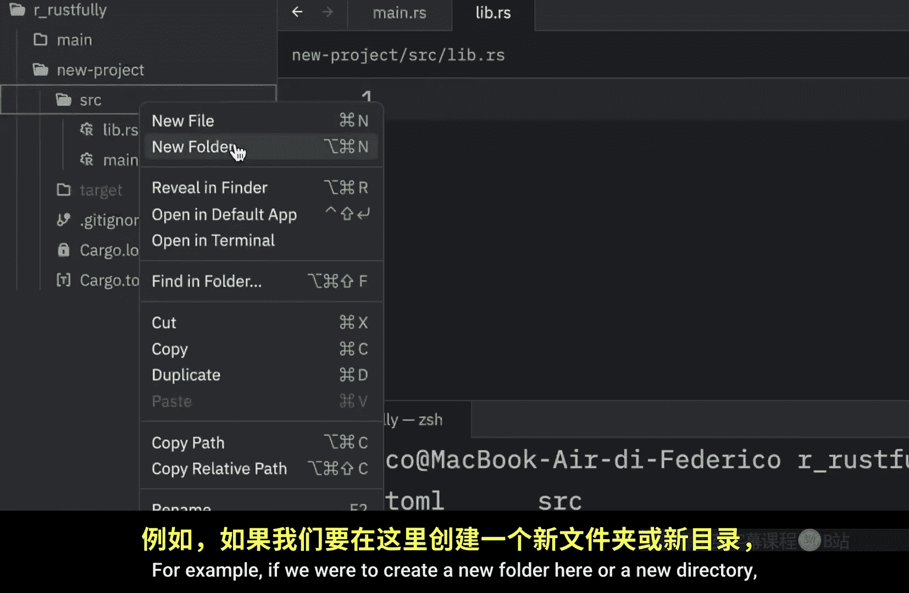
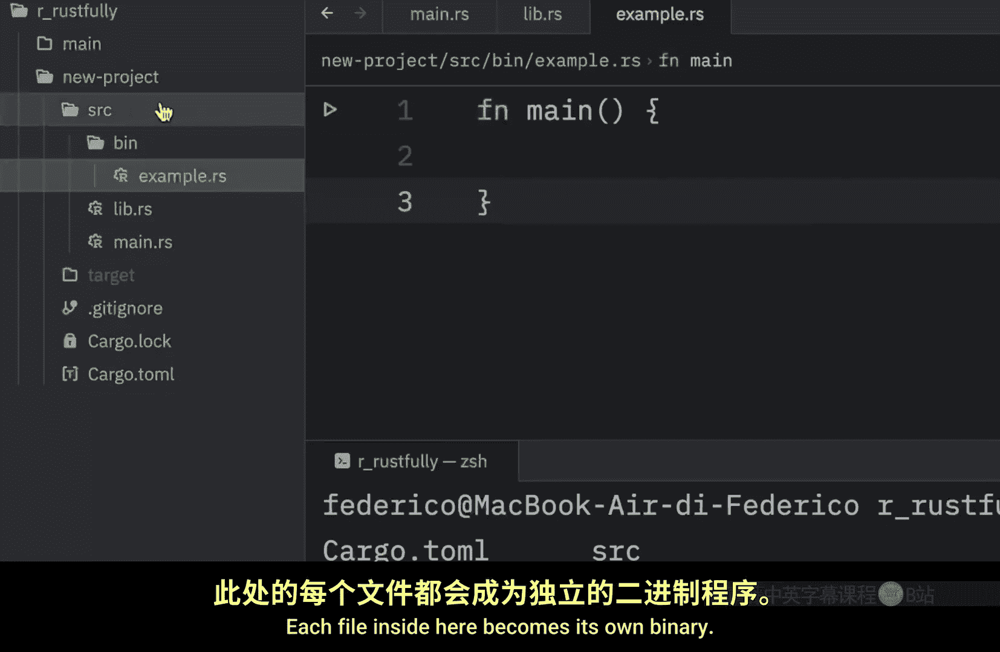
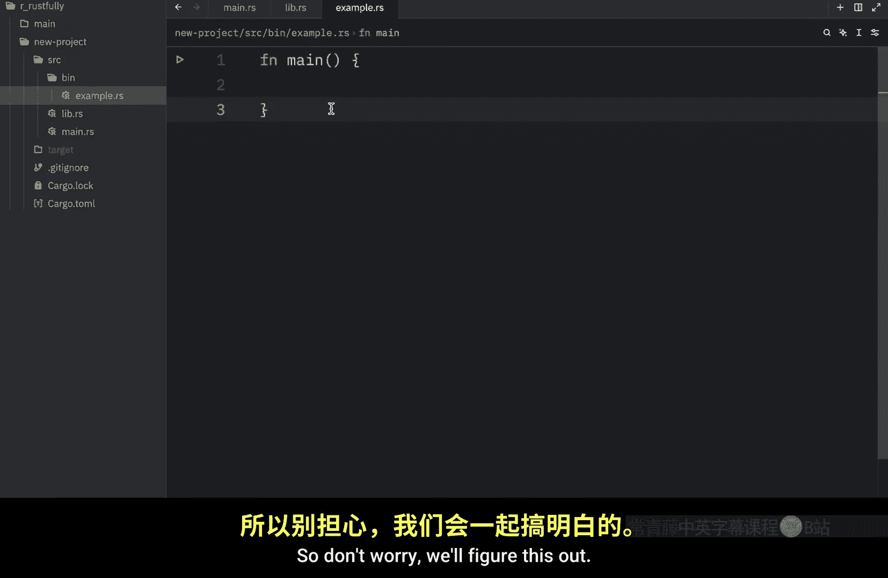

# Rustfully【中英⚡Rust 初学者教程（2025）｜Rust for beginners (2025)】 p59 P59 Rust中的包和crate详解 -BV1eyAkzPEhj_p59-

Before we start building bigger projects in rustt， it's worth learning how we can better organize our code with packages。

 creates and modules。 I mean， we could also just create a single file that contains thousands of lines of code but with experience you'll learn pretty quickly how unmanageable that becomes everything we've written so far has been in one module in a single file ideally though as our projects grow in size。

 we should split it into multiple modules and multiple files to better organize our code by grouping related functionality together we're also going to discuss encapsulating implementation details which will let us reuse code at a higher level In other words。

 once we've implemented an operation Other code will be able to call our code via its public interface without having to know how the implementation works Ru has several features that allows us to manage our codes organization including which details are exposed which details are private and what names are。

In each scope in our programs， these systems， which are sometimes collectively referred to as the module system include packages。

 a cargo feature that lets you build， test and share crates Cates。

 a truth modules that produce a library or executable modules and use let you control the organization scope and privacy of paths and finally paths a way of naming an item such as astruct function or module so that's what we're going to learn about in the next few videos First let's talk about packages and crates a crate is the smallest amount of code that the rust compiler considers at a time。

Even if we decide to run rust C rather than cargo and pass in a single code file。

 the compiler considers that file to be a crate， for example。

 we can try to compile our code by typing in rust C and typing in source/ma dot Rs。

This is going to create an executable， as you can see right here， right above text。

 we have main and to run that we just type in dot/lash main。😊。

And with that， we successfully ran the code also crates can contain modules and the modules may be defined in other files that get compiled with the crate as we'll soon see Now a crate can come in one of two forms a binary crate or a library crate binary crates are programs that can be compiled into an executable that you can run such as a command line or a server Each crate must have a function called main that defines what happens when the executable runs all the crates we've created so far have been binary crates library crates on the other hand don't have a main function and don't compiled to an executable instead they define functionality intended to be shed with multiple projects One example of a library crate is the ran crate which we use to generate random numbers so to add this crate to our project we're going to type in cargo add Rand and if it's there it's going。

You do it instantly otherwise it's going to probably load for a bit。

 but once we have that we can use it。 we can type and use random Rng then we could create a function called rule which generates a random rule like if you're rolling a die so here will type in let mutable Rng equal random Rng and this creates a number generator and we can let the rule equal Rng do random range and pass in one26 with6 being inclusive and all we're going to do here is print line that you rolled this role Now to run this code all we have to do is roll rule and role and the next time we run this we should get the rule back and in this case we rolled three3s At first I thought it was a bug but it was just very lucky as you can see the second time I rolled it I got different numbers back so the ran cr provides functionality that generates random numbers note that most of the time when rust stations say create。

They mean library crate is used interchangeably with the general programming concept of a library。

 The crate root is a source file that the rust compiler starts from and makes up the root module of the crate will dive more into that when we get to the section that covers modules。

 but let's talk a bit about packages next。 a package is a bundle of one or more crates that provide a set of functionality。

 Every package contains a cargo do Tamil file that tells rust how to build those crates Now a package can contain as many binary crates as you like but only one library crate at most every package must contain at least one crate。

 whether that's a binary crate or a library crate Here's what happens when we create a new package with cargo and we'll pass in a project name called New project。

Then we're going to type in Ls new project to list all the files and directories that are present in this project and at this point we only have a cargo。

tmel and a source file and since this project has a cargotel file it officially becomes a package we can even navigate to this new project so we can see it visually as you can see we have the cargo the gitigngno which doesn't really matter in this context and the source directory and inside the source directory you'll see a main do Rs file this file is the starting point of a binary crate and it's named after the package If there's a file called Lib。

 Rs in the source directory cargo is going to treat this as a library crate and a package can contain both of these it can also have multiple binary crates by placing files in the source bindirecty For example。

 if we were to create a new folder here or a new directory we could type in bin。

Inside there we could add some other binaries such as example。

 Rs Each file inside here becomes its own binary Now I know we covered a lot of terminology in today's video and that it can sound quite confusing at first but I promise that with time it will make more and more sense It just takes a bit of getting used to and coming from Python I'm going to tell you that I'm also struggling with it so don't worry we'll figure this out。

