# Rustfully【中英⚡Rust 初学者教程（2025）｜Rust for beginners (2025)】 p60 P60 Rust中的模块非常出色 -BV1eyAkzPEhj_p60-

In this video， we will start learning about modules and other parts of the module system in rust to better understand how modules work。

 We're going to start off by creating a mini projectject that uses them。

 This project will simulate a bank that allows you to create an account deposit money With money and announce important messages to your customers and to get started we're going to create our very first module。

 So inside the source we're going to create a new file called bank do Rs。

 Then we're going to create a directory for the submods of bank。

 and we're going to call this bank and it doesn't have to exactly match the name of banks but I recommend that you do this because it becomes far more complicated to link these two together if you name it something else。

 but we will cover that in a future lesson。 For now just make sure both of these have the exact same name so that bank Rs knows that it can find more functionality inside bank inside here we're going to create two files。

acccounts Rs and another one called transactions Rs So these are submods that belong to bank。

 Rs inside the account submodule， we're going to create a publicstruct which will be called account and this is going to contain a public owner of type string and a public balance of type I32 and since we also want to be able to easily debug this we're going to add a trait so we're going to derive the debug trait next let's create the implementation for thisstruct and inside we're going to create a public function called new which is going to take an owner。

 which is the owner of the account and that's going to be of type string slice and it will return self then inside we can just pass in the account with the owner which will be a string from the owner then we will include the balance which will initially be set to0 Now we define this method to be public so that other modules can see it and。

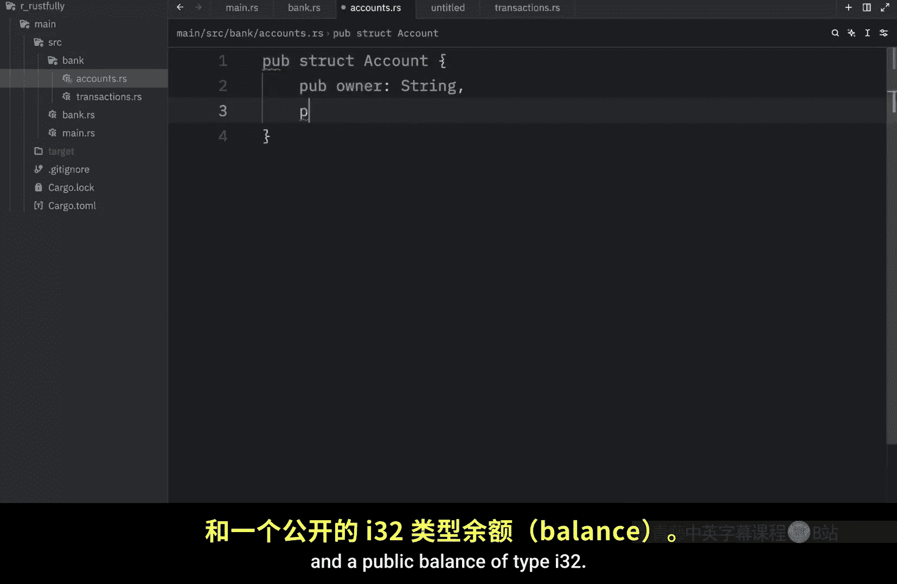

Use it。 In other words， we are exposing it to the world。 If you try removing this keyword。

 you're going to notice that later on new will not work outside of this module。

 but I'll show you that in just a moment， because next we want to go to transactions。

 and inside here， we want to import the functionality from accounts。

 Since we want to use that inside here。 And to do that。

 we need to use the use keyword followed by crate and the create part specifies that this is an absolute path。

 which means you can include it in basically any file and it will work the same way。 So use create。

Bank accounts。 And we want to use the account part。

 And since we're focusing more on the module aspect of the language。

 I'm just going to paste in the code。 there's no point in writing all of this out。

 but I will explain what it does。 So once again， we created some public functions that we want to expose to the world。

 something that we want to be public throughout the program。

 and these two functions are deposit and withdraw。 The first one allows us to deposit some money into an account。

 and then it prints the current balance。 The second one allows us to withdraw money from an account。

 And it obviously checks whether the user has enough funds before tries to withdraw the funds。

 Otherwise， it withdraws the funds because the user does have enough money。 But once again。

 it's important to note that we're using the public keyword。

 because we want to be able to use both of these outside of this file。

 So that's how we can define some functionality in submods。

 But now's time we go back to our bank module。 And here you can declare what submods and functionality you want to be public to。

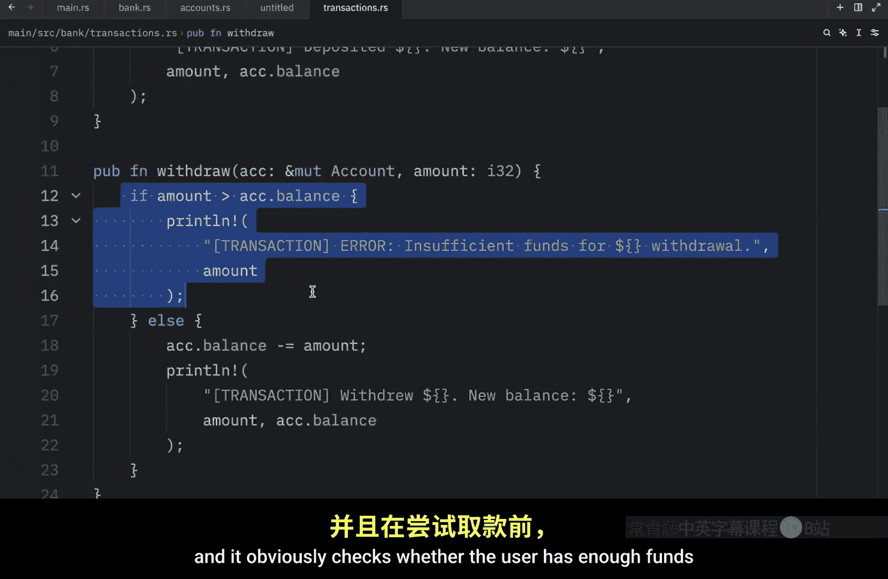

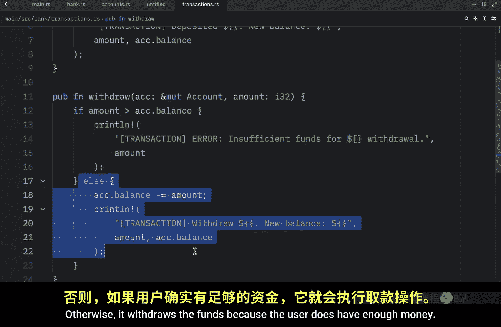

Program， since we created a directory called Bank， it will default to looking inside here for the submods that we just created。

 and this is all because we named our module bank Rs。 So once again。

 it's not a coincidence that this directory is called bank。

 I did it on purpose because it links these two together quite nicely but inside here we need to type in public module accounts and public module transactions。

 And this includes the functionality that we created in the submods into the bank module so that we can use it in main do Rs。

 And you're not required to create submods， you could have created all the functionality directly in bank Rs。

 but I wanted to show you that in case you want to further split the functionality。

 you could do that with submods。 But inside here I am going to keep one function。

 which is going to be called announce which will allow us to announce something and once again。

 this is public because we want to be able to use it outside of this file。 but now that we。

Have all this functionality。 Let's try using it in main dot Rs。

 So here to use the functionality from bank， we need to type in mod bank because we're using the functionality from that module。

 Then inside here， we can create a mutable account。

 and that's going to equal a bank from accounts account and new and the owner is going to be Bob。

 Then we can print that we created that account。 Now to use some functionality from the module。

 all we have to do is type in bank transactions。 and deposit and inside here。

 we can pass in the account， which is just called account。 So we will leave it at that。

 and we will deposit 150 currency。 we can pretend that these are euros。 So we deposited 150s。 Next。

 I'm going to duplicate this and withdraw。

20 euros。 then I just want to print the final state of our account and finally to show you that we can use functionality directly from the bank module。

 I'm going to refer to bank and use the announce method or the announce function and type in that there is some maintenance。

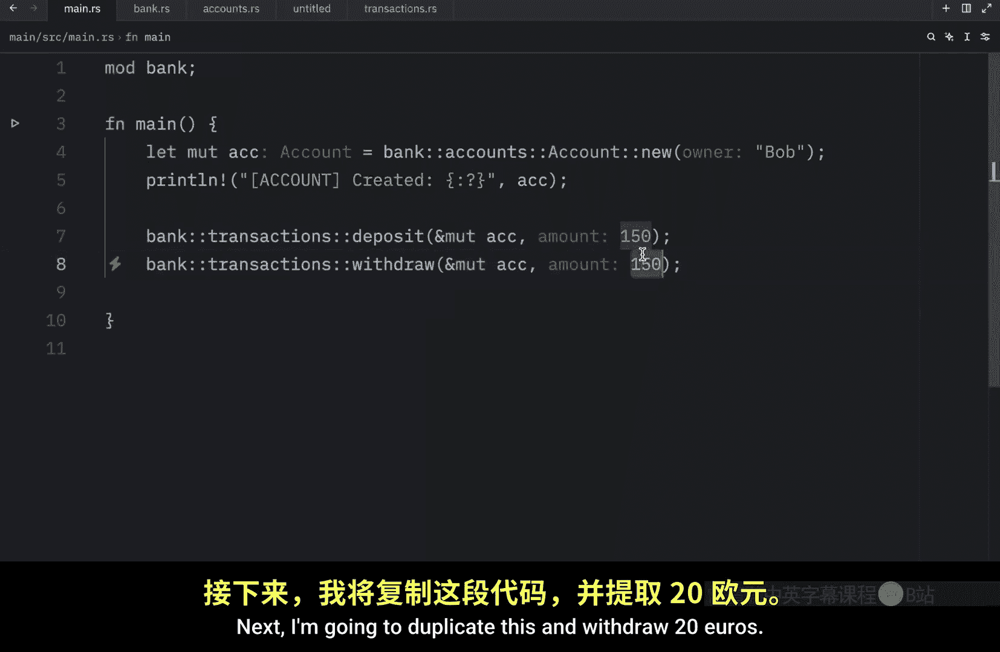

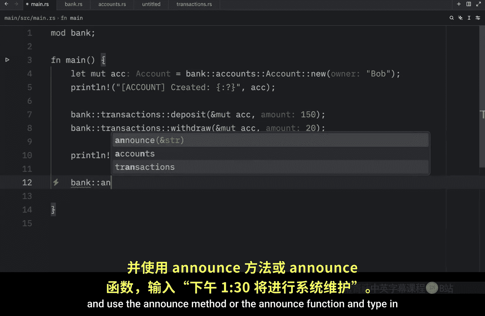

At 130 PMm。 Now， when we run this， we should get the following messages first that we created an account with the owner being said to Bob then that we deposited $150。

 I guess the currency was in dollars after all， then Bob with Dr 20 and the new balance is now 130 and the final state of our account for today is that Bob is still the owner and the balance is now 130。

 then we also had a bank announcement that there was going to be some maintenance at 130 pm。

 But now let's go back to the module and this time I'm going to remove the public part So you can see what happens when I do that。

 As soon as I remove the public part and I go to Maine。

 you'll notice that we can no longer use announced because it is now treated as private。

 all the functionality you create is considered to be private by default unless you specify to be public。

 So if we want our main do R S file to see this function we need to make it public。

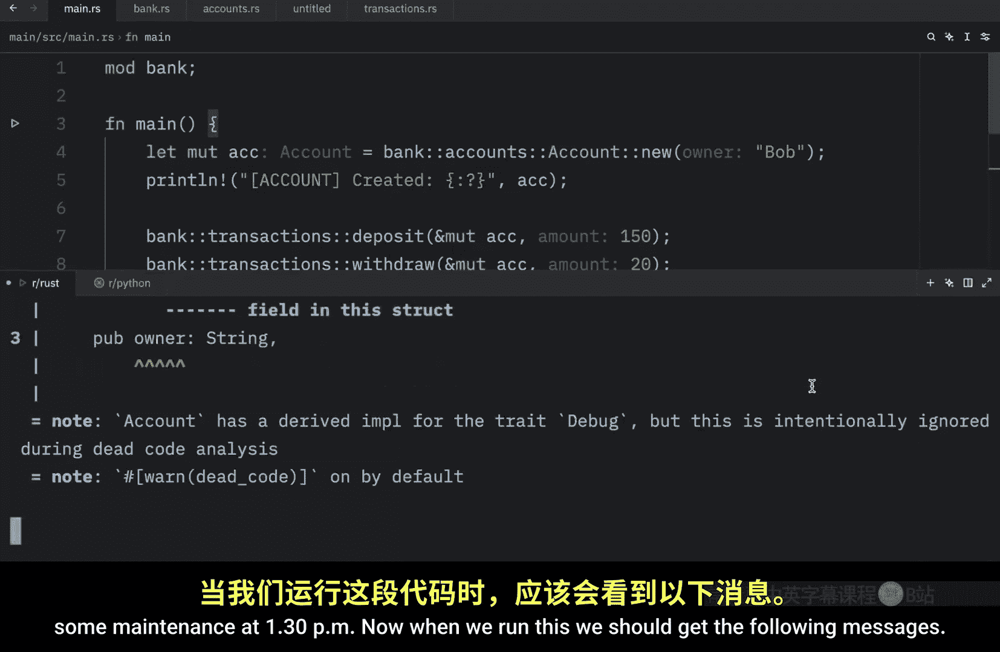

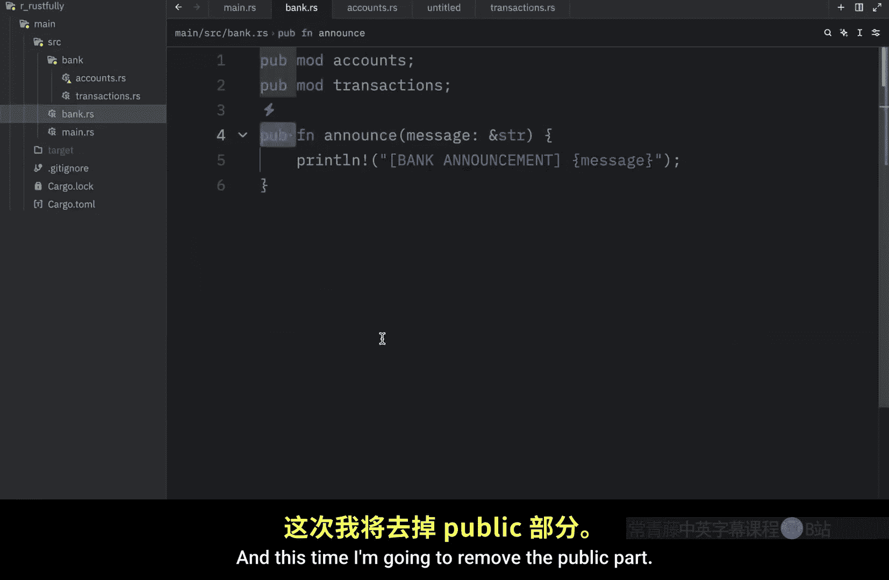

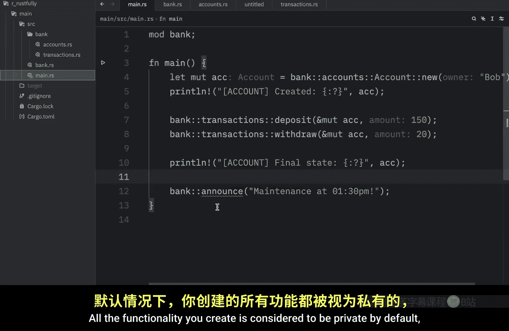

And the same thing goes for the submods， if we were to remove public。

 main dot Rrs would not be able to see that because transactions is now private。

 so we need to make sure that's public and if we go away level deeper and tap on transactions and we remove public from the deposit function。

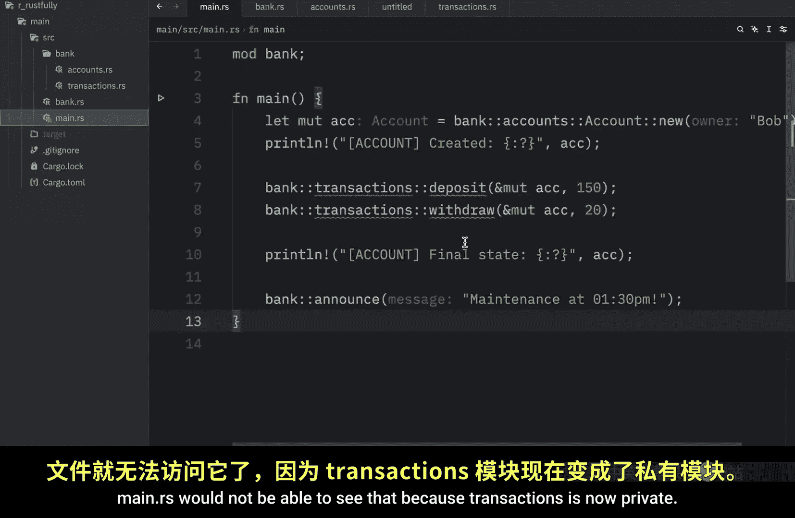

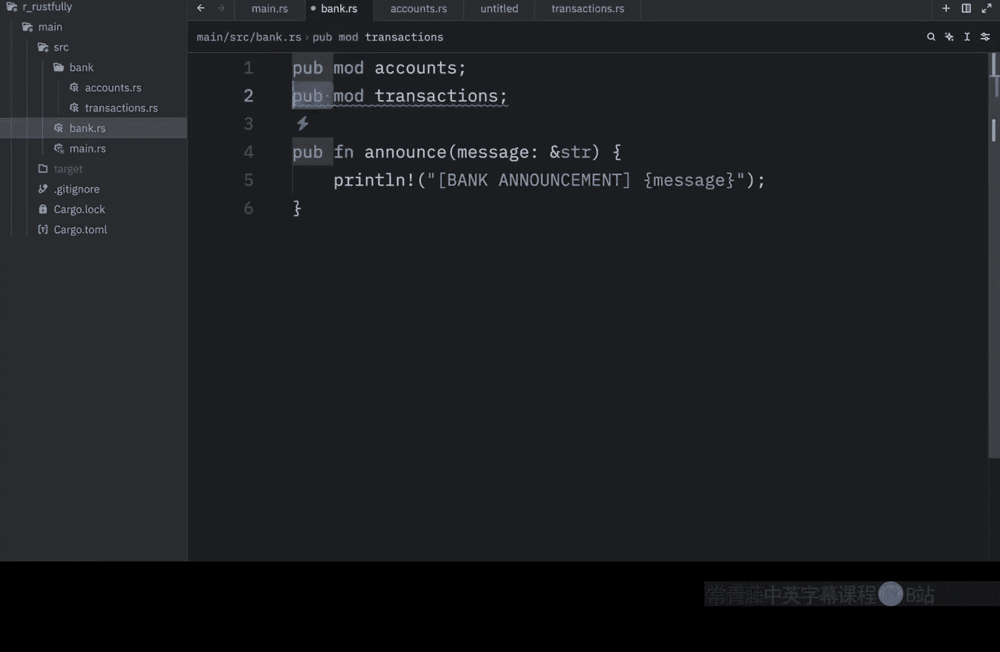

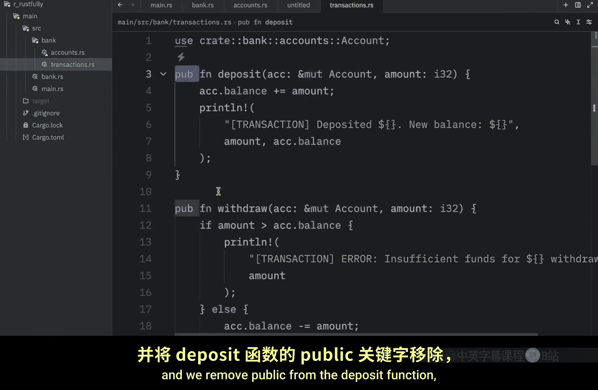

We're still going to get an error in main do Rs because this is no longer public。

 this can only be used inside the transactions file。

 So if we want to be able to access this outside of that file。

 we need to make this public and you do not type in public to make something public。

 you just type in pubub and there's only one last thing I want to cover today and that is that once again。

 if you were to name this anything else it would be much harder to link bank with the bank directory For example。

 let's rename this to extra as soon as we do that Ru is going to have a much harder time finding extra。

 we're going to have to use some special syntax to locate it。

 we can't just type in public module accounts because Rust will have no idea where this is。

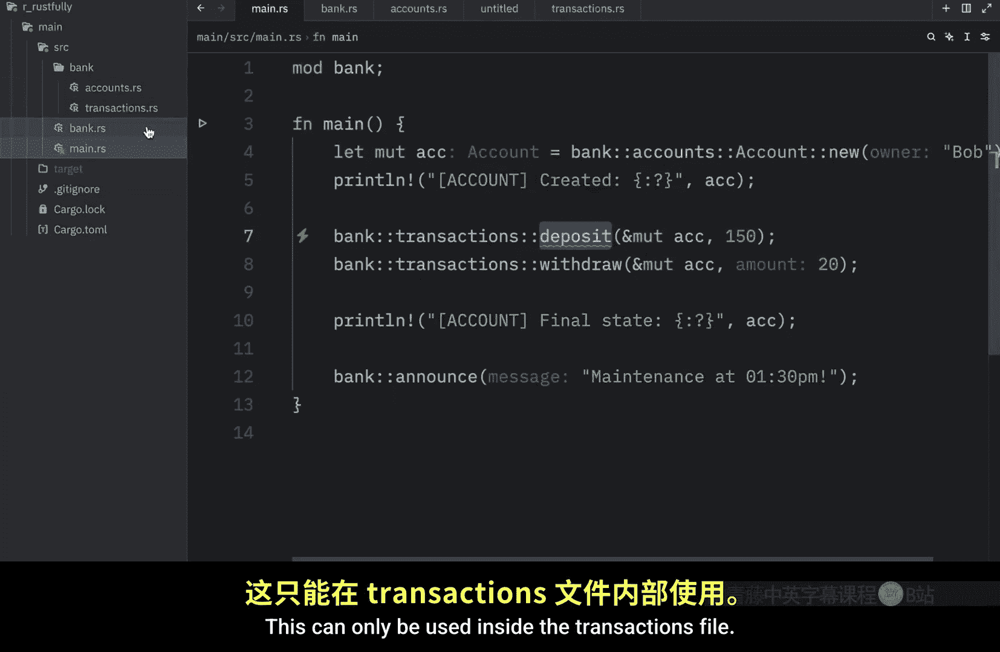

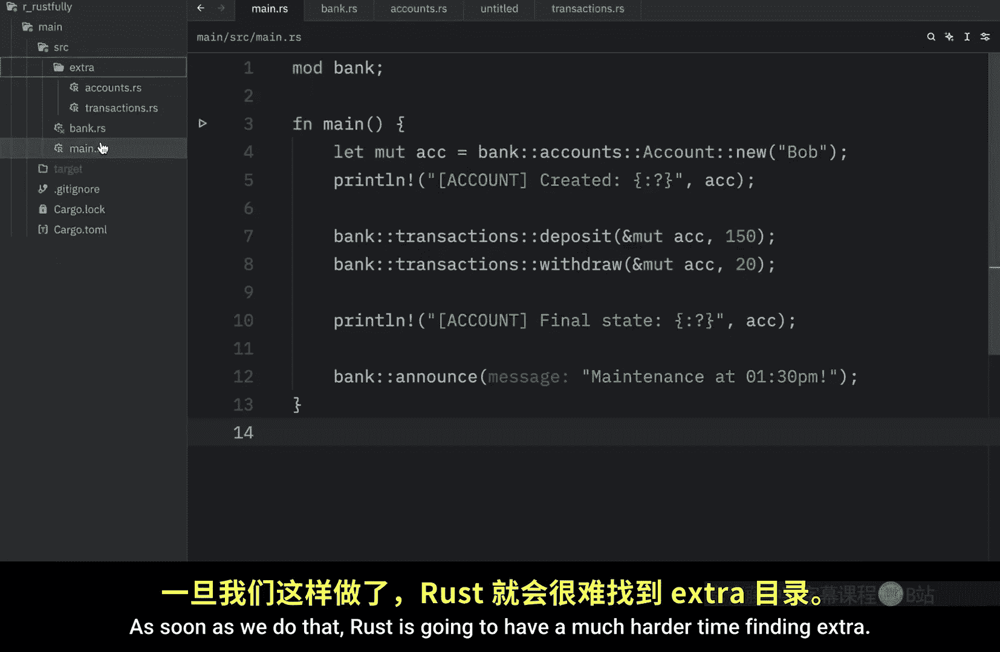

But if we were to name this the exact same name as the module， so we type in bank。

 Rus is able to put two and two together and understand that the bank directory belongs to bank so it can easily find these submods。

 but once again you're not required to name this bank and I will teach you later on how you can refer to it if you name it something such as extra。

