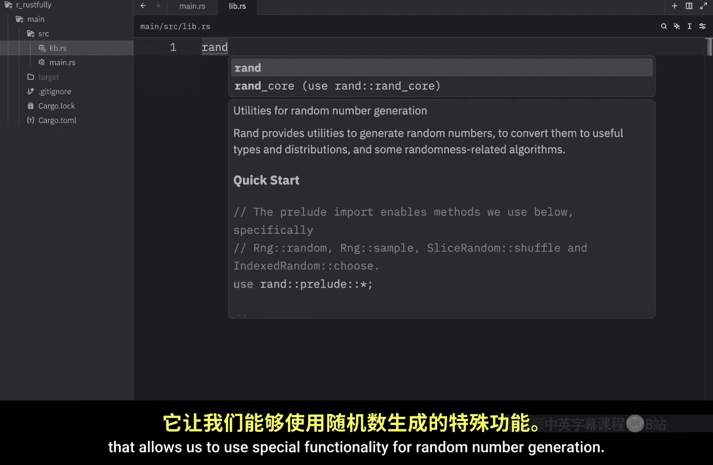
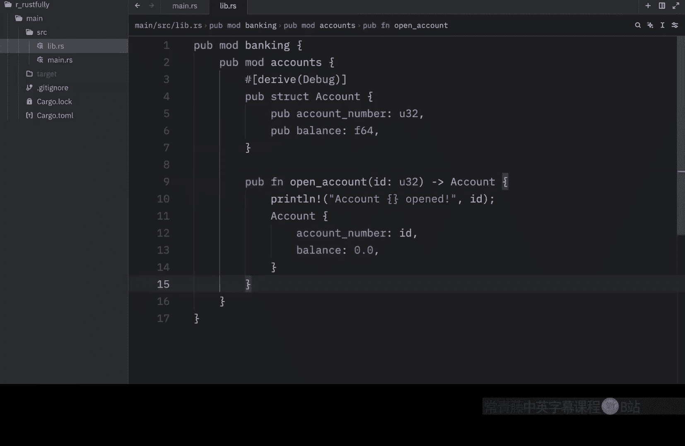
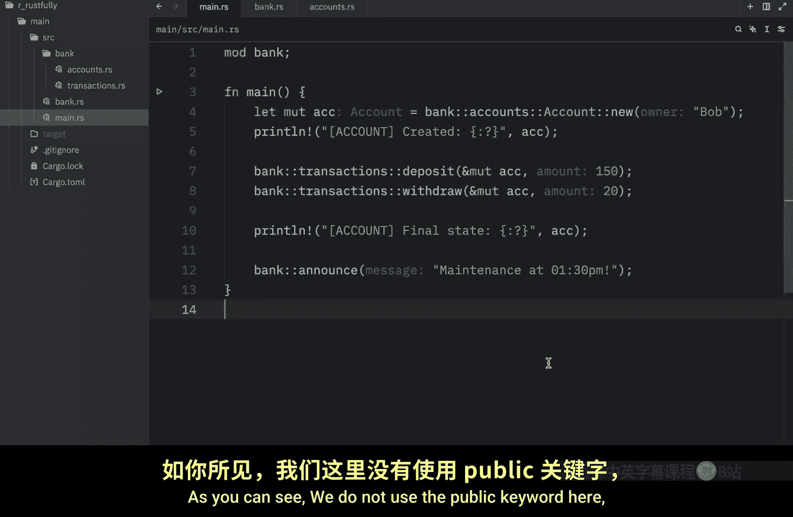
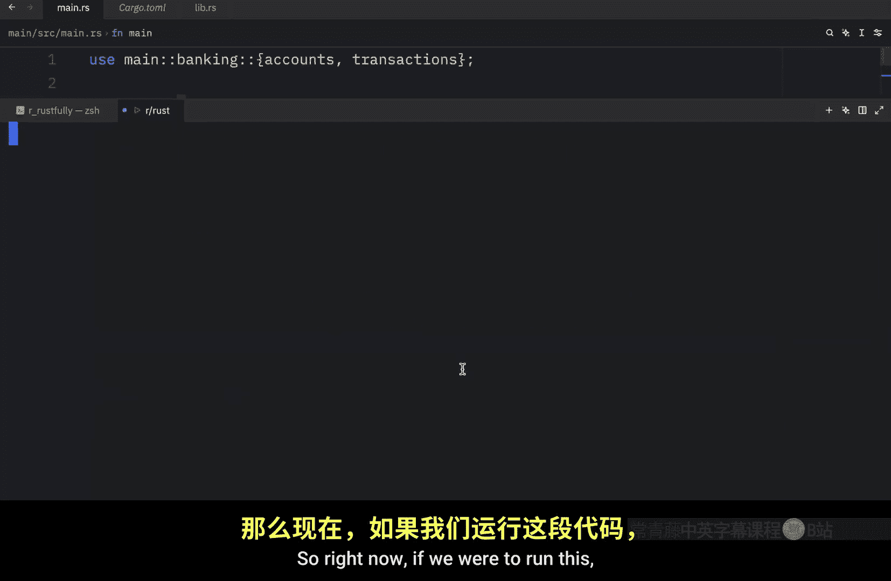

# Rustfully【中英⚡Rust 初学者教程（2025）｜Rust for beginners (2025)】 p61 P61 如何在Rust中使用_lib.rs_ -BV1eyAkzPEhj_p61-

Previously we learned about how we could create modules in rust and in today's video we're going to talk a little bit more about the modules and about libraries in rust。

 first of all， I want to talk about a little detail which I excluded in the previous video and that is that there's actually another way to define a module in rust because previously I showed you that you had to create a bank Rs file and a bank directory that contained the functionality and the reason I showed you this approach is because that's what was mentioned in the rust documentation and all of the lessons that I'm creating in this series are based on the rust documentation and whether that's the best practice or not that's what I'm following for now anyway what I wanted to show you is that you can actually group all the functionality directly in the folder without having to create a separate file such as bank。

 Rs So here what we're going to do is rename bank Rs to mod Rs and immediately in our main。

S file we're going to get an error because it cannot find this module anymore。

 which makes sense because we do not have it defined anywhere。

 We just have a directory that has some functionality。

 but our public API does not exist under the name of bank to make this work we're going to have to drag it inside the bank directory and this file follows a special naming convention which rust recognizes as the module entry point So this is just another way to create a module in rust and it works exactly the same way as when we had bank R S defined Ru will look for this mod R S file inside the bank directory and when it finds it。

 it will allow us to use all of this functionality as long as we define it to be public of course and it's completely up to you whether you want to define a mod R S file or move that outside and rename it to bank R S Both of these approaches work up next we're going to create our very first library in rust So what we're going to do first is remove this。

By deleting it and deleting bank Rs and we're going to reset our main do Rs file。

 So it's not going to contain anything。 Now inside the source。

 we're going to create a new file called Lib do Rs and we're going to try to create another banking system here So this will be the top level module which we will name banking the whole reason we're using a library is so that we can group related functionality together to be used elsewhere just like when we use that R crate that allows us to use special functionality for random number generation anyway。

 to get started， let's create our very first module。

Wwhich will be the banking module so this will be the start of our library。 and once again。

 we need to make this public so that other files can see it。

 we are exposing this functionality to the rest of the world。

 right below that we're going to create a public module called accounts and inside here I'm going to insert a publicstruct called account which contains a public account number and a public balance。

 right below that we're going to create a public function called open account and this will be a constructor used to create a new accountstruct。

 Then right below that we're going to create a function called close account which will be used to close any account and this will be a private function as you can see we do not use the public keyword here which means we cannot not use it outside of this module and I had to annotate it with allowdecode because we're not going to be using it in this project I just put it here to simulate that we can have some private functionality in case we need to use it This is not something you want the user。

Because it performs quite a dangerous operation， such as account closure。

 that's something we want to make sure we handle appropriately now right below the accounts module。

 it's time we create another module。And this one will be called transactions。

 And since we want to work with the accounts module。

 we're going to use some special syntax to refer to it。So here I'm going to type in use super。

Accounts and account。 What super allows us to do is to refer to functionality that's defined outside of transactions。

 One level up。 So outside of this block， the next level is going to be the level that contains public module account。

 So that's what super allows us to do。 and I'll explain it in more detail in a different video。

 But inside here we're going to create a function that's called deposit which allows us to deposit a given amount into an account of our choice。

 So here we take an account and the amount that we want to insert。

 Then we add to that account and we print a message with the changes。

 And right below that we're going to create a function that allows us to withdraw money。

 So I'm just going to paste that in and explain it real quick。

 So here we insert the account we want to withdraw from and the amount that we want to try to withdraw。

 Of course we should check that that account has that money before we try to do so。

 And if it does we withdraw that money。 Otherwise we're going to print a beautiful message that tells them that they are to。

Poor and that they cannot withdraw the amount that they wish to withdraw， and finally。

 let's create one more function that allows us to transfer funds from one account to another。

And this function will be called transfer， which takes an account to transfer money from and an account to transfer money to plus the amount to transfer。

 And once again， we need to check that the user or the account has a valid balance before we try to move the money And if it does we can perform that operation otherwise we tell the user or the account holder once again that they are just too poor to perform that transaction and Rus is complaining because I did not close this properly there we go。

 And right now I'm writing all of the functionality inside the library but if you have separate files。

 you'd use Lib do Rs as the entry point to expose all the functionality that you want to be visible to the project now that we finished writing the library。

 we can go to our main do Rs file and try to use it to use this library we need to refer to our project name。

 So here in this example we need to type in use main because my project is named to main that is the folder for my project that contains。

The source and the cargo dot as you can see inside here。

 we have a package with the name of main and that's why I refer to main here if this was name something else。

 you would use that name instead anyway use main。Baaning。And from banking。

 I want to import accounts and transactions， and now we can use the functionality that we defined in Lib do Rs。

 So to get started， I'm going to create two accounts one for James and one for Bob。

 And the very first thing we're going to do is see what they contain。

 So I'm going to debug James and debug Bob and when we run this what we should get as an output are these two accounts。

 one that belongs to James and one that belongs to Bob， both of them have a balance of zero。

 next we can perform some simple transactions。 such as depositing $200 into James accounts and then withdrawing $50 from James account。

 And since James is a boss and has some money， he can now pay Bob the money that he owed So he's going to pay Bob $100 and the next time we debug both of these accounts。

 we're going to see the amount that they end up with。

So right now if we were to run this， what we should get as an output is that we opened to accounts and as you can see the balance started at zero for both of them and then we deposited $200 into account1 which belongs to James so the new balance is $200 After that we withdrew $50 from account1 which still belongs to James so the new balance is now $150 then we transferred $100 from account 1 to account2 so James now only has $50 while Bob has $100 and we were able to do all of that through our library our banking library which contains all the functionality or exposes all the functionality that we can use for banking。

