# Rustfully【中英⚡Rust 初学者教程（2025）｜Rust for beginners (2025)】 p62 P62 Rust中的泛型函数非常棒 -BV1eyAkzPEhj_p62-

How's it going everyone In today's video， we're going to start learning about generics in rust。

 First， we'll take a look at how we can use generics in functions。 thenstructs and finally in enums。

 we will also talk about how generics effect code performance。

 Now before jumping into generics let's take a quick look at the problem that they were meant to solve imagine you want to create a function that grabs the first integer from a list。

 Well， it's not that difficult really， and we can do so by creating the following function So here will create a function called get first int and as an argument we're going to pass in a list or it's actually going to be a slice of integers So to do that we'll type in square brackets and I32 and that will return to us a reference to an I32 Now right below that we just need to pass in the reference to this list and return the first element and to use this function all we need to do now is create some numbers So we'll type in numbers and that's going to equal a vector。

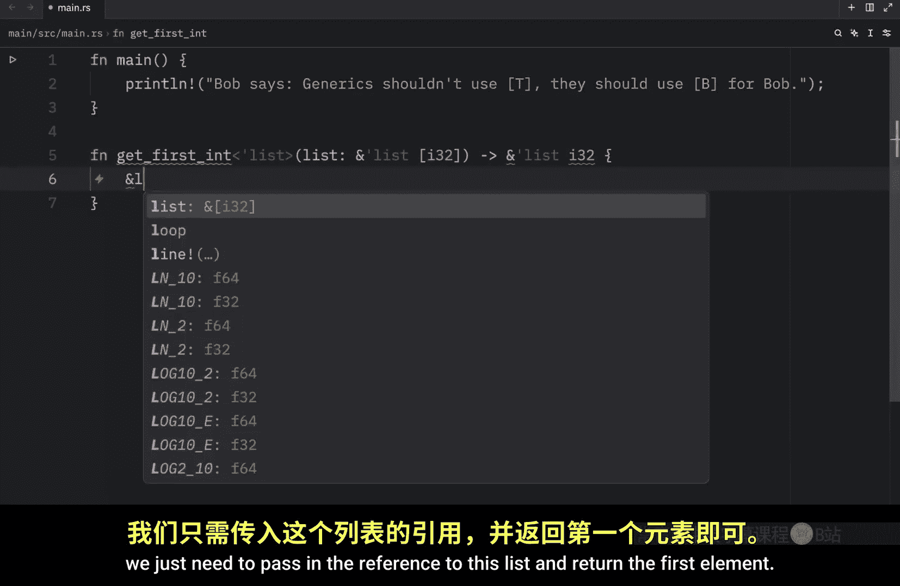

With the values of1，2 and three right below that we can use the debug macro and pass in get first integer and pass in our numbers or a reference to our numbers and now when we run this what we should get back is the first integer in this list and in this case it's one but now all of a sudden imagine we also want to grab the first character from a list Well that's also not that difficult but we're going to have to write a completely new function for it so instead of get first int。

 we're going to copy and paste that right below and type in get first character which will take a character and return a character sometimes autotocomplete really screws me over I don't really understand how I got a character array ref searcher when all I wanted was character anyway with this being done we can go up to our main function and type in let characters。

eququal a vector of A B and C And to use that all we need to do is debug or I mean you can use it anywhere。

 but I'm going to debug it and type and get first character and then pass in a reference to this vector and just like that we get our usual python syntax error because my shortcut for running code is almost exactly the same as the one I have for rust but if we were to rerun this in rust what we're going to get as an output is the first character in our characters vector and both of these functions work fine but we've broken one of the most fundamental rules of programming we have duplicate code for no real reason。

 both of these contain the exact same logic to achieve the first element from an iterable and now imagine that you want to get the first float or boolean from a list are you really going to create a dedicated function for each of those operations of course not unless you're being paid hourly。

Hate your boss and don't really have any deadlines。

 So let's take a look at how we can fix the code repetition problem we encountered using generics。

 So what we're going to do is leave all of this code as is just so you can compare it to the new function I'm about to create here I'm going to type in function get first Now in angle brackets we're going to specify a generic type which we're going to set to T。

 This is a common naming convention for generics T stands for type Next。

 we're going to create our list variable and that's going to be a slice of our generic type and what it's going to return to us is a reference to that type or the value of that type and I use a column there because I still think I'm in Python。

 And finally we're going to do the same thing we did with the other two functions and return the first element from this iterable and now Colin's running for some reason It's an absolute mess when you're teaching three languages and you have three different shortcuts。

 but now with this being created look what we can do。

We can remove this part here and this part here and our code is going to work exactly the same way。

 as you can see we got the first element from both of these vectors and this time we did it using generics and a single function and what that means is that we do not need these other two functions anymore note that this generic function is far from perfect and will fail if the list is empty I only created it to demonstrate how generics work here。

 and I'm sure you're also wondering about this inlay type hint。

 which is next to T T and T This inlay hint has to do with lifetimes and we're going to cover that in a couple of lessons so do not worry about that just now。

 just try to concentrate on the generic parts of this video Now let's take a look at another example that uses generics。

So let's remove all of this and start from scratch。

 This time we're going to make a function that handles things more appropriately。

 We're also going to add a constraint to r generic type this time These constraints allow us to be more specific with r generic functions For example we can type in function largest and say that T will use the partial or trait by defining T to have this trait。

 we're telling rust that the elements must be comparable such as integers floats and characters if we don't include it rust will suggest we use it so we can use the comparison operators on our type T and I'll show you as soon as we're done creating this function what happens when we remove this but right now we're just going to create a list inside here which is going to be a slice of T and it's going to return to us an option with a reference to T This time we're going to try to be more mature and create a function that's a bit more robust So here we'll type in if the list。

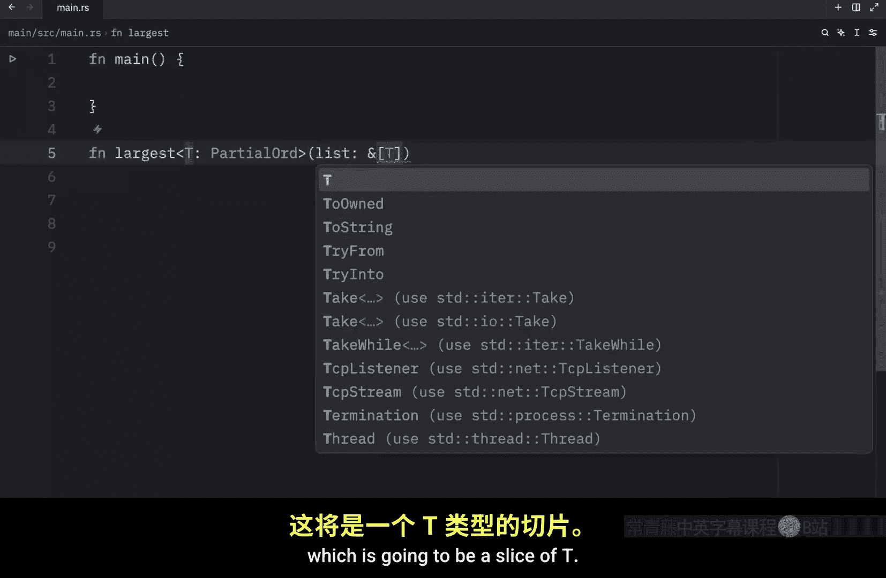

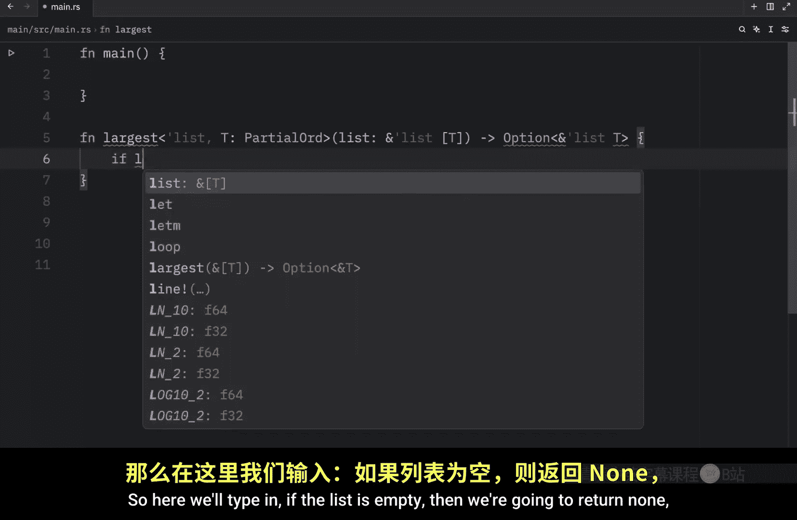

Is empty， then we're going to return none because there is no large value。

 And I just remembered that we can use to do to make the syntax highlighting go away。

 So I'm just going to add that macro at the bottom。And continue with thecode。 Now。

 right below this check， we're going to type in let mutable largest equal the list at the index of0。

 This is going to be the starting value。 and if this iterable only contains one value。

 It's going to return this value because that's the only value hence the largest value。 Next。

 we're going to iterate through the list。 So for item in list and to make sure that works。

 we need to turn it into an iterator。 then we're going to check if the item is greater than the largest item。

 then the largest is now going to equal that item， then at the bottom we can return some largest。

 and that's going to be our generic function。 And as I mentioned earlier。

 this constraint over here allows us to use the comparison operators with type T because without it。

 rust will have no idea what we're trying to compare here。 I mean。

 we could literally be trying to compare anything here since t can be anything without that constraint But by adding that constraint we're telling rust that this must be。

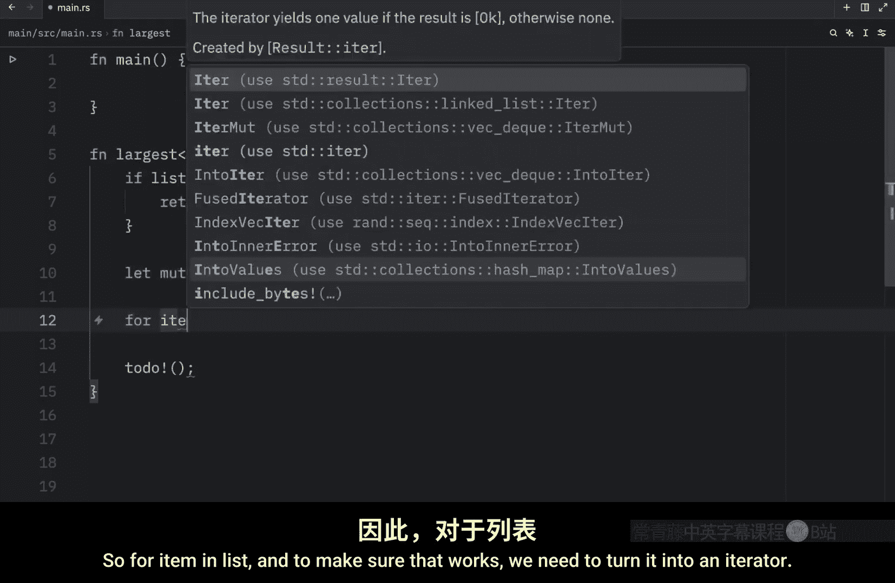

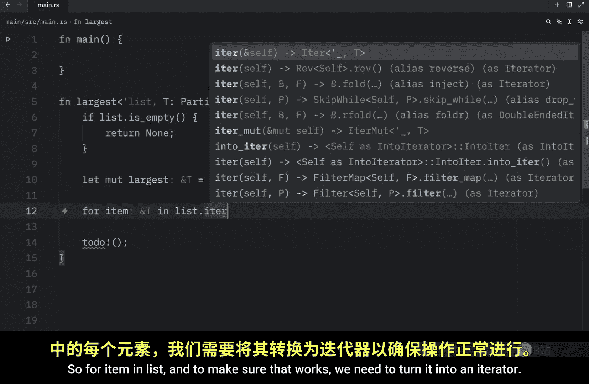

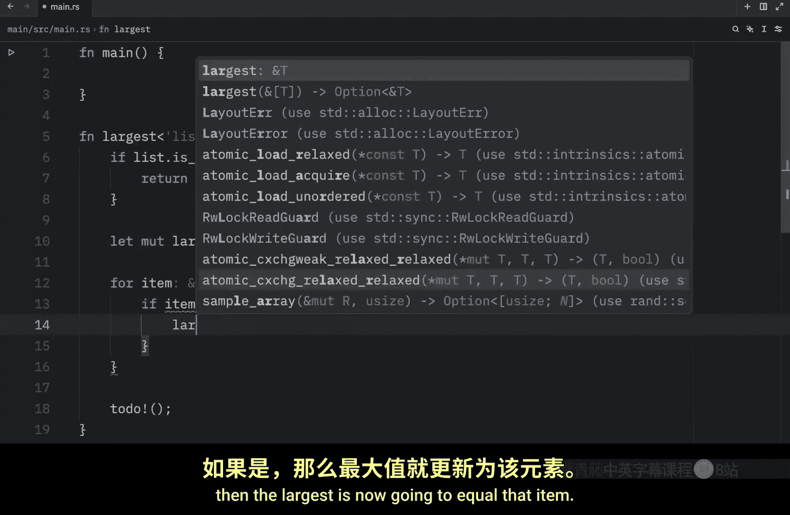

Type which can be used with the comparison operators and if you hover over partial order。

 you'll see that it is a trade for types that form a partial order and that means that the types that we're using with our generic type must work with these comparison operators Now with this function being defined we can go back to our main function and try to use it and once again I'm going to create some characters and some numbers but this time I'm just going to paste it in and what we're going to do next is debug pass in largest and pass in a reference to the characters then we're going to do the same thing for the numbers and what we're going to notice is that it's going to work perfectly for the characters Z was the largest and for the integers3 was the largest and we were able to find out what was the largest integer using a single function and this is amazing because it means less code repetition Even if these were floats such as 1。

5 and 4。6 our code would still run。

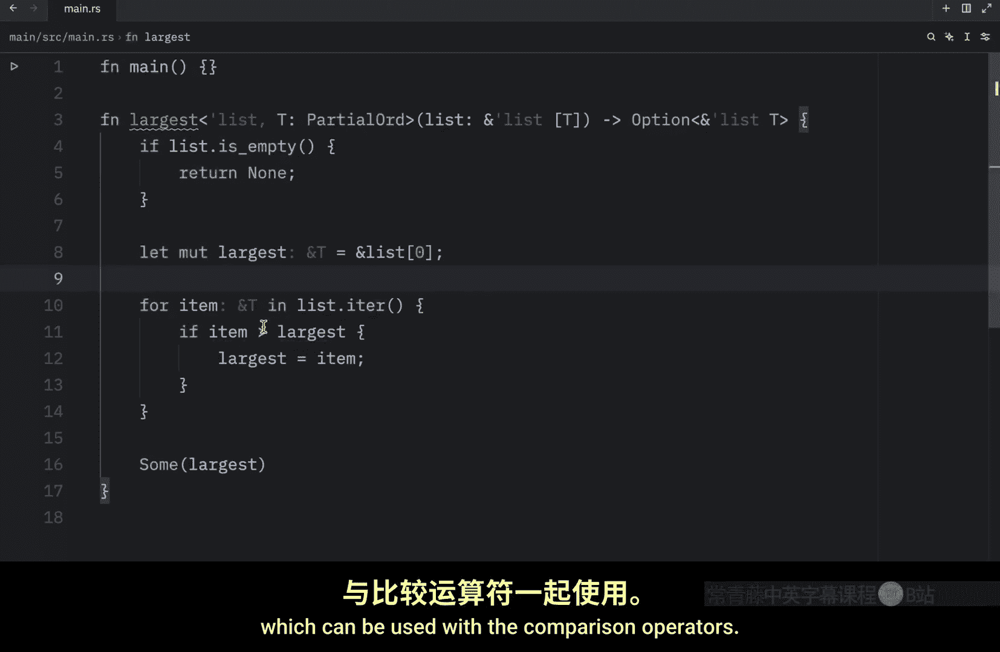

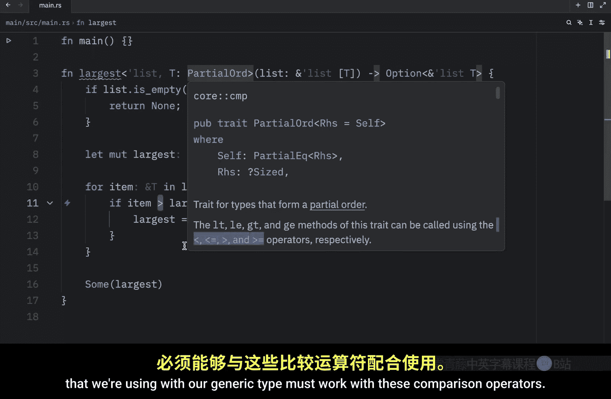

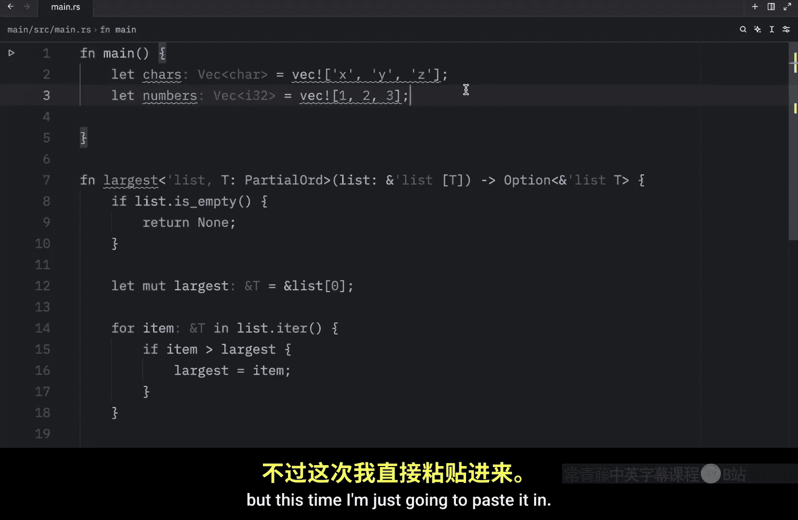

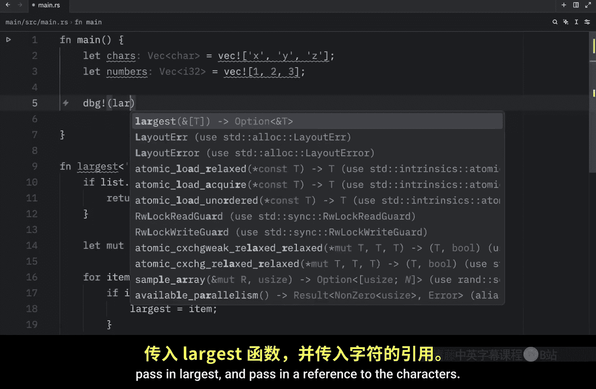

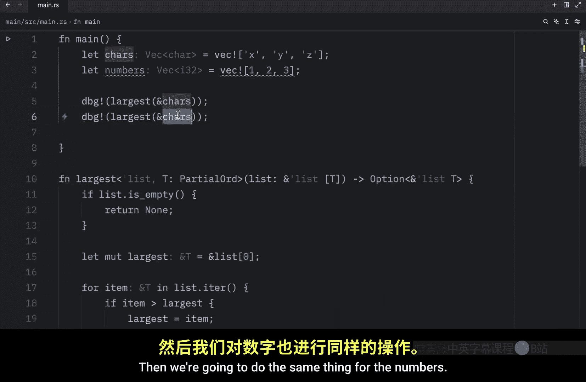

