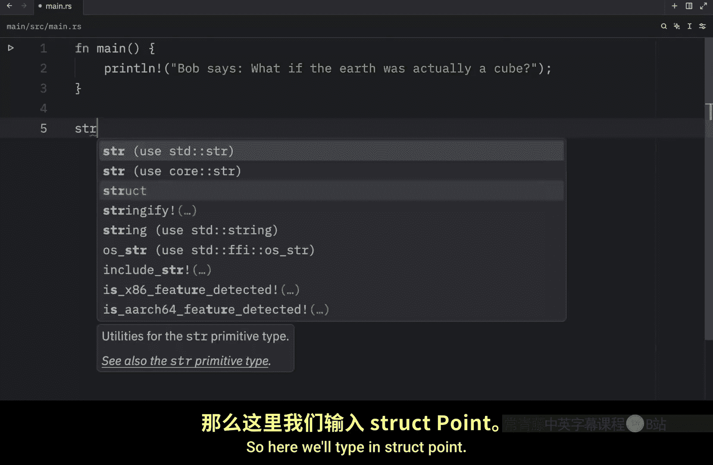
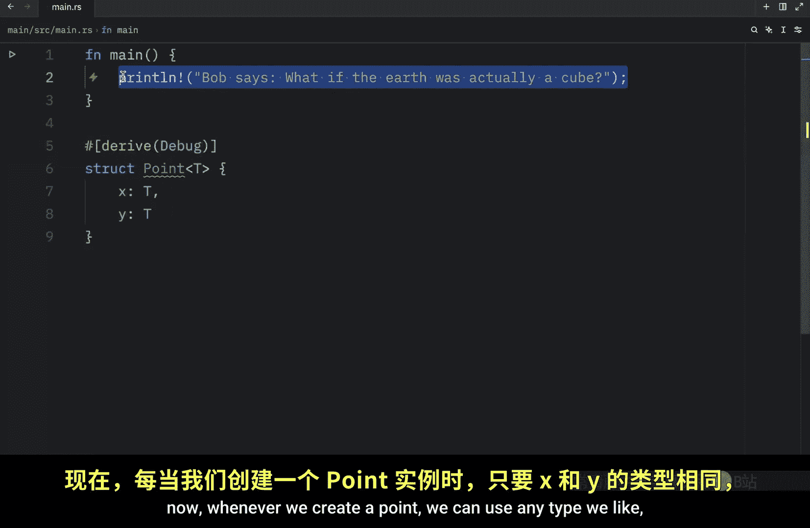
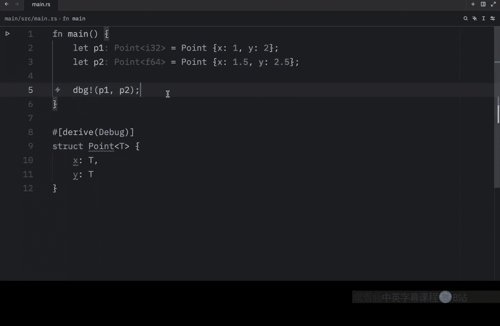
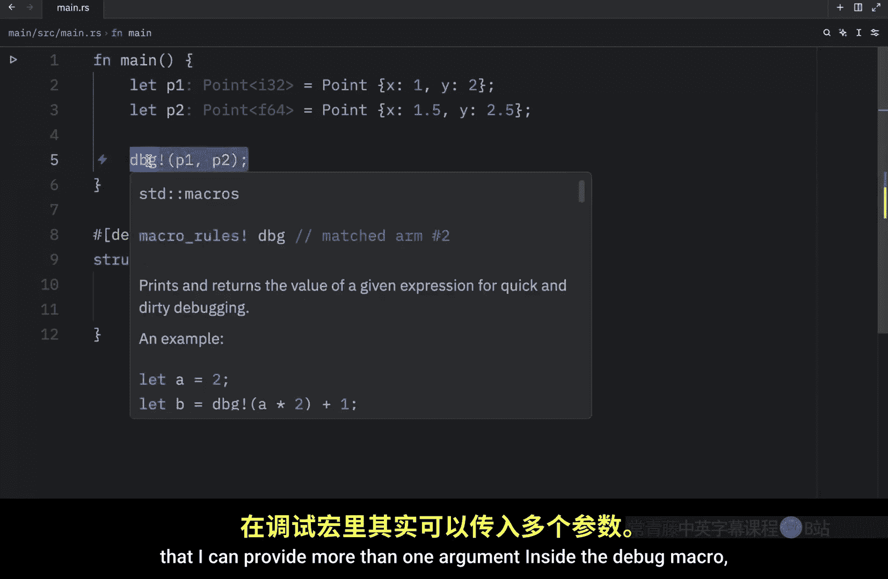
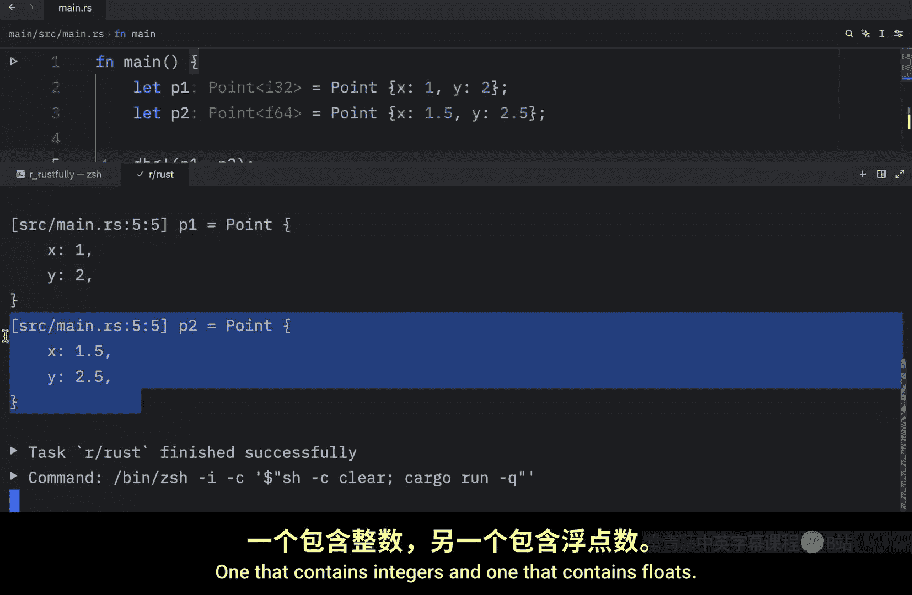
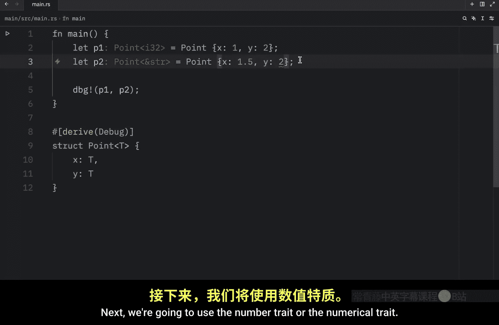
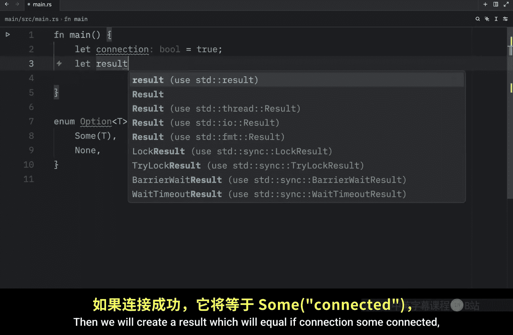
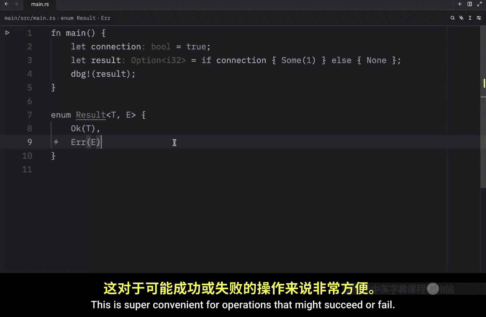

# Rustfully【中英⚡Rust 初学者教程（2025）｜Rust for beginners (2025)】 p63 P63 Rust中的泛型结构体很酷 -BV1eyAkzPEhj_p63-

Continuing with generics in this lesson， we're going to learn how to use them withstructs and enums。

 For example， we might want to create a point that has two fields， X and Y。

So here we'll type instruct points and once again using angle brackets。

 we're going to provide a generic type， which will be named T。 Now inside here we can type in X。

 which will be of type T and y which will be of type T also since I want to be able to use this with the debug macro。

 I'm going to。

Derive debug Now whenever we create a point， we can use any type we like as long as both of them are the same。

 So what we're going to do is let P1 equal a point and then we're going to say that x will equal 1。

And y will equal 2 this is a valid point， Both of the types are of type I32。

 which is the generic type we have here right below that we're going to type in let P2 equal a point and x this time will equal 1。

5。

And y will equal 2。5 and this time our generic type is being inferred as a 64 bit float and finally let's debug this by passing in p1 and P2 and in most lessons I tend to forget that I can provide more than one argument inside the debug macro so this time I'm going to do it and when we run this what we should end up with as an output are two points one that contains integers and one that contains floats and this was all possible things to generics and once again both types have to match for this to work we can't insert 1。

5 and2 and expect for this to work because2 is an integer and 1。

5 is a float when you use generics you're making a contract that this has to be of the same type especially if you're specifying it in two different places Now if you ever need to use more than one generic type in your code。

 you can just specify extra generic parameters in yourstruct for example。

Here we can type in T and U and this time y is going to be of type U by convention。

 we use U for the second generic parameter and we do this since it's the next letter after T If you add more continue with V and so on but as you can see the code editor or even rust does not complain anymore because y is of type U now and when we run this we're going to get the following output X is 1。

5 and y is2 the generic types here inferred our f64 and I32 while in the previous one they are both I32 Now there's one last thing I want to talk about before moving on to the next part of generics and it's a current problem that we have with thisstruct adding a generic type is great for flexibility but it can sometimes become2 flexible I mean theoretically we could add types here that don't even make sense such as a string that says hello our generic type is going to infer this as a string。

And that's fine。 That's what we told our code to do to allow us to insert any type into this struct。

 And once we do T will be considered that type for the rest of its usage。 But again。

 this doesn't really make sense in the context of a point。

 And we can also add booles and vectors and literally any type we want。 So once again。

 it's a good idea to add some constraints。 This time we're going to add a trait that only allows numerical values。

 And to do this， we're going to type in cargo add number。

 So this will add the number crate to our project。 so that we can use a trait that only allows for numerical values。

 So going back to this struct， we're going to change everything to be of type T once again。

 because in this context， we really don't care about different data types in our code。

 So we'll just change it to 1。5 and 2。0 Next， we're going to use。😊。

The number trait or the numerical trait。 And then we're going to specify t to be of type nu。

 And just by doing this we've added a constraint to our type。

 which means that we cannot use types which are not numerical with T and this is great because now if we try to insert something such as a string that says hello and why which says Bob it's not going to work because a string is not a numerical type and if you hover over this you'll see that the trade bound is not satisfied and then itll tell us which types we can use such as these ones over here。

 the numerical types， otherwise if we want to insert true and false。

This will also not work because these are not numerical types。

 So if we try to insert anything that's not a numerical type， rust won't be happy。

 and this is much better than allowing any type to be inserted here up next。

 let's see how we can use generic data types with enums。 For this example。

 we're going to recreate the option type from the standard library。

 This time itll hopefully make more sense。 So here we will type in enum option T。

 which is the generic type， and this will contain some T and none。 Now inside main。

 we can type in something such as let connection equal true。

 Then we will create a result which will equal。

If connection， some connected else， we're going to return none。

 So we're just pretending to check for some sort of internet connection。 If there is a connection。

 we will tell the user that they are connected， otherwise， we will return none。

 And then we will debug the result。 Now， in this example， we did not use this enum。

 I just created this line of code to demonstrate the option that we have here。

 because this returns in option， which can potentially contain a value。

 which is this value over here。 and this part is generic because this can be any value。

 as you can see， the option right now is of type string slice。 But if we pass in one。

 it's now going to be of type I 32， this is the generic part。

 And just like with functions andstructs， enums can also have multiple generics。

 and a really common example is the result enum。

Which we've seen many times。 This contains the types of T and E and the variance are going to be okay。

 which contains T and the error， which contains E。 So here we have a type for the O variant and a type for the error。

 This is super convenient for operationss that might succeed or fail。

