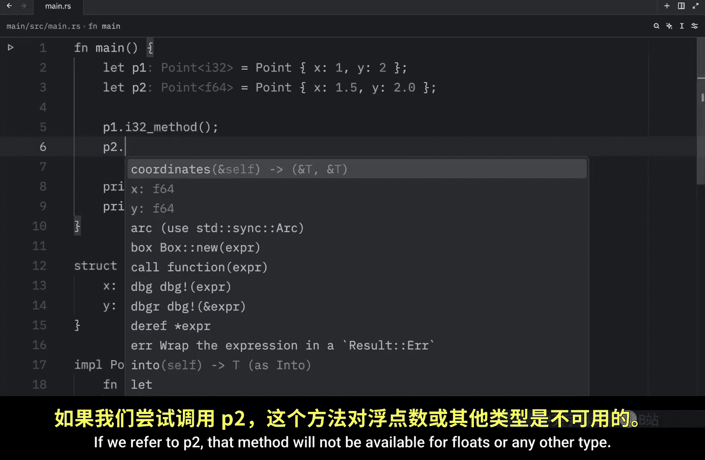
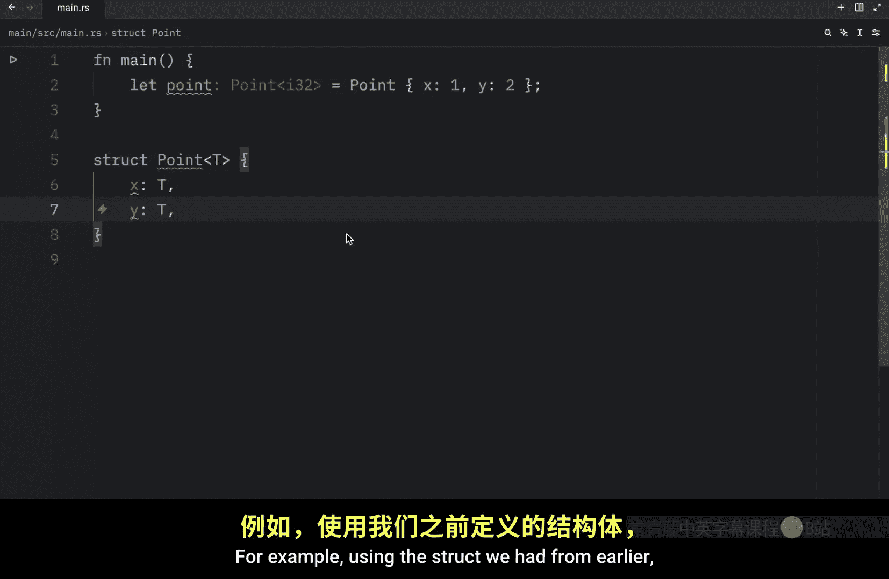
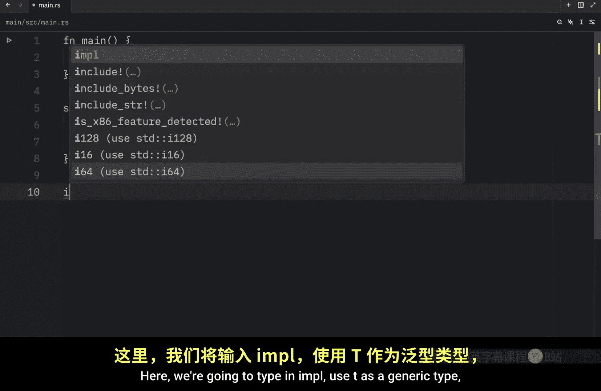
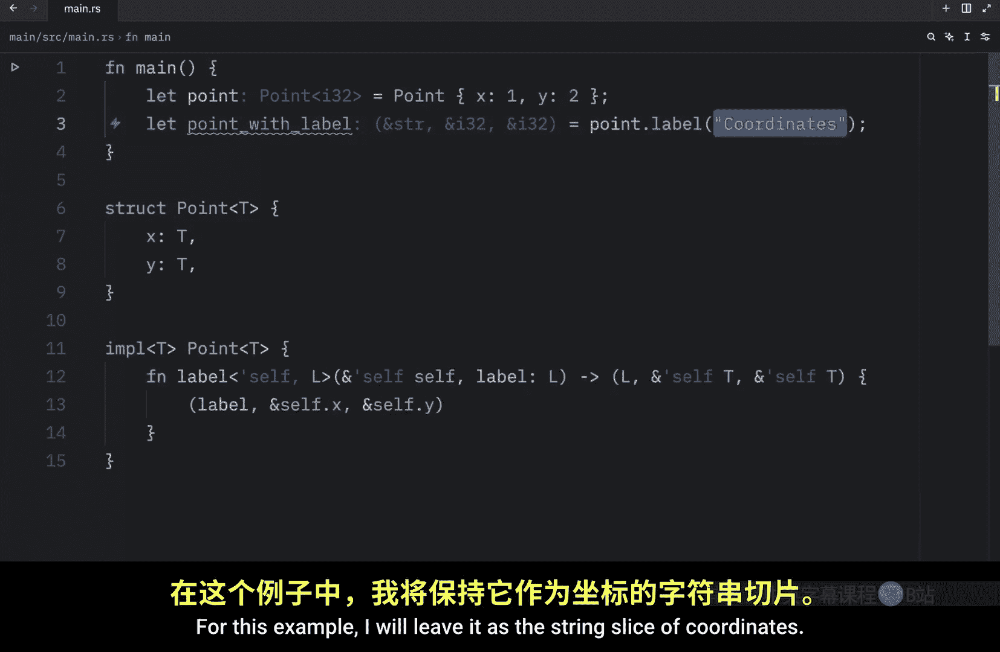
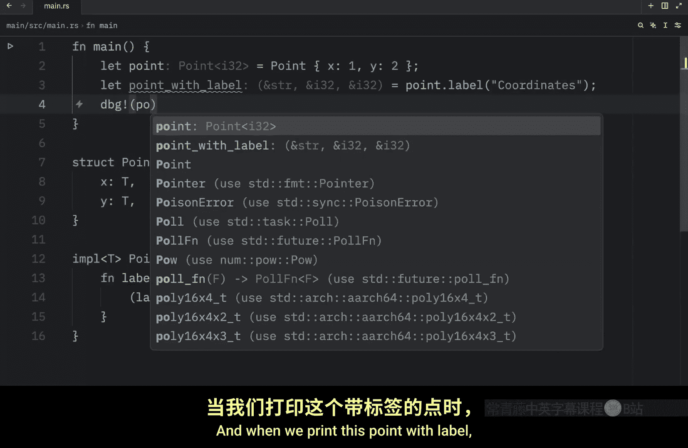
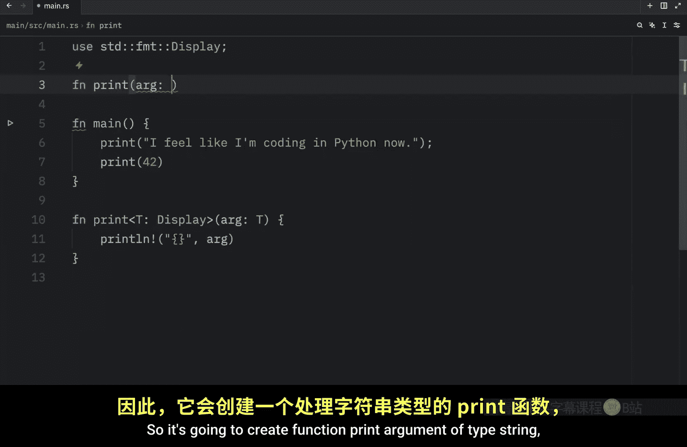
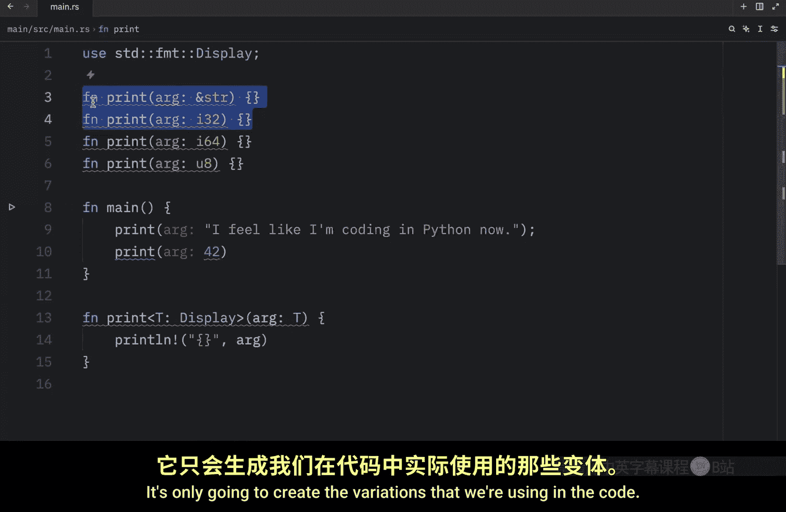

# Rustfully【中英⚡Rust 初学者教程（2025）｜Rust for beginners (2025)】 p64 P64 我喜欢Rust中的泛型 -BV1eyAkzPEhj_p64-

How's it going， everyone。 I know you love generics and the last two videos got so much hype that I just had to make a third video on generics。

 but that's it。 no matter how much you beg for more generics， this will be the final video。 For now。

 in today's lesson， we're going to learn how we can use generics in method definitions to get started。

 we will create a struct that holds the coordinates for a point So here will type instruct point。

 which will be a generic type and inside here we' type in X of type T and y of type T。 Next。

 let's create that implementation block。 and include the generic type of T and the point with the generic type of T here。

 we're telling rust that we want to implement the generic type on our methods。

 Then we can use the generic type inside our implementation block。 For this example。

 we're going to try to get some coordinates back。 So function coordinates。

 which will take a reference to self。😊。

And return to us a tuple with the first coordinate and the second coordinate then inside all we have to do is return that tuple by typing in ampersand self X and a reference to Y and just like that we can now create two points1 called P1 which will equal a point with X being set to1 and y being set to2 and a second point where x will be set 21。

5 and2 will be set to2。0 so now that we have two points that use generic types let's try to use the method we just created which also uses a generic type so right below we're going to debug or just print P1 do coordinates and we're going to do the same thing for P2 Now when we run this what we should get as an output are our coordinates in integer format or I32 format and the coordinates in F64 format So we were able to use both of those types。

independently with a singlestruct and a single implementation block if you want to specify constraints。

 you just have to type in the data type that you want to specifically create a method for in your implementation block So what we're going to do next is include a new implementation block which will take the point and this will only work with I32 so to demonstrate this I will pass in an I32 method which is just a random name or not really a random name。

 but it shows you that this belongs to the I32 type and inside here we will print line This is only visible for I32 then we can go back up to our main function and if we were to type in P1 we would be able to refer to the I32 method because it's an I32 if we refer to P2 that method will not be available for floats or any other type this method is only available for I32。

So that's how you can specify a constraint。 Finally。

 it's important to cover that you can have multiple layers of generics in an implementation block。

 For example， using thestruct we had from earlier， let's create a new implementation block Here we're going to type in Iple use T as a generic type and create our point with the generic type once again。

 Then inside here we're going to create a method which allows us to label our data。

 So we will call this label and we're going to include a new generic type which I will just abbreviate to L for label Now as an argument it's going to take self and the type of the label。

 Then it's going to return to us a tuple with the label the first coordinate and the second coordinate。

 And finally we just need to return the label。

The first coordinates and the second coordinates， as you can see。

 we were able to use generics within the implementation block。

 and these generics are completely separate from the generics we defined for ourstruct。

 Now what we're going to do is create a new variable called P1。

 And I keep on forgetting this is not Python equal point dot label。

 And we might as well just change this to point with label。😊，And inside here， we can pass in a label。

 which we can call coordinates。 Now， the type of the argument is going to be a string slice because it was generic。

 we can now include anything as a label， we can even use 10 as a label or a boolean as a label。

 we can use whatever label we like for this example。

 I will leave it as the string slice of coordinates。 And when we print this point with label。

 What we should get as an output。 is this data over here。 a tuple which contains the label。

 the first coordinate and the second coordinates。 Now， I know what you're thinking。

 you can't believe this is the final lesson on generics。 and I feel your pan。

 but I also know what else you're thinking You're thinking about the runtime cost when using generic type parameters in your code。

 The good news is that generics won't make your program run any slower than if you were to use concrete types like I32 or F 64。

😊。

us accomplishcomplishes this by performing monomorphization of the code at compile time。

 which is a fancy smanancy term for turning the generic code into specific code by filling in the generic types with concrete types at compile time。

 for example， here we could create a function called print because I miss Python already and this will implement the display trade。

 Now we're going to pass in an argument of type T and all we're going to do is print line and print that argument。

 So it's practically a print clone for the print function that we have in Python。

 Now we can go up here and use it。 we can pass in I feel like I'm coding in Python Now or we can pass in an i 32 such as 42 when we run this what we should get as an output are both of the arguments being printed to the console。

 when we include the following lines of code in our project rust will create。

2 functions at compile time， because it knows that these will be the only types used with this generic function。

 So it's going to create function prints。Arguments of type string。

 and it's going to create function print argument of type I 32。 and that's it。

 It's not going to create the other types because we're not using I 64 and we're not using a U 8。

 So there's no point in generating that code。 It's only going to create the variations that we are using in the code。

