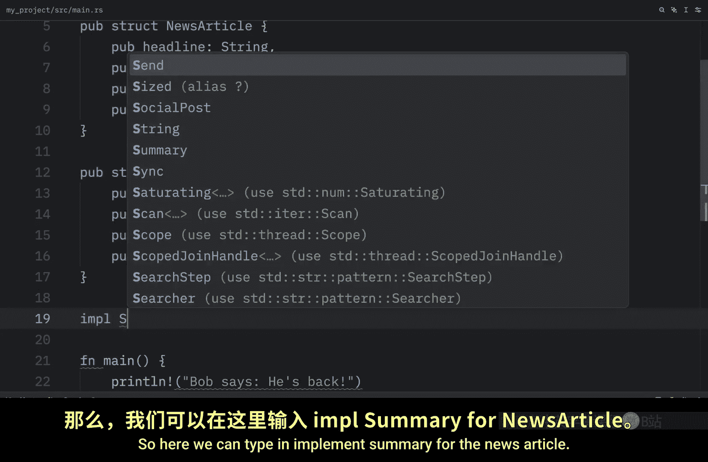
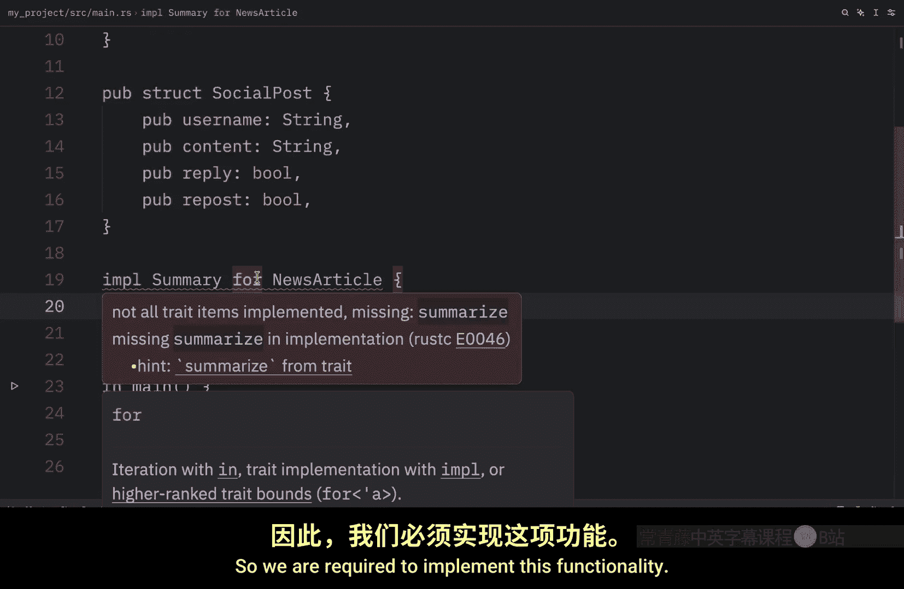
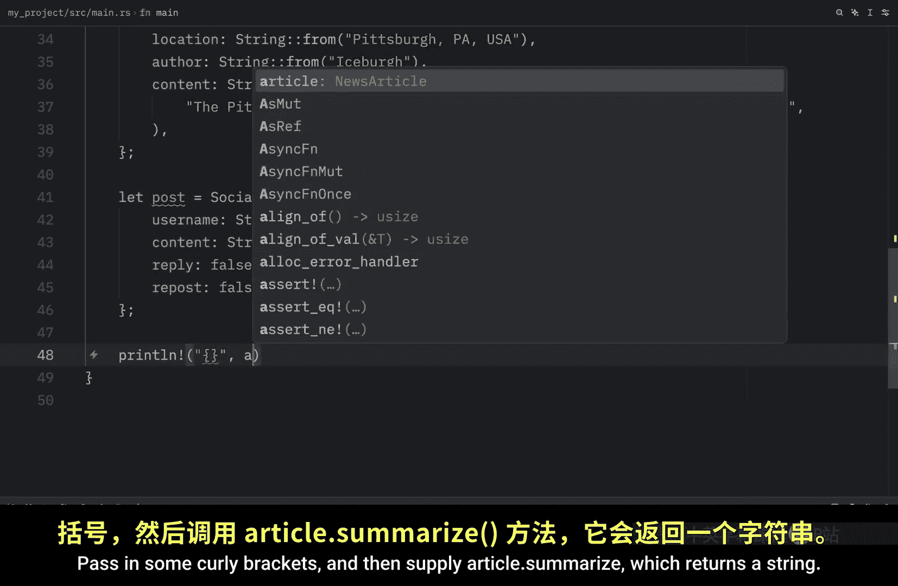
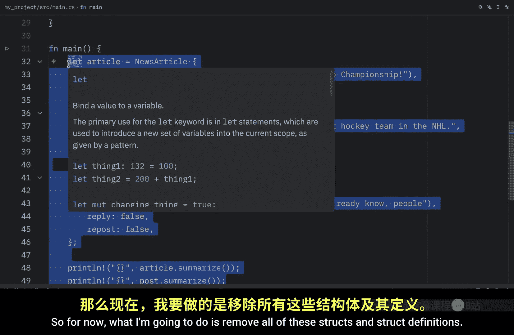
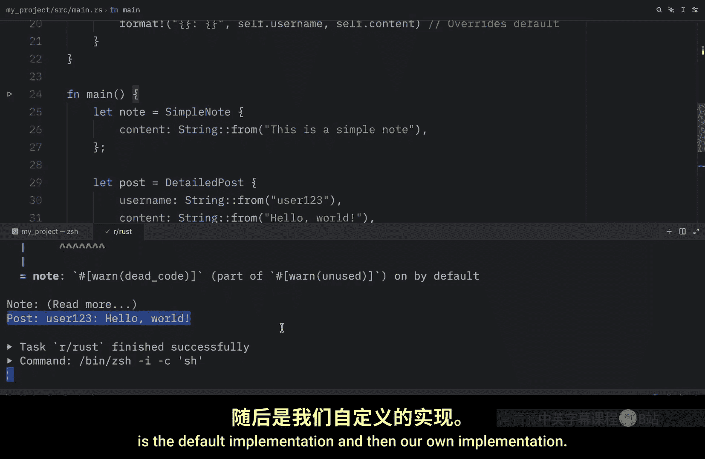

# Rustfully【中英⚡Rust 初学者教程（2025）｜Rust for beginners (2025)】 p65 P65 Rust中的trait非常棒 -BV1eyAkzPEhj_p65-

How's it going everyone in today's video we're going to learn about traits and since there's a lot to explain。

 I'm actually going to split this up into four videos。

 but today we will at least get started with learning how to implement a trait Now a trait defines a collection of methods that types can implement the purpose is to group method signatures that multiple types can share as behavior to define a trait your type in the trait and the name of the trait followed by the implementation and you can add the public keyword to let other traits depend on it but inside here we should supply method signatures only for example we might have a method signature that says summarize and that will take self and return a string that's all we're going to provide and we're going to use concrete types later to provide bodies for the required methods and it's important to note that a trait can declare several methods in this example I'm only。

Defining oneU next， let's take a look at how we can implement traits for concrete types and for this example we're going to create twostructs。

 one called news article which contains a headline， a location。

 an author and some content and another one which is called social post which will contain a username。

 some content， a reply and a repost Next we can implement or use the trait。

On thesestructs so here we can type in implement summary for the news article and if you hover over the red squiggly lines。

 you'll notice that we did not implement all the trait items we are missing the one item that we defined in our trait so we are required to implement this functionality So let's do that by implementing a method called summarize and here all it's going to do is print the headline。

 the author and the location then we can do the same thing for the social post we can implement the summary for social post and inside here once again we are required to implement all of the functionality So what we're going to do is create a method called summarize which will return a string and here we're going to format it and return something that contains a username and some content and to use this functionality all we need to do is create a couple ofstructs that contains some data so I'm going to copy and paste in and。

Article and a post。 and then we can use these trucks exactly as we would expect so we can print line。

Pass in some curly brackets and then supply article do summarize which returns a string and the string it returns is a summary of the article Penguins Winy Stanley Cup Championship by iceberg and the location then we can do the exact same thing for the post so down below we'll just type in posts after making sure this has a semicolon and now when we run this we will get the summary for the second one as well so as you can see all the trait requires us to do here is implement certain functionality then we can use those strs as normal Now the last thing I want to show you how to do today is how to provide default method implementations in your traits So for now what I'm going to do is remove all of thesestructs andstruct definitions So all we have right now is the summary trait but now what we're going to do is define a default implementation and the default is going to return a string from。

Read more So this is the string that we will return Now the implementer can choose to keep the default or override them selectively。

 which is quite nice。 defaultults may also call other trait methods including required ones and it actually turns out we do need ourstructs from earlier so I'm going to paste those in once again just to show you how we can use this default behavior。

 So down below we're going to implement summary for the news article and to use the default implementation。

 we can provide an empty pair of curly braces we are not required to provide a body for summarize since we have a default implementation。

 otherwise if you want to provide your own implementation you can override the method So for social post we will be overriding the summarize method by providing our own implementation but let's use a different example this time so I'm going to remove all of that and I'm going to create two news。

Trs， one， which is called simple note， and that contains some content of type string and another one。

 which is called detailed post， which contains a username and some content。 Now， for the simple note。

 we're going to implement the summary。For that note and we're just going to use the default implementations but for the detailed post we're going to override the default implementation with our own so now in mainine let's create a couple ofstructs one which will be a note and this will contain the string value of this is a simple note and the other one is going to be a post which is going to be a detailed post with a username and some content then down below we can print the original note or the simple note and we can print the detailed post and now when we run this what we should get as an output is the default implementation and then our own implementation so we were able to use both of those。

