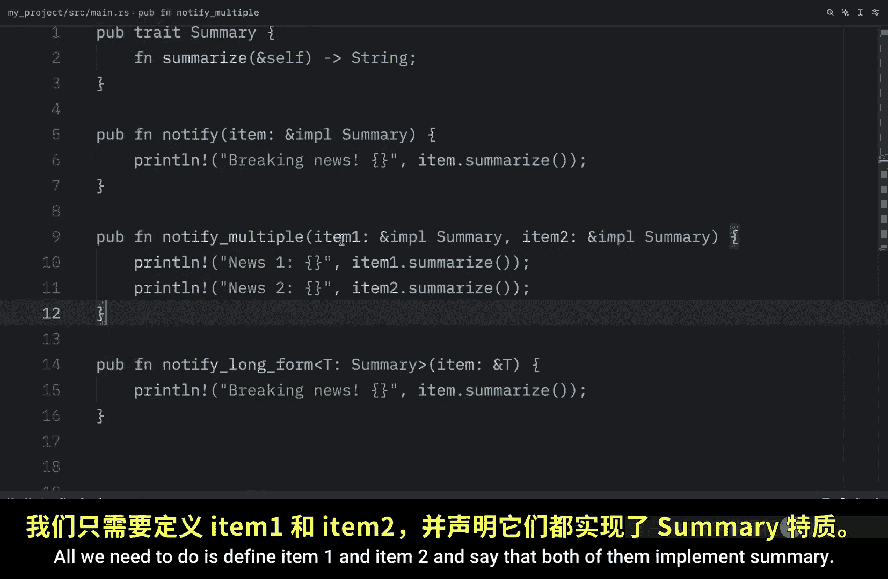
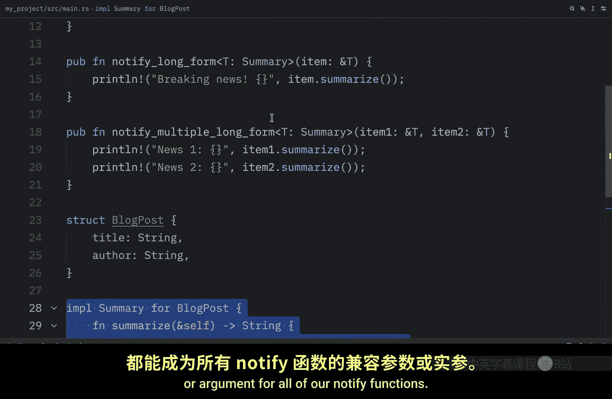
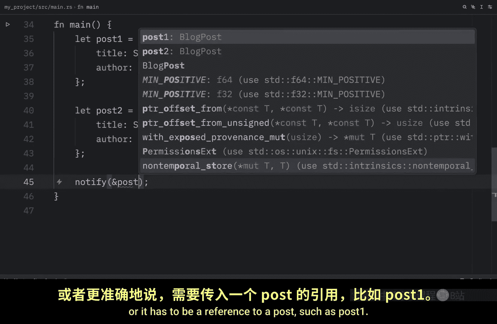
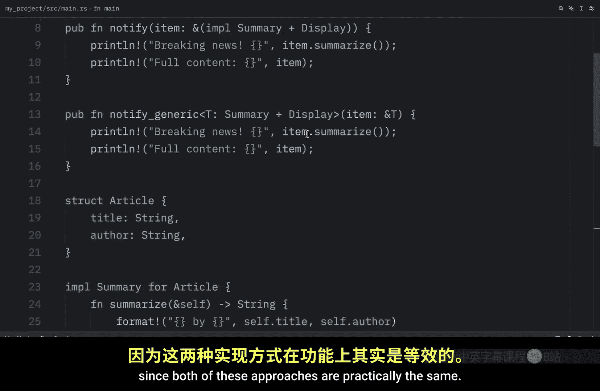

# Rustfully【中英⚡Rust 初学者教程（2025）｜Rust for beginners (2025)】 p66 P66 在Rust中使用trait作为约束 -BV1eyAkzPEhj_p66-

How's it going， everyone。 previously， we learned how we could define a simple trait in rust。

 Now it's time we learn how we can use traits as constraints on generic functions to get started。

 I'm going to be showing you how you can use trait bounds on parameters And for this we have two forms。

 one which will be the shorthand and one which is just explicit generics with bounds。

 So let's get started by implementing these shorthand syntax。

 and we're going to use the same trait from the previous lesson， the one called summary。

 which has one function calleds Now right below we can type in public function notify and here we want to pass in an item。

 and we're going to use this syntax the implement syntax and what we want to do here is implement this trait and then right below we're going to print that there is some breaking news and we're going to use the method from summary on this item。

😊，And it's important that we define this item to implement the summary trait。

 otherwise this will not work。 Next， we're going to use the explicit generic syntax。

 which is the long form of doing this。 So let's type in public function notify and since this is the long form I will just add that there。

 And here we're going to define a generic。

Wwhich will be called T and that's going to implement the summary trait and the item is going to be a reference to T then with this generic type。

 which has the summary constraint we can type in item and say that this is a reference of T then inside here we can paste in the exact same line of code and both of these will end up doing the same thing and doing this with multiple parameters is also quite straightforward all we need to do is define item1 and item2 and say that both of them implement summary for the log form it might end up being even more convenient because we can use the same generic type on both of the items Now to use these we need to create astruct and then implement the summary on thatstruct So it's going to look like this here we have astruct which is called blog post and that contains a title and an author Then here we're implementing the summary for the blog post and this right here turns any blog post we create into a compatible。

parameterameter or argument for all of our notify functions So now in main we're going to create two differentstructs。

 one called post1 and one called post2 with these blog posts。

 we can type in notify and we can pass in a post or it has to be a reference to a post such as post1 and that will work perfectly fine as you can see when we run this it's going to say breaking news rust traits by Alice and the other functions will work exactly the same way If we use the long form we just need to pass another reference to astruct that implements the summary trait and for the ones that take multiple items we just need to pass in multiple compatible items such as post1 and post2 All we're doing here is following the signature that we defined in our function up next I want to show you how you can combine multiple trade bounds using the plus operator syntax Sometimes you need a type to implement multiple traits to use methods from all of them using。

the plus operator we can achieve that for example， maybe we want to use both the summary trade and the display trade on this item to do that we would first have to import the display trade from the standard library and we would have to put this in parentheses then right after that we can say summary plus display and that will require this item to implement both the summary trade and the display trade and since this also requires the display trade we can now print it normally if we want to do this using generics we can do that easily just by adding the plus operator to the generic。

And then everything else will work as normal Now to use these。

 we're going to create an article and we're going to implement the summary trait on the article and something else we want to do is go all the way back up to the imports and use format from the standard library and the reason we're doing this is because we also need to implement the display trait for the article So here we're defining how we want to format it using the display trait then right inside main we can create an article which will be called Under traits by Charlie Then we can use notify。

Pass in an article。And run thecode。 And this is what we're going to get as an output。 Now。

 if we use the generic version。It's going to give us。A syntax era because I ran this in Python。

But if we run this in rust， we should get the exact same output since both of these approaches are practically the same。

