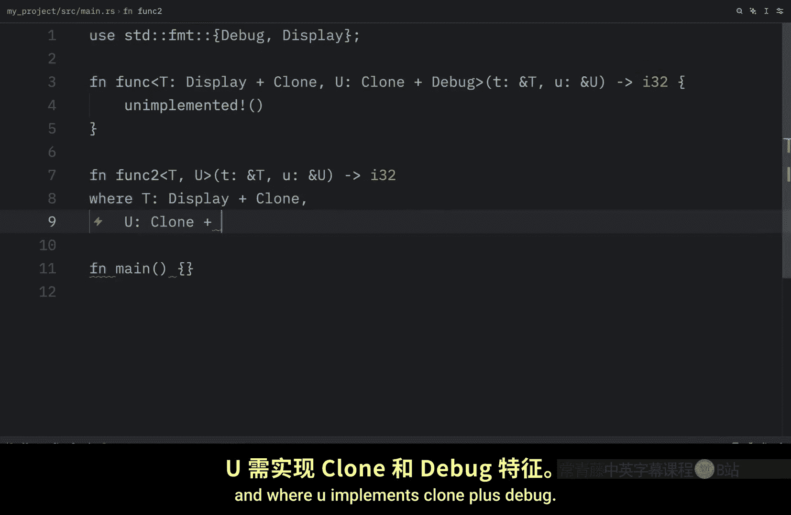
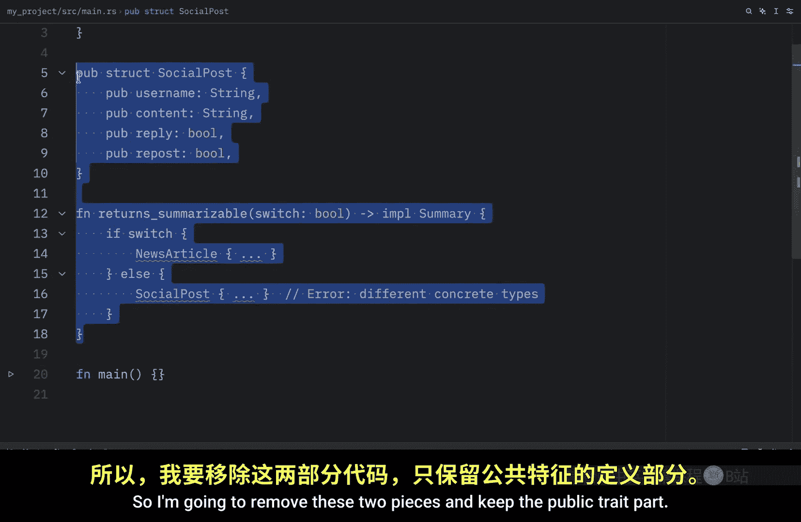
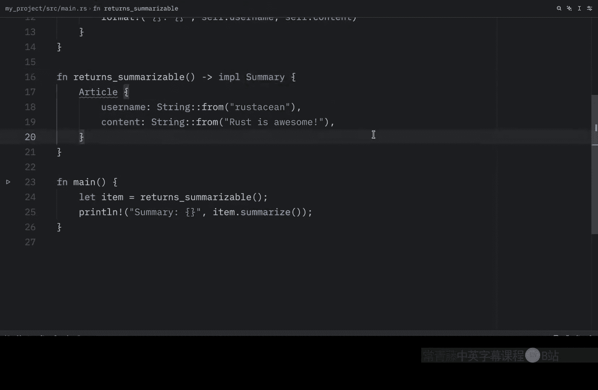

# Rustfully【中英⚡Rust 初学者教程（2025）｜Rust for beginners (2025)】 p67 P67 Rust中的trait很有用 -BV1eyAkzPEhj_p67-

How's it going everyone In today's video， we're going to learn a little bit more about traits。

 More specifically， we're going to learn how to use where clauses to improve readability of complex trade bounds。

 when trade bounds become complex inline syntax can make signatures hard to read。

 The solution is to move bounds to a where clause after the signature。

 The benefit is that name parameters and return types remain uncluttered。

 And just to show you what I mean， let's create an example。

 So right above main I'm going to import display and debug。 Then right below。

 I'm going to create a function just called funk for now and this function is going to have the following signature。

 So first it takes type T or defines type T which will implement display and clone and then we define type which will implement clone and debug And right after we take them as arguments and we specify the return type。

 Then inside here we can just call unimplemented。So as you can see the inline bounds slowly become very hard to read now let's recreate this using the where clause so right below we can type in function function 2 and I'm going to paste in the signature which is going to take T and U which are both generic types and it's going to return an I32 just like we did above and with this being done we can specify where T implements display plus clone and where you implements clone plus debug。

And right below in curly braces we can add our code and once again I'm going to add unimplemented so as you can see when generics become quite complex。

 this makes it a little bit easier to read and edit up next we're going to learn how we can return types that implement traits and we're going to do this using the implement trade syntax Now before I explain anything let's create a little example that uses this syntax。

And for this example， we're going to have to use the summary trait and the social poststruct。

 which we used in a previous lesson then right below we can create a function called Return summarizable and this will return something that implements the summary trait then inside we need to return a concrete type that implements summary so on this example I'm going to pass in a social post。

 so the concrete type here is the social post， but the colorss are only going to see implement summary and what's nice about this is that the color is going to depend on this implementation。

 not the exact type of thestruct， so here we have a social post but this could also be an article if we had an article that implemented the summary trait It's important to note though that there is a limitation For example we cannot return to different types in different branches even if they both implement the summary trait but let's take a look at a better example where this doesn't throw a。

Of errors so I'm going to remove these two pieces and keep the public trade part。

 Then we're going to go back to the days of Twitter where we had tweets and life was beautiful and we will implement the summary trait for that tweet then right below we can create a function which is called returns summarizable and all that matters is that we are implementing the summary trait and since the tweet implements that summary trait everything's going to work just fine here then inside the main function we can create an item which will just return the tweet from this returns summmarizable function and then we can print that item or the summary of that item And when we run this。

 what we should get as an output is this following text and once again what's cool about this is that we can return anything that implements the summary trait So even if we were to change this tweet to something such as an article that would work just fine but obviously we need to create an article which implement the summary。

Trade first。

