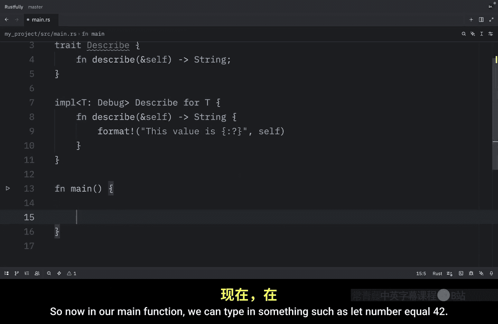
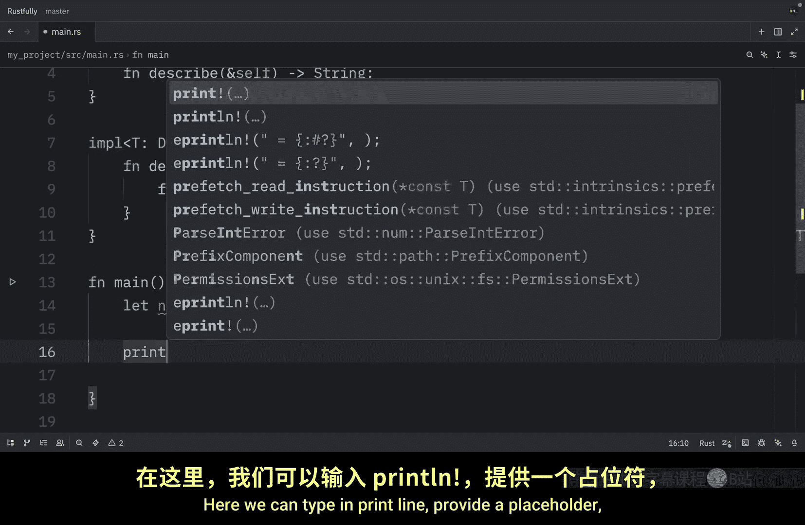

# Rustfully【中英⚡Rust 初学者教程（2025）｜Rust for beginners (2025)】 p68 P68 再见，Rust的trait -BV1eyAkzPEhj_p68-

In this video we're going to learn how we can conditionally implement methods based on trait bounds and this will be the final video on traits before we jump into lifetimes conditional implementations let you add methods only when a types generics meets specific trait bounds you do this with the implementation followed by the trait and whatever bounds it has For example。

 if we have a pair that takes T this can always call new but it will only get CMmpP display when T implements both display and partial or because printing and comparing require those traits Ru also uses blanket implementations where a trait is implemented for every type that satisfies a bound like how two string is automatically implemented for all types that implement display this approach keeps your types flexible。

 prevents misuse and exposed。richer APIs only when the inner types are capable of supporting them。

 So first let's take a look at an example of how we can define unconditional methods and for this example。

 we're going to create astruct called pair which holds X and Y of type T next we can create the implementation block that uses it Now this method will work with T no matter what type it is it is available for all the types if we want to create conditional methods。

 we're going to have to add some bounds here such as display and partial a and obviously if we want to use display。

 we're going to have to import it from the standard library Now inside here we can add CMmpP display before we use it I'm going to go up here and just paste in the previous implementation because we need that as well to simplify creating new pairs and now in main we can create a pair we can say let's pair equal pair new and inside will pass in4。

And10 as you can see here， we can create a pair of any type。 This works with any type。

Because that's what we defined over here and since the elements or the type of these elements satisfy both display and partial odd。

 we can use CMP display with this pair So right now we can type in pair do cmpP display and when we run the script or when we run the program we will get back that the largest member is y and that it holds a value of 10 Now watch what happens when we introduce some types that do not satisfy these straight bounds such as vectors we could pass in one2。

And three and four， it would no longer work。😡，Because we have some unsatisfied trade bounds so this method will not be available to these types and finally let's cover blanket implementations blanket implementations allow implementing a trait for all types meeting bounds an example would be the standard library implementing two string for all types that use the display trait。

 but for this example we're going to use the debug trait and this trait is going to be used to describe an object then right below we can create the blanket implementation So this will be implemented for all types that implement debug allowing us to use the format macro with the colon question mark format specifier So since we told Ru that we want T2b of type Dbug we can now use this inside the method So now in our main function we can type in something such as let number equal 42 here we can type in print line provide a placeholder and then we can type in number。

And just like that， when we run this， what we should get as an output is that this value is 42 Without this bound。

 Rust would not know what to do here。

