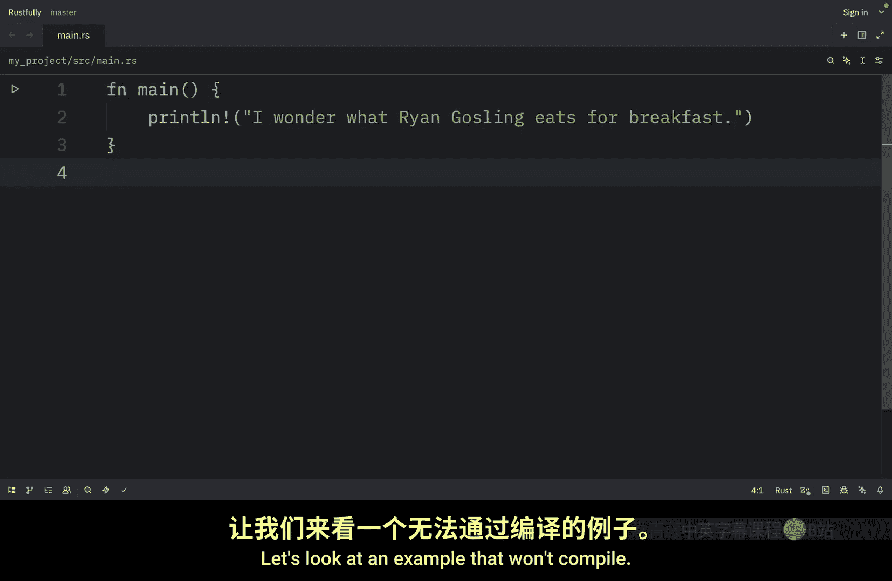
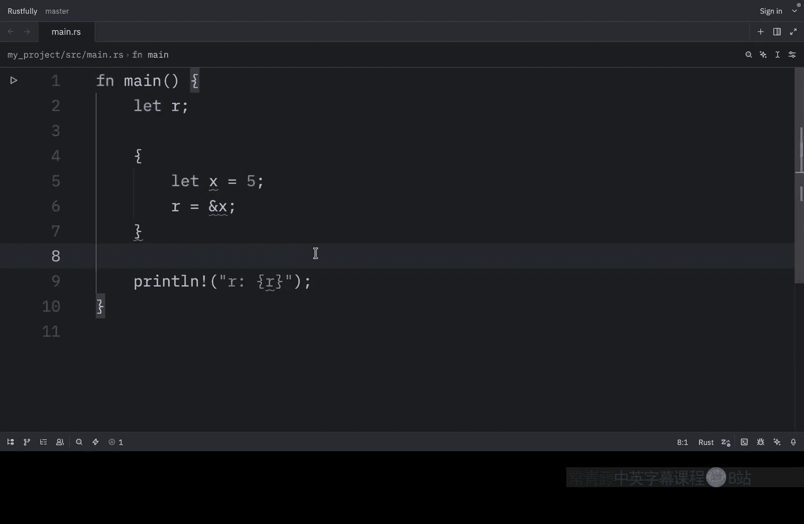
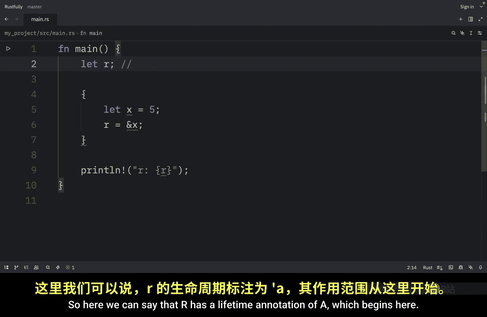
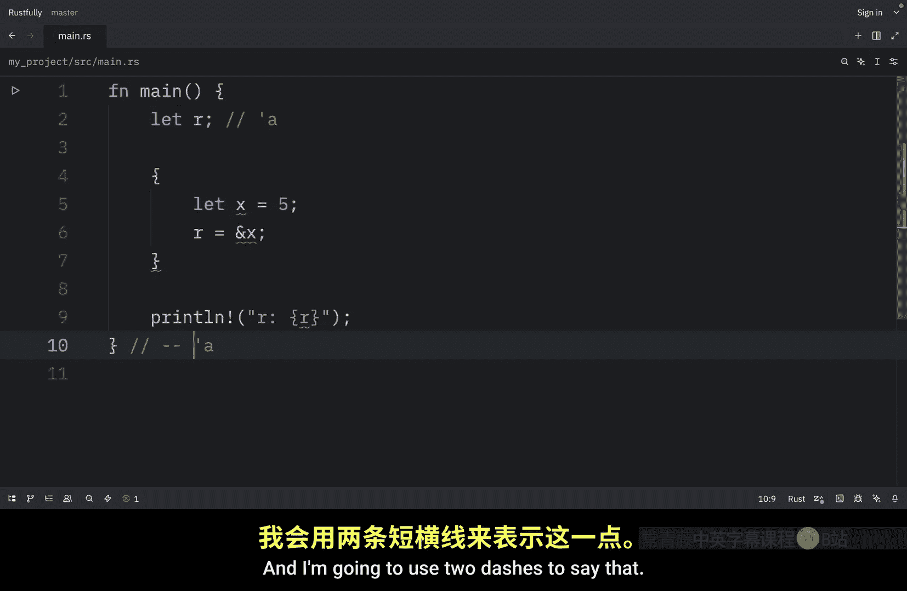
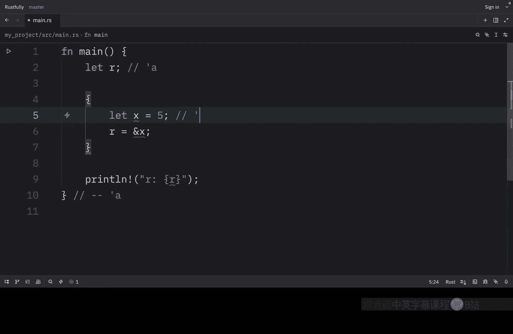
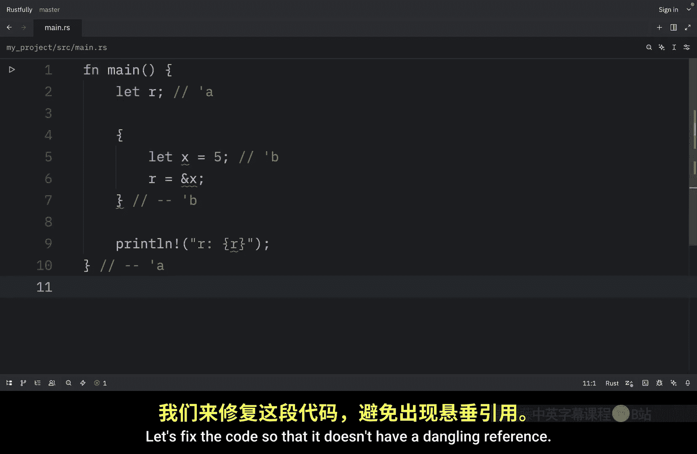
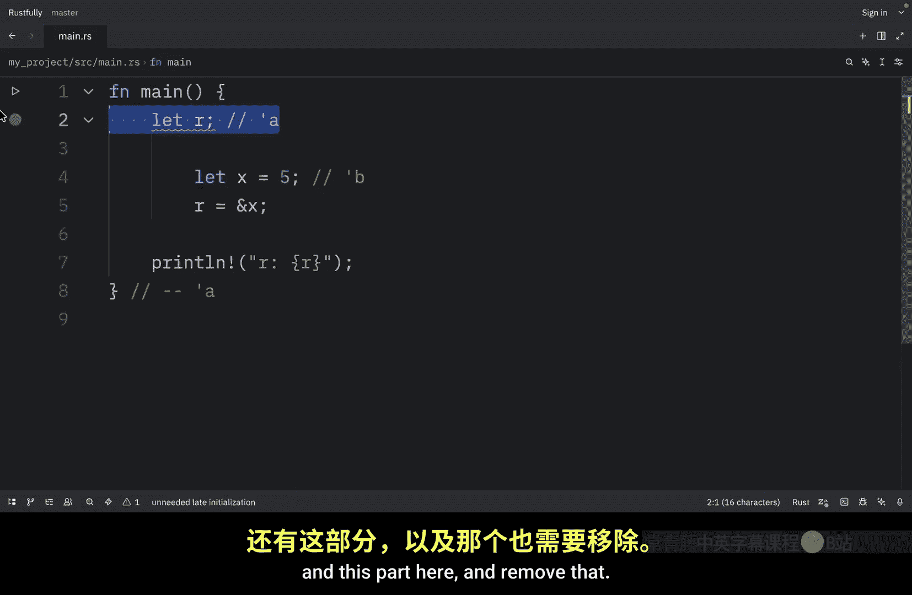
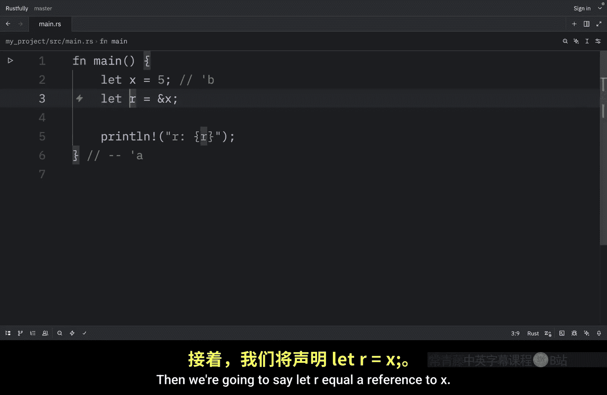
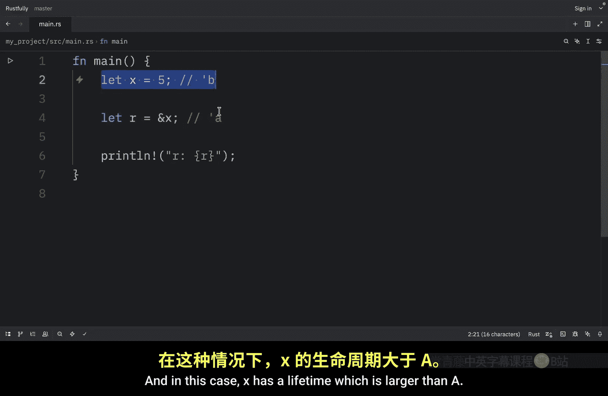

# Rustfully【中英⚡Rust 初学者教程（2025）｜Rust for beginners (2025)】 p69 P69 你好，Rust的生命周期 -BV1eyAkzPEhj_p69-

How's it going everyone。 In today's video， we're going to learn about one of Rus's most important concepts。

 Lifes。 Now， lifetimes are another kind of generic that we've already been using。

 but we haven't talked about them explicitly yet。 rather than ensuring that a type has the behavior we want。

 lifetimes ensure that references are valid as long as we need them to be。

 every reference in rust has a lifetime， which is the scope for which that reference is valid。

 Most of the time lifetimes are implicit and inferred。 just like most of the time types are infer。

 We only need to annotate lifetimes when the lifetimes of references could be related in a few different ways。

 and annotating lifetimes is not even a concept。 Most other programming languages have。

 So this is going to feel unfamiliar if you're coming from languages like Python or ja。

 but don't worry， we'll take it step by step。😊。

Get comfortable with the concept。 The main aim of lifetimes is to prevent dangling references。

 which if they were allowed to exist， would cause a program to reference data other than the data it's intended to reference let's look at an example that won't compile。

 So for this example， we're going to create a reference and then we're going to create a new scope and at the bottom。

 we're going to try to print that reference。 As soon as we try to run this。

 we're going to get an error。 because R is a dangling reference。

 And if we go up in the error message。 we're going to find out that this borrowed value does not live long enough and the reason is that x is going to be out of scope。

 when the inner scope ends。 but R is still valid for the outer scope because its scope is larger。

 And in that case， we say that it lives longer。 If rust， for whatever reason。

 allowed this code to work。

Wouldd be referencing memory that was thealated when X went out of scope and anything we tried to do with R wouldn't work correctly。

 So how does Ru determine that this code is invalid。 Well， it uses a B checker。

 The rust compiler has a B checker that compares scopes to determine whether all bs are valid。

 Let's visualize the lifetimes with annotations。 So here we can say that R has a lifetime annotation of a which begins here and R will go out of scope here。

 So this is where the lifetime ends。 and I'm going to use two dashes to say that。

 Then here we can mention that a new lifetime begins。

And we'll call this lifetime B， which ends down here。

 So here we've annotated the lifetime of R with a and the lifetime of X with B。

 The inner B block is much smaller than the outer a lifetime block at compile time Rus compares the size of the two lifetimes and sees that R has a lifetime of A。

 but that it refers to memory with a lifetime of B。

 The program is rejected because B is shorter than a。

 The subject of the reference doesn't live as long as the reference。

 Let's fix the code so that it doesn't have a dangling reference。

 So to do that we're going to remove this part here。 and this part here and remove that。

 then we're going to say let's R equal a reference to X。

 and we can add the lifetime annotations once again。 So here we have B。

And here we have A and in this case x has a lifetime which is larger than a This means that r can reference x because Ru knows that the reference in r will always be valid while x is valid when you have a reference rust make sure that the data it points to will be valid for as long as the reference exists this prevents use after free bugs and data races that you might encounter in other languages。

