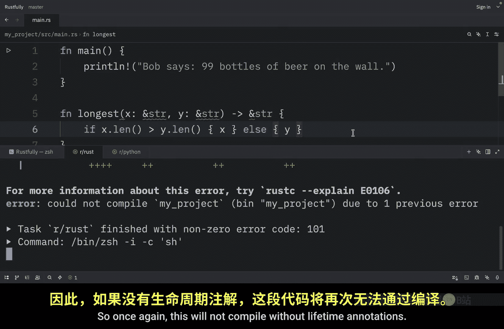
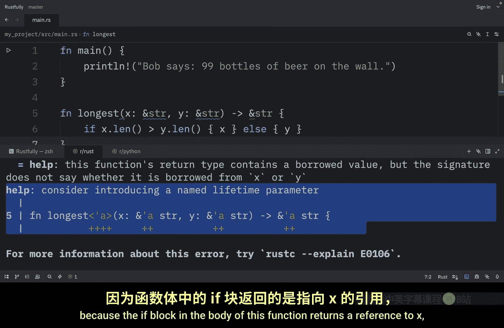
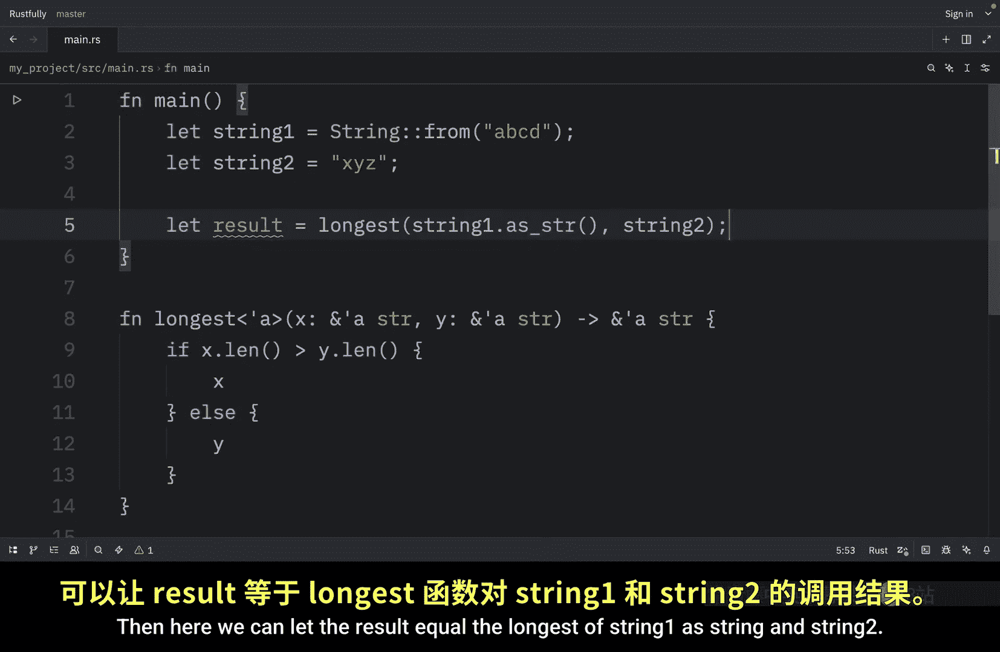

# Rustfully【中英⚡Rust 初学者教程（2025）｜Rust for beginners (2025)】 p70 P70 Rust中的生命周期很好 -BV1eyAkzPEhj_p70-

Now that you know where the lifetimes of references are and how rust analyzes lifetimes to ensure that references will always be valid。

 let's explore generic lifetimes in function parameters and return values。

 In this video will write a function that returns the longer of two string slices。

 This function will take two string slices and return a single string slice。

 We want the function to take string slices， which are references rather than strings because we don't want the function to take ownership of its parameters。

 right now， if we try to implement the longest function without lifetime annotations。

 it won't compile。 The compiler can' tell whether the reference being returned， refers to X or Y。

 because we don't know which branch will execute at compile time。 So once again。

 this will not compile without lifetime annotations。 And in the help， it will ask us to consider。😊。

Introducing a named lifetime parameter。 So this help text reveals that the return type needs a generic lifetime parameter on it because rust can't tell whether the reference being returned。

 refers to X or Y。 or actually we don't know either because the if block in the body of this function returns a reference to X and the else block returns a reference to Y。

 when we're defining this function， we don't know the concrete values that will be passed into this function。

 so we don't know whether the if case or the else case will execute We also don't know the concrete lifetimes of the references that will be passed in。

 so we can't look at the scopes to determine whether the reference we return will always be valid Now。

 lifetime annotations don't change how long any of the references live Rather they describe the relationships of the lifetimes of multiple references to each other without affecting the lifetimes just as functions can accept any。

Type when the signature specifies a generic type parameter。

 functionss can accept references with any lifetime by specifying a generic lifetime parameter。 Now。

 lifetime annotations have a slightly unusual syntax。

 The name of lifetime parameters must start with an apostrophe and are usually all lowercase and very short like generic types。

 Most people use the name apostrophe a for the first lifetime annotation。

 and we place lifetime parameter annotations after the ampersand of a reference using a space to separate the annotation from their references type。

 For example， here we have a regular reference， which is a reference of I 32。

 a reference with an explicit lifetime would look like this。 ampersand apostrophe a and the type。

 Now， a mutable reference with an explicit lifetime would look like this。😊，Apersan， apostrophe。

 the lifetime name followed by mute and the type one lifetime annotation by itself doesn't really have much meaning because the annotations are meant to tell rust how generic lifetime parameters of multiple references relate to each other。

 Let's examine how the lifetime annotations relate to each other in the context of the longest function。

 So let's go back to our longest function which would not compile because it's missing lifetimes to use lifetime annotations in function signatures。

 we need to declare the generic lifetime parameters inside angle brackets between the function name and the parameterist just as we did with generic type parameters So here we can open up a pair of angle brackets and place in apostrophe a And here instead of just ampersan string。

 we're going to type in ampersand apostrophe a string and we're going to do the same thing for y and then for the return type we will do the same thing。

Once again。 and these apps should be removed。 So here we want the signature to express the following constraint。

 The returned reference will be valid as long as both of the parameters are valid。

 This is the relationship between lifetimes of the parameters and the return value。

 the function signature now tells rust that for some lifetime。

 which right now is a the function takes two parameters。

 both of which our string slices that live at least as long as lifetime A the function signature also tells rust that the string slice returned from the function will live at least as long as lifetime A in practice。

 it means that the lifetime of the reference returned by the longest function is the same as the smaller of the lifetimes of the values referred to by the function arguments。

 Remember， when we specify the lifetime parameters in this function signature when not changing the lifetimes of any values passed in or returned。

Rather， we're specifying that the B checker should reject any values that don't adhere to these constraints。

 the longest function doesn't need to know exactly how long X and y will live only that some scope can be substituted for a that will satisfy these signature Now if we want to use this function we can create two strings inside main one called string1 and one called string 2 then here we can let the result equal the longest of string1 as string and string 2 and finally we can print the result that the longest string is result Now if we were to run this what we should get as an output is that the longest string is abudda or ABcD My recommendation is that you always think about the lifetime relationships when writing functions that return references the key insight is that the returned reference must be valid for at least as long as the shorter of the input lifetimes。

