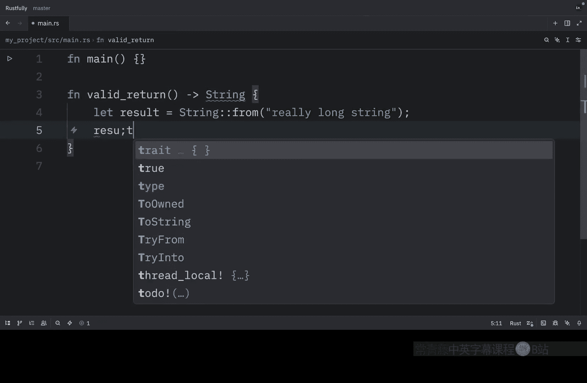
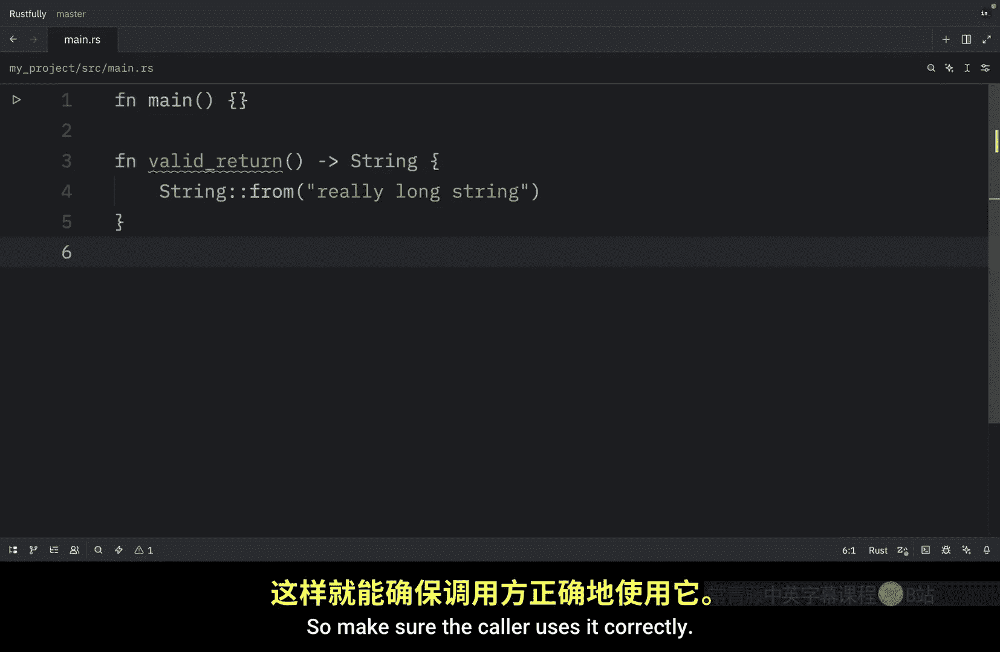

# Rustfully【中英⚡Rust 初学者教程（2025）｜Rust for beginners (2025)】 p71 P71 Rust中的生命周期很重要 -BV1eyAkzPEhj_p71-

In this video， we're going to continue learning about lifetimes in rust。

 When annotating lifetimes in functions， the annotations go in the function signature。

 not in the function body。 the lifetime annotations become part of the contract of the function。

 much like the types in the signature， having function signatures contain the lifetime contract means the analysis the rust compiler does can be simpler。

 if there is a problem with the way a function is annotated or the way it is called the compiler errors can point to the part of our code and the constraints more precisely。

 when we pass concrete references to a function with lifetime parameters。

 the concrete lifetime that is substituted for the generic lifetime is the part of the scope that overlaps between the parameters。

 In other words， the generic lifetime will get the concrete lifetime that is equal to the smaller of the lifetimes of the input references。

 Let's look at how the。😊，Lifetime annotations restrict the longest function by passing in references that have different concrete lifetimes so for this example we're going to create a string called string1 and this will be a string from long string is long then we're going to create a separate scope and inside here we're going to create a second string called string 2 which will be a string from X Y and Z and we're going to let the result equal the longest of string 1 and string2 and then we're going to print that the longest string is the result what's important to note here is that string2 goes out of scope here but that's okay because result is also out of scope by the time we reach this point and right now if we were to run this we would get that the longest string is long string is long and that actually took me a moment to understand so one thing that I'm going to do is add a colon here and rerun that and now this makes much more sense to me so all of this is valid。

In this example， string1 is valid until the end of the alercope while string2 is only valid until the end of the innercope and the result over here references something that is valid until the end of the innercope this means that the B checker approves this because the return reference doesn't outlive the shorter of the two input lifetimes but now let's try an example that shows that the lifetime of the reference in result must be the smaller lifetime of the two arguments so here what we're going to do is type in let result and below we're going to remove this part over here and paste it directly under and instead of let result。

 we're just going to say that the result equals the longest of these two strings and now when we run this you'll notice that we're going to end up with an error and if we open up the terminal a bit more you'll see that the error shows that for result to be valid for the print line statement string2。

Would need to be valid until the end of the outer scope。 In other words。

 string 2 does not live long enough。 As humans， we can look at this code and see that string one is longer than string 2。

 and therefore result will contain a reference to string one because string one has not gone out of scope yet。

 a reference to string one will still be valid for the printline statement。 However。

 the compiler can't see that the reference is valid in this case。

 we've told Ru that the lifetime of the reference returned by the longest function is the same as the smaller of the lifetimes of the references passed in。

 therefore the borrow checker， this allows this code as possibly having an invalid reference。

 The way in which you need to specify lifetime parameters depends on what your function is doing。

 For example， if we change the implementation of the longest function to always return the first parameter rather than the longest string slice we wouldn't need to specify a lifetime on the y parameter。

 So in that case。We could just remove this because we would always return X and obviously this is just an example used for demonstration purposes。

 ideally， you would like to return the longest value。

 not just the first one but here we've specified a lifetime parameter for the parameter X and the return type but not for the parameter Y because the lifetime of y does not have any relationship with the lifetime of X or the return value in this example and this is an important insight you only need to annotate lifetimes that are related to each other if a parameter's lifetimes doesn't affect the return value you don't need to annotate it when returning a reference from a function。

 the lifetime parameter for the return type needs to match the lifetime parameter for one of the parameter If the reference returned does not refer to one of the parameter it must refer to a value created within this function。

 However， this would be a dangling reference because the value will go out of scope For example here we。

ha a function called invalid return and this will contain a very long string and we want to return that as a string but since the result goes out of scope。

 this becomes a dangling reference and this won't compile So the problem is that the result goes out of scope and gets cleaned up at the end of the function and we're also trying to return a reference to result from the function there is no way we can specify lifetime parameters that would change the dangling reference and rust won't let us create a dangling reference in this case the best fix would be to return an owned data type rather than a reference so that the calling function is then responsible for cleaning up the value so in this case we're going to change this to a valid return。

 remove the lifetime parameter and say that we are returning a string then all we need to do here is return the result。

So here we are returning ownership instead of a reference。And yes。

 this could also be simplified to just returning the string directly just like this。

That's not the pointUltimately lifetime syntax is about connecting the lifetimes of various parameters and return values of functions Once they're connected。

 rust has enough information to allow memory safefe operations and disallow operations that would create dangling pointers or otherwise violate memory safety personally I like to think of lifetime annotations as a way to tell the compiler hey。

 this reference I'm returning is tied to the lifetime of this parameter。

 so make sure the collar uses it correctly。

