# Rustfully【中英⚡Rust 初学者教程（2025）｜Rust for beginners (2025)】 p72 P72 生命周期在Rust中无处不在 -BV1eyAkzPEhj_p72-

This is the fourth video on lifetimes。 So far， thestructs we've defined all holdown types。

 We can definestructs to hold references， but in that case。

 we need to add a lifetime annotation on every reference in thestruct definition。

 This is important because if astruct holds a reference。

 That reference must be valid first long as thestruct exists。

 The lifetime annotation tells rust exactly how long the reference needs to live。

 Let's create astruct that holds a string slice。 Thisstruct will need a lifetime annotation because it contains a reference。

 So here we create astruct called important excerpt right after we're going to open up a pair of angle brackets and pass in a lifetime annotation。

 Then inside we can create the part and this part will contain a string slice。 But of course。

 we're going to annotate it with a lifetime annotation。 So here we can use the amant。

 The apostrophe and an a followed by the string。 Thisstruct has the single field。😊。

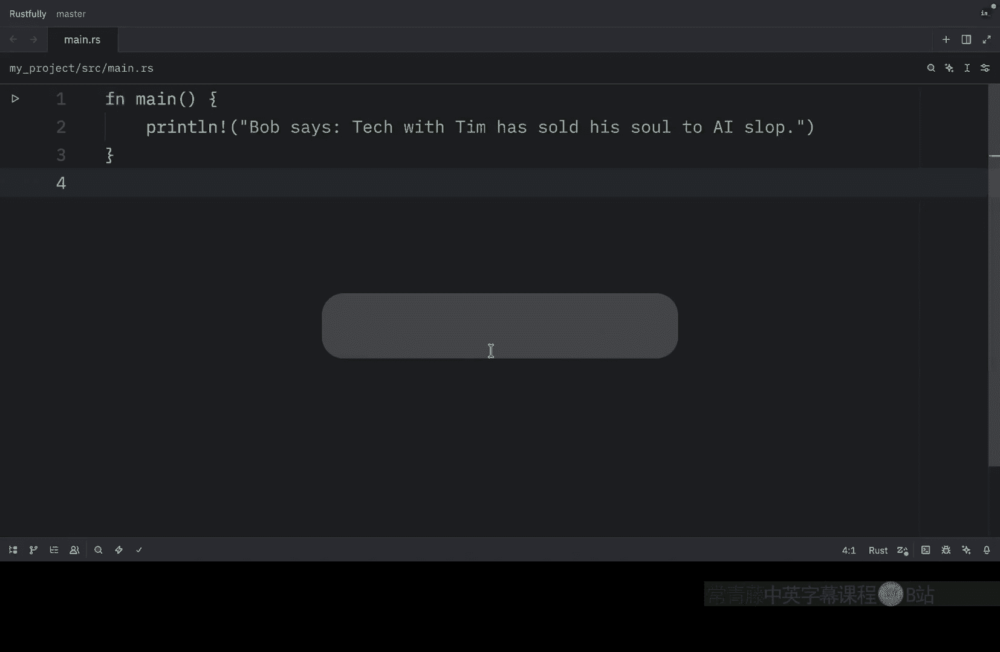

That holds a string slice， which is a reference As with generic data types。

 we declare the name of the generic lifetime parameter inside angle brackets after the name of the struct so that we can use the lifetime parameter in the body of thestruct definition。

 This annotation means an instance of important excerpt can't outlive the reference it holds in its part field。

 In other words， thestruct must be destroyed before the data it references goes out of scope。

 Let's see how this works in practice。 So in our main function we're going to create a novel which will equal a string from call me Imail。

 Some years ago， then we're going to let the first sentence equal novel dot split dot next。

 and then we will unwrap it below that we're going to let I equal the important excerpt and the part is going to contain the first sentence。

 and finally， we're going to printline that the excerpt is I dot part。

 Both novel and first sentence must。

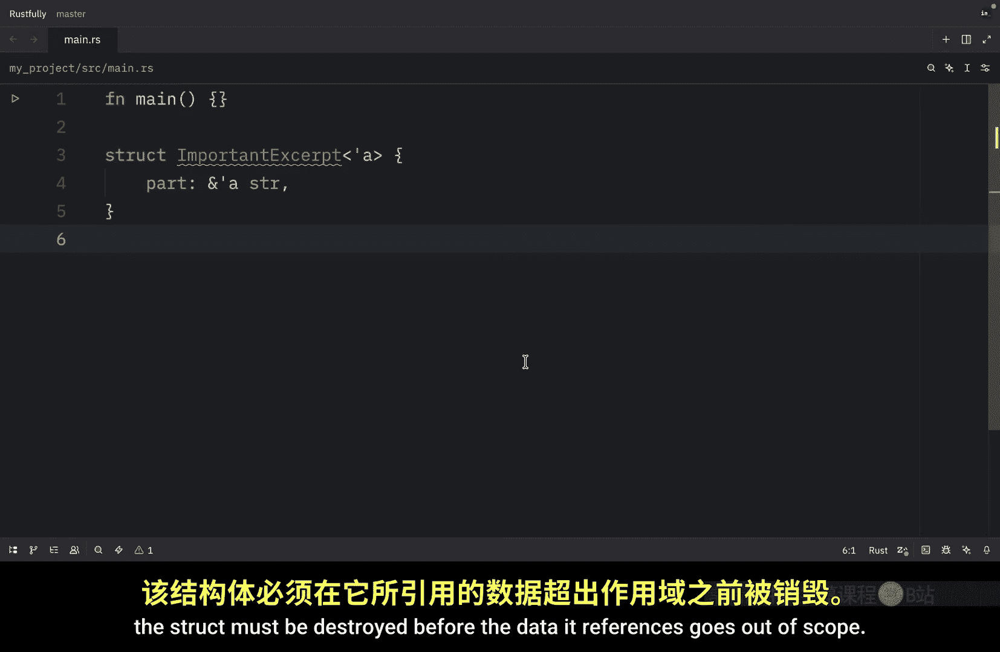

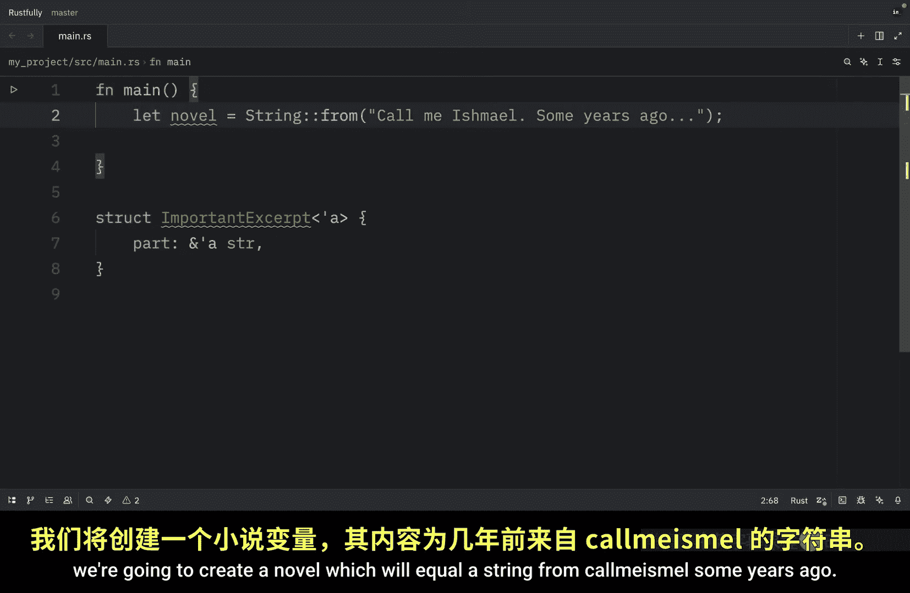

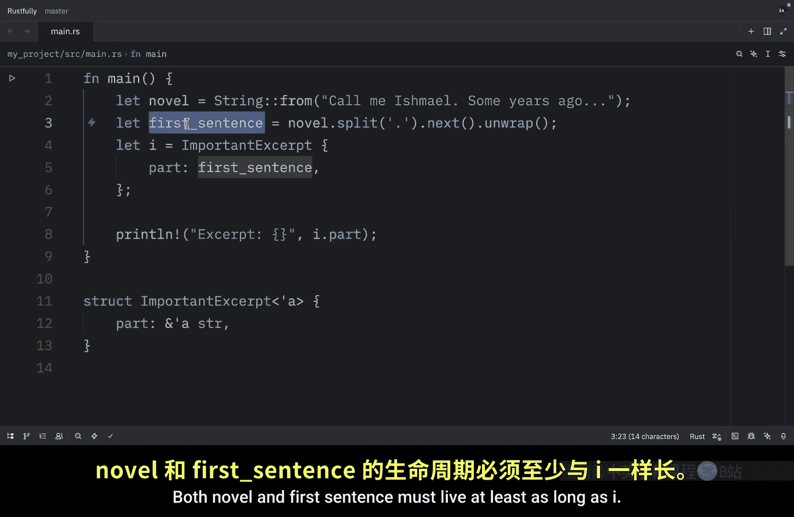

Live at least as long as I And now when we run this。

 what we should get as the first sentence is call me Ismailel。 Anyway。

 the data in novel exists before the important exc instance is created In addition。

 novel doesn't go out of scope until after the important excerpt goes out of scope So the reference in the important accept instance is valid。

 if we try to create an important excerpt with a reference that goes out of scope before thestruct would get a compile error。

 This is exactly what lifetimes prevent。 At this point you've learned that every reference has a lifetime and that you need to specify lifetime parameters for functions orstructs that use references。

 However， we've already seen functions that compiled without lifetime annotations。

 let me show you one here we have a function called first word This function compiles without lifetime annotations。

 Even though both the parameter and return types are references。 The reason this function compiled。

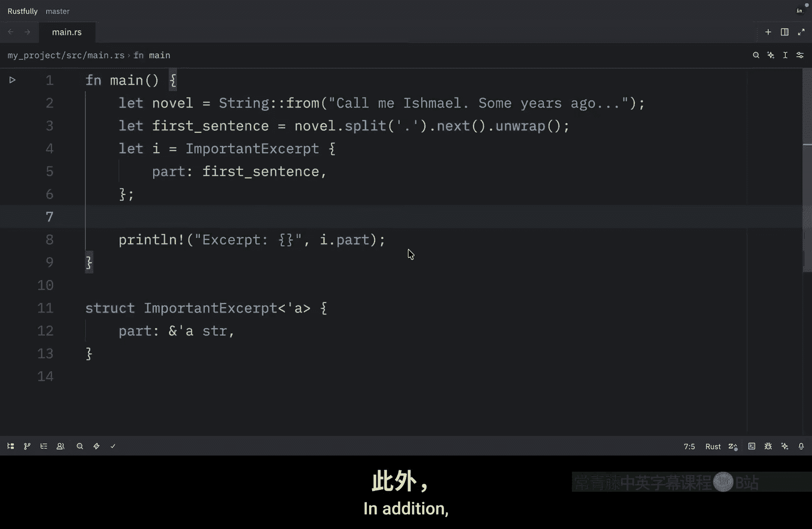

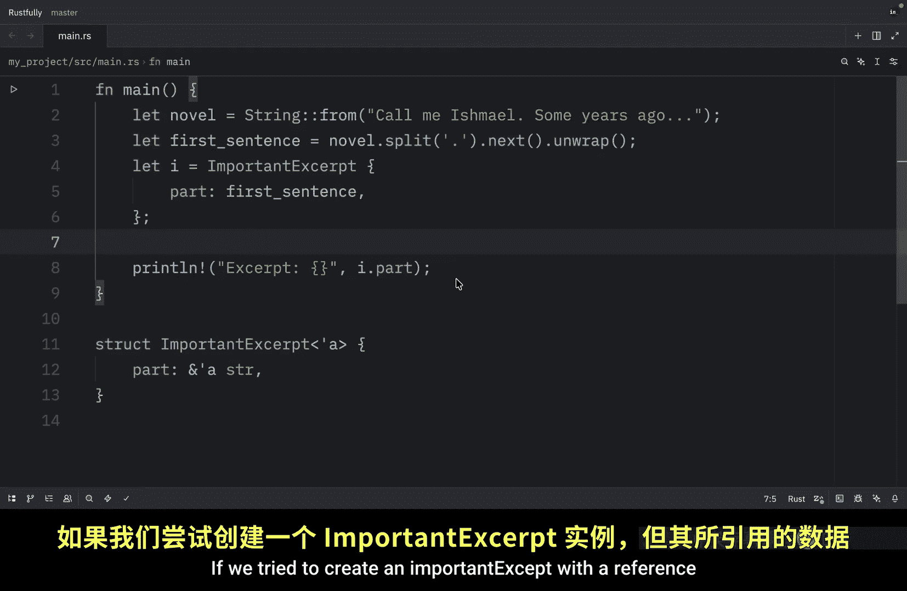

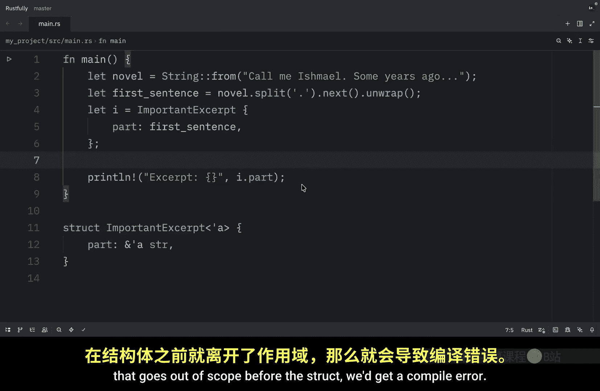

Without lifetime annotations is historical in early versions。

 this code wouldn't have compiled because every reference needed an explicit lifetime At that time。

 the function signature would have been written like this。

 After writing a lot of rust code the rust team found that Ru programmers entering the same lifetime annotations over and over in particular situations these situations were predictable and followed a few deterministic patternss。

 The developers programmed these patterns into the compiler's code so that the borrowcheer could infer the lifetimes in these situations and wouldn't need explicit annotations。

 As you can see， my code editor shows me these inferred type annotations in gray or these lifetime annotations in gray。

 The patternss programmed into rust's analysis of references are called the lifetime all rules these aren't rules for programmers to follow theyre a set of particular cases that the compiler will consider and if your code fits these cases you don't need to write the lifetimes explicitly。

The all rules don't provide full inference If there is still ambiguity about what lifetimes the references have after Rut applies the rules。

 the compiler won't guess what the lifetime of the remaining references should be instead of guessing the compiler will give you an error that you can resolve by adding the lifetime annotations Lifes on function or method parameters are called input lifetimes and lifetimes on return values are called output lifetimes the compiler uses three rules to figure out the lifetimes of the references when there aren't explicit annotations We'll cover these rules in detail in the next episode but for now just know that the compiler can often figure out lifetimes automatically for common patterns personally I find lifetime all really helpful because it means I don't have to write lifetime annotations for every single function Most of the time the compiler can figure it out and when it can't it will tell me exactly what I need to add and before we conclude this lesson let's run the function first word so here I'm going to create。

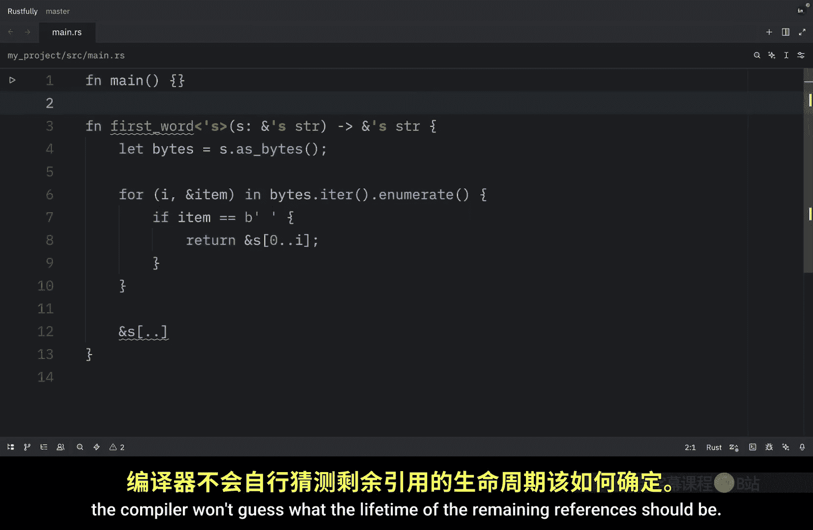

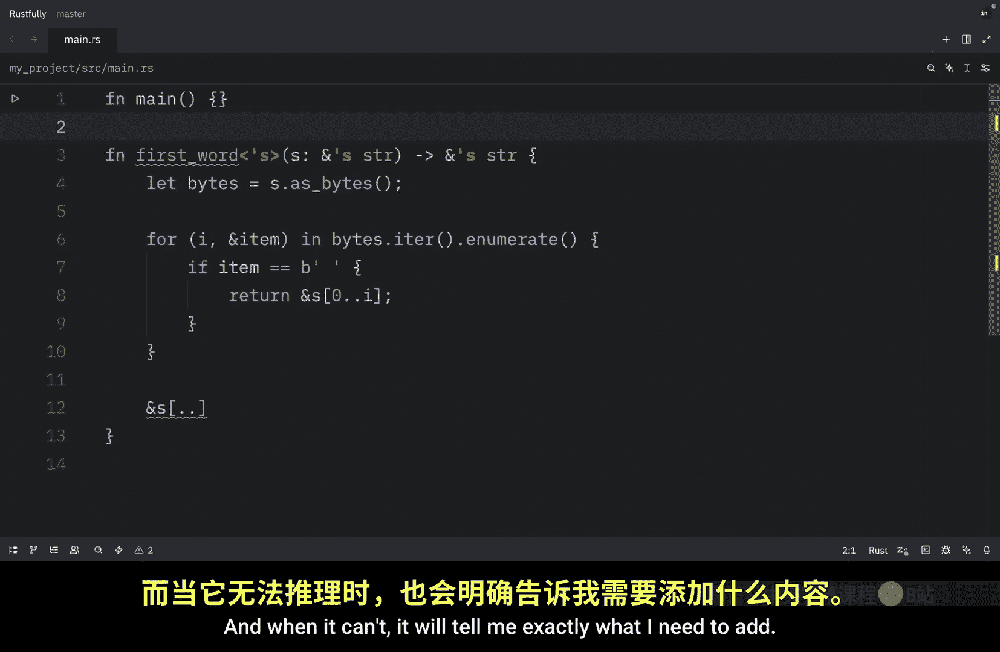

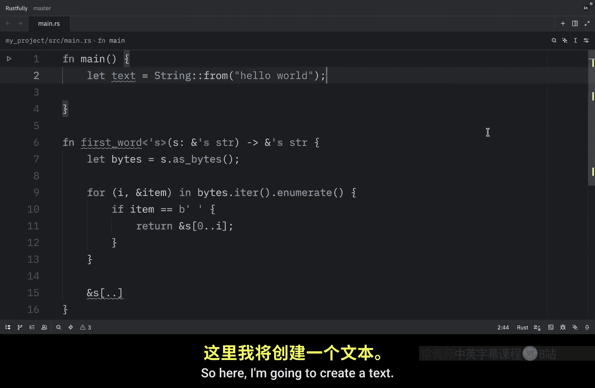

A text， which will be of type string。 and we're going to find out what the first word of that text is by passing in a reference to that text。

 Then right below， we can print that the first word is the word。

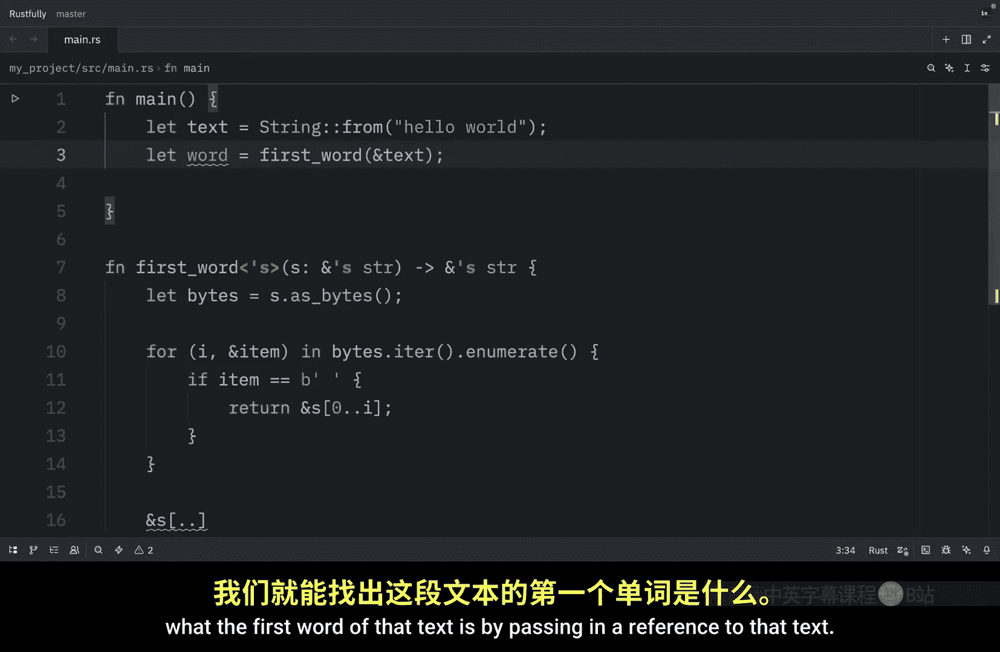

And when we run this， we should get hello as an output。

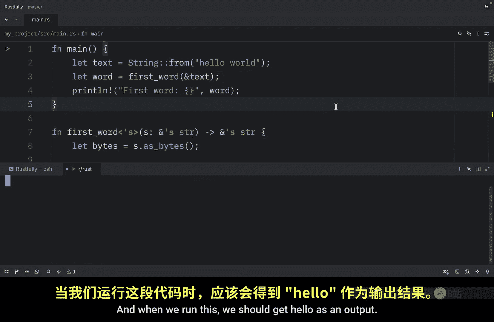