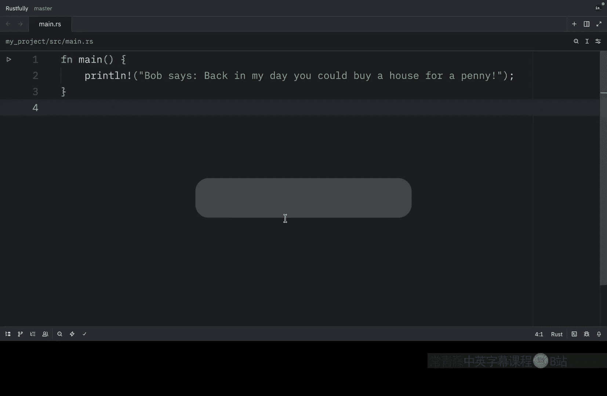
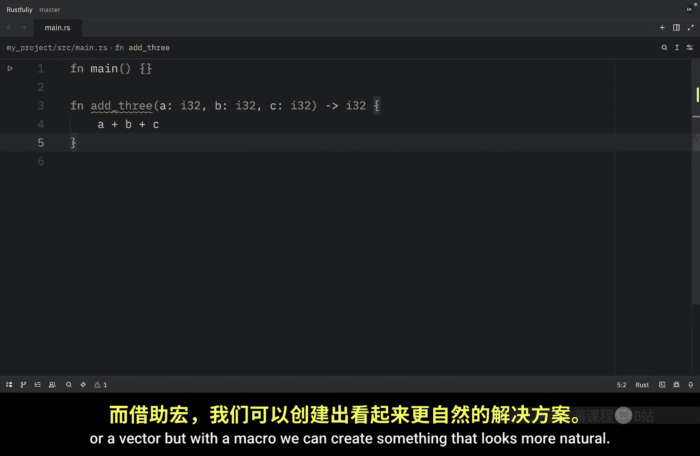
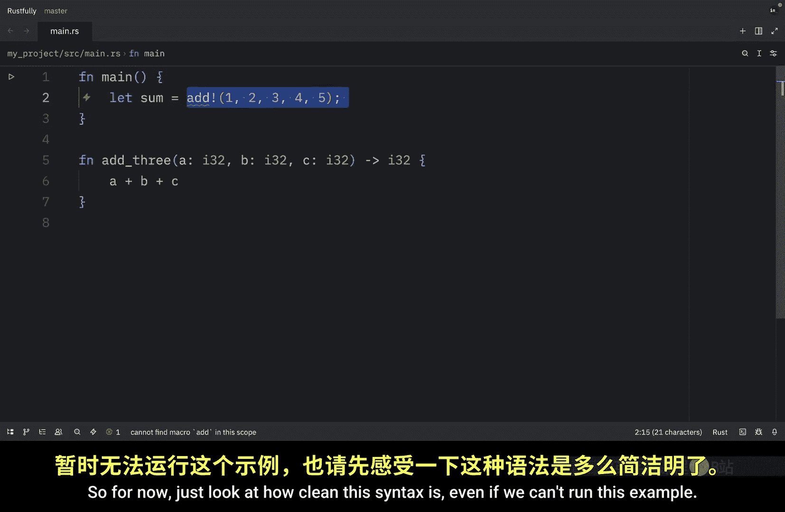
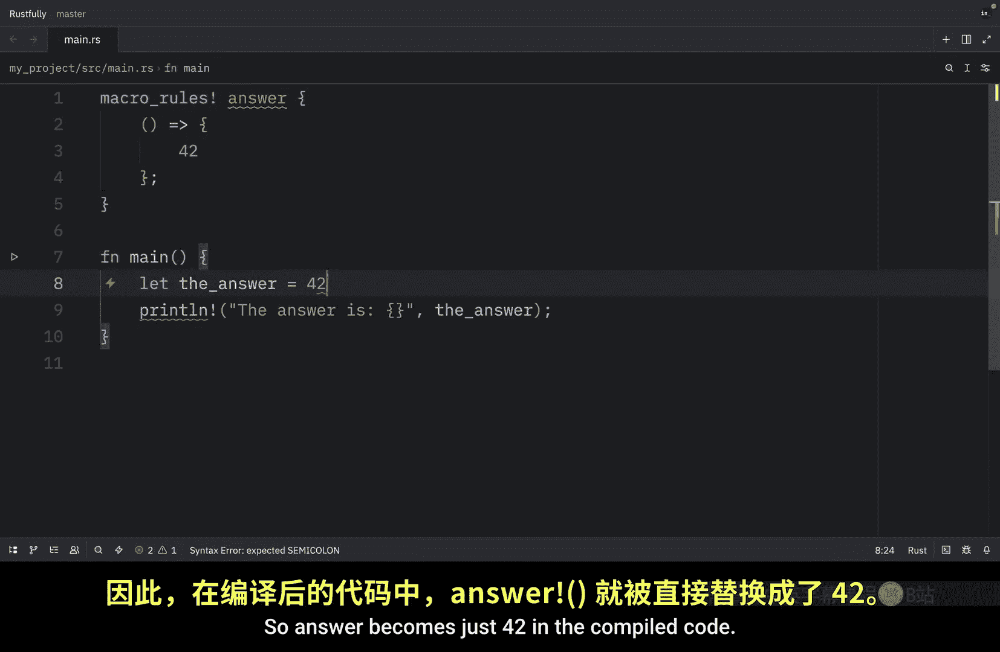

# Rustfully【中英⚡Rust 初学者教程（2025）｜Rust for beginners (2025)】 p75 P75 Rust中的宏非常棒 -BV1eyAkzPEhj_p75-

How's it going everyone In today's video series， we're going to learn about one of Ru's most powerful features。

 Declarative macros。 Now macros in Ru are a way to write code that writes other code。

 which is known as meta programminggramm This might sound complicated。

 but once you understand the basics macros become an incredibly useful tool in your rust toolkit。

 The confusing part isn't really understanding what macros do。 they generate code at compile time。

 The confusing part is understanding the syntax and when to use macros versus regular functions。

 especially if you're coming from languages like Python or jascript where you might not have encountereded macros before In this series I'm going to show you how declarative macros work step by step We'll start with the basics and build up to more complex examples。

 My recommendation is that you follow along and try modifying the examples yourself。

 That's the best way to really understand how macros work。 Before we dive into the syntax。

 let's talk about what macros actually。

A macro is a way to define reusable code patterns When you call a macro。

 it expands into code at compile time before your program actually runs。

 This is different from functions in a few important ways。

 functions are called at runtime macros are expanded at compile time。

 macros can take a variable number of arguments。 macros can generate code that functions cant and you've actually been using macros this whole time without realizing it。

 printline is a macro and so is vector and even format。

 which is a macro that creates a formatted string。 The exclamation mark is how you distinguish macros from functions When you see printline or V you know you're calling a macro。

 not a function。 This is important because macros can do things that functions cut like take a variable number of arguments So why would you want to use macros instead of regular。

unsThere are several good reasons。 The first one being cogeneration macros can generate repetitive code for you。

 Second variable arguments。 macros can take different numbers of arguments Third compile time checks macros can perform checks at compile time。

 and finally， domain specific languages。 macros can create mini languages for specific tasks。

 Personal I like to think of macros as a way to reduce boilerplate and make code more expressive。

 but you should use them judiciously。 not everything needs to be a macro。

 let's look at a simple example of what macros can do that functions can Here's a function that can only take a fixed number of arguments。

 and we will call it add3， but what if we want to add a variable number of numbers with a function we need to use a slice or a vector but with a macro we can create something that looks more natural we。

Going to learn how to create is this macro over here。 As you can see， it looks far more natural。

 You just add the numbers to the add macro and it gives you the sum。

 we don't have to pass in a vector or anything。 but once again。

 we're going to learn how to do this in the next episode。

 So for now just look at how clean this syntaxes even if we can't run this example  moving on。

 I just want to quickly mention that rust has three types of macros。

 starting with declarative macros。 and this is the one that we're learning about in this series。

 and these are written using a macro rules macro they are pattern matching-based and they are the most common and easiest to understand。

 then we have procedural macros， they are more advanced and written as rust code。

 although we won't be covering these in this series and finally we have built in macros which are provided by the standard library The example we have print line or print all of these are built in macros。

In this series we're focusing on declarative macros because they're the most accessible and cover most use cases。

 but now let's take a look at how macros work when you write a macro。

 you're essentially writing a pattern match the macro system looks at the code you pass to the macro matches it against patterns you've defined and then generates code based on those patents This all happens at compile time so there's no runtime overhead The macro expands into regular Ru code which then gets compiled normally let's take a look at a very simple example to get a feel for how this works we'll create a macro that just returns the number 42 This macro is called An and it takes no arguments as you can tell by the empty parentheses。

When you call it， it expands to the number 42， but now let's try using it。

 So here we're going to create an answer called the answer。

 and that's going to call the answer macro then with that。

Does that have to be written above， Is that the first time I have to write something above？

Interesting and now when we run this what we should get as an output is that the answer is 42 when the compiler sees answer。

 it matches it against our pattern， which is the empty parentheses and replaces it with 42 so answer becomes just 42 in the compiled code and this is a trivial example but it shows the basic idea macros match patterns and generate code in the next episode we'll learn how to write more useful macros with actual patterns。

