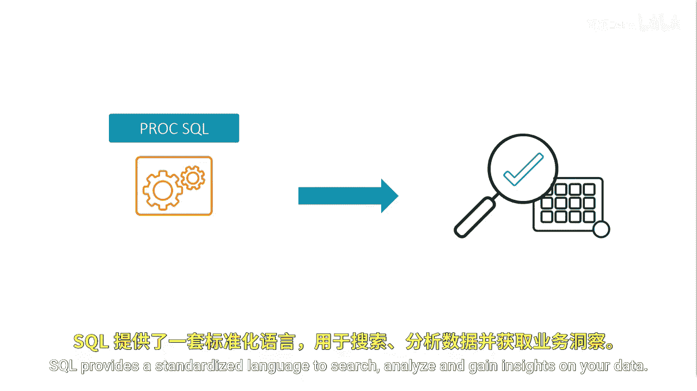
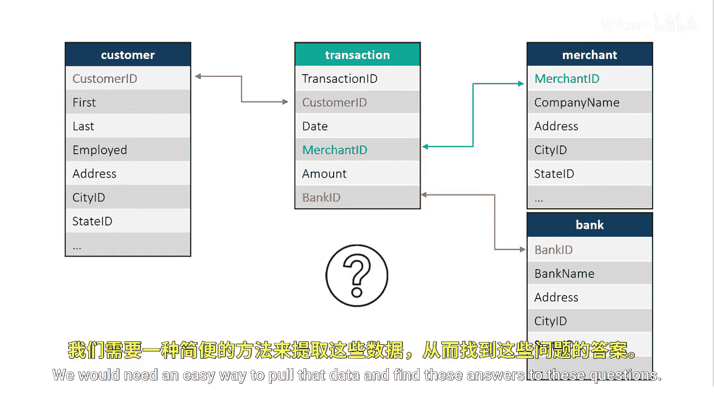
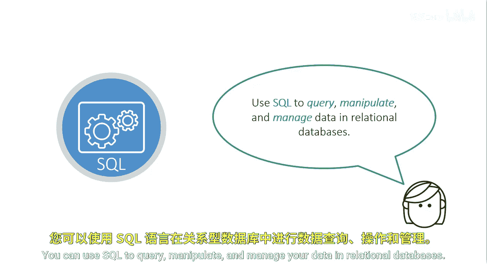
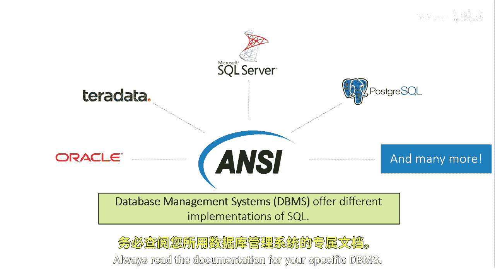

# SAS【中英⚡SAS高级程序员 专项课程｜SAS Advanced Programmer Professional Certificate】 p03 P3 01_什么是SQL -BV1Cfe3z3EoA_p3-

Before we dive into an understanding of SQL， let's first review tables。

 recall that SAS tables are structured tables that contain rows and columns。

Rows are also known as observations or records， and columns are also known as variables or fields。

A database is a large collection of structured tables organized in an easily accessible form。

Depending on your organization， you could have tens， hundreds， or thousands of tables， and thousands。

 millions or billions of rows。No matter the size of your collection of tables。

 there's a good chance that tables are related。

SQL provides a standardized language to search， analyze， and gain insights on your data。

Let's look at a collection of four tables。Each of these tables contains rows and columns The customer table has information about customers like names。

 addresses， etc the transaction table has customer transaction information like customer ID。

 date purchased merchant purchased from etc The merchant table has merchant information like company name location and contact information etc and the bank table has bank information like bank name。

 location and contact information these tables are related by specific key typically called a primary key the primary key is a unique value that identifies rows in a table。

The customer ID in the customer table references specific customer information。

 and in the transaction table， the customer ID references a specific purchase for that customer。

TheCustom ID in the transaction table is typically known as the For key。

The merchant ID in the merchant table references a specific merchant name。

 and in the transaction table references a customer specific transaction at a merchant。

With these relationships， we can begin to investigate our data What if we wanted to find the names and locations of all customers in the transaction table from North Carolina？

Or the number of transactions for each merchant or customer。

What about which bank typically has the most transactions？

We would need an easy way to pull that data and find these answers to these questions。

You can use SQL to query， manipulate， and manage your data in relational databases。

SsQL was invented in the early '70s after the proposal of the relational data model。

After its inception， EQL grew in popularity and became standardized through the American National Standards Institute in the mid-1980s。

Since then， the standard has been revised numerous times to include a larger set of features。

SS began to implement SQL with the SQL procedure in the '90s。

 adhering to the first major revision of the anNsI standard。

Although PRC SQL incorporates many of the standards， SAS SQL is not NC compliant。

Despite SQL having a set of standards， it's important to understand database management systems or DBMSs offer different implementations of the standard SQL。

Database management systems like Oracle， Terraadata， SQL Server， Postgres。

 and a variety of others all follow ansI standard SQL， however some might have keywords。

 features and enhancements that will be slightly different between systems。

While it might differ slightly， no matter which implementation of ani standard SQL you learn。

 understanding the SQL language in one system will allow you to transition to another pretty seamlessly。

Always read the documentation for your specific DBMS。

