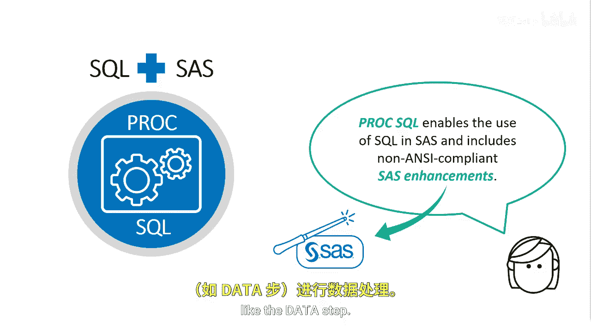
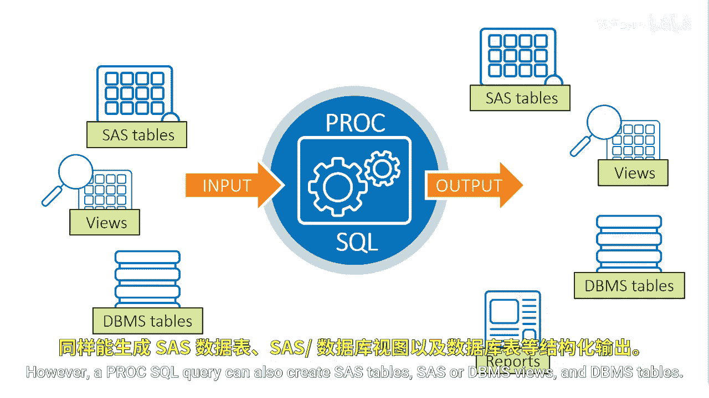

# SAS【中英⚡SAS高级程序员 专项课程｜SAS Advanced Programmer Professional Certificate】 p04 P4 02_什么是PROC SQL -BV1Cfe3z3EoA_p4-

The SQL procedure or PRC SQL is the base SAS AI standard implementation of structured query language。

Proc SQL enables the use of SQL in SAS and includes non anI compliant SAS enhancements。

Throughout the course， we'll mark SASs enhancements with the logo and make you aware of some differences。

Think of ProC SQL as a combination of SAS and SQL The SAS implementation allows you to use SQL on your SAS programs with the additional features that SAS offers like the data step。

As you go through the process of making data meaningful and actionable using SQL。

 keep in mind the SAS programming process。SQL allows you to follow the basic steps of accessing structured tables like SAS or DBMS tables however。

 SQL can't access unstructured files like text， JSON or CSV。

You can use SAS to access those unstructured files。With SQL。

 you can explore and get a better understanding of your data and what you might need to add or change after you understand your data。

 you can prepare it for analysis once the data is ready， you can analyze and report on it。Lastly。

 using SQL in the SAS environmentviron allows you to continue to access data in a variety of formats and export results to various report and data formats。

Like most other SAS procedures， ProCSQL can read in SAS tables， SAS or DBMS views， and DBMS tables。

As output， a Pro SQL query creates a report by default； however。

 a Pro SQL query can also create SAS tables， SASR DBMS views， and DBMS tables。

