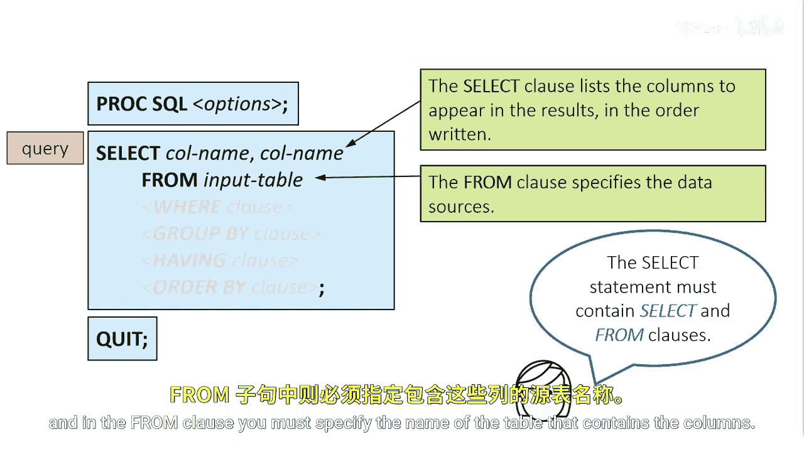
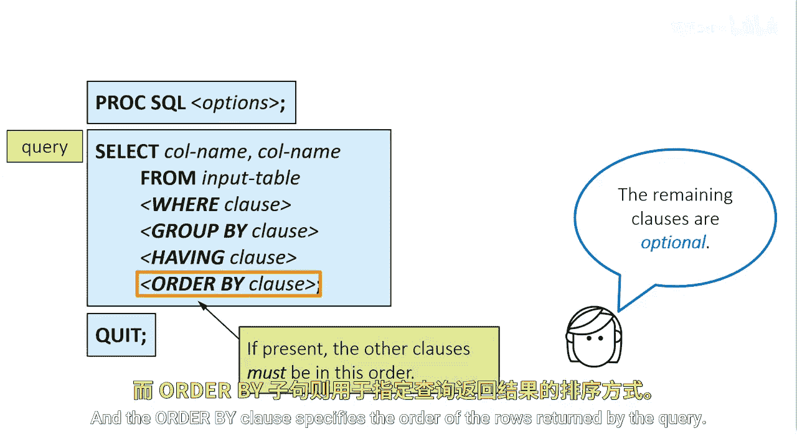
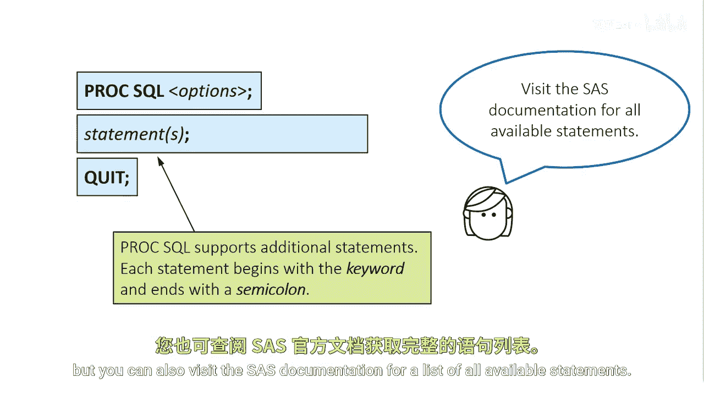

# SAS【中英⚡SAS高级程序员 专项课程｜SAS Advanced Programmer Professional Certificate】 p05 P5 03_PROC SQL语法 -BV1Cfe3z3EoA_p5-

The SQL procedure is initiated with a PRC SQL statement and it's terminated with a quit statement。

Multiple statements can be included in a PR SQL step and each statement defines a process and executes immediately。

 no run statement is needed。

The select statement is a most commonly used SQL statement and is usually referred to as a query。

It retrieves data from one or more tables and creates a report that displays the data。

Like many statements in PRC SQL， the select statement is composed of building blocks called clauses and ends with a semicolon。

Because the select statement is broken into clauses， SQL is described as a modular language。

At a minimum， your query must specify two things in the select clause。

 you must specify a list of column names to retrieve， separated by commas， and in the from clause。

 you must specify the name of the table that contains the columns。

The remaining clauses are optional， but you'll likely be using them frequently。If present。

 the clauses must be in this order， select from where Group by， having and order by。

 but not all clauses must be present。For example， you can use the wear clauses and order by clauses and not use the group by or having clauses。

The where clause enables you to filter rows of data。

 the group by clause enables you to process data in groups。

The Have clause works with the group by clause to filter grouped results。

And the order by clause specifies the order of the rows returned by the query。

Although the select statement is the most commonly used statement。

 Proc SQL allows for additional statements， each statement begins with a key word and ends with a semicolon。

In this course， you'll see a variety of additional statements。

 but you can also visit the SAS documentation for a list of all available statements。

