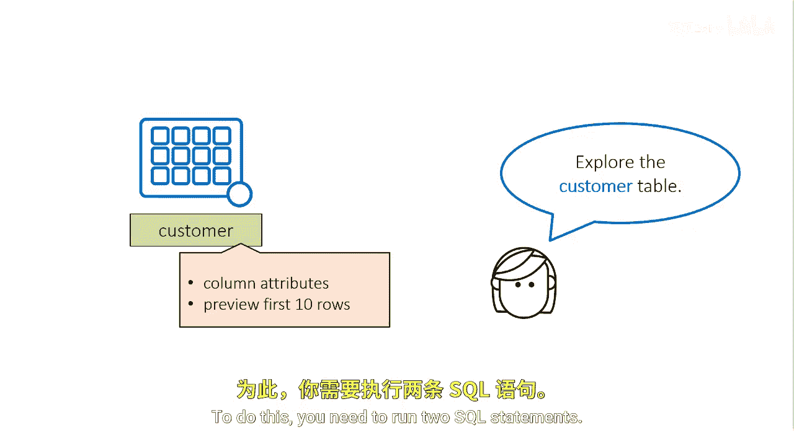
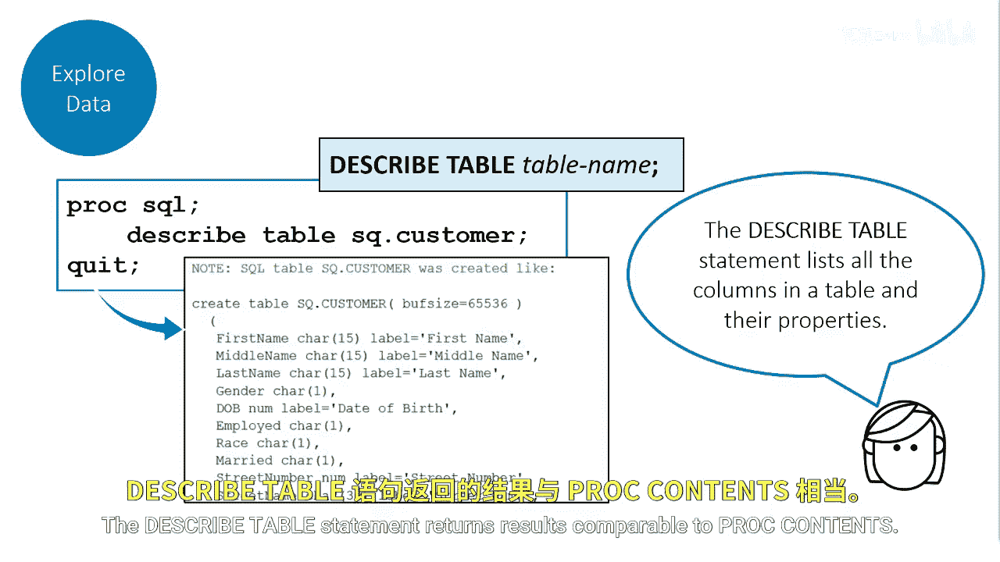

# SAS【中英⚡SAS高级程序员 专项课程｜SAS Advanced Programmer Professional Certificate】 p06 P6 04_探索表 -BV1Cfe3z3EoA_p6-

Consider this you're a new analyst who's learning Proc SQL。

 your first task is to explore the customer table。You want to look at the column attributes and preview the first 10 rows of the table。

To do this， you need to run two SQL statements。

First， you use a De table statement to see the column names and their properties you specify a Describe table and then the name of the table to describe SQ。

cusomer to generate a description of the table。SS writes a description to the log the results display the column name。

 column types， and associated labels if they exist for specific columns。

The described table statement returns results comparable to PR contents。

Secondly， you use a simple select statement and select the first name， last name。

 and state columns from the customer table。You separate the column names with commas。

By using the Os equals 10 data set option in the from clause。

 this query generates a report of only the first 10 rows。

You just want to preview the data so you don't need a report of the entire table。

An SQL query is similar to Pro print， which prints the observations in a table。

As sort of a general rule of thumb， when executing a query。

 you want to be cautious if you don't know the size of your table。Depending on the size of the table。

 you can accidentally create a report with 100，000， 500，000 or a million rows plus。

That most likely is unnecessary and could cause issues and or slow the system。Also。

 be aware that you can use other SAS data set options like keep equals， D equals。

 and where equals in ProC SQL。

