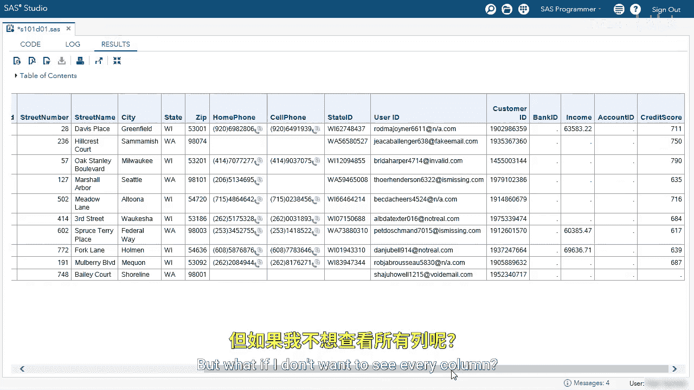
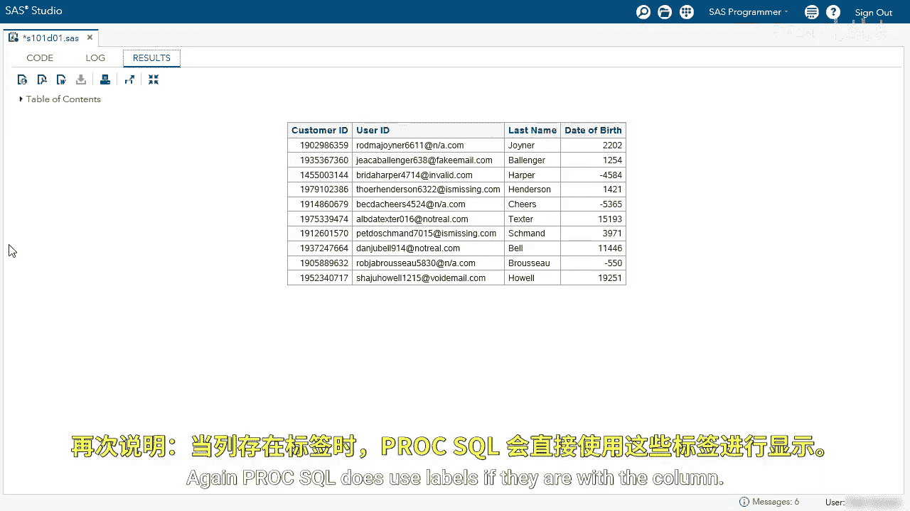

# SAS【中英⚡SAS高级程序员 专项课程｜SAS Advanced Programmer Professional Certificate】 p07 P7 05_演示：探索客户表 -BV1Cfe3z3EoA_p7-

We're going to start by exploring the customer table。

I'm going to use this De table statement on the SQ。t customer table。

I'm going to run the SQL procedure。In the log， we can see all the columns in the customer table。

 the column type， and then if there's a label or a format。I want to focus on the first few columns。

Look at first name， middle name， last name， all those are characters， and they all contain a label。

Let's look at the DOB column， that is a numeric column with the label date of birth。

The actual column name is DOB， but again， there is a label， and I want to show you that in a second。

In this next query， we're going to use the select statement to view the first 10 rows of the customer table。

I'm using the asterisk to select every column from the table。

Next we're going to use the from clause and select the customer table。

Before I run this code the customer table has over 100，000 rows， I don't need to see all 100。

000 rows to explore the table， so I'm going to use the Obs equals option to limit to the first 10 rows。

Now let's run our query。

Here we can see our results Let's focus on the date of birth column remember。

 I told you that the columns name is actually DOB， not date of birth。

 so by default ProCSQL uses associated labels with the columns If there is no label it'll use the column name。

We can also see the first 10 rows and every column in this table。

 but what if I don't want to see every column， let's go back to our editor。😊。

Instead of the asterisk， let's specify three columns， the first name。

 the last name in the DOV column。Now I'm going to run the query。If you specify the column names。

 we will only see those columns， so here we only see the first name。

 the last name and the DOB or date of birth column Let's go back to our editor。

And it's adjust our columns。Next， I want to specify the customer ID， user ID， last name， and DOB。

If I run this query， I'll now select those four columns。Again， we can see the four columns。

 a custom ID， user ID， last name and date of birth again。

 ProC SQL does use labels if they are with the column。

