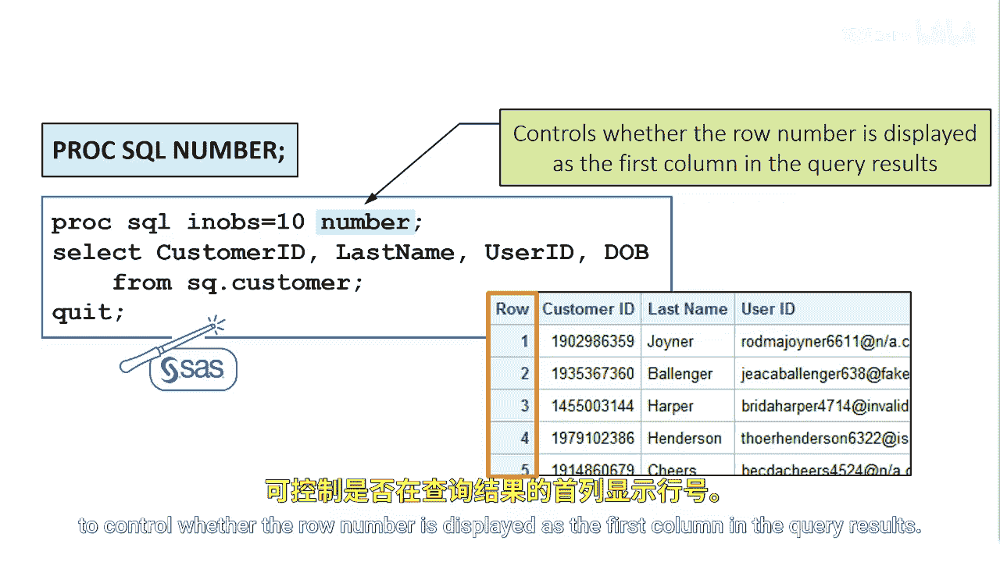

# SAS【中英⚡SAS高级程序员 专项课程｜SAS Advanced Programmer Professional Certificate】 p08 P8 06_SQL选项 -BV1Cfe3z3EoA_p8-

You can use ProC SQL options to control processing for example。

 you can use the NOs equals option in the Pro SQL statement to limit rows from each source table that contribute to a query the NOs equals option is similar to the Os equals dataset option。

The OutOs equals option restricts the number of rows that a query outputs。

 that is all the rows from the table or tables are processed， but only n rows or output。

You can also use options to control the display of your output。

 use the number option in the Pro SQL statement to control whether the row number is displayed as the first column in the query results。

