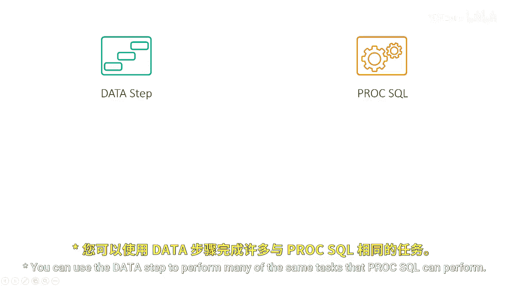
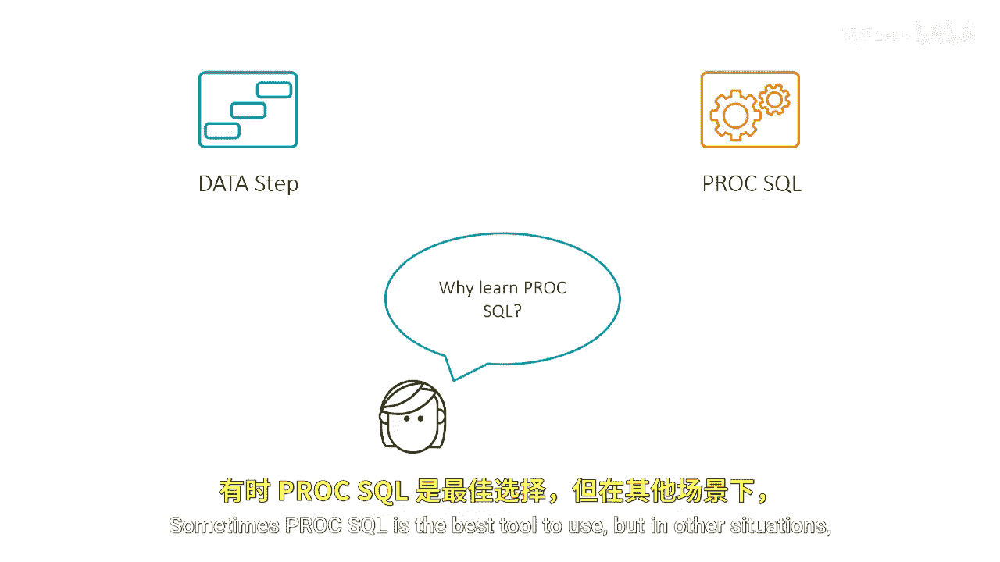
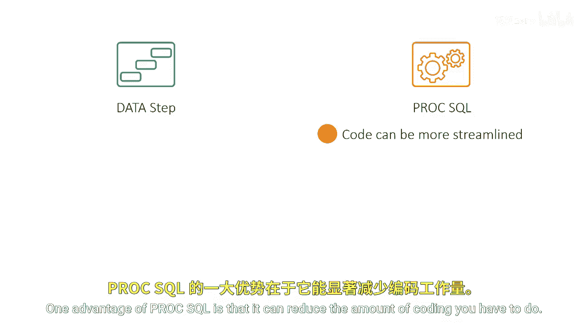
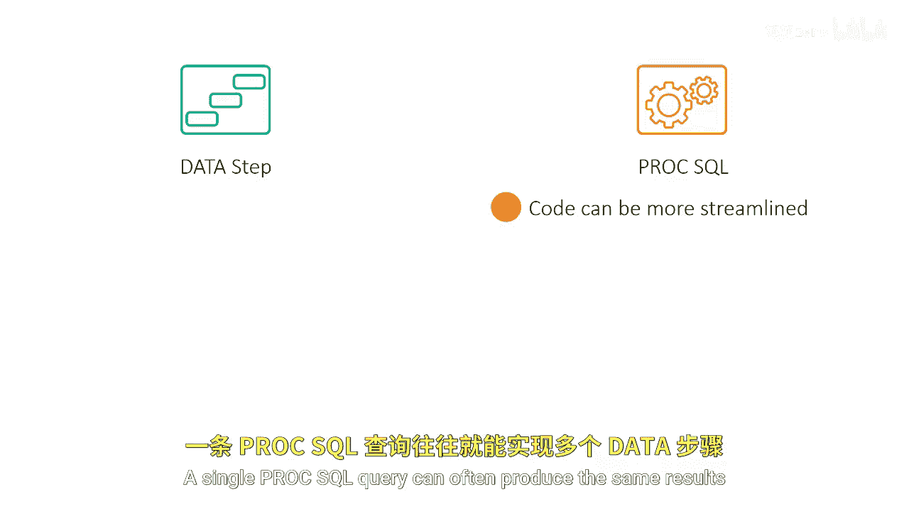
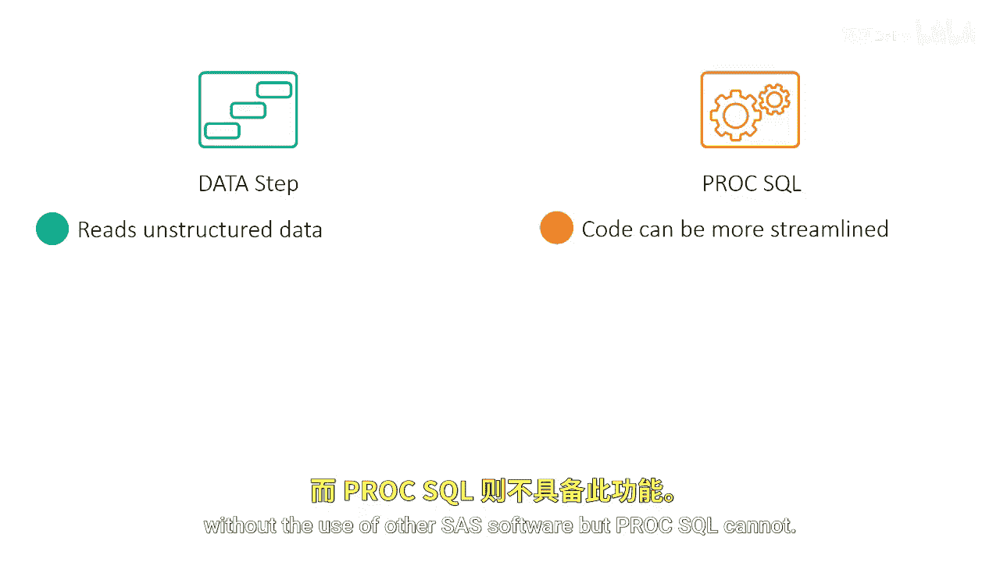
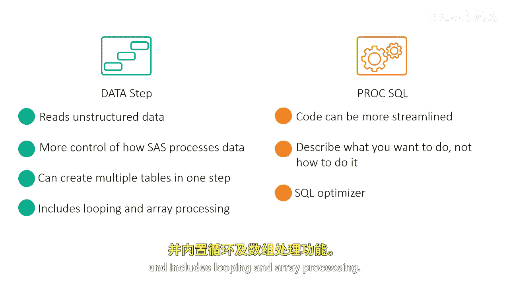
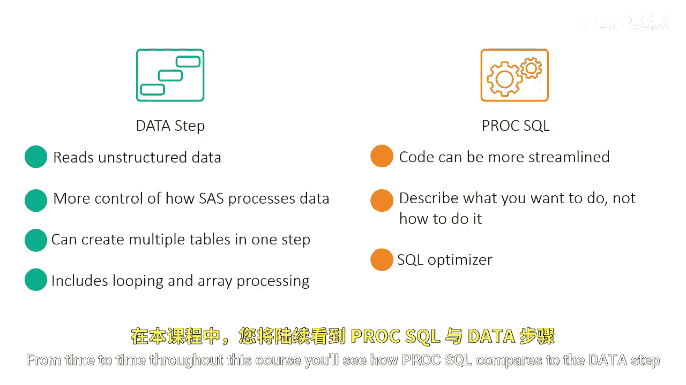

# SAS【中英⚡SAS高级程序员 专项课程｜SAS Advanced Programmer Professional Certificate】 p09 P9 07_比较SQL与DATA步 -BV1Cfe3z3EoA_p9-

You can use the data step to perform many of the same tasks that Pro SQL can perform。

 so why should you learn ProC SQL？

ProcSQL is a complement to the data step， not a replacement for it。

Sometimes Pro SQL is the best tool to use， but in other situations it's better to use the data step。

One advantage of ProC SQL is that it can reduce the amount of coding you have to do。

A single ProC SQL query can often produce the same results as multiple data steps and other proC steps。

On the other hand， if you want to use Bay SAS to read raw text files。

 you'll have to use the data step。

The data step can read various types of raw text files without the use of other SAS software。

 but Pro SQL cannot。

There's another important difference between ProC SQL and the data step with SQL。

 you describe your desired result and the SQL optimizer generates the results for you。

The data step gives you more control of how to process data it allows you to create multiple tables in one step and includes looping and array processing from time to time throughout this course you'll see how ProSQL compares to the data step and other SAS procedures at performing specific tasks。

