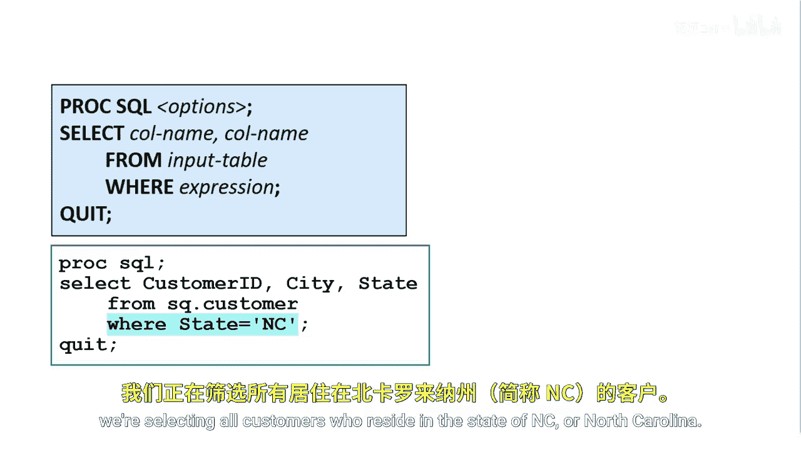
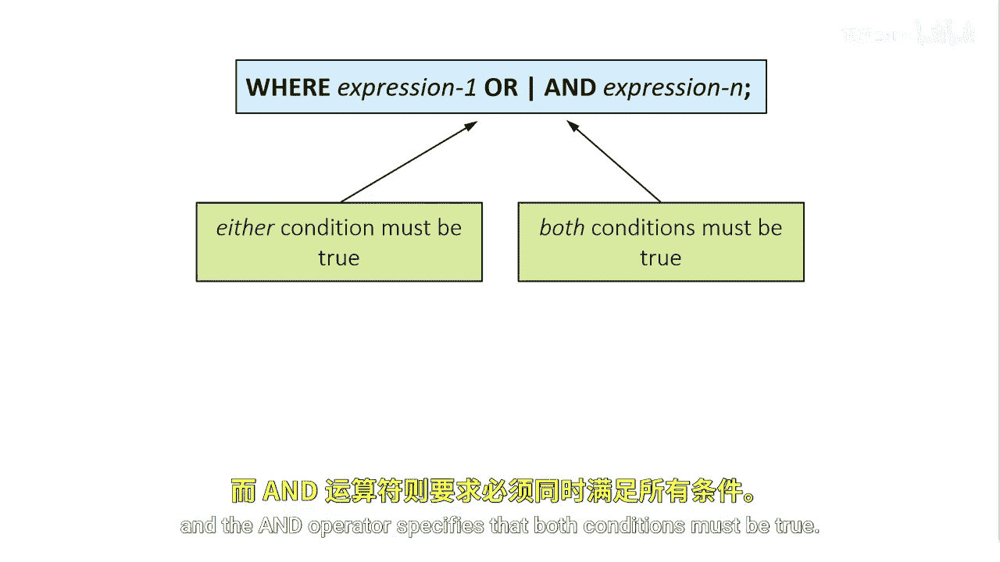
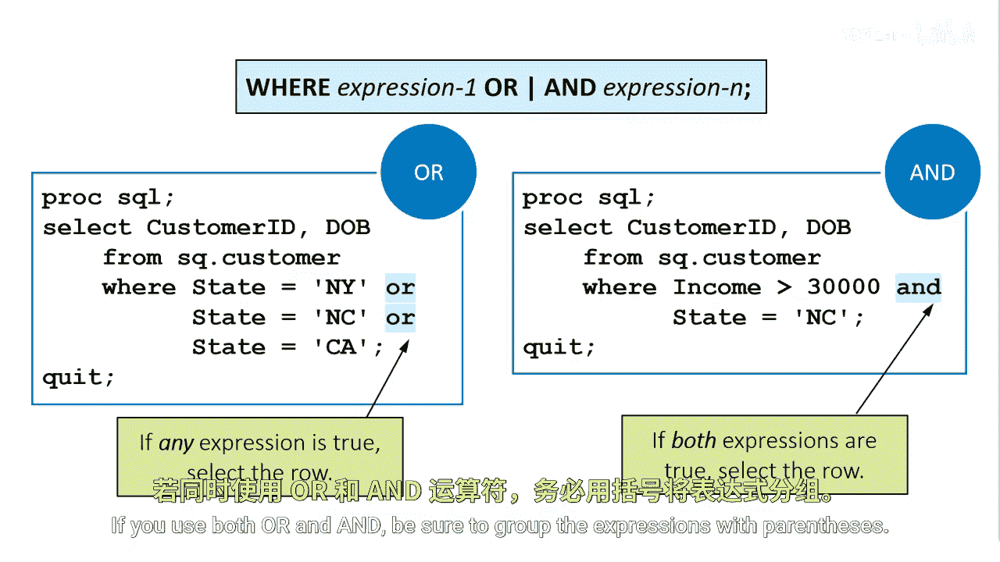

# SAS【中英⚡SAS高级程序员 专项课程｜SAS Advanced Programmer Professional Certificate】 p11 P11 01_使用WHERE子句筛选行 -BV1Cfe3z3EoA_p11-

Suppose you want to create some simple reports from the customer table。

 but you don't want to see all the rows in the table for example， in the first report。

 you want to see only the top 10 customers by income whose credit score is greater than 700 and who don't have a bank ID。

 or maybe you'd like a report of customers born prior to December 31st， 1940 and who are employed。

You can use the where clause to filter your data， the where clause must be after the select and from clauses。

 and it consists of the keyword where followed by one or more expressions。

An expression tests the value of one or more columns against one or more conditions that you specify。

In this example， where state equals NC， we're selecting all customers who reside in the state of NC or North Carolina。

 if the expression is true， include the row in the results。

An expression is a sequence of operarans and operators。Operans can be a column name。

 a constant or a SAs function。Where clauses can contain any of the columns in the table。

 including columns that are not selected in the select clauses。

Operators are symbols or mnemonics that specify a comparison， an arithmetic calculation。

 or a logical operation。Character values are case sensitive and must be enclosed in double or single quotation marks。

Double quotation marks are assassin enhancement， many database systems use only single quotes to enclose string literal。

The War clauseuse where state equals NC uses a equal comparison operator to select all rows where state is equal to NC。

Character comparisons are k sensitive， so you must specify character constants using the same case as a stored value。

Nummeric values are not enclosed in quotation marks and must be standard numeric values。

 You cannot include special symbols such as commas or dollar signs In the clause where income less than 30000。

 we keep all rows where income is less than the constant 30000。You can also use the SAS function。

In the clause where month DOB equals9， we're using the month function to extract the numeric month value of the DOB column and searching for customers born in month9 or September。

Comparison operators can appear in any valid SAS expression and anywhere in SAS code。

 not only in the wear clauses and ProC SQL。All these comparison operators can be used as a mnemonic or a symbol。

The mnemonics are assassin enhancement， they don't conform to the anNsI standard for SQL。

 most of the comparison operator symbols conform to the anNsi standard。

The only symbols that are SAss enhancements are the last two symbols for the not equal to operator。

SS provides these for consistency with some operating environments and keyboards。

You can also combine multiple expressions with the logical operators or and and to retrieve rows that satisfy multiple conditions or expressions。

The orR operator specifies that either condition must be true and the and operator specifies that both conditions must be true。

In the first example， we're using three expressions and the orR operator to select all customers from NY or NC or CAA。

If any one of these conditions is true， we select the row。In the second example。

 we use two expressions in the and operator to select only customers with an income value greater than 30。

000 and where state equals NC。In this scenario， both conditions must be true for the row to be selected。

If you use both or and and， be sure to group the expressions with parentheses。

The end operator tests for values that match one of a list of values similar to using multiple ore expressions。

The value list in the in operator must be enclosed in parentheses and separated by either commas or blanks。

Character values must be enclosed in quotation marks， either double or single。

Suppose you want to search for all rows where customers are located in NC，GA or NY。

One way to do this is to use the orR operator and three expressions。

 state equals NC or state equals GA or state equals N。For a more concise approach。

 use the in operator where state in and then in parentheses， N， GA and Y。

You can also use the no operator to form a negative condition。In the War clauseuse。

 where state not in NCGA NY， the not operator searches for all customers in all states other than NC。

GA and NY。The not operator can prefix other operators。

