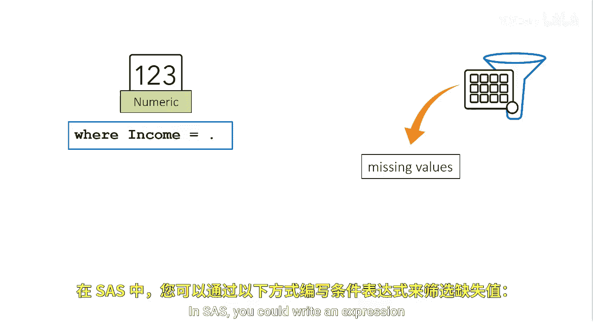
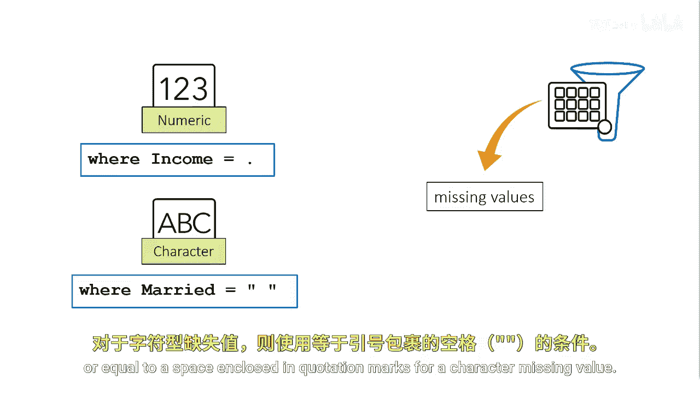
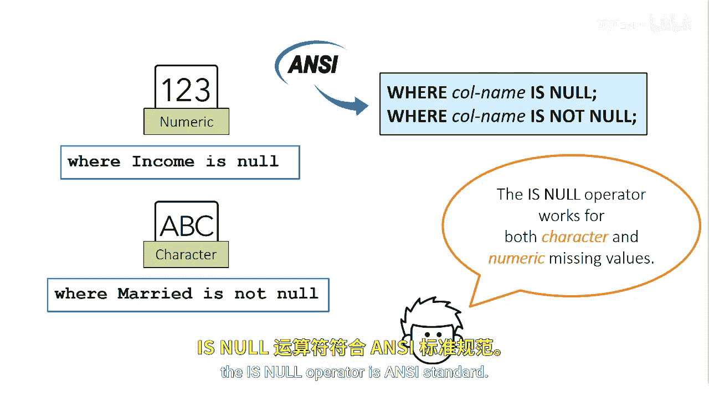
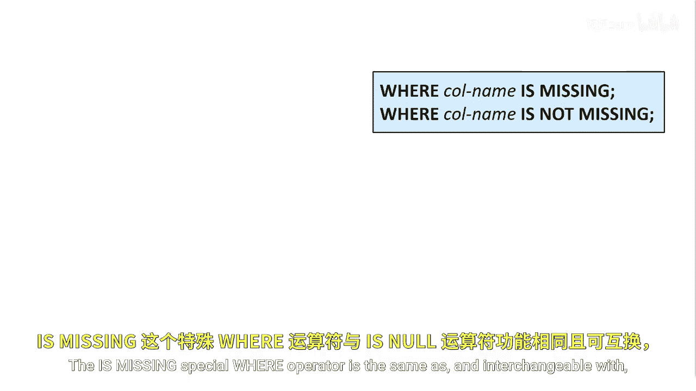

# SAS【中英⚡SAS高级程序员 专项课程｜SAS Advanced Programmer Professional Certificate】 p12 P12 02_特殊WHERE运算符：缺失值 -BV1Cfe3z3EoA_p12-

Suppose you want to filter your data by missing values in SAS。

 you could write an expression where a column is equal to a period for a numeric missing value or equal to a space enclos quotation mark for a character missing value。

Another option is to use the I null or is not null comparison operator。

These comparison operators can be used for either numeric or character missing values。

If your data comes from a DBMS environment that distinguishes between missing and null values。

 the INll operator is ansI standard。

You might also encounter the Is missing operator the Is missing special wear operator is the same as and interchangeable with the I NL operator in SAS。

 but the I missing operator is not ansI standard。

For consistency when working with SAS and databases。

 it's recommended to use the IsNL Specialware operator。

