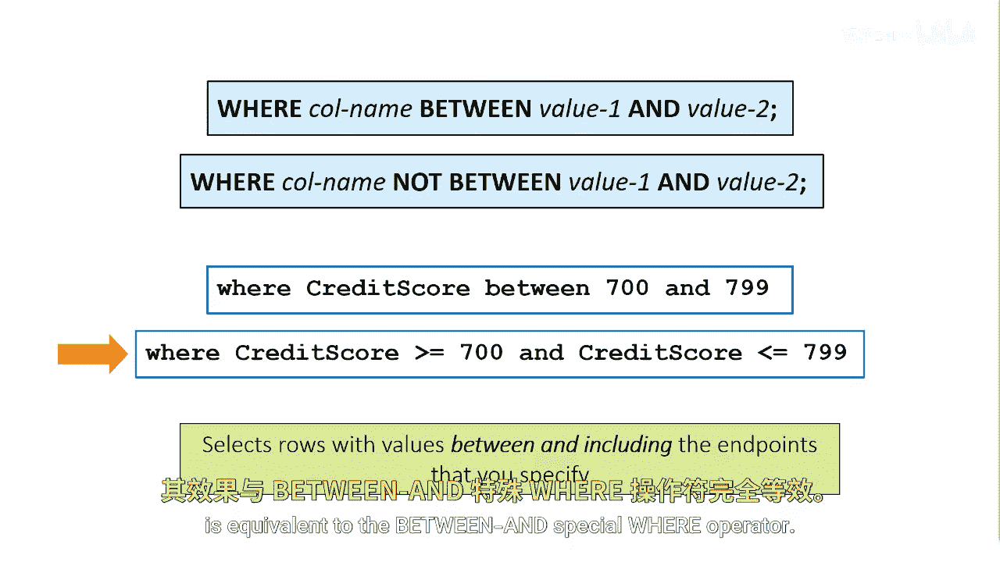
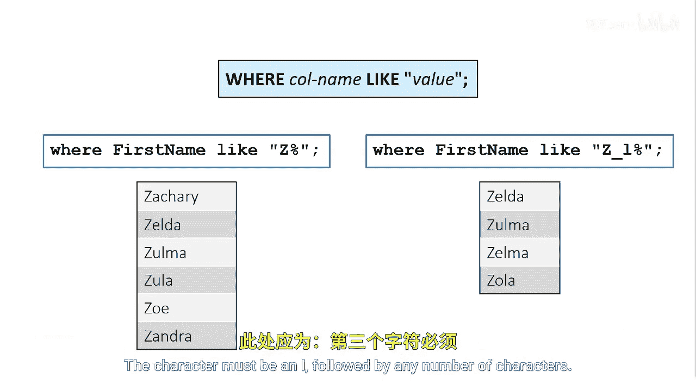

# SAS【中英⚡SAS高级程序员 专项课程｜SAS Advanced Programmer Professional Certificate】 p13 P13 04_其他特殊WHERE运算符 -BV1Cfe3z3EoA_p13-

Another special wear operator you can use is the between and operator。

It selects rows based on an inclusive range of values。

The between and operator is used for numeric and character ranges。

The first example selects customers with a credit score value between 700 and 799。

Because of between and operator is inclusive， the value 700 and 799 are included in the results。

You can also use two expressions with the and operator for similar results。

 the second example where credit score greater than equal to 700 and credit score less than or equal to 799 is equivalent to the between and specialware operator。

The like operator selects rows by comparing the values of a character column to a specified pattern。

 which is referred to as pattern matching。You specify a pattern after the like operator。

 the pattern must be a character value， so you canclose it in quotation marks。

To indicate a specific pattern， you can use two special characters。

 the percent sign and the underscore。The percent is a wild card for any number of characters。

 and the underscore is a wild card for a single character。

So in the query where first name like Z percent sign。

 the where clause returns all first names that begin with a capital Z and have any number of characters。

Additionally， you can use both types of special characters in the same pattern。

In the query where first name like Z underscore L percent sign。

 the where clauseuse returns all first names that begin with a capital Z。

 followed by any single character， the character must be an L， followed by any number of characters。

