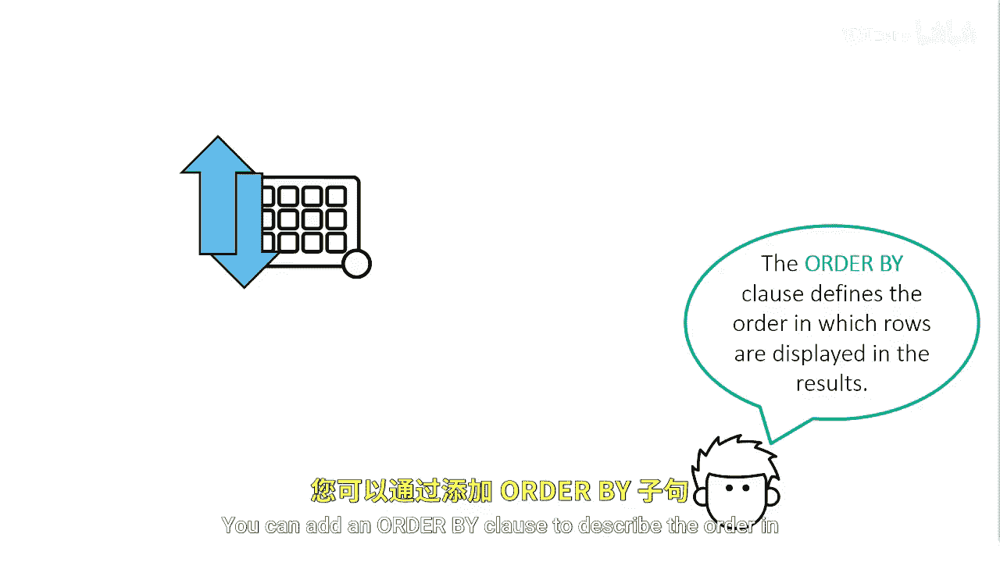

# SAS【中英⚡SAS高级程序员 专项课程｜SAS Advanced Programmer Professional Certificate】 p14 P14 05_使用ORDER BY子句排序输出 -BV1Cfe3z3EoA_p14-

Now let's talk about your output。You can add an order by clause to describe the order in which you want rows arranged in the results。

The default sort order when using an order by clause is ascending。

 but you can add the DESC keyword after the column name to change it to descending。

You can order by multiple columns and you can use any column in the table。

 including columns that are not selected or columns that are calculated。

If multiple order by columns are specified， the first one determines the major SOAR order。

