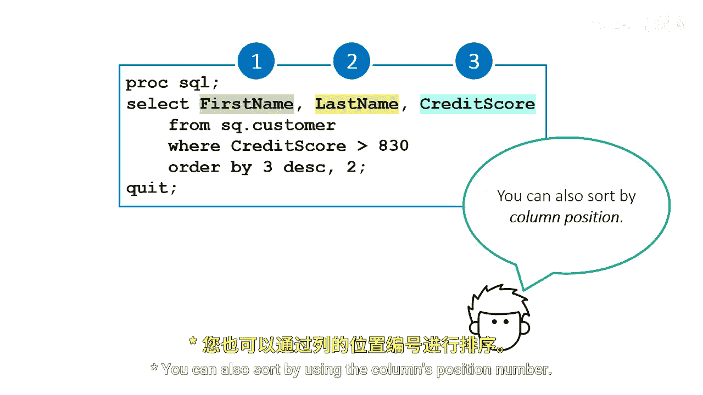
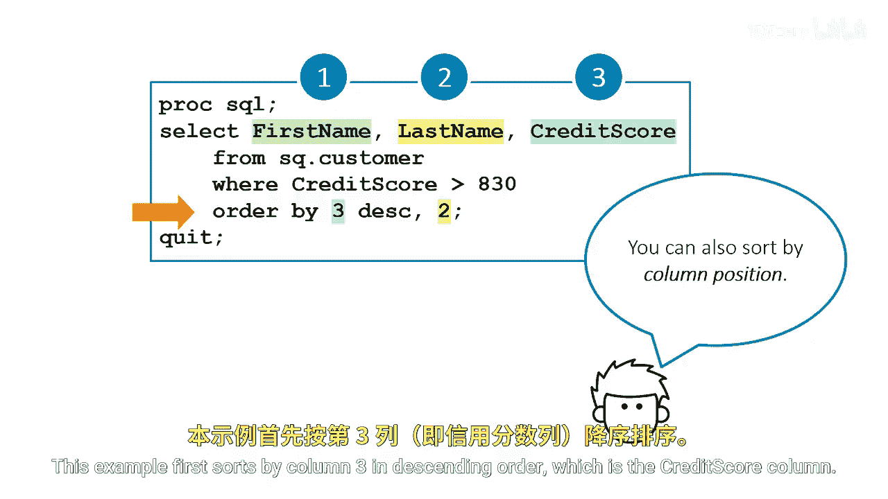

# SAS【中英⚡SAS高级程序员 专项课程｜SAS Advanced Programmer Professional Certificate】 p15 P15 06_按列位置排序 -BV1Cfe3z3EoA_p15-

You can also sort by using the comms position number。

This example first sorts by column 3 in descending order， which is the credit score column。

The secondary sort is column2 or the last name column。

 the results are the same as the previous activity。

