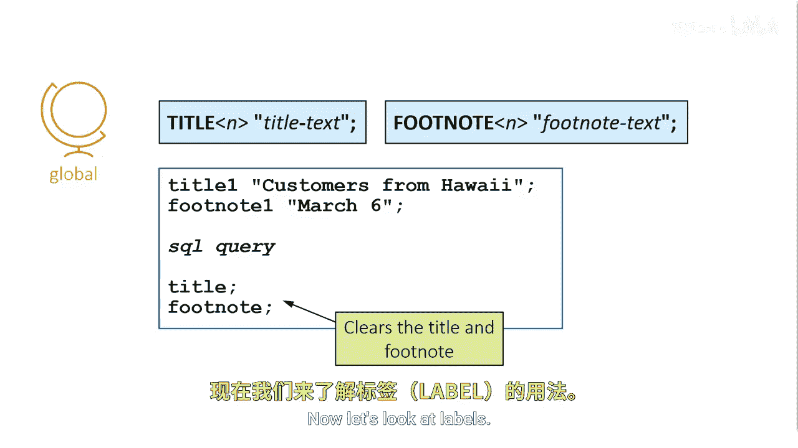
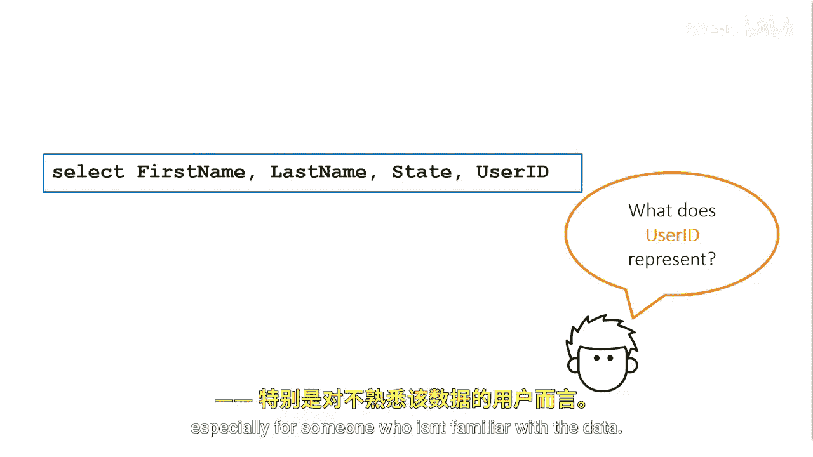
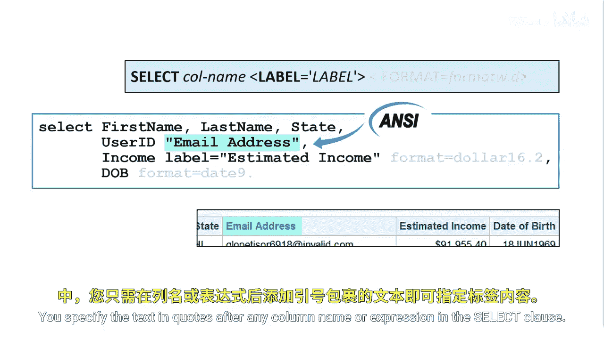
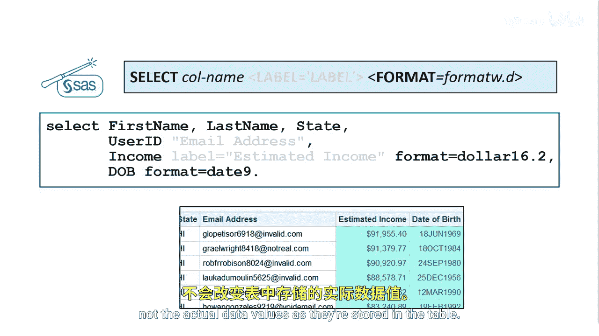

# SAS【中英⚡SAS高级程序员 专项课程｜SAS Advanced Programmer Professional Certificate】 p16 P16 07_增强报告 -BV1Cfe3z3EoA_p16-

Let's shift our focus to reports。Do the rows of data in this report represent customers or employees。

 all rows or a subset？Is income in dollars？When was the report run？

How can we make the birthday readable？You can do many things to enhance the look of a report to make it easier to read and understand。

You can add a title and footnote to tell what the report is and when it was created。

Labels provide more informative column headers。The label for user ID should be email address。

 and the label for income should be estimated income。

You can make the income column more readable with a currency format and the date of birth column more readable with a date format。

Let's see how to make these enhancements。

Title is a global statement that establishes a permanent title for all reports created in your SAS session。

The syntax is the keyword title followed by the title textex and closing quotation marks。

You can have up to 10 titles。Specify a number one through 10 after the keyword title to indicate the line number。

 title and titletle I are equivalent。You can also add footnotes to any report with the footnote statement。

The same rules that apply for titles apply to footnotes。

Remember that title and footnotes are global statements and they remain active as long as your SAS session is active。

If you want to clear the titles and footnotes， submit the respective title and footnote statements with no text。

 these are called null statements and they clear all titles and footnotes。

It's a good idea to do this at the end of your program。

Client applications such as SAS Studio submit a null title statement for you at the end of your code。

 but it's a good idea to get in the habit of submitting the statement yourself。

Now let's look at labels column names must adhere to particular naming conventions。

 but that means sometimes the names might be a bit difficult to interpret。

 especially for someone who isn't familiar with the data。

Labels are an easy way to enhance a report with more descriptive column headings。

A label can be any text string up to 256 characters， including spaces and special characters。

By default， ProC SQL displays results by using permanent column attributes that are already saved in the table。

 or if there are none by using the column name， you can use the anNsi standard column modifier to create a column label that is displayed in the output。

 you specify the text and quotes after any column name or expression in the select clauses。

You can take advantage of SAS enhancements such as the label equals column modifier。

You can specify the label equal column modifier after any column name or expression specified in the select clause。

You specified label equals and then enclosed in quotation marks the text that you want to display in the results。

Generally， using the SAS method makes your code easier to read and follow； however。

 you can use the label equalal column modifier or the an column modifier or both within the same select clause。

To control how values appear in your reports， you can apply SAS formats。

You can use the format equalqual column modifier to associate formats with column values。

The format equalqual column modifier is A Sa enhancement and makes it easier to create more useful and Po reports。

You can specify any SAS or user defined format。To apply a format after any column name or expression specified in the select clause。

 you specify format equals followed by the name of a format。Then you specify the total format with。

 including decimal places and special characters。The period is a required delimiter and for numeric formats it can be followed by the number of decimal places。

If you don't specify a format width that is large enough to accommodate a value。

 SAS automatically adjust to display as much of the stored value as possible In this example。

 we apply the dollar format with a width of 16 and two decimal places to the income column。

For the DOB column， we apply the date9 dot format， which specifies a two digit day。

 three character month followed by four digit year。

ProocSQL displays an asterisk if the specific width isn't wide enough。

 but does not issue a warning in the log。

Formats specified in the select clause affect only how the data values appear in the results。

 not the actual data values as are stored in the table。

